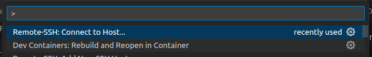
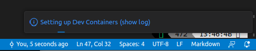
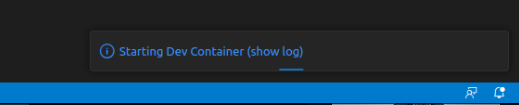
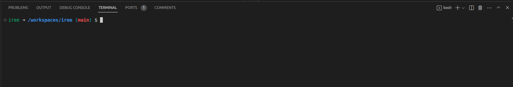

# Getting Started with IREE Development Containers

VS Code Development Container is a feature of Visual Studio Code that allows
developers to create a consistent and isolated development environment for their
projects. It leverages Docker containers to provide an environment that is
identical to the production environment, which means developers can develop and
test their code in an environment that closely mimics the production
environment.

With VS Code Development Container, developers can avoid the hassle of setting
up a local development environment, installing dependencies, and managing
different versions of software packages. Instead, they can use a pre-configured
container that contains all the required dependencies and tools to develop their
project. This makes it easier to share the development environment with other
team members and ensures that everyone is using the same environment.

In addition, VS Code Development Container provides a seamless development
experience by allowing developers to work directly within the container using
Visual Studio Code. They can edit code, run tests, and debug their applications
as if they were working on their local machine.

Overall, VS Code Development Container is a powerful tool for developers who
want to streamline their development process and ensure consistency across their
team's development environment.

## A. Prerequisites

Please follow the following steps to prepare your working environment:

1. **Install Docker:** Before you can use VS Code Development Containers, you
   need to have Docker installed on your machine. You can download and install
   Docker for your operating system from the official Docker website.

2. **[Optional] Install the NVIDIA-Docker runtime:** If you have an NVIDIA GPU
   and want to use it for accelerated computing in your container, you can
   install the NVIDIA-Docker runtime. Follow the instructions on the
   [NVIDIA-Docker GitHub page](https://github.com/NVIDIA/nvidia-docker) or on
   [NVIDIA Developer Documentation](https://developer.nvidia.com/nvidia-container-runtime)
   to install the runtime for your operating system.

3. **Install VS Code:** Naturally you will need VS Code to be installed on your
   machine: https://code.visualstudio.com/download

4. **Install Dev Container VS Code Extension:** Once VS Code installed, you will
   need *Microsoft's Dev Containers extension:*
   [ms-vscode-remote.remote-containers](https://marketplace.visualstudio.com/items?itemName=ms-vscode-remote.remote-containers).

5. **[Optional] Install Remote Development VS Code Extension Pack:** If you wish
   to setup the `Dev Container` on a remote machine over SSH, we recommend
   installing *Microsoft's Remote Development extension pack:* :
   [ms-vscode-remote.vscode-remote-extensionpack](https://marketplace.visualstudio.com/items?itemName=ms-vscode-remote.vscode-remote-extensionpack).


## B. Configuring your Development Container.

IREE Project provides multiple possible development containers which corresponds
to different usecases (e.g CPU, NVIDIA GPUs, etc.).

More containers will be integrated in the future, contributions are welcome.

In order to setup the environment, please execute this script:

```sh
python3 .devcontainer/configure.py

# This question is optional and will only appear if your environment was
# previously configured. It aims to avoid overriding an existing configuration
# inadvertently.
>>> A `docker-compose.yml` already exists. Are you certain you want to overwrite it [y/N]?

# Google provides prebuilt container images hosted on `gcr.io`. We invite you
# and recommend using them. However, for expert users you can use locally built
# containers by answering `N`.
>>> Do you wish to use the official prebuild development containers [Y/n]?

# We offer the option to mount a host directory to use as persistant local
# CCache cache. The directory needs to exist in order to be mounted.
>>> [OPTIONAL] Enter the the directory path to mount as CCache Cache.
    It will be mounted in the container under: `/home/iree/.cache/ccache`. [Default: None]:

# We offer the option to mount a host directory to use as persistant local
# build directory. The directory needs to exist in order to be mounted.
>>> [OPTIONAL] Enter the the directory path to mount as Build Directory.
    It will mounted in the container under: `/home/iree/build` [Default: None]:

# If your environment has any NVIDIA GPU with properly installed drivers and
# NVIDIA Docker Runtime, you will be asked if you wish to use an NVIDIA GPU
# ready container.
>>> [OPTIONAL] Do you wish to use NVIDIA GPU [y/N]?

# Finally a success message will be printed.
>>> ================================================================================
>>>
>>> Success! Wrote Docker Compose file to `/path/to/iree/.devcontainer/docker-compose.yml`.
```

## C. (Building and) Launching the Development

We can now build or download, if necessary, and launch the development
container. In order to do so, we need to open the VS Code "Command Palette" with
the shortcut: `Ctrl + Shift + P`.

We need to select and click `Dev Containers: Rebuild and Reopen in Container`.



A message will appear signifying that the environment is being setup (this step
might take some time if you need to download or build the container, you can
click on `show log` to see the details and watch the progress):



The window will refresh once the environment is ready, and the container will be
started (You can click on `show log` to watch the progress, this might take a
few minutes).



Once the container is started, you will be greeted by the container terminal
(notice the username `iree`):



**Once done, you are ready to start developing, building and contributing to
IREE 🎉🎉🎉.**