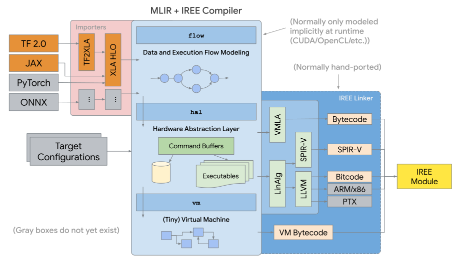

# IREE: Intermediate Representation Execution Environment

IREE (**I**ntermediate **R**epresentation **E**xecution **E**nvironment,
pronounced as "eerie") is an MLIR-based end-to-end compiler that lowers ML
models to a unified IR optimized for real-time mobile/edge inference against
heterogeneous hardware accelerators. IREE also provides flexible deployment
solutions for the compiled ML models.

#### Project Status

IREE is still in its early phase. We have settled down on the overarching
infrastructure and are actively improving various software components as well as
project logistics. It is still quite far from ready for everyday use and is made
available without any support at the moment. With that said, we welcome any kind
of feedback on any [communication channels](#communication-channels)!

## Communication Channels

*   [GitHub Issues](https://github.com/google/iree/issues): Preferred for
    specific technical issues and coordination on upcoming features.
*   [Google IREE Discord Server](https://discord.gg/26P4xW4): The core team and
    collaborators coordinate daily development here; good for low-latency
    communication.
*   [Google Groups Email List](https://groups.google.com/forum/#!forum/iree-discuss):
    Good for general and low-priority discussion.

#### Related Project Channels

*   [MLIR topic within LLVM Discourse](https://llvm.discourse.group/c/llvm-project/mlir/31):
    IREE is enabled by and heavily relies on [MLIR](https://mlir.llvm.org). IREE
    sometimes is referred to in certain MLIR discussions. Useful if you are also
    interested in MLIR evolution.

## Getting Started

For development, IREE supports both Bazel and CMake on Windows and Linux. We are
working on enabling macOS support. For deployment, IREE aims to additionally
cover Android and iOS.

Please see the [Getting Started](https://google.github.io/iree/GetStarted) pages
on IREE's [documentation hub](https://google.github.io/iree) to configure,
compile, and run IREE in your favorite development environment!

## Documentation and Talks

IREE hosts all its documentation and project status dashboards on
[GitHub Pages](https://google.github.io/iree). We are still building up the
website; please feel free to
[create issues](https://github.com/google/iree/issues) for the documentation
you'd like to see!

We also have some public talks that explain IREE's concepts and architecture:

*   2020-03-18: Interactive HAL IR Walkthrough (Ben Vanik and core team)
    ([recording](https://drive.google.com/file/d/1_sWDgAPDfrGQZdxAapSA90AD1jVfhp-f/view?usp=sharing))
*   2020-01-31: End-to-end MLIR Workflow in IREE
    ([recording](https://drive.google.com/open?id=1os9FaPodPI59uj7JJI3aXnTzkuttuVkR)
    and
    [slides](https://drive.google.com/open?id=1RCQ4ZPQFK9cVgu3IH1e5xbrBcqy7d_cEZ578j84OvYI))

## Architecture and Goals

IREE adopts a _holistic_ approach towards ML model compilation: the IR produced
contains both the _scheduling_ logic, required to communicate data dependencies
to low-level parallel pipelined hardware/API like Vulkan, and the _execution_
logic, encoding dense computation on the hardware in the form of
hardware/API-specific binaries like SPIR-V.

The architecture of IREE is best illustrated by the following picture:

Being compilation-based means IREE does not have a traditional runtime that
dispatches "ops" to their fat kernel implementations. What IREE provides is a
toolbox for different deployment scenarios. It scales from running generated
code on a particular API (such as emitting C code calling external DSP kernels),
to a HAL (**H**ardware **A**bstraction **L**ayer) that allows the same generated
code to target multiple APIs (like Vulkan and Direct3D 12), to a full VM
allowing runtime model loading for flexible deployment options and heterogeneous
execution.

IREE aims to

*   Support advanced models on mobile/edge devices. Dynamic shapes, dynamic flow
    control, dynamic multi-model dispatch, streaming models, tree-based search
    algorithms, and other are all good examples of exciting ML evolution. We are
    trying to build IREE from the ground-up to enable these models and run them
    efficiently on modern hardware, especially on mobile/edge devices.
*   Demonstrate MLIR's ability to develop non-traditional ML compiler backends
    and runtimes. MLIR enables IREE's holistic approach of focusing on the math
    being performed and how that math is scheduled rather than graphs of "ops".
*   Embrace standard-based ML via Vulkan. The graphics world is shifting towards
    favoring modern explicit APIs for performance and predictability and Vulkan
    is emerging as the "compatibility" layer. We would love to allow hardware
    vendors to be able to make ML efficient on their hardware without the need
    for bespoke runtimes and special access. We also would love to let
    developers and users utilize all the hardware available on as many platforms
    as possible.

## Roadmap and Milestones

IREE is still at its early stage; we have lots of exciting future plans. Please
check out the [long-term design roadmap](./docs/roadmap_design.md) and
[short-term focus areas](./docs/roadmap.md).

We use [GitHub Projects](https://github.com/google/iree/projects) to track
various IREE components and
[GitHub Milestones](https://github.com/google/iree/milestones) for major
features and quarterly plans. Please check out for updated information.

## Build Status

CI System | Build System | Platform | Component       | Status
:-------: | :----------: | :------: | :-------------: | :----:
Kokoro    | Bazel        | Linux    | Core            | 
Kokoro    | Bazel        | Linux    | Bindings        | 
Kokoro    | Bazel        | Linux    | Integrations    | 
Kokoro    | CMake        | Linux    | Core + Bindings | 

## License

IREE is licensed under the terms of the Apache license. See [LICENSE](LICENSE)
for more information.
