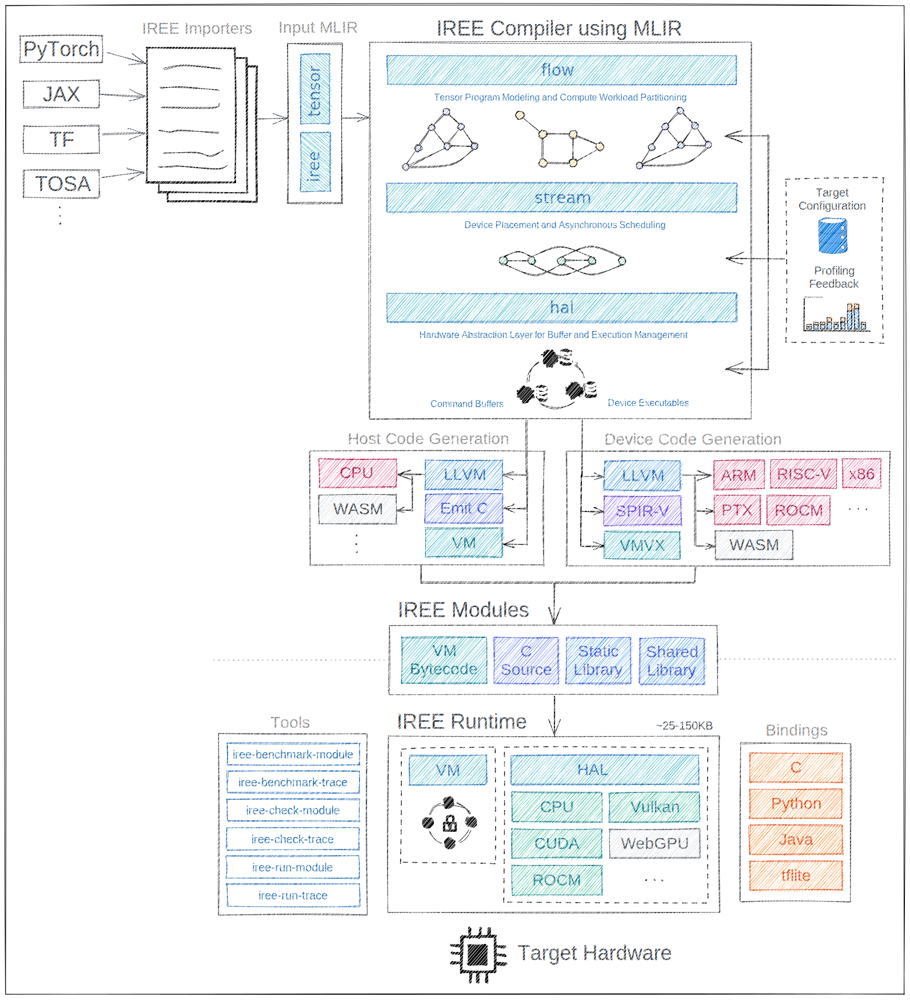

# IREE Compiler

This directory contains IREE's main [MLIR](https://mlir.llvm.org/)-based
compiler.

A few paths of interest include:

```
└── compiler/src/iree/compiler/
    ├── API/         (C and Python APIs)
    ├── Bindings/    (used to generate different ABI bindings)
    ├── Codegen/     (device code generation for assorted APIs)
    ├── ConstEval/   (JIT eval using the compiler+runtime to optimize constants)
    ├── Dialect/
    │   ├── Flow/    (tensor program modeling and compute workload partitioning)
    │   ├── HAL/     (Hardware Abstraction Layer for buffer and execution management)
    │   │   └── Target/
    │   │       ├── LLVM/
    │   │       ├── VMVX/
    │   │       ├── VulkanSPIRV/
    │   │       └── etc.
    │   ├── Stream/  (device placement and asynchronous scheduling)
    │   ├── Util/    (common types across other IREE dialects)
    │   └── VM/      (abstract Virtual Machine)
    ├── InputConversion/  (conversions from frontend/input dialects)
    └── Translation/      (translation pipeline definitions)

```

Noteworthy compiler components _not_ included here include:

```
├── compiler/plugins/
│   └── input/                 (Input dialect support plugins)
│   └── target/                (HAL target backend plugins)
└── llvm-external-projects/
    └── iree-dialects/         (IREE dialects for other projects to target)
```

Additional input/target/etc. plugins may also be defined out-of-tree.

The general flow of data from a frontend framework down to a compiled program
is:

```
program written in framework

    |
    |  import tool
    V

imported .mlir file

    |
    |  main IREE compiler
    V

compiled program
```

where import tools live outside of the compiler/ directory (and possibly
outside of the IREE repo itself).

Refer to IREE's
[presentations and talks](../../../../README.md#presentations-and-talks) and this
architecture diagram for details on how the pieces fit together:



## Coding Style

The compiler/ directory uses clang-format with (mostly) the LLVM style, unlike
the runtime/ directory which uses the Google style.

Read more:

* https://llvm.org/docs/CodingStandards.html
* https://clang.llvm.org/docs/ClangFormatStyleOptions.html
