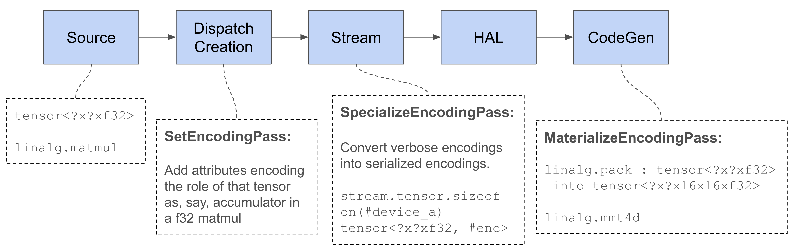

# Data-Tiling Walkthrough

Data-tiling is the modification of data layout of operands of certain
operations, such as matrix multiplication, that prefer specific layouts. These
layout preferences depend on the operations and the target hardware. For
example, matrix multiplications may need to use hardware matrix multiplication
instructions that perform optimally with a specific matrix data layout.

Layout changes may also be motivated by memory access performance, as
data-tiling can result in improved locality of memory accesses, fewer cache
lines being accessed, and generally simpler memory access patterns that are more
likely to be handled performantly by the memory system.

These layout changes can be propagated as far as possible across the workload,
so the entire workload can use the updated layouts, as opposed to having to
perform layout transformations at runtime. This may involve fusions or
constant-evaluation that can amortize or remove layout-transformation overheads.

The main conceptual difficulty in modeling this in tensor-level MLIR is that
tensors don't have layouts: tensors are higher-level, abstract arrays. This is
addressed by the concept of tensor encodings, which this document will explain.

<!-- more -->

## Prior Reading

Introducing layout transformations is not hard in itself. What is hard is making
that fit in the progressive-lowerings design of a retargetable compiler. The
solution we have in IREE is using tensor encodings, which represents virtual
layout. The below talk walks through how IREE uses the Encoding dialect in
host/device programming model. [[Link to the slides](https://llvm.org/devmtg/2025-06/slides/technical-talk/wang-data-tilling.pdf)]

Recording:
[Data-Tiling in IREE: Achieving High Performance Through Compiler Design (AsiaLLVM)](https://www.youtube.com/watch?v=iANJWUL_SOo)

## Setup

Compilation command, that targets gfx942 AMDGPU:

```bash
iree-compile matmul.mlir -o /tmp/matmul.mlir \
  --iree-hal-target-device=hip \
  --iree-rocm-target=gfx942 \
  --iree-dispatch-creation-data-tiling
```

Test source program, matmul.mlir:

```mlir
func.func @matmul_f32f32f32(%arg0: tensor<?x?xf32>, %arg1: tensor<?x?xf32>) -> tensor<?x?xf32> {
  %c0 = arith.constant 0 : index
  %c1 = arith.constant 1 : index
  %dim = tensor.dim %arg0, %c0 : tensor<?x?xf32>
  %dim_0 = tensor.dim %arg1, %c1 : tensor<?x?xf32>
  %cst = arith.constant 0.000000e+00 : f32
  %0 = tensor.empty(%dim, %dim_0) : tensor<?x?xf32>
  %1 = linalg.fill ins(%cst : f32) outs(%0 : tensor<?x?xf32>) -> tensor<?x?xf32>
  %2 = linalg.matmul
    ins(%arg0, %arg1 : tensor<?x?xf32>, tensor<?x?xf32>)
    outs(%1 : tensor<?x?xf32>) -> tensor<?x?xf32>
  return %2 : tensor<?x?xf32>
}
```

<!-- markdownlint-disable -->
<details><summary>Compilation command that targets host CPU</summary>

Below is the compilation command that targets your host CPU. The IR dumps are
different from what the post shows, but they follow the same mechanism.

```bash
iree-compile matmul.mlir -o /tmp/matmul.mlir \
  --iree-hal-target-device=local \
  --iree-hal-local-target-device-backends=llvm-cpu \
  --iree-llvmcpu-target-cpu-features=host \
  --iree-dispatch-creation-data-tiling
```

</details>
<!-- markdownlint-restore -->

## Target-Independent Optimizations

Data-tiling can start from either GlobalOptimization phase or DispatchCreation
phase. The former one is the current default, and the latter one is mainly
designed for data-tiling fusion. In this post, we focus on the data-tiling
fusion path, thus it happens in DispatchCreation phase.



### Introduction of Encoding Dialect

The encoding dialect defines IREE tensor encoding attributes and related
ops. These encoding hints enable optimization of compute-heavy operations
like matmul. E.g., IREE implements data-tiling using the encoding dialect,
by introducing encodings on matmul ops and fuse encoding ops with producers.

There are two core operations in this dialect, and they are very simple:

* SetEncodingOp: Adds an encoding attribute to a tensor value.
* UnsetEncodingOp: Removes the encoding attribute from a tensor value.

Encoding attributes fall into two categories:

* Encoding type attribute: An encoding type attribute is expected to be attached
  on tensor types.
* Encoding resolver: An attribute that transforms encoding type attribute
  between the states.

An encoding type attribute typically goes through three states in the lowering.

```text
+------------------+    +---------------------+    +--------------------+
| Verbose Encoding | -> | Serialized Encoding | -> | Physical Ops/Types |
+------------------+    +---------------------+    +--------------------+
```

Encoding resolvers are responsible for transforming the encodings between
states. Each backend can define its own resolver to interpret encodings
based on target-specific details.

To support encoding transformations better, IREE defines three encoding
interfaces:

* [LayoutResolverAttr](https://github.com/iree-org/iree/blob/e6fb1e180438c4f78a1ea2bafd9a653fbe7a064b/compiler/src/iree/compiler/Dialect/Encoding/IR/EncodingInterfaces.td#L17-L74):
  Converts verbose encodings into serialized ones, based on target-specific
  information.
* [SerializableAttr](https://github.com/iree-org/iree/blob/e6fb1e180438c4f78a1ea2bafd9a653fbe7a064b/compiler/src/iree/compiler/Dialect/Encoding/IR/EncodingInterfaces.td#L76-L206):
  Represents serialized encoding formats with enough detail for host-side
  compilation.
* [LayoutMaterializerAttr](https://github.com/iree-org/iree/blob/e6fb1e180438c4f78a1ea2bafd9a653fbe7a064b/compiler/src/iree/compiler/Dialect/Encoding/IR/EncodingInterfaces.td#L208-L281):
  Lowers encodings into physical operations and types.

An encoding resolver must implement `LayoutResolverAttr`, as it needs to
convert verbose encodings into serialized encodings with target specifics.

Sometimes, an encoding resolver also implements `SerializableAttr` because
the layout can be customized format, e.g., packing, etc. Only the resolver
itself knows how to interpret the layout.

An encoding resolver must implement `LayoutMaterializerAttr`, because only the
resolver itself knows what the final operations and types are.

### AnnotateDataTilingHintsPass (DispatchCreation)

Data-tiling is an optional technique. It is hard to enable data-tiling for all
the matmuls unconditionally, especially if an user wants to apply different
strategies on specific matmuls.

A design idea of the pass is providing a mechanism to users that can selectively
enable data-tiling for matmuls. There are two modes:

* Attach the data-tiling hint attribute to all the matmuls, if the hint does not
  exist in any operation.
* Skip the pass, if any operation already has the data-tiling hint attribute.

It allows users to set the attribute in preprocessing phase or the model.

<!-- markdownlint-disable -->
<details><summary>IR dump before the pass</summary>

```mlir linenums="1" hl_lines="12-14"
util.func public @matmul_f32f32f32(%arg0: !hal.buffer_view, %arg1: !hal.buffer_view) -> !hal.buffer_view {
  %0 = hal.buffer_view.dim<%arg0 : !hal.buffer_view>[0] : index
  %1 = hal.buffer_view.dim<%arg0 : !hal.buffer_view>[1] : index
  %2 = hal.tensor.import %arg0 "input0" : !hal.buffer_view -> tensor<?x?xf32>{%0, %1}
  %3 = hal.buffer_view.dim<%arg1 : !hal.buffer_view>[0] : index
  %4 = hal.buffer_view.dim<%arg1 : !hal.buffer_view>[1] : index
  %5 = hal.tensor.import %arg1 "input1" : !hal.buffer_view -> tensor<?x?xf32>{%3, %4}
  %6 = flow.dispatch.region -> (tensor<?x?xf32>{%0, %4}) {
    %8 = tensor.empty(%0, %4) : tensor<?x?xf32>
    %cst = arith.constant 0.000000e+00 : f32
    %9 = linalg.fill ins(%cst : f32) outs(%8 : tensor<?x?xf32>) -> tensor<?x?xf32>
    %10 = linalg.matmul
      ins(%2, %5 : tensor<?x?xf32>, tensor<?x?xf32>)
      outs(%9 : tensor<?x?xf32>) -> tensor<?x?xf32>
    flow.return %10 : tensor<?x?xf32>
  }
  %7 = hal.tensor.export %6 "output0" : tensor<?x?xf32>{%0, %4} -> !hal.buffer_view
  util.return %7 : !hal.buffer_view
}
```

</details>

<details><summary>IR dump after the pass</summary>

```mlir linenums="1" hl_lines="12-14"
util.func public @matmul_f32f32f32(%arg0: !hal.buffer_view, %arg1: !hal.buffer_view) -> !hal.buffer_view {
  %0 = hal.buffer_view.dim<%arg0 : !hal.buffer_view>[0] : index
  %1 = hal.buffer_view.dim<%arg0 : !hal.buffer_view>[1] : index
  %2 = hal.tensor.import %arg0 "input0" : !hal.buffer_view -> tensor<?x?xf32>{%0, %1}
  %3 = hal.buffer_view.dim<%arg1 : !hal.buffer_view>[0] : index
  %4 = hal.buffer_view.dim<%arg1 : !hal.buffer_view>[1] : index
  %5 = hal.tensor.import %arg1 "input1" : !hal.buffer_view -> tensor<?x?xf32>{%3, %4}
  %6 = flow.dispatch.region -> (tensor<?x?xf32>{%0, %4}) {
    %8 = tensor.empty(%0, %4) : tensor<?x?xf32>
    %cst = arith.constant 0.000000e+00 : f32
    %9 = linalg.fill ins(%cst : f32) outs(%8 : tensor<?x?xf32>) -> tensor<?x?xf32>
    %10 = linalg.matmul {iree.opt.data_tiling}
      ins(%2, %5 : tensor<?x?xf32>, tensor<?x?xf32>)
      outs(%9 : tensor<?x?xf32>) -> tensor<?x?xf32>
    flow.return %10 : tensor<?x?xf32>
  }
  %7 = hal.tensor.export %6 "output0" : tensor<?x?xf32>{%0, %4} -> !hal.buffer_view
  util.return %7 : !hal.buffer_view
}
```

</details>
<!-- markdownlint-restore -->

### SetEncodingPass (DispatchCreation)

The pass sets the encodings on matmul operands, and it propagates the encodings
through the `linalg.fill` op. You can encode whatever static information in the
encodings, as long as they provide values to backend that helps code-generation
decision.

The trade-off is that verbose encodings are harder to lower, especially for host
compilation. E.g., the compiler is not able to CSE the return values from a
dispatch region, if they have different encodings but result in identical
results in the later lowering. I.e., it can result in additional memory
footprint, that IREE definitely wants to avoid as many as possible. It also
makes encoding propagation harder, as the compiler needs to track all the
information in relevant fields.

What is encoded in IREE are:

* Operation type. E.g., `matmul`.
* Operand index. E.g., `lhs`, `rhs`, etc.
* Element type of each operand. E.g., `[f32, f32, f32]`.
* Indexing map of each operand.
* Iteration sizes.

The `iteration_sizes` field can be optional in terms of functionality. They are
useful for skinny matmul like matvec, vecmat, etc.

Note: it looks dumb in the IR dump, because it does not provide any information
to the local dispatch. However, it is very useful in the later lowering because
IREE can fuse `iree_encoding.set_encoding` ops with producers that provide the
information across dispatches.

<!-- markdownlint-disable -->
<details><summary>IR dump after the pass</summary>

```mlir linenums="1" hl_lines="4-15 25 26 32"
#map = affine_map<(d0, d1, d2) -> (d0, d2)>
#map1 = affine_map<(d0, d1, d2) -> (d2, d1)>
#map2 = affine_map<(d0, d1, d2) -> (d0, d1)>
#encoding = #iree_encoding.encoding<operand_index = 0 : index, op_type =  matmul,
                                    element_types = [f32, f32, f32],
                                    user_indexing_maps = [#map, #map1, #map2],
                                    iteration_sizes = [?, ?, ?]>
#encoding1 = #iree_encoding.encoding<operand_index = 1 : index, op_type =  matmul,
                                     element_types = [f32, f32, f32],
                                     user_indexing_maps = [#map, #map1, #map2],
                                     iteration_sizes = [?, ?, ?]>
#encoding2 = #iree_encoding.encoding<operand_index = 2 : index, op_type =  matmul,
                                     element_types = [f32, f32, f32],
                                     user_indexing_maps = [#map, #map1, #map2],
                                     iteration_sizes = [?, ?, ?]>
util.func public @matmul_f32f32f32(%arg0: !hal.buffer_view, %arg1: !hal.buffer_view) -> !hal.buffer_view {
  %0 = hal.buffer_view.dim<%arg0 : !hal.buffer_view>[0] : index
  %1 = hal.buffer_view.dim<%arg0 : !hal.buffer_view>[1] : index
  %2 = hal.tensor.import %arg0 "input0" : !hal.buffer_view -> tensor<?x?xf32>{%0, %1}
  %3 = hal.buffer_view.dim<%arg1 : !hal.buffer_view>[0] : index
  %4 = hal.buffer_view.dim<%arg1 : !hal.buffer_view>[1] : index
  %5 = hal.tensor.import %arg1 "input1" : !hal.buffer_view -> tensor<?x?xf32>{%3, %4}
  %6 = flow.dispatch.region -> (tensor<?x?xf32>{%0, %4}) {
    %cst = arith.constant 0.000000e+00 : f32
    %8 = iree_encoding.set_encoding %2 : tensor<?x?xf32> -> tensor<?x?xf32, #encoding>
    %9 = iree_encoding.set_encoding %5 : tensor<?x?xf32> -> tensor<?x?xf32, #encoding1>
    %10 = tensor.empty(%0, %4) : tensor<?x?xf32, #encoding2>
    %11 = linalg.fill ins(%cst : f32) outs(%10 : tensor<?x?xf32, #encoding2>) -> tensor<?x?xf32, #encoding2>
    %12 = linalg.matmul
      ins(%8, %9 : tensor<?x?xf32, #encoding>, tensor<?x?xf32, #encoding1>)
      outs(%11 : tensor<?x?xf32, #encoding2>) -> tensor<?x?xf32, #encoding2>
    %13 = iree_encoding.unset_encoding %12 : tensor<?x?xf32, #encoding2> -> tensor<?x?xf32>{%0, %4}
    flow.return %13 : tensor<?x?xf32>
  }
  %7 = hal.tensor.export %6 "output0" : tensor<?x?xf32>{%0, %4} -> !hal.buffer_view
  util.return %7 : !hal.buffer_view
}
```

</details>
<!-- markdownlint-restore -->

### HoistEncodingOpsPass (DispatchCreation)

The pass runs local propagation locally and hoists tensor encoding ops outside
Flow dispatch regions, so the `iree_encoding.set_encoding` ops can be fused
within producers later on.

<!-- markdownlint-disable -->
<details><summary>IR dump after the pass</summary>

```mlir linenums="1" hl_lines="23 24"
#map = affine_map<(d0, d1, d2) -> (d0, d2)>
#map1 = affine_map<(d0, d1, d2) -> (d2, d1)>
#map2 = affine_map<(d0, d1, d2) -> (d0, d1)>
#encoding = #iree_encoding.encoding<operand_index = 0 : index, op_type =  matmul,
                                    element_types = [f32, f32, f32],
                                    user_indexing_maps = [#map, #map1, #map2],
                                    iteration_sizes = [?, ?, ?]>
#encoding1 = #iree_encoding.encoding<operand_index = 1 : index, op_type =  matmul,
                                     element_types = [f32, f32, f32],
                                     user_indexing_maps = [#map, #map1, #map2],
                                     iteration_sizes = [?, ?, ?]>
#encoding2 = #iree_encoding.encoding<operand_index = 2 : index, op_type =  matmul,
                                     element_types = [f32, f32, f32],
                                     user_indexing_maps = [#map, #map1, #map2],
                                     iteration_sizes = [?, ?, ?]>
util.func public @matmul_f32f32f32(%arg0: !hal.buffer_view, %arg1: !hal.buffer_view) -> !hal.buffer_view {
  %0 = hal.buffer_view.dim<%arg0 : !hal.buffer_view>[0] : index
  %1 = hal.buffer_view.dim<%arg0 : !hal.buffer_view>[1] : index
  %2 = hal.tensor.import %arg0 "input0" : !hal.buffer_view -> tensor<?x?xf32>{%0, %1}
  %3 = hal.buffer_view.dim<%arg1 : !hal.buffer_view>[0] : index
  %4 = hal.buffer_view.dim<%arg1 : !hal.buffer_view>[1] : index
  %5 = hal.tensor.import %arg1 "input1" : !hal.buffer_view -> tensor<?x?xf32>{%3, %4}
  %6 = iree_encoding.set_encoding %2 : tensor<?x?xf32> -> tensor<?x?xf32, #encoding>
  %7 = iree_encoding.set_encoding %5 : tensor<?x?xf32> -> tensor<?x?xf32, #encoding1>
  %8 = flow.dispatch.region -> (tensor<?x?xf32>{%0, %4}) {
    %cst = arith.constant 0.000000e+00 : f32
    %10 = tensor.empty(%0, %4) : tensor<?x?xf32, #encoding2>
    %11 = linalg.fill ins(%cst : f32) outs(%10 : tensor<?x?xf32, #encoding2>) -> tensor<?x?xf32, #encoding2>
    %12 = linalg.matmul
      ins(%6, %7 : tensor<?x?xf32, #encoding>, tensor<?x?xf32, #encoding1>)
      outs(%11 : tensor<?x?xf32, #encoding2>) -> tensor<?x?xf32, #encoding2>
    %13 = iree_encoding.unset_encoding %12 : tensor<?x?xf32, #encoding2> -> tensor<?x?xf32>{%0, %4}
    flow.return %13 : tensor<?x?xf32>
  }
  %9 = hal.tensor.export %8 "output0" : tensor<?x?xf32>{%0, %4} -> !hal.buffer_view
  util.return %9 : !hal.buffer_view
}
```

</details>
<!-- markdownlint-restore -->

<details><summary>Example with local propagation</summary>

There is an elementwise operation followed by the `linalg.matmul` op, and the
second input operand has an encoding after propagation. Thus, there are three
`iree_encoding.set_encoding` ops in total outside dispatch regions. A new
`#encoding3` is generated because of the broadcasting map.

<br/>

IR dump before the pass:

<!-- markdownlint-disable -->
```mlir linenums="1" hl_lines="33-39"
#map = affine_map<(d0, d1, d2) -> (d0, d2)>
#map1 = affine_map<(d0, d1, d2) -> (d2, d1)>
#map2 = affine_map<(d0, d1, d2) -> (d0, d1)>
#map3 = affine_map<(d0, d1) -> (d0, d1)>
#map4 = affine_map<(d0, d1) -> (d1)>
#encoding = #iree_encoding.encoding<operand_index = 0 : index, op_type =  matmul,
                                    element_types = [f32, f32, f32],
                                    user_indexing_maps = [#map, #map1, #map2],
                                    iteration_sizes = [255, 1023, 513]>
#encoding1 = #iree_encoding.encoding<operand_index = 1 : index, op_type =  matmul,
                                     element_types = [f32, f32, f32],
                                     user_indexing_maps = [#map, #map1, #map2],
                                     iteration_sizes = [255, 1023, 513]>
#encoding2 = #iree_encoding.encoding<operand_index = 2 : index, op_type =  matmul,
                                     element_types = [f32, f32, f32],
                                     user_indexing_maps = [#map, #map1, #map2],
                                     iteration_sizes = [255, 1023, 513]>
util.func public @foo(%arg0: !hal.buffer_view, %arg1: !hal.buffer_view) -> !hal.buffer_view {
  %0 = hal.tensor.import %arg0 "input0" : !hal.buffer_view -> tensor<255x513xf32>
  %1 = hal.tensor.import %arg1 "input1" : !hal.buffer_view -> tensor<1023xf32>
  %2 = flow.dispatch.region -> (tensor<255x1023xf32>) {
    %4 = tensor.empty() : tensor<255x1023xf32>
    %cst = arith.constant 0.000000e+00 : f32
    %cst_0 = arith.constant dense<1.000000e+00> : tensor<513x1023xf32>
    %5 = iree_encoding.set_encoding %0 : tensor<255x513xf32> -> tensor<255x513xf32, #encoding>
    %6 = iree_encoding.set_encoding %cst_0 : tensor<513x1023xf32> -> tensor<513x1023xf32, #encoding1>
    %7 = tensor.empty() : tensor<255x1023xf32, #encoding2>
    %8 = linalg.fill ins(%cst : f32) outs(%7 : tensor<255x1023xf32, #encoding2>) -> tensor<255x1023xf32, #encoding2>
    %9 = linalg.matmul
      ins(%5, %6 : tensor<255x513xf32, #encoding>, tensor<513x1023xf32, #encoding1>)
      outs(%8 : tensor<255x1023xf32, #encoding2>) -> tensor<255x1023xf32, #encoding2>
    %10 = iree_encoding.unset_encoding %9 : tensor<255x1023xf32, #encoding2> -> tensor<255x1023xf32>
    %11 = linalg.generic {indexing_maps = [#map3, #map4, #map3], iterator_types = ["parallel", "parallel"]}
      ins(%10, %1 : tensor<255x1023xf32>, tensor<1023xf32>)
      outs(%4 : tensor<255x1023xf32>) {
    ^bb0(%in: f32, %in_1: f32, %out: f32):
      %12 = arith.mulf %in, %in_1 : f32
      linalg.yield %12 : f32
    } -> tensor<255x1023xf32>
    flow.return %11 : tensor<255x1023xf32>
  }
  %3 = hal.tensor.export %2 "output0" : tensor<255x1023xf32> -> !hal.buffer_view
  util.return %3 : !hal.buffer_view
}
```

IR dump after the pass:

```mlir linenums="1" hl_lines="18-21 28 44"
#map = affine_map<(d0, d1, d2) -> (d0, d2)>
#map1 = affine_map<(d0, d1, d2) -> (d2, d1)>
#map2 = affine_map<(d0, d1, d2) -> (d0, d1)>
#map3 = affine_map<(d0, d1) -> (d1)>
#map4 = affine_map<(d0, d1) -> (d0, d1)>
#encoding = #iree_encoding.encoding<operand_index = 0 : index, op_type =  matmul,
                                    element_types = [f32, f32, f32],
                                    user_indexing_maps = [#map, #map1, #map2],
                                    iteration_sizes = [255, 1023, 513]>
#encoding1 = #iree_encoding.encoding<operand_index = 1 : index, op_type =  matmul,
                                     element_types = [f32, f32, f32],
                                     user_indexing_maps = [#map, #map1, #map2],
                                     iteration_sizes = [255, 1023, 513]>
#encoding2 = #iree_encoding.encoding<operand_index = 2 : index, op_type =  matmul,
                                     element_types = [f32, f32, f32],
                                     user_indexing_maps = [#map, #map1, #map2],
                                     iteration_sizes = [255, 1023, 513]>
#encoding3 = #iree_encoding.encoding<operand_index = 2 : index, op_type =  matmul,
                                     element_types = [f32, f32, f32],
                                     user_indexing_maps = [#map, #map1, [#map2, #map3]],
                                     iteration_sizes = [255, 1023, 513]>
util.func public @foo(%arg0: !hal.buffer_view, %arg1: !hal.buffer_view) -> !hal.buffer_view {
  %0 = hal.tensor.import %arg0 "input0" : !hal.buffer_view -> tensor<255x513xf32>
  %1 = hal.tensor.import %arg1 "input1" : !hal.buffer_view -> tensor<1023xf32>
  %2 = iree_encoding.set_encoding %0 : tensor<255x513xf32> -> tensor<255x513xf32, #encoding>
  %cst = arith.constant dense<1.000000e+00> : tensor<513x1023xf32>
  %3 = iree_encoding.set_encoding %cst : tensor<513x1023xf32> -> tensor<513x1023xf32, #encoding1>
  %4 = iree_encoding.set_encoding %1 : tensor<1023xf32> -> tensor<1023xf32, #encoding3>
  %5 = flow.dispatch.region -> (tensor<255x1023xf32>) {
    %7 = tensor.empty() : tensor<255x1023xf32, #encoding2>
    %cst_0 = arith.constant 0.000000e+00 : f32
    %8 = tensor.empty() : tensor<255x1023xf32, #encoding2>
    %9 = linalg.fill ins(%cst_0 : f32) outs(%8 : tensor<255x1023xf32, #encoding2>) -> tensor<255x1023xf32, #encoding2>
    %10 = linalg.matmul
      ins(%2, %3 : tensor<255x513xf32, #encoding>, tensor<513x1023xf32, #encoding1>)
      outs(%9 : tensor<255x1023xf32, #encoding2>) -> tensor<255x1023xf32, #encoding2>
    %11 = linalg.generic {indexing_maps = [#map4, #map3, #map4], iterator_types = ["parallel", "parallel"]}
      ins(%10, %4 : tensor<255x1023xf32, #encoding2>, tensor<1023xf32, #encoding3>)
      outs(%7 : tensor<255x1023xf32, #encoding2>) {
    ^bb0(%in: f32, %in_1: f32, %out: f32):
      %13 = arith.mulf %in, %in_1 : f32
      linalg.yield %13 : f32
    } -> tensor<255x1023xf32, #encoding2>
    %12 = iree_encoding.unset_encoding %11 : tensor<255x1023xf32, #encoding2> -> tensor<255x1023xf32>
    flow.return %12 : tensor<255x1023xf32>
  }
  %6 = hal.tensor.export %5 "output0" : tensor<255x1023xf32> -> !hal.buffer_view
  util.return %6 : !hal.buffer_view
}
```
<!-- markdownlint-restore -->

</details>

### PropagateEncodingsPass (DispatchCreation)

This is a placeholder for propagating encodings globally, i.e., outside
`flow.dispatch.region` ops. However, the pass does not perform anything because
the design and the implementation are not done yet.

### FuseEncodingOpsIntoDispatchRegionsPass (DispatchCreation)

The pass fuses `iree_encoding.set_encoding` ops, that are outside dispatch
regions, into producer, if the source is a `flow.dispatch.region` op.

The result IR is the same in the example. You can go to [the lit
tests](https://github.com/iree-org/iree/blob/main/compiler/src/iree/compiler/DispatchCreation/test/fuse_encoding_ops_into_dispatch_regions.mlir)
for examples.

### ConvertEncodingToFlowPass (DispatchCreation)

The pass replaces `iree_encoding.set_encoding` ops with `flow.tensor.encode`
ops, if they are outside dispatch regions. The design idea is mainly for
folding. Otherwise, it results in an executable that performs copy if the
relayout is not needed.

IREE specializes the encodings in a later pass (i.e., SpecializeEncodingsPass)
that converts verbose encodings to serialized encodings. The
`[flow|stream].tensor.encode` ops can be folded away, if the source tensor type
is identical to the result tensor type.

<details><summary>IR dump after the pass</summary>

Note: the `canonicalize` is run after the pass in this example, because it makes
IR clear. Otherwise, there are `arith.constant` ops and `tensor.dim` ops around
`flow.tensor.encode` ops.

<!-- markdownlint-disable -->
```mlir linenums="1" hl_lines="25-26"
#map = affine_map<(d0, d1, d2) -> (d0, d2)>
#map1 = affine_map<(d0, d1, d2) -> (d2, d1)>
#map2 = affine_map<(d0, d1, d2) -> (d0, d1)>
#encoding = #iree_encoding.encoding<operand_index = 0 : index, op_type =  matmul,
                                    element_types = [f32, f32, f32],
                                    user_indexing_maps = [#map, #map1, #map2],
                                    iteration_sizes = [?, ?, ?]>
#encoding1 = #iree_encoding.encoding<operand_index = 1 : index, op_type =  matmul,
                                     element_types = [f32, f32, f32],
                                     user_indexing_maps = [#map, #map1, #map2],
                                     iteration_sizes = [?, ?, ?]>
#encoding2 = #iree_encoding.encoding<operand_index = 2 : index, op_type =  matmul,
                                     element_types = [f32, f32, f32],
                                     user_indexing_maps = [#map, #map1, #map2],
                                     iteration_sizes = [?, ?, ?]>
module {
  util.func public @matmul_f32f32f32(%arg0: !hal.buffer_view, %arg1: !hal.buffer_view) -> !hal.buffer_view {
    %cst = arith.constant 0.000000e+00 : f32
    %0 = hal.buffer_view.dim<%arg0 : !hal.buffer_view>[0] : index
    %1 = hal.buffer_view.dim<%arg0 : !hal.buffer_view>[1] : index
    %2 = hal.tensor.import %arg0 "input0" : !hal.buffer_view -> tensor<?x?xf32>{%0, %1}
    %3 = hal.buffer_view.dim<%arg1 : !hal.buffer_view>[0] : index
    %4 = hal.buffer_view.dim<%arg1 : !hal.buffer_view>[1] : index
    %5 = hal.tensor.import %arg1 "input1" : !hal.buffer_view -> tensor<?x?xf32>{%3, %4}
    %6 = flow.tensor.encode %2 : tensor<?x?xf32>{%0, %1} -> tensor<?x?xf32, #encoding>{%0, %1}
    %7 = flow.tensor.encode %5 : tensor<?x?xf32>{%3, %4} -> tensor<?x?xf32, #encoding1>{%3, %4}
    %8 = flow.dispatch.region -> (tensor<?x?xf32>{%0, %4}) {
      %10 = tensor.empty(%0, %4) : tensor<?x?xf32, #encoding2>
      %11 = linalg.fill ins(%cst : f32) outs(%10 : tensor<?x?xf32, #encoding2>) -> tensor<?x?xf32, #encoding2>
      %12 = linalg.matmul
        ins(%6, %7 : tensor<?x?xf32, #encoding>, tensor<?x?xf32, #encoding1>)
        outs(%11 : tensor<?x?xf32, #encoding2>) -> tensor<?x?xf32, #encoding2>
      %13 = iree_encoding.unset_encoding %12 : tensor<?x?xf32, #encoding2> -> tensor<?x?xf32>{%0, %4}
      flow.return %13 : tensor<?x?xf32>
    }
    %9 = hal.tensor.export %8 "output0" : tensor<?x?xf32>{%0, %4} -> !hal.buffer_view
    util.return %9 : !hal.buffer_view
  }
}
```
<!-- markdownlint-restore -->

</details>

### HoistIntoGlobalsPass (DispatchCreation)

This is where IREE hoists relayout ops that perform on weights and constants to
initializers. IREE performs [ConstExprAnalysis](https://github.com/iree-org/iree/blob/main/compiler/src/iree/compiler/Dialect/Util/Analysis/Constant/ConstExpr.h)
and hoists the constant expressions to `util.initializer` modules. They will be
executed either during compile-time or initialization phase. I.e., it is not
part of the actual execution.

It creates a global variable for each expression and stores the result to new
variables. On the program side, all the hoisted computation is replaced with
`util.global.load` ops.

The result IR is the same in the example. The below example demonstrates the
hoisting result if the source is weight.

Note: const-evaluation is not yet supported after global optimization phase, so
they can only be executed in initialization phase today.

<details><summary>Example with hoisting to initializers</summary>

IR dump before the pass:

<!-- markdownlint-disable -->
```mlir linenums="1" hl_lines="26-27"
#map = affine_map<(d0, d1, d2) -> (d0, d2)>
#map1 = affine_map<(d0, d1, d2) -> (d2, d1)>
#map2 = affine_map<(d0, d1, d2) -> (d0, d1)>
#map3 = affine_map<(d0, d1) -> (d1)>
#map4 = affine_map<(d0, d1) -> (d0, d1)>
#encoding = #iree_encoding.encoding<operand_index = 0 : index, op_type =  matmul,
                                    element_types = [f32, f32, f32],
                                    user_indexing_maps = [#map, #map1, #map2],
                                    iteration_sizes = [255, 1023, 513]>
#encoding1 = #iree_encoding.encoding<operand_index = 1 : index, op_type =  matmul,
                                     element_types = [f32, f32, f32],
                                     user_indexing_maps = [#map, #map1, #map2],
                                     iteration_sizes = [255, 1023, 513]>
#encoding2 = #iree_encoding.encoding<operand_index = 2 : index, op_type =  matmul,
                                     element_types = [f32, f32, f32],
                                     user_indexing_maps = [#map, #map1, #map2],
                                     iteration_sizes = [255, 1023, 513]>
#encoding3 = #iree_encoding.encoding<operand_index = 2 : index, op_type =  matmul,
                                     element_types = [f32, f32, f32],
                                     user_indexing_maps = [#map, #map1, [#map2, #map3]],
                                     iteration_sizes = [255, 1023, 513]>
util.func public @foo(%arg0: !hal.buffer_view, %arg1: !hal.buffer_view) -> !hal.buffer_view {
  %0 = hal.tensor.import %arg0 "input0" : !hal.buffer_view -> tensor<255x513xf32>
  %1 = hal.tensor.import %arg1 "input1" : !hal.buffer_view -> tensor<1023xf32>
  %2 = flow.tensor.encode %0 : tensor<255x513xf32> -> tensor<255x513xf32, #encoding>
  %cst = arith.constant dense<1.000000e+00> : tensor<513x1023xf32>
  %3 = flow.tensor.encode %cst : tensor<513x1023xf32> -> tensor<513x1023xf32, #encoding1>
  %4 = flow.tensor.encode %1 : tensor<1023xf32> -> tensor<1023xf32, #encoding3>
  %5 = flow.dispatch.region -> (tensor<255x1023xf32>) {
    %7 = tensor.empty() : tensor<255x1023xf32, #encoding2>
    %cst_0 = arith.constant 0.000000e+00 : f32
    %8 = linalg.fill ins(%cst_0 : f32) outs(%7 : tensor<255x1023xf32, #encoding2>) -> tensor<255x1023xf32, #encoding2>
    %9 = linalg.matmul
      ins(%2, %3 : tensor<255x513xf32, #encoding>, tensor<513x1023xf32, #encoding1>)
      outs(%8 : tensor<255x1023xf32, #encoding2>) -> tensor<255x1023xf32, #encoding2>
    %10 = linalg.generic {indexing_maps = [#map4, #map3, #map4], iterator_types = ["parallel", "parallel"]}
      ins(%9, %4 : tensor<255x1023xf32, #encoding2>, tensor<1023xf32, #encoding3>)
      outs(%7 : tensor<255x1023xf32, #encoding2>) {
    ^bb0(%in: f32, %in_1: f32, %out: f32):
      %12 = arith.mulf %in, %in_1 : f32
      linalg.yield %12 : f32
    } -> tensor<255x1023xf32, #encoding2>
    %11 = iree_encoding.unset_encoding %10 : tensor<255x1023xf32, #encoding2> -> tensor<255x1023xf32>
    flow.return %11 : tensor<255x1023xf32>
  }
  %6 = hal.tensor.export %5 "output0" : tensor<255x1023xf32> -> !hal.buffer_view
  util.return %6 : !hal.buffer_view
}
```
<!-- markdownlint-restore -->

IR dump after the pass:

<!-- markdownlint-disable -->
```mlir linenums="1" hl_lines="27-32 37"
#executable_target_rocm_hsaco_fb = #hal.executable.target<"rocm", "rocm-hsaco-fb", {abi = "hip", iree.encoding.resolver = #iree_gpu.gpu_encoding_resolver<>, iree_codegen.target_info = #iree_gpu.target<arch = "gfx942", features = "", wgp = <compute =  fp64|fp32|fp16|int64|int32|int16|int8, storage =  b64|b32|b16|b8, subgroup =  shuffle|arithmetic, dot =  dp4xi8toi32, mma = [<MFMA_F32_16x16x16_BF16>, <MFMA_F32_32x32x8_BF16>, <MFMA_F32_16x16x32_F8E5M2FNUZ>, <MFMA_F32_16x16x32_F8E5M2FNUZ_F8E4M3FNUZ>, <MFMA_F32_16x16x32_F8E4M3FNUZ>, <MFMA_F32_16x16x32_F8E4M3FNUZ_F8E5M2FNUZ>, <MFMA_F32_32x32x16_F8E5M2FNUZ>, <MFMA_F32_32x32x16_F8E5M2FNUZ_F8E4M3FNUZ>, <MFMA_F32_32x32x16_F8E4M3FNUZ>, <MFMA_F32_32x32x16_F8E4M3FNUZ_F8E5M2FNUZ>, <MFMA_I32_16x16x32_I8>, <MFMA_I32_32x32x16_I8>, <MFMA_F64_16x16x4_F64>, <MFMA_F32_16x16x4_F32>, <MFMA_F32_16x16x16_F16>, <MFMA_F32_32x32x8_F16>], subgroup_size_choices = [64], max_workgroup_sizes = [1024, 1024, 1024], max_thread_count_per_workgroup = 1024, max_workgroup_memory_bytes = 65536, max_workgroup_counts = [2147483647, 2147483647, 2147483647], max_load_instruction_bits = 128, simds_per_wgp = 4, vgpr_space_bits = 16384>>, ukernels = "none"}>
#map = affine_map<(d0, d1, d2) -> (d0, d2)>
#map1 = affine_map<(d0, d1, d2) -> (d2, d1)>
#map2 = affine_map<(d0, d1, d2) -> (d0, d1)>
#map3 = affine_map<(d0, d1) -> (d1)>
#map4 = affine_map<(d0, d1) -> (d0, d1)>
#device_target_hip = #hal.device.target<"hip", [#executable_target_rocm_hsaco_fb]> : !hal.device
#encoding = #iree_encoding.encoding<operand_index = 1 : index, op_type =  matmul,
                                    element_types = [f32, f32, f32],
                                    user_indexing_maps = [#map, #map1, #map2],
                                    iteration_sizes = [255, 1023, 513]>
#encoding1 = #iree_encoding.encoding<operand_index = 0 : index, op_type =  matmul,
                                     element_types = [f32, f32, f32],
                                     user_indexing_maps = [#map, #map1, #map2],
                                     iteration_sizes = [255, 1023, 513]>
#encoding2 = #iree_encoding.encoding<operand_index = 2 : index, op_type =  matmul,
                                     element_types = [f32, f32, f32],
                                     user_indexing_maps = [#map, #map1, #map2],
                                     iteration_sizes = [255, 1023, 513]>
#encoding3 = #iree_encoding.encoding<operand_index = 2 : index, op_type =  matmul,
                                     element_types = [f32, f32, f32],
                                     user_indexing_maps = [#map, #map1, [#map2, #map3]],
                                     iteration_sizes = [255, 1023, 513]>
module attributes {stream.affinity.default = #hal.device.affinity<@__device_0>} {
  util.global private @__device_0 = #device_target_hip
  util.global private @__hoisted_tensor_513x1023xf32__encoded {stream.affinity.default = #hal.device.affinity<@__device_0>} : tensor<513x1023xf32, #encoding>
  util.initializer attributes {stream.affinity.default = #hal.device.affinity<@__device_0>} {
    %cst = arith.constant dense<1.000000e+00> : tensor<513x1023xf32>
    %0 = flow.tensor.encode %cst : tensor<513x1023xf32> -> tensor<513x1023xf32, #encoding>
    util.global.store %0, @__hoisted_tensor_513x1023xf32__encoded : tensor<513x1023xf32, #encoding>
    util.return
  }
  util.func public @foo(%arg0: !hal.buffer_view, %arg1: !hal.buffer_view) -> !hal.buffer_view {
    %0 = hal.tensor.import %arg0 "input0" : !hal.buffer_view -> tensor<255x513xf32>
    %1 = hal.tensor.import %arg1 "input1" : !hal.buffer_view -> tensor<1023xf32>
    %2 = flow.tensor.encode %0 : tensor<255x513xf32> -> tensor<255x513xf32, #encoding1>
    %__hoisted_tensor_513x1023xf32__encoded = util.global.load immutable @__hoisted_tensor_513x1023xf32__encoded : tensor<513x1023xf32, #encoding>
    %3 = flow.tensor.encode %1 : tensor<1023xf32> -> tensor<1023xf32, #encoding3>
    %4 = flow.dispatch.region -> (tensor<255x1023xf32>) {
      %6 = tensor.empty() : tensor<255x1023xf32, #encoding2>
      %cst = arith.constant 0.000000e+00 : f32
      %7 = linalg.fill ins(%cst : f32) outs(%6 : tensor<255x1023xf32, #encoding2>) -> tensor<255x1023xf32, #encoding2>
      %8 = linalg.matmul
        ins(%2, %__hoisted_tensor_513x1023xf32__encoded : tensor<255x513xf32, #encoding1>, tensor<513x1023xf32, #encoding>)
        outs(%7 : tensor<255x1023xf32, #encoding2>) -> tensor<255x1023xf32, #encoding2>
      %9 = linalg.generic {indexing_maps = [#map4, #map3, #map4], iterator_types = ["parallel", "parallel"]}
        ins(%8, %3 : tensor<255x1023xf32, #encoding2>, tensor<1023xf32, #encoding3>)
        outs(%6 : tensor<255x1023xf32, #encoding2>) {
      ^bb0(%in: f32, %in_0: f32, %out: f32):
        %11 = arith.mulf %in, %in_0 : f32
        linalg.yield %11 : f32
      } -> tensor<255x1023xf32, #encoding2>
      %10 = iree_encoding.unset_encoding %9 : tensor<255x1023xf32, #encoding2> -> tensor<255x1023xf32>
      flow.return %10 : tensor<255x1023xf32>
    }
    %5 = hal.tensor.export %4 "output0" : tensor<255x1023xf32> -> !hal.buffer_view
    util.return %5 : !hal.buffer_view
  }
}
```
<!-- markdownlint-restore -->

</details>

### ConvertToStreamPass

IREE then converts dispatch regions to workgroup ops, outlines them to
executables, and convert flow ops to stream ops. It is not data-tiling
specifics, but the IR dump before and after the pass is showed for better
picture.

After the conversion, the flow executables all become stream executables, and
the function arguments become opaque types (i.e., `stream.binding` types).

The host code is mostly composed of `stream.tensor.sizeof` and
`stream.tensor.dispatch` ops.

* The `sizeof` op takes a tensor type with an optional encoding and indicates
  the storage buffer size that will be used to issue the allocation later on.
* The `dispatch` op describes how we call the functions in the program.

<!-- markdownlint-disable -->
<details><summary>IR dump before the pass</summary>

```mlir linenums="1"
#executable_target_rocm_hsaco_fb = #hal.executable.target<"rocm", "rocm-hsaco-fb", {abi = "hip", iree.encoding.resolver = #iree_gpu.gpu_encoding_resolver<>, iree_codegen.default_tuning_spec = #rocm.builtin.tuning_module<"iree_default_tuning_spec_gfx942.mlir">, iree_codegen.target_info = #iree_gpu.target<arch = "gfx942", features = "", wgp = <compute =  fp64|fp32|fp16|int64|int32|int16|int8, storage =  b64|b32|b16|b8, subgroup =  shuffle|arithmetic, dot =  dp4xi8toi32, mma = [<MFMA_F32_16x16x16_BF16>, <MFMA_F32_32x32x8_BF16>, <MFMA_F32_16x16x32_F8E5M2FNUZ>, <MFMA_F32_16x16x32_F8E5M2FNUZ_F8E4M3FNUZ>, <MFMA_F32_16x16x32_F8E4M3FNUZ>, <MFMA_F32_16x16x32_F8E4M3FNUZ_F8E5M2FNUZ>, <MFMA_F32_32x32x16_F8E5M2FNUZ>, <MFMA_F32_32x32x16_F8E5M2FNUZ_F8E4M3FNUZ>, <MFMA_F32_32x32x16_F8E4M3FNUZ>, <MFMA_F32_32x32x16_F8E4M3FNUZ_F8E5M2FNUZ>, <MFMA_I32_16x16x32_I8>, <MFMA_I32_32x32x16_I8>, <MFMA_F64_16x16x4_F64>, <MFMA_F32_16x16x4_F32>, <MFMA_F32_16x16x16_F16>, <MFMA_F32_32x32x8_F16>], subgroup_size_choices = [64], max_workgroup_sizes = [1024, 1024, 1024], max_thread_count_per_workgroup = 1024, max_workgroup_memory_bytes = 65536, max_workgroup_counts = [2147483647, 2147483647, 2147483647], max_load_instruction_bits = 128, simds_per_wgp = 4, vgpr_space_bits = 16384>>, ukernels = "none"}>
#map = affine_map<(d0, d1, d2) -> (d0, d2)>
#map1 = affine_map<(d0, d1, d2) -> (d2, d1)>
#map2 = affine_map<(d0, d1, d2) -> (d0, d1)>
#device_target_hip = #hal.device.target<"hip", [#executable_target_rocm_hsaco_fb]> : !hal.device
#encoding = #iree_encoding.encoding<operand_index = 0 : index, op_type =  matmul, element_types = [f32, f32, f32], user_indexing_maps = [#map, #map1, #map2], iteration_sizes = [?, ?, ?]>
#encoding1 = #iree_encoding.encoding<operand_index = 1 : index, op_type =  matmul, element_types = [f32, f32, f32], user_indexing_maps = [#map, #map1, #map2], iteration_sizes = [?, ?, ?]>
#encoding2 = #iree_encoding.encoding<operand_index = 2 : index, op_type =  matmul, element_types = [f32, f32, f32], user_indexing_maps = [#map, #map1, #map2], iteration_sizes = [?, ?, ?]>
module attributes {stream.affinity.default = #hal.device.affinity<@__device_0>} {
  util.global private @__device_0 = #device_target_hip
  flow.executable private @matmul_f32f32f32_dispatch_0 {
    flow.executable.export public @matmul_f32f32f32_dispatch_0_matmul_DxDxD_f32 workgroups(%arg0: index, %arg1: index, %arg2: index, %arg3: index) -> (index, index, index) {
      %x, %y, %z = iree_tensor_ext.dispatch.workgroup_count_from_slice(%arg0, %arg1, %arg2, %arg3)
      flow.return %x, %y, %z : index, index, index
    }
    builtin.module {
      func.func @matmul_f32f32f32_dispatch_0_matmul_DxDxD_f32(%arg0: !iree_tensor_ext.dispatch.tensor<readonly:tensor<?x?xf32, #encoding>>, %arg1: !iree_tensor_ext.dispatch.tensor<readonly:tensor<?x?xf32, #encoding1>>, %arg2: index, %arg3: index, %arg4: index, %arg5: index, %arg6: !iree_tensor_ext.dispatch.tensor<writeonly:tensor<?x?xf32>>) {
        %cst = arith.constant 0.000000e+00 : f32
        %0 = iree_tensor_ext.dispatch.workload.ordinal %arg2, 0 : index
        %1 = iree_tensor_ext.dispatch.workload.ordinal %arg3, 1 : index
        %2 = iree_tensor_ext.dispatch.workload.ordinal %arg4, 2 : index
        %3 = iree_tensor_ext.dispatch.workload.ordinal %arg5, 3 : index
        %4 = flow.dispatch.tie_shape %arg0 : !iree_tensor_ext.dispatch.tensor<readonly:tensor<?x?xf32, #encoding>>{%0, %1}
        %5 = flow.dispatch.tie_shape %arg1 : !iree_tensor_ext.dispatch.tensor<readonly:tensor<?x?xf32, #encoding1>>{%2, %3}
        %6 = flow.dispatch.tie_shape %arg6 : !iree_tensor_ext.dispatch.tensor<writeonly:tensor<?x?xf32>>{%0, %3}
        %7 = iree_tensor_ext.dispatch.tensor.load %4, offsets = [0, 0], sizes = [%0, %1], strides = [1, 1] : !iree_tensor_ext.dispatch.tensor<readonly:tensor<?x?xf32, #encoding>>{%0, %1} -> tensor<?x?xf32, #encoding>
        %8 = iree_tensor_ext.dispatch.tensor.load %5, offsets = [0, 0], sizes = [%2, %3], strides = [1, 1] : !iree_tensor_ext.dispatch.tensor<readonly:tensor<?x?xf32, #encoding1>>{%2, %3} -> tensor<?x?xf32, #encoding1>
        %9 = tensor.empty(%0, %3) : tensor<?x?xf32, #encoding2>
        %10 = linalg.fill ins(%cst : f32) outs(%9 : tensor<?x?xf32, #encoding2>) -> tensor<?x?xf32, #encoding2>
        %11 = linalg.matmul ins(%7, %8 : tensor<?x?xf32, #encoding>, tensor<?x?xf32, #encoding1>) outs(%10 : tensor<?x?xf32, #encoding2>) -> tensor<?x?xf32, #encoding2>
        %12 = iree_encoding.unset_encoding %11 : tensor<?x?xf32, #encoding2> -> tensor<?x?xf32>{%0, %3}
        iree_tensor_ext.dispatch.tensor.store %12, %6, offsets = [0, 0], sizes = [%0, %3], strides = [1, 1] : tensor<?x?xf32> -> !iree_tensor_ext.dispatch.tensor<writeonly:tensor<?x?xf32>>{%0, %3}
        return
      }
    }
  }
  util.func public @matmul_f32f32f32(%arg0: !hal.buffer_view, %arg1: !hal.buffer_view) -> !hal.buffer_view attributes {iree.abi.stub, iree.reflection = {iree.abi.declaration = "sync func @matmul_f32f32f32(%input0: tensor<?x?xf32>, %input1: tensor<?x?xf32>) -> (%output0: tensor<?x?xf32>)"}} {
    %0 = hal.buffer_view.dim<%arg0 : !hal.buffer_view>[0] : index
    %1 = hal.buffer_view.dim<%arg0 : !hal.buffer_view>[1] : index
    %2 = hal.tensor.import %arg0 "input0" : !hal.buffer_view -> tensor<?x?xf32>{%0, %1}
    %3 = hal.buffer_view.dim<%arg1 : !hal.buffer_view>[0] : index
    %4 = hal.buffer_view.dim<%arg1 : !hal.buffer_view>[1] : index
    %5 = hal.tensor.import %arg1 "input1" : !hal.buffer_view -> tensor<?x?xf32>{%3, %4}
    %6 = flow.tensor.encode %2 : tensor<?x?xf32>{%0, %1} -> tensor<?x?xf32, #encoding>{%0, %1}
    %7 = flow.tensor.encode %5 : tensor<?x?xf32>{%3, %4} -> tensor<?x?xf32, #encoding1>{%3, %4}
    %8 = flow.dispatch @matmul_f32f32f32_dispatch_0::@matmul_f32f32f32_dispatch_0_matmul_DxDxD_f32[%0, %1, %3, %4](%6, %7, %0, %1, %3, %4) : (tensor<?x?xf32, #encoding>{%0, %1}, tensor<?x?xf32, #encoding1>{%3, %4}, index, index, index, index) -> tensor<?x?xf32>{%0, %4}
    %9 = hal.tensor.export %8 "output0" : tensor<?x?xf32>{%0, %4} -> !hal.buffer_view
    util.return %9 : !hal.buffer_view
  }
}
```

</details>
<!-- markdownlint-restore -->

<!-- markdownlint-disable -->
<details><summary>IR dump after the pass</summary>

```mlir linenums="1"
#executable_target_rocm_hsaco_fb = #hal.executable.target<"rocm", "rocm-hsaco-fb", {abi = "hip", iree.encoding.resolver = #iree_gpu.gpu_encoding_resolver<>, iree_codegen.default_tuning_spec = #rocm.builtin.tuning_module<"iree_default_tuning_spec_gfx942.mlir">, iree_codegen.target_info = #iree_gpu.target<arch = "gfx942", features = "", wgp = <compute =  fp64|fp32|fp16|int64|int32|int16|int8, storage =  b64|b32|b16|b8, subgroup =  shuffle|arithmetic, dot =  dp4xi8toi32, mma = [<MFMA_F32_16x16x16_BF16>, <MFMA_F32_32x32x8_BF16>, <MFMA_F32_16x16x32_F8E5M2FNUZ>, <MFMA_F32_16x16x32_F8E5M2FNUZ_F8E4M3FNUZ>, <MFMA_F32_16x16x32_F8E4M3FNUZ>, <MFMA_F32_16x16x32_F8E4M3FNUZ_F8E5M2FNUZ>, <MFMA_F32_32x32x16_F8E5M2FNUZ>, <MFMA_F32_32x32x16_F8E5M2FNUZ_F8E4M3FNUZ>, <MFMA_F32_32x32x16_F8E4M3FNUZ>, <MFMA_F32_32x32x16_F8E4M3FNUZ_F8E5M2FNUZ>, <MFMA_I32_16x16x32_I8>, <MFMA_I32_32x32x16_I8>, <MFMA_F64_16x16x4_F64>, <MFMA_F32_16x16x4_F32>, <MFMA_F32_16x16x16_F16>, <MFMA_F32_32x32x8_F16>], subgroup_size_choices = [64], max_workgroup_sizes = [1024, 1024, 1024], max_thread_count_per_workgroup = 1024, max_workgroup_memory_bytes = 65536, max_workgroup_counts = [2147483647, 2147483647, 2147483647], max_load_instruction_bits = 128, simds_per_wgp = 4, vgpr_space_bits = 16384>>, ukernels = "none"}>
#map = affine_map<(d0, d1, d2) -> (d0, d2)>
#map1 = affine_map<(d0, d1, d2) -> (d2, d1)>
#map2 = affine_map<(d0, d1, d2) -> (d0, d1)>
#device_target_hip = #hal.device.target<"hip", [#executable_target_rocm_hsaco_fb]> : !hal.device
#encoding = #iree_encoding.encoding<operand_index = 0 : index, op_type =  matmul, element_types = [f32, f32, f32], user_indexing_maps = [#map, #map1, #map2], iteration_sizes = [?, ?, ?]>
#encoding1 = #iree_encoding.encoding<operand_index = 1 : index, op_type =  matmul, element_types = [f32, f32, f32], user_indexing_maps = [#map, #map1, #map2], iteration_sizes = [?, ?, ?]>
#encoding2 = #iree_encoding.encoding<operand_index = 2 : index, op_type =  matmul, element_types = [f32, f32, f32], user_indexing_maps = [#map, #map1, #map2], iteration_sizes = [?, ?, ?]>
module attributes {stream.affinity.default = #hal.device.affinity<@__device_0>} {
  util.global private @__device_0 = #device_target_hip
  stream.executable private @matmul_f32f32f32_dispatch_0 {
    stream.executable.export public @matmul_f32f32f32_dispatch_0_matmul_DxDxD_f32 workgroups(%arg0: index, %arg1: index, %arg2: index, %arg3: index) -> (index, index, index) {
      %x, %y, %z = iree_tensor_ext.dispatch.workgroup_count_from_slice(%arg0, %arg1, %arg2, %arg3)
      stream.return %x, %y, %z : index, index, index
    }
    builtin.module {
      func.func @matmul_f32f32f32_dispatch_0_matmul_DxDxD_f32(%arg0: !stream.binding, %arg1: !stream.binding, %arg2: index, %arg3: index, %arg4: index, %arg5: index, %arg6: !stream.binding) {
        %c0 = arith.constant 0 : index
        %cst = arith.constant 0.000000e+00 : f32
        %0 = iree_tensor_ext.dispatch.workload.ordinal %arg2, 0 : index
        %1 = iree_tensor_ext.dispatch.workload.ordinal %arg3, 1 : index
        %2 = iree_tensor_ext.dispatch.workload.ordinal %arg4, 2 : index
        %3 = iree_tensor_ext.dispatch.workload.ordinal %arg5, 3 : index
        %4 = stream.binding.subspan %arg0[%c0] : !stream.binding -> !iree_tensor_ext.dispatch.tensor<readonly:tensor<?x?xf32, #encoding>>{%0, %1}
        %5 = stream.binding.subspan %arg1[%c0] : !stream.binding -> !iree_tensor_ext.dispatch.tensor<readonly:tensor<?x?xf32, #encoding1>>{%2, %3}
        %6 = stream.binding.subspan %arg6[%c0] : !stream.binding -> !iree_tensor_ext.dispatch.tensor<writeonly:tensor<?x?xf32>>{%0, %3}
        %7 = iree_tensor_ext.dispatch.tensor.load %4, offsets = [0, 0], sizes = [%0, %1], strides = [1, 1] : !iree_tensor_ext.dispatch.tensor<readonly:tensor<?x?xf32, #encoding>>{%0, %1} -> tensor<?x?xf32, #encoding>
        %8 = iree_tensor_ext.dispatch.tensor.load %5, offsets = [0, 0], sizes = [%2, %3], strides = [1, 1] : !iree_tensor_ext.dispatch.tensor<readonly:tensor<?x?xf32, #encoding1>>{%2, %3} -> tensor<?x?xf32, #encoding1>
        %9 = tensor.empty(%0, %3) : tensor<?x?xf32, #encoding2>
        %10 = linalg.fill ins(%cst : f32) outs(%9 : tensor<?x?xf32, #encoding2>) -> tensor<?x?xf32, #encoding2>
        %11 = linalg.matmul ins(%7, %8 : tensor<?x?xf32, #encoding>, tensor<?x?xf32, #encoding1>) outs(%10 : tensor<?x?xf32, #encoding2>) -> tensor<?x?xf32, #encoding2>
        %12 = iree_encoding.unset_encoding %11 : tensor<?x?xf32, #encoding2> -> tensor<?x?xf32>{%0, %3}
        iree_tensor_ext.dispatch.tensor.store %12, %6, offsets = [0, 0], sizes = [%0, %3], strides = [1, 1] : tensor<?x?xf32> -> !iree_tensor_ext.dispatch.tensor<writeonly:tensor<?x?xf32>>{%0, %3}
        return
      }
    }
  }
  util.func public @matmul_f32f32f32(%arg0: !hal.buffer_view, %arg1: !hal.buffer_view) -> !hal.buffer_view attributes {iree.abi.stub, iree.reflection = {iree.abi.declaration = "sync func @matmul_f32f32f32(%input0: tensor<?x?xf32>, %input1: tensor<?x?xf32>) -> (%output0: tensor<?x?xf32>)"}} {
    %0 = hal.buffer_view.dim<%arg0 : !hal.buffer_view>[0] : index
    %1 = hal.buffer_view.dim<%arg0 : !hal.buffer_view>[1] : index
    %element_type_f32 = hal.element_type<f32> : i32
    %dense_row_major = hal.encoding_type<dense_row_major> : i32
    hal.buffer_view.assert<%arg0 : !hal.buffer_view> message("input0") shape([%0, %1]) type(%element_type_f32) encoding(%dense_row_major)
    %2 = stream.tensor.sizeof on(#hal.device.affinity<@__device_0>) tensor<?x?xf32>{%0, %1} : index
    %3 = stream.tensor.import on(#hal.device.affinity<@__device_0>) %arg0 : !hal.buffer_view -> tensor<?x?xf32>{%0, %1} in !stream.resource<external>{%2}
    %4 = stream.async.transfer %3 : !stream.resource<external>{%2} from(#hal.device.affinity<@__device_0>) -> to(#hal.device.affinity<@__device_0>) !stream.resource<*>{%2}
    %5 = hal.buffer_view.dim<%arg1 : !hal.buffer_view>[0] : index
    %6 = hal.buffer_view.dim<%arg1 : !hal.buffer_view>[1] : index
    %element_type_f32_0 = hal.element_type<f32> : i32
    %dense_row_major_1 = hal.encoding_type<dense_row_major> : i32
    hal.buffer_view.assert<%arg1 : !hal.buffer_view> message("input1") shape([%5, %6]) type(%element_type_f32_0) encoding(%dense_row_major_1)
    %7 = stream.tensor.sizeof on(#hal.device.affinity<@__device_0>) tensor<?x?xf32>{%5, %6} : index
    %8 = stream.tensor.import on(#hal.device.affinity<@__device_0>) %arg1 : !hal.buffer_view -> tensor<?x?xf32>{%5, %6} in !stream.resource<external>{%7}
    %9 = stream.async.transfer %8 : !stream.resource<external>{%7} from(#hal.device.affinity<@__device_0>) -> to(#hal.device.affinity<@__device_0>) !stream.resource<*>{%7}
    %10 = stream.tensor.sizeof on(#hal.device.affinity<@__device_0>) tensor<?x?xf32, #encoding>{%0, %1} : index
    %11 = stream.tensor.encode on(#hal.device.affinity<@__device_0>) %4 : tensor<?x?xf32>{%0, %1} in !stream.resource<*>{%2} -> tensor<?x?xf32, #encoding>{%0, %1} in !stream.resource<*>{%10}
    %12 = stream.tensor.sizeof on(#hal.device.affinity<@__device_0>) tensor<?x?xf32, #encoding1>{%5, %6} : index
    %13 = stream.tensor.encode on(#hal.device.affinity<@__device_0>) %9 : tensor<?x?xf32>{%5, %6} in !stream.resource<*>{%7} -> tensor<?x?xf32, #encoding1>{%5, %6} in !stream.resource<*>{%12}
    %14 = stream.tensor.sizeof on(#hal.device.affinity<@__device_0>) tensor<?x?xf32>{%0, %6} : index
    %15 = stream.tensor.dispatch on(#hal.device.affinity<@__device_0>) @matmul_f32f32f32_dispatch_0::@matmul_f32f32f32_dispatch_0_matmul_DxDxD_f32[%0, %1, %5, %6](%11, %13, %0, %1, %5, %6) : (tensor<?x?xf32, #encoding>{%0, %1} in !stream.resource<*>{%10}, tensor<?x?xf32, #encoding1>{%5, %6} in !stream.resource<*>{%12}, index, index, index, index) -> tensor<?x?xf32>{%0, %6} in !stream.resource<*>{%14}
    %16 = stream.async.transfer %15 : !stream.resource<*>{%14} from(#hal.device.affinity<@__device_0>) -> to(#hal.device.affinity<@__device_0>) !stream.resource<external>{%14}
    %17 = stream.tensor.export on(#hal.device.affinity<@__device_0>) %16 : tensor<?x?xf32>{%0, %6} in !stream.resource<external>{%14} -> !hal.buffer_view
    util.return %17 : !hal.buffer_view
  }
}
```

</details>
<!-- markdownlint-restore -->

### SpecializeEncodingsPass (Stream)

The pass resolves the layouts based on Stream affinity analysis. It updates the
encodings of all the Stream tensor ops with resolved layouts, and updates
bindings with resolved layouts.

The key is using [AffinityAnalysisDialectInterface](https://github.com/iree-org/iree/blob/main/compiler/src/iree/compiler/Dialect/Stream/IR/StreamInterfaces.h)
to [retrieve the encoding
resolver](https://github.com/iree-org/iree/blob/e6fb1e180438c4f78a1ea2bafd9a653fbe7a064b/compiler/src/iree/compiler/Dialect/HAL/IR/HALDialect.cpp#L122-L180).

In this example, the `#iree_gpu.gpu_encoding_resolver<>` is attached to the
executable target configuration; it is used to resolve the layouts in the pass.
There are two major interface methods used in the specialization:

* `Attribute cloneWithSimplifiedConfig(DictionaryAttr config)`: Attributes are
  immutable in MLIR concept; we don't want to duplicate the configs in IR. Thus,
  the encoding resolver does not have any configs; IREE uses the interface
  method to propagate needed information for the specialization.
* `Attribute getLayout(RankedTensorType type)`: Returns the serialized encoding
  layout for the given `type`.

The implementation can be found
[here](https://github.com/iree-org/iree/blob/e6fb1e180438c4f78a1ea2bafd9a653fbe7a064b/compiler/src/iree/compiler/Codegen/ExternalInterfaces/GPUEncodingExternalModels.cpp#L397-L421).

The pass iterates all the stream tensor ops and replaces the verbose encodings
with serialized encodings using `getLayout` method. In the example,
that is dictionary attribute representing the [MaterializeEncodingInfo
struct](https://github.com/iree-org/iree/blob/e6fb1e180438c4f78a1ea2bafd9a653fbe7a064b/compiler/src/iree/compiler/Codegen/Dialect/Codegen/IR/IREECodegenTypes.h#L87-L99).
For example:

```mlir linenums="1" hl_lines="10-15 26-27"
#map0 = affine_map<(m, n, k) -> (m, k)>
#map1 = affine_map<(m, n, k) -> (k, n)>
#map2 = affine_map<(m, n, k) -> (m, n)>
#executable_target_vmvx_bytecode_fb = #hal.executable.target<"vmvx", "vmvx-bytecode-fb", {iree.encoding.resolver = #iree_cpu.vmvx_encoding_resolver<>}>
#executable_target_x86_64 = #hal.executable.target<"llvm-cpu", "xyz", {iree.encoding.resolver = #iree_cpu.cpu_encoding_resolver<>, target_triple="x86_64-xyz-xyz", cpu_features="+avx512f"}>
#executable_target_aarch64 = #hal.executable.target<"llvm-cpu", "xyz", {iree.encoding.resolver = #iree_cpu.cpu_encoding_resolver<>, target_triple="aarch64-xyz-xyz", cpu_features="+sve"}>
#device_target_local_0_ = #hal.device.target<"local", {ordinal = 0 : index}, [#executable_target_vmvx_bytecode_fb]> : !hal.device
#device_target_local_1_ = #hal.device.target<"local", {ordinal = 1 : index}, [#executable_target_x86_64]> : !hal.device
#device_target_local_2_ = #hal.device.target<"local", {ordinal = 2 : index}, [#executable_target_aarch64]> : !hal.device
#encoding = #iree_encoding.encoding<
  operand_index = 0 : index,
  op_type =  matmul,
  element_types = [f32, f32, f32],
  user_indexing_maps = [#map0, #map1, #map2]
>

util.global private @device_a = #device_target_local_0_
util.global private @device_b = #device_target_local_1_
util.global private @device_c = #device_target_local_2_
util.func public @tensor_sizeof(%d0: index, %d1: index) -> (index, index, index) {
  %size0 = stream.tensor.sizeof on(#hal.device.affinity<@device_a>) tensor<?x?xf32, #encoding>{%d0, %d1} : index
  %size1 = stream.tensor.sizeof on(#hal.device.affinity<@device_b>) tensor<?x?xf32, #encoding>{%d0, %d1} : index
  %size2 = stream.tensor.sizeof on(#hal.device.affinity<@device_c>) tensor<?x?xf32, #encoding>{%d0, %d1} : index
  util.return %size0, %size1, %size2 : index, index, index
}
// CHECK-DAG:   #[[$ENCODING0:.+]] = #iree_encoding.layout<[#iree_cpu.vmvx_encoding_resolver{{.+}}encoding_info = {innerDimsPos = [{{.+}}], innerTileSizes = [{{.+}}], outerDimsPerm = [{{.+}}]}
// CHECK-DAG:   #[[$ENCODING1:.+]] = #iree_encoding.layout<[#iree_cpu.cpu_encoding_resolver{{.+}}encoding_info = {innerDimsPos = [{{.+}}], innerTileSizes = [{{.+}}], outerDimsPerm = [{{.+}}]}
// CHECK-LABEL: util.func public @tensor_sizeof
// CHECK:         %[[D0_RES:.+]] = stream.tensor.sizeof {{.+}} tensor<?x?xf32, #[[$ENCODING0]]>
// CHECK:         %[[D1_RES:.+]] = stream.tensor.sizeof {{.+}} tensor<?x?xf32, #[[$ENCODING1]]>
// CHECK:         return %[[D0_RES]], %[[D1_RES]]
```

On the executable side, the encodings attached on stream.bindings are also
updated with resolved layouts, which is consistent with the changes in stream
tensor ops. The encodings on other operations (e.g., set_encoding) will be
materialized later on in CodeGen pipeline. For example:

```mlir linenums="1" hl_lines="7-14 18-23 29-30 32-33"
#pipeline_layout = #hal.pipeline.layout<bindings = [
  #hal.pipeline.binding<storage_buffer>,
  #hal.pipeline.binding<storage_buffer>
]>
#executable_target = #hal.executable.target<"llvm-cpu", "xyz", {target_triple = "x86_64-xyz-xyz", cpu_features = "+avx512f", iree.encoding.resolver = #iree_cpu.cpu_encoding_resolver<>}>
#encoding = #iree_encoding.encoding<
  operand_index = 0 : index,
  op_type =  matmul,
  element_types = [f32, f32, f32],
  layouts = [#iree_cpu.cpu_encoding_layout<configuration = {
    encoding_info = {innerDimsPos = [0, 1],
                     innerTileSizes = [1, 1],
                     outerDimsPerm = [0, 1]}
  }>]>
#map = affine_map<(d0, d1, d2) -> (d0, d2)>
#map1 = affine_map<(d0, d1, d2) -> (d2, d1)>
#map2 = affine_map<(d0, d1, d2) -> (d0, d1)>
#encoding1 = #iree_encoding.encoding<
  operand_index = 0 : index,
  op_type =  matmul,
  element_types = [f32, f32, f32],
  user_indexing_maps = [#map, #map1, #map2],
  round_dims_to = array<i64: 1, 32, 32>>
func.func @set_encoding_LHS_with_layout() attributes {
  hal.executable.target = #executable_target
} {
  %c0 = arith.constant 0 : index
  %0 = hal.interface.binding.subspan layout(#pipeline_layout) binding(0) alignment(64) offset(%c0) flags("ReadOnly|Indirect") : !flow.dispatch.tensor<readonly:tensor<1x256xf32>>
  %1 = hal.interface.binding.subspan layout(#pipeline_layout) binding(1) alignment(64) offset(%c0) flags(Indirect)
    : !flow.dispatch.tensor<writeonly:tensor<1x256xf32, #encoding>>
  %2 = flow.dispatch.tensor.load %0, offsets = [0, 0], sizes = [1, 256], strides = [1, 1] : !flow.dispatch.tensor<readonly:tensor<1x256xf32>> -> tensor<1x256xf32>
  %3 = iree_encoding.set_encoding %2
    : tensor<1x256xf32> -> tensor<1x256xf32, #encoding1>
  flow.dispatch.tensor.store %3, %1, offsets = [0, 0], sizes = [1, 256], strides = [1, 1] : tensor<1x256xf32, #encoding1> -> !flow.dispatch.tensor<writeonly:tensor<1x256xf32, #encoding>>
  return
}
```

<!-- markdownlint-disable -->
<details><summary>IR dump after the pass</summary>

```mlir linenums="1"
#encoding = #iree_encoding.layout<[
  #iree_gpu.gpu_encoding_resolver<configuration = {encoding_info = {
    innerDimsPos = [0, 1], innerTileSizes = [128, 16], outerDimsPerm = [0, 1],
    swizzle = {expandShape = [[["CrossThread", 4 : i16], ["CrossIntrinsic", 8 : i16], ["CrossThread", 4 : i16]], [["CrossIntrinsic", 4 : i16], ["CrossThread", 4 : i16]]],
               permutation = [1, 4, 0, 2, 3]}}}>
]>
#encoding1 = #iree_encoding.layout<[
  #iree_gpu.gpu_encoding_resolver<configuration = {encoding_info = {
    innerDimsPos = [1, 0], innerTileSizes = [128, 16], outerDimsPerm = [1, 0],
    swizzle = {expandShape = [[["CrossThread", 4 : i16], ["CrossThread", 16 : i16], ["CrossIntrinsic", 2 : i16]], [["CrossIntrinsic", 4 : i16], ["CrossThread", 4 : i16]]],
               permutation = [0, 2, 4, 1, 3]}}}>
]>
#executable_target_rocm_hsaco_fb = #hal.executable.target<"rocm", "rocm-hsaco-fb", {abi = "hip", iree.encoding.resolver = #iree_gpu.gpu_encoding_resolver<>, iree_codegen.default_tuning_spec = #rocm.builtin.tuning_module<"iree_default_tuning_spec_gfx942.mlir">, iree_codegen.target_info = #iree_gpu.target<arch = "gfx942", features = "", wgp = <compute =  fp64|fp32|fp16|int64|int32|int16|int8, storage =  b64|b32|b16|b8, subgroup =  shuffle|arithmetic, dot =  dp4xi8toi32, mma = [<MFMA_F32_16x16x16_BF16>, <MFMA_F32_32x32x8_BF16>, <MFMA_F32_16x16x32_F8E5M2FNUZ>, <MFMA_F32_16x16x32_F8E5M2FNUZ_F8E4M3FNUZ>, <MFMA_F32_16x16x32_F8E4M3FNUZ>, <MFMA_F32_16x16x32_F8E4M3FNUZ_F8E5M2FNUZ>, <MFMA_F32_32x32x16_F8E5M2FNUZ>, <MFMA_F32_32x32x16_F8E5M2FNUZ_F8E4M3FNUZ>, <MFMA_F32_32x32x16_F8E4M3FNUZ>, <MFMA_F32_32x32x16_F8E4M3FNUZ_F8E5M2FNUZ>, <MFMA_I32_16x16x32_I8>, <MFMA_I32_32x32x16_I8>, <MFMA_F64_16x16x4_F64>, <MFMA_F32_16x16x4_F32>, <MFMA_F32_16x16x16_F16>, <MFMA_F32_32x32x8_F16>], subgroup_size_choices = [64], max_workgroup_sizes = [1024, 1024, 1024], max_thread_count_per_workgroup = 1024, max_workgroup_memory_bytes = 65536, max_workgroup_counts = [2147483647, 2147483647, 2147483647], max_load_instruction_bits = 128, simds_per_wgp = 4, vgpr_space_bits = 16384>>, ukernels = "none"}>
#map = affine_map<(d0, d1, d2) -> (d0, d2)>
#map1 = affine_map<(d0, d1, d2) -> (d2, d1)>
#map2 = affine_map<(d0, d1, d2) -> (d0, d1)>
#device_target_hip = #hal.device.target<"hip", [#executable_target_rocm_hsaco_fb]> : !hal.device
#encoding2 = #iree_encoding.encoding<operand_index = 0 : index, op_type =  matmul,
                                     element_types = [f32, f32, f32],
                                     user_indexing_maps = [#map, #map1, #map2],
                                     iteration_sizes = [?, ?, ?]>
#encoding3 = #iree_encoding.encoding<operand_index = 1 : index, op_type =  matmul,
                                     element_types = [f32, f32, f32],
                                     user_indexing_maps = [#map, #map1, #map2],
                                     iteration_sizes = [?, ?, ?]>
#encoding4 = #iree_encoding.encoding<operand_index = 2 : index, op_type =  matmul,
                                     element_types = [f32, f32, f32],
                                     user_indexing_maps = [#map, #map1, #map2],
                                     iteration_sizes = [?, ?, ?]>
module attributes {stream.affinity.default = #hal.device.affinity<@__device_0>} {
  util.global private @__device_0 = #device_target_hip
  stream.executable private @matmul_f32f32f32_dispatch_0 {
    stream.executable.export public @matmul_f32f32f32_dispatch_0_matmul_DxDxD_f32 workgroups(%arg0: index, %arg1: index, %arg2: index, %arg3: index) -> (index, index, index) {
      %x, %y, %z = iree_tensor_ext.dispatch.workgroup_count_from_slice(%arg0, %arg1, %arg2, %arg3)
      stream.return %x, %y, %z : index, index, index
    }
    builtin.module {
      func.func @matmul_f32f32f32_dispatch_0_matmul_DxDxD_f32(%arg0: !stream.binding, %arg1: !stream.binding, %arg2: index, %arg3: index, %arg4: index, %arg5: index, %arg6: !stream.binding) {
        %c0 = arith.constant 0 : index
        %cst = arith.constant 0.000000e+00 : f32
        %0 = iree_tensor_ext.dispatch.workload.ordinal %arg2, 0 : index
        %1 = iree_tensor_ext.dispatch.workload.ordinal %arg3, 1 : index
        %2 = iree_tensor_ext.dispatch.workload.ordinal %arg4, 2 : index
        %3 = iree_tensor_ext.dispatch.workload.ordinal %arg5, 3 : index
        %4 = stream.binding.subspan %arg0[%c0] : !stream.binding
          -> !iree_tensor_ext.dispatch.tensor<readonly:tensor<?x?xf32, #encoding>>{%0, %1}
        %5 = stream.binding.subspan %arg1[%c0] : !stream.binding
          -> !iree_tensor_ext.dispatch.tensor<readonly:tensor<?x?xf32, #encoding1>>{%2, %3}
        %6 = stream.binding.subspan %arg6[%c0] : !stream.binding
          -> !iree_tensor_ext.dispatch.tensor<writeonly:tensor<?x?xf32>>{%0, %3}
        %7 = iree_tensor_ext.dispatch.tensor.load %4, offsets = [0, 0], sizes = [%0, %1], strides = [1, 1]
          : !iree_tensor_ext.dispatch.tensor<readonly:tensor<?x?xf32, #encoding>>{%0, %1} -> tensor<?x?xf32, #encoding2>
        %8 = iree_tensor_ext.dispatch.tensor.load %5, offsets = [0, 0], sizes = [%2, %3], strides = [1, 1]
          : !iree_tensor_ext.dispatch.tensor<readonly:tensor<?x?xf32, #encoding1>>{%2, %3} -> tensor<?x?xf32, #encoding3>
        %9 = tensor.empty(%0, %3) : tensor<?x?xf32, #encoding4>
        %10 = linalg.fill ins(%cst : f32) outs(%9 : tensor<?x?xf32, #encoding4>) -> tensor<?x?xf32, #encoding4>
        %11 = linalg.matmul
          ins(%7, %8 : tensor<?x?xf32, #encoding2>, tensor<?x?xf32, #encoding3>)
          outs(%10 : tensor<?x?xf32, #encoding4>) -> tensor<?x?xf32, #encoding4>
        %12 = iree_encoding.unset_encoding %11 : tensor<?x?xf32, #encoding4> -> tensor<?x?xf32>{%0, %3}
        iree_tensor_ext.dispatch.tensor.store %12, %6, offsets = [0, 0], sizes = [%0, %3], strides = [1, 1] : tensor<?x?xf32> -> !iree_tensor_ext.dispatch.tensor<writeonly:tensor<?x?xf32>>{%0, %3}
        return
      }
    }
  }
  util.func public @matmul_f32f32f32(%arg0: !hal.buffer_view, %arg1: !hal.buffer_view) -> !hal.buffer_view attributes {iree.abi.stub, iree.reflection = {iree.abi.declaration = "sync func @matmul_f32f32f32(%input0: tensor<?x?xf32>, %input1: tensor<?x?xf32>) -> (%output0: tensor<?x?xf32>)"}} {
    %0 = hal.buffer_view.dim<%arg0 : !hal.buffer_view>[0] : index
    %1 = hal.buffer_view.dim<%arg0 : !hal.buffer_view>[1] : index
    %element_type_f32 = hal.element_type<f32> : i32
    %dense_row_major = hal.encoding_type<dense_row_major> : i32
    hal.buffer_view.assert<%arg0 : !hal.buffer_view> message("input0") shape([%0, %1]) type(%element_type_f32) encoding(%dense_row_major)
    %2 = stream.tensor.sizeof on(#hal.device.affinity<@__device_0>) tensor<?x?xf32>{%0, %1} : index
    %3 = stream.tensor.import on(#hal.device.affinity<@__device_0>) %arg0 : !hal.buffer_view -> tensor<?x?xf32>{%0, %1} in !stream.resource<external>{%2}
    %4 = stream.async.transfer %3 : !stream.resource<external>{%2} from(#hal.device.affinity<@__device_0>) -> to(#hal.device.affinity<@__device_0>) !stream.resource<*>{%2}
    %5 = hal.buffer_view.dim<%arg1 : !hal.buffer_view>[0] : index
    %6 = hal.buffer_view.dim<%arg1 : !hal.buffer_view>[1] : index
    hal.buffer_view.assert<%arg1 : !hal.buffer_view> message("input1") shape([%5, %6]) type(%element_type_f32) encoding(%dense_row_major)
    %7 = stream.tensor.sizeof on(#hal.device.affinity<@__device_0>) tensor<?x?xf32>{%5, %6} : index
    %8 = stream.tensor.import on(#hal.device.affinity<@__device_0>) %arg1 : !hal.buffer_view -> tensor<?x?xf32>{%5, %6} in !stream.resource<external>{%7}
    %9 = stream.async.transfer %8 : !stream.resource<external>{%7} from(#hal.device.affinity<@__device_0>) -> to(#hal.device.affinity<@__device_0>) !stream.resource<*>{%7}
    %10 = stream.tensor.sizeof on(#hal.device.affinity<@__device_0>)
      tensor<?x?xf32, #encoding>{%0, %1} : index
    %11 = stream.tensor.encode on(#hal.device.affinity<@__device_0>) %4
      : tensor<?x?xf32>{%0, %1} in !stream.resource<*>{%2} -> tensor<?x?xf32, #encoding>{%0, %1} in !stream.resource<*>{%10}
    %12 = stream.tensor.sizeof on(#hal.device.affinity<@__device_0>)
      tensor<?x?xf32, #encoding1>{%5, %6} : index
    %13 = stream.tensor.encode on(#hal.device.affinity<@__device_0>) %9
      : tensor<?x?xf32>{%5, %6} in !stream.resource<*>{%7} -> tensor<?x?xf32, #encoding1>{%5, %6} in !stream.resource<*>{%12}
    %14 = stream.tensor.sizeof on(#hal.device.affinity<@__device_0>)
      tensor<?x?xf32>{%0, %6} : index
    %15 = stream.tensor.dispatch on(#hal.device.affinity<@__device_0>)
      @matmul_f32f32f32_dispatch_0::@matmul_f32f32f32_dispatch_0_matmul_DxDxD_f32[%0, %1, %5, %6](%11, %13, %0, %1, %5, %6)
      : (tensor<?x?xf32, #encoding>{%0, %1} in !stream.resource<*>{%10}, tensor<?x?xf32, #encoding1>{%5, %6} in !stream.resource<*>{%12}, index, index, index, index)
      -> tensor<?x?xf32>{%0, %6} in !stream.resource<*>{%14}
    %16 = stream.async.transfer %15 : !stream.resource<*>{%14} from(#hal.device.affinity<@__device_0>) -> to(#hal.device.affinity<@__device_0>) !stream.resource<external>{%14}
    %17 = stream.tensor.export on(#hal.device.affinity<@__device_0>) %16 : tensor<?x?xf32>{%0, %6} in !stream.resource<external>{%14} -> !hal.buffer_view
    util.return %17 : !hal.buffer_view
  }
}
```

</details>
<!-- markdownlint-restore -->

<details><summary>Deep dive into multi-device cases</summary>

IREE deduplicates executables after it outlines dispatches to executables. It is
very reasonable in a program because we do not want to generate duplicated
artifacts. However, there are issues when multi-device and encodings are
involved.

<br/>

Take a look at the below snippet. There is an executable that set encodings on
the source tensor, and there are two dispatch ops. One launch the kernel on
`device_a`, and the other launch the kernel on `device_b`. It can produce wrong
codegen artifacts when bindings types are encoded (i.e., the tensor type has an
encoding attribute). Because they can result in different layouts. It is
confusing what the input layouts for the executable because there are two
possibilities. In this case, we have to duplicate the executable with updated
encoding, and modify the dispatch to launch proper executable based on resolved
encoding layouts.

<!-- markdownlint-disable -->
```mlir linenums="1" hl_lines="18 19"
stream.executable private @ex {
  stream.executable.export public @set_encoding
  builtin.module {
    func.func @set_encoding(%arg0: !stream.binding, %arg1: index, %arg2: index, %arg3: !stream.binding) {
      %c0 = arith.constant 0 : index
      %0 = flow.dispatch.workload.ordinal %arg1, 0 : index
      %1 = flow.dispatch.workload.ordinal %arg2, 1 : index
      %2 = stream.binding.subspan %arg0[%c0] : !stream.binding -> !flow.dispatch.tensor<readonly:tensor<?x?xf32>>{%0, %1}
      %3 = stream.binding.subspan %arg3[%c0] : !stream.binding -> !flow.dispatch.tensor<writeonly:tensor<?x?xf32, #encoding>>{%0, %1}
      %4 = flow.dispatch.tensor.load %2, offsets = [0, 0], sizes = [%0, %1], strides = [1, 1] : !flow.dispatch.tensor<readonly:tensor<?x?xf32>>{%0, %1} -> tensor<?x?xf32>
      %5 = iree_encoding.set_encoding %4 : tensor<?x?xf32> -> tensor<?x?xf32, #encoding>
      flow.dispatch.tensor.store %5, %3, offsets = [0, 0], sizes = [%0, %1], strides = [1, 1] : tensor<?x?xf32, #encoding> -> !flow.dispatch.tensor<writeonly:tensor<?x?xf32, #encoding>>{%0, %1}
      return
    }
  }
}
util.func public @multi_device_set_encoding() {
  %1 = stream.tensor.dispatch on(#hal.device.affinity<@device_a>) @ex::@set_encoding(%0, %N, %K) : (tensor<?x?xf32>{%N, %K} in !stream.resource<*>{%c16}, index, index) -> (tensor<?x?xf32, #encoding>{%N, %K} in !stream.resource<*>{%c16})
  %4 = stream.tensor.dispatch on(#hal.device.affinity<@device_b>) @ex::@set_encoding(%3, %N, %K) : (tensor<?x?xf32>{%N, %K} in !stream.resource<*>{%c16}, index, index) -> (tensor<?x?xf32, #encoding>{%N, %K} in !stream.resource<*>{%c16})
  util.return
}
```
<!-- markdownlint-restore -->

Thus, the SpecializeEncoding pass collects all the layout variants per
executable, duplicate the executables with updated encodings, and update the
dispatch op to launch the corresponding executable. See the below example.

<br/>

Note that the duplication does not only look at execution affinity, but also
look at the layouts for each input operands. Because the actual layout can vary
based on where the input operands come from.

<!-- markdownlint-disable -->
```mlir linenums="1" hl_lines="1-7 8-12 16-21 33-38 54-59 65-68"
#encoding = #iree_encoding.encoding<
  operand_index = 0 : index,
  op_type =  matmul,
  element_types = [f32, f32, f32],
  layouts = [#iree_encoding.specialized_encoding<123, tensor<?x?xf32>>]
>
#encoding1 = #iree_encoding.encoding<
  operand_index = 0 : index,
  op_type =  matmul,
  element_types = [f32, f32, f32],
  layouts = [#iree_encoding.specialized_encoding<456, tensor<?x?xf32>>]
>
// -------------------------------- //
// #encoding2 does not have layouts. //
// -------------------------------- //
#encoding2 = #iree_encoding.encoding<
  operand_index = 0 : index,
  op_type =  matmul,
  element_types = [f32, f32, f32],
  user_indexing_maps = [#map, #map1, #map2]
>
stream.executable private @ex {
  stream.executable.export public @set_encoding
  builtin.module {
    func.func @set_encoding(%arg0: !stream.binding, %arg1: index, %arg2: index, %arg3: !stream.binding) {
      %c0 = arith.constant 0 : index
      %0 = flow.dispatch.workload.ordinal %arg1, 0 : index
      %1 = flow.dispatch.workload.ordinal %arg2, 1 : index
      %2 = stream.binding.subspan %arg0[%c0] : !stream.binding -> !flow.dispatch.tensor<readonly:tensor<?x?xf32>>{%0, %1}
      %3 = stream.binding.subspan %arg3[%c0] : !stream.binding -> !flow.dispatch.tensor<writeonly:tensor<?x?xf32, #encoding>>{%0, %1}
      %4 = flow.dispatch.tensor.load %2, offsets = [0, 0], sizes = [%0, %1], strides = [1, 1] : !flow.dispatch.tensor<readonly:tensor<?x?xf32>>{%0, %1} -> tensor<?x?xf32>
      %5 = iree_encoding.set_encoding %4 : tensor<?x?xf32> -> tensor<?x?xf32, #encoding2>
      // --------------------------------------------------------------- //
      // This is the key, which is a #encoding2 -> #encoding conversion. //
      // --------------------------------------------------------------- //
      flow.dispatch.tensor.store %5, %3, offsets = [0, 0], sizes = [%0, %1], strides = [1, 1]
        : tensor<?x?xf32, #encoding2>
        -> !flow.dispatch.tensor<writeonly:tensor<?x?xf32, #encoding>>{%0, %1}
      return
    }
  }
}
stream.executable private @ex_dup0 {
  stream.executable.export public @set_encoding
  builtin.module {
    func.func @set_encoding(%arg0: !stream.binding, %arg1: index, %arg2: index, %arg3: !stream.binding) {
      %c0 = arith.constant 0 : index
      %0 = flow.dispatch.workload.ordinal %arg1, 0 : index
      %1 = flow.dispatch.workload.ordinal %arg2, 1 : index
      %2 = stream.binding.subspan %arg0[%c0] : !stream.binding -> !flow.dispatch.tensor<readonly:tensor<?x?xf32>>{%0, %1}
      %3 = stream.binding.subspan %arg3[%c0] : !stream.binding -> !flow.dispatch.tensor<writeonly:tensor<?x?xf32, #encoding1>>{%0, %1}
      %4 = flow.dispatch.tensor.load %2, offsets = [0, 0], sizes = [%0, %1], strides = [1, 1] : !flow.dispatch.tensor<readonly:tensor<?x?xf32>>{%0, %1} -> tensor<?x?xf32>
      %5 = iree_encoding.set_encoding %4 : tensor<?x?xf32> -> tensor<?x?xf32, #encoding2>
      // --------------------------------------------------------------- //
      // This is the key, which is a #encoding2 -> #encoding1 conversion. //
      // --------------------------------------------------------------- //
      flow.dispatch.tensor.store %5, %3, offsets = [0, 0], sizes = [%0, %1], strides = [1, 1]
        : tensor<?x?xf32, #encoding2>
        -> !flow.dispatch.tensor<writeonly:tensor<?x?xf32, #encoding1>>{%0, %1}
      return
    }
  }
}
util.func public @multi_device_set_encoding() {
  // Launch @ex::@set_encoding executable, which is specialized for the dispatch op.
  %1 = stream.tensor.dispatch on(#hal.device.affinity<@device_a>) @ex::@set_encoding(%0, %arg2, %arg3) : (tensor<?x?xf32>{%arg2, %arg3} in !stream.resource<*>{%c16}, index, index) -> tensor<?x?xf32, #encoding>{%arg2, %arg3} in !stream.resource<*>{%c16}
  // Launch @ex_dup0::@set_encoding executable, which is specialized for the dispatch op.
  %4 = stream.tensor.dispatch on(#hal.device.affinity<@device_b>) @ex_dup0::@set_encoding(%3, %arg2, %arg3) : (tensor<?x?xf32>{%arg2, %arg3} in !stream.resource<*>{%c16}, index, index) -> tensor<?x?xf32, #encoding1>{%arg2, %arg3} in !stream.resource<*>{%c16}
  util.return
}
```
<!-- markdownlint-restore -->

For more examples, see the
<a href="https://github.com/iree-org/iree/blob/main/compiler/src/iree/compiler/Dialect/Stream/Transforms/test/specialize_encodings.mlir">
lit tests
</a>.

</details>

### EncodeHostTensorsPass (Stream)

Later on, the `stream.tensor.sizeof` op is lowered to the storage buffer size
calculation. Since the new encoding attribute [implements the
SerializableAttr](https://github.com/iree-org/iree/blob/e6fb1e180438c4f78a1ea2bafd9a653fbe7a064b/compiler/src/iree/compiler/Codegen/ExternalInterfaces/GPUEncodingExternalModels.cpp#L385-L395)
and it already has all the information. We are able to serve the needs from
target devices.

<!-- markdownlint-disable -->
<details><summary>IR dump after the pass</summary>

```mlir linenums="1" hl_lines="22-27 29-34 36-37"
util.func public @matmul_f32f32f32(%arg0: !hal.buffer_view, %arg1: !hal.buffer_view) -> !hal.buffer_view {
  %c0 = arith.constant 0 : index
  %c16 = arith.constant 16 : index
  %c128 = arith.constant 128 : index
  %c4 = arith.constant 4 : index
  %0 = hal.buffer_view.dim<%arg0 : !hal.buffer_view>[0] : index
  %1 = hal.buffer_view.dim<%arg0 : !hal.buffer_view>[1] : index
  %element_type_f32 = hal.element_type<f32> : i32
  %dense_row_major = hal.encoding_type<dense_row_major> : i32
  hal.buffer_view.assert<%arg0 : !hal.buffer_view> message("input0") shape([%0, %1]) type(%element_type_f32) encoding(%dense_row_major)
  %2 = arith.muli %0, %c4 : index
  %3 = arith.muli %2, %1 : index
  %4 = stream.tensor.import on(#hal.device.affinity<@__device_0>) %arg0 : !hal.buffer_view -> tensor<?x?xf32>{%0, %1} in !stream.resource<external>{%3}
  %5 = stream.async.transfer %4 : !stream.resource<external>{%3} from(#hal.device.affinity<@__device_0>) -> to(#hal.device.affinity<@__device_0>) !stream.resource<*>{%3}
  %6 = hal.buffer_view.dim<%arg1 : !hal.buffer_view>[0] : index
  %7 = hal.buffer_view.dim<%arg1 : !hal.buffer_view>[1] : index
  hal.buffer_view.assert<%arg1 : !hal.buffer_view> message("input1") shape([%6, %7]) type(%element_type_f32) encoding(%dense_row_major)
  %8 = arith.muli %6, %c4 : index
  %9 = arith.muli %8, %7 : index
  %10 = stream.tensor.import on(#hal.device.affinity<@__device_0>) %arg1 : !hal.buffer_view -> tensor<?x?xf32>{%6, %7} in !stream.resource<external>{%9}
  %11 = stream.async.transfer %10 : !stream.resource<external>{%9} from(#hal.device.affinity<@__device_0>) -> to(#hal.device.affinity<@__device_0>) !stream.resource<*>{%9}
  %12 = arith.ceildivsi %0, %c128 : index
  %13 = arith.muli %12, %c128 : index
  %14 = arith.ceildivsi %1, %c16 : index
  %15 = arith.muli %14, %c16 : index
  %16 = arith.muli %13, %c4 : index
  %17 = arith.muli %16, %15 : index
  %18 = stream.tensor.encode on(#hal.device.affinity<@__device_0>) %5 : tensor<?x?xf32>{%0, %1} in !stream.resource<*>{%3} -> tensor<?x?xf32, #iree_encoding.layout<[#iree_gpu.gpu_encoding_resolver<configuration = {encoding_info = {innerDimsPos = [0, 1], innerTileSizes = [128, 16], outerDimsPerm = [0, 1], swizzle = {expandShape = [[["CrossThread", 4 : i16], ["CrossIntrinsic", 8 : i16], ["CrossThread", 4 : i16]], [["CrossIntrinsic", 4 : i16], ["CrossThread", 4 : i16]]], permutation = [1, 4, 0, 2, 3]}}}>]>>{%0, %1} in !stream.resource<*>{%17}
  %19 = arith.ceildivsi %7, %c128 : index
  %20 = arith.muli %19, %c128 : index
  %21 = arith.ceildivsi %6, %c16 : index
  %22 = arith.muli %21, %c16 : index
  %23 = arith.muli %22, %c4 : index
  %24 = arith.muli %23, %20 : index
  %25 = stream.tensor.encode on(#hal.device.affinity<@__device_0>) %11 : tensor<?x?xf32>{%6, %7} in !stream.resource<*>{%9} -> tensor<?x?xf32, #iree_encoding.layout<[#iree_gpu.gpu_encoding_resolver<configuration = {encoding_info = {innerDimsPos = [1, 0], innerTileSizes = [128, 16], outerDimsPerm = [1, 0], swizzle = {expandShape = [[["CrossThread", 4 : i16], ["CrossThread", 16 : i16], ["CrossIntrinsic", 2 : i16]], [["CrossIntrinsic", 4 : i16], ["CrossThread", 4 : i16]]], permutation = [0, 2, 4, 1, 3]}}}>]>>{%6, %7} in !stream.resource<*>{%24}
  %26 = arith.muli %0, %c4 : index
  %27 = arith.muli %26, %7 : index
  %28 = stream.async.dispatch on(#hal.device.affinity<@__device_0>) @matmul_f32f32f32_dispatch_0::@matmul_f32f32f32_dispatch_0_matmul_DxDxD_f32[%0, %1, %6, %7](%18[%c0 to %17 for %17], %25[%c0 to %24 for %24], %0, %1, %6, %7) : (!stream.resource<*>{%17}, !stream.resource<*>{%24}, index, index, index, index) -> !stream.resource<*>{%27}
  %29 = stream.async.transfer %28 : !stream.resource<*>{%27} from(#hal.device.affinity<@__device_0>) -> to(#hal.device.affinity<@__device_0>) !stream.resource<external>{%27}
  %30 = stream.tensor.export on(#hal.device.affinity<@__device_0>) %29 : tensor<?x?xf32>{%0, %7} in !stream.resource<external>{%27} -> !hal.buffer_view
  util.return %30 : !hal.buffer_view
}
```

</details>
<!-- markdownlint-restore -->

### MaterializeEncodingsPass (Stream)

After the encoding specialization, all the encodings are serialized. A
`stream.tensor.encode` op is folded away, if the source type is identical to the
result type. We may still see some `stream.tensor.encode` ops on the host
program, and it means that an actual relayout kernel is needed for the case.

The final step in the stream transformation is to materialize uniqued
executables for `stream.tensor.encode` ops and replace them with dispatches to
those executables.

<!-- markdownlint-disable -->
<details><summary>IR dump after the pass</summary>

```mlir linenums="1" hl_lines="40-81 110 118"
#encoding = #iree_encoding.layout<[#iree_gpu.gpu_encoding_resolver<configuration = {encoding_info = {innerDimsPos = [0, 1], innerTileSizes = [128, 16], outerDimsPerm = [0, 1], swizzle = {expandShape = [[["CrossThread", 4 : i16], ["CrossIntrinsic", 8 : i16], ["CrossThread", 4 : i16]], [["CrossIntrinsic", 4 : i16], ["CrossThread", 4 : i16]]], permutation = [1, 4, 0, 2, 3]}}}>]>
#encoding1 = #iree_encoding.layout<[#iree_gpu.gpu_encoding_resolver<configuration = {encoding_info = {innerDimsPos = [1, 0], innerTileSizes = [128, 16], outerDimsPerm = [1, 0], swizzle = {expandShape = [[["CrossThread", 4 : i16], ["CrossThread", 16 : i16], ["CrossIntrinsic", 2 : i16]], [["CrossIntrinsic", 4 : i16], ["CrossThread", 4 : i16]]], permutation = [0, 2, 4, 1, 3]}}}>]>
#executable_target_rocm_hsaco_fb = #hal.executable.target<"rocm", "rocm-hsaco-fb", {abi = "hip", iree.encoding.resolver = #iree_gpu.gpu_encoding_resolver<>, iree_codegen.default_tuning_spec = #rocm.builtin.tuning_module<"iree_default_tuning_spec_gfx942.mlir">, iree_codegen.target_info = #iree_gpu.target<arch = "gfx942", features = "", wgp = <compute =  fp64|fp32|fp16|int64|int32|int16|int8, storage =  b64|b32|b16|b8, subgroup =  shuffle|arithmetic, dot =  dp4xi8toi32, mma = [<MFMA_F32_16x16x16_BF16>, <MFMA_F32_32x32x8_BF16>, <MFMA_F32_16x16x32_F8E5M2FNUZ>, <MFMA_F32_16x16x32_F8E5M2FNUZ_F8E4M3FNUZ>, <MFMA_F32_16x16x32_F8E4M3FNUZ>, <MFMA_F32_16x16x32_F8E4M3FNUZ_F8E5M2FNUZ>, <MFMA_F32_32x32x16_F8E5M2FNUZ>, <MFMA_F32_32x32x16_F8E5M2FNUZ_F8E4M3FNUZ>, <MFMA_F32_32x32x16_F8E4M3FNUZ>, <MFMA_F32_32x32x16_F8E4M3FNUZ_F8E5M2FNUZ>, <MFMA_I32_16x16x32_I8>, <MFMA_I32_32x32x16_I8>, <MFMA_F64_16x16x4_F64>, <MFMA_F32_16x16x4_F32>, <MFMA_F32_16x16x16_F16>, <MFMA_F32_32x32x8_F16>], subgroup_size_choices = [64], max_workgroup_sizes = [1024, 1024, 1024], max_thread_count_per_workgroup = 1024, max_workgroup_memory_bytes = 65536, max_workgroup_counts = [2147483647, 2147483647, 2147483647], max_load_instruction_bits = 128, simds_per_wgp = 4, vgpr_space_bits = 16384>>, ukernels = "none"}>
#map = affine_map<(d0, d1, d2) -> (d0, d2)>
#map1 = affine_map<(d0, d1, d2) -> (d2, d1)>
#map2 = affine_map<(d0, d1, d2) -> (d0, d1)>
#device_target_hip = #hal.device.target<"hip", [#executable_target_rocm_hsaco_fb]> : !hal.device
#encoding2 = #iree_encoding.encoding<operand_index = 0 : index, op_type =  matmul, element_types = [f32, f32, f32], user_indexing_maps = [#map, #map1, #map2], iteration_sizes = [?, ?, ?]>
#encoding3 = #iree_encoding.encoding<operand_index = 1 : index, op_type =  matmul, element_types = [f32, f32, f32], user_indexing_maps = [#map, #map1, #map2], iteration_sizes = [?, ?, ?]>
#encoding4 = #iree_encoding.encoding<operand_index = 2 : index, op_type =  matmul, element_types = [f32, f32, f32], user_indexing_maps = [#map, #map1, #map2], iteration_sizes = [?, ?, ?]>
module attributes {stream.affinity.default = #hal.device.affinity<@__device_0>} {
  util.global private @__device_0 = #device_target_hip
  stream.executable private @matmul_f32f32f32_dispatch_0 {
    stream.executable.export public @matmul_f32f32f32_dispatch_0_matmul_DxDxD_f32 workgroups(%arg0: index, %arg1: index, %arg2: index, %arg3: index) -> (index, index, index) {
      %x, %y, %z = iree_tensor_ext.dispatch.workgroup_count_from_slice(%arg0, %arg1, %arg2, %arg3)
      stream.return %x, %y, %z : index, index, index
    }
    builtin.module {
      func.func @matmul_f32f32f32_dispatch_0_matmul_DxDxD_f32(%arg0: !stream.binding, %arg1: !stream.binding, %arg2: index, %arg3: index, %arg4: index, %arg5: index, %arg6: !stream.binding) {
        %c0 = arith.constant 0 : index
        %cst = arith.constant 0.000000e+00 : f32
        %0 = iree_tensor_ext.dispatch.workload.ordinal %arg2, 0 : index
        %1 = iree_tensor_ext.dispatch.workload.ordinal %arg3, 1 : index
        %2 = iree_tensor_ext.dispatch.workload.ordinal %arg4, 2 : index
        %3 = iree_tensor_ext.dispatch.workload.ordinal %arg5, 3 : index
        %4 = stream.binding.subspan %arg0[%c0] : !stream.binding -> !iree_tensor_ext.dispatch.tensor<readonly:tensor<?x?xf32, #encoding>>{%0, %1}
        %5 = stream.binding.subspan %arg1[%c0] : !stream.binding -> !iree_tensor_ext.dispatch.tensor<readonly:tensor<?x?xf32, #encoding1>>{%2, %3}
        %6 = stream.binding.subspan %arg6[%c0] : !stream.binding -> !iree_tensor_ext.dispatch.tensor<writeonly:tensor<?x?xf32>>{%0, %3}
        %7 = iree_tensor_ext.dispatch.tensor.load %4, offsets = [0, 0], sizes = [%0, %1], strides = [1, 1] : !iree_tensor_ext.dispatch.tensor<readonly:tensor<?x?xf32, #encoding>>{%0, %1} -> tensor<?x?xf32, #encoding2>
        %8 = iree_tensor_ext.dispatch.tensor.load %5, offsets = [0, 0], sizes = [%2, %3], strides = [1, 1] : !iree_tensor_ext.dispatch.tensor<readonly:tensor<?x?xf32, #encoding1>>{%2, %3} -> tensor<?x?xf32, #encoding3>
        %9 = tensor.empty(%0, %3) : tensor<?x?xf32, #encoding4>
        %10 = linalg.fill ins(%cst : f32) outs(%9 : tensor<?x?xf32, #encoding4>) -> tensor<?x?xf32, #encoding4>
        %11 = linalg.matmul ins(%7, %8 : tensor<?x?xf32, #encoding2>, tensor<?x?xf32, #encoding3>) outs(%10 : tensor<?x?xf32, #encoding4>) -> tensor<?x?xf32, #encoding4>
        %12 = iree_encoding.unset_encoding %11 : tensor<?x?xf32, #encoding4> -> tensor<?x?xf32>{%0, %3}
        iree_tensor_ext.dispatch.tensor.store %12, %6, offsets = [0, 0], sizes = [%0, %3], strides = [1, 1] : tensor<?x?xf32> -> !iree_tensor_ext.dispatch.tensor<writeonly:tensor<?x?xf32>>{%0, %3}
        return
      }
    }
  }
  stream.executable private @_encoding_0 {
    stream.executable.export public @_encoding_0_encode_DxDxf32_to_DxDxf32 workgroups(%arg0: index, %arg1: index, %arg2: index, %arg3: index) -> (index, index, index) {
      %x, %y, %z = iree_tensor_ext.dispatch.workgroup_count_from_slice(%arg0, %arg1, %arg2, %arg3)
      stream.return %x, %y, %z : index, index, index
    }
    builtin.module {
      func.func @_encoding_0_encode_DxDxf32_to_DxDxf32(%arg0: !stream.binding, %arg1: index, %arg2: index, %arg3: index, %arg4: index, %arg5: !stream.binding) {
        %0 = iree_tensor_ext.dispatch.workload.ordinal %arg1, 0 : index
        %1 = iree_tensor_ext.dispatch.workload.ordinal %arg2, 1 : index
        %2 = iree_tensor_ext.dispatch.workload.ordinal %arg3, 2 : index
        %3 = iree_tensor_ext.dispatch.workload.ordinal %arg4, 3 : index
        %c0 = arith.constant 0 : index
        %4 = stream.binding.subspan %arg0[%c0] : !stream.binding -> !iree_tensor_ext.dispatch.tensor<readonly:tensor<?x?xf32>>{%0, %1}
        %5 = stream.binding.subspan %arg5[%c0] : !stream.binding -> !iree_tensor_ext.dispatch.tensor<writeonly:tensor<?x?xf32, #encoding>>{%2, %3}
        %6 = iree_tensor_ext.dispatch.tensor.load %4, offsets = [0, 0], sizes = [%0, %1], strides = [1, 1] : !iree_tensor_ext.dispatch.tensor<readonly:tensor<?x?xf32>>{%0, %1} -> tensor<?x?xf32>
        %7 = iree_encoding.set_encoding %6 : tensor<?x?xf32> -> tensor<?x?xf32, #encoding>
        iree_tensor_ext.dispatch.tensor.store %7, %5, offsets = [0, 0], sizes = [%2, %3], strides = [1, 1] : tensor<?x?xf32, #encoding> -> !iree_tensor_ext.dispatch.tensor<writeonly:tensor<?x?xf32, #encoding>>{%2, %3}
        return
      }
    }
  }
  stream.executable private @_encoding_1 {
    stream.executable.export public @_encoding_1_encode_DxDxf32_to_DxDxf32 workgroups(%arg0: index, %arg1: index, %arg2: index, %arg3: index) -> (index, index, index) {
      %x, %y, %z = iree_tensor_ext.dispatch.workgroup_count_from_slice(%arg0, %arg1, %arg2, %arg3)
      stream.return %x, %y, %z : index, index, index
    }
    builtin.module {
      func.func @_encoding_1_encode_DxDxf32_to_DxDxf32(%arg0: !stream.binding, %arg1: index, %arg2: index, %arg3: index, %arg4: index, %arg5: !stream.binding) {
        %0 = iree_tensor_ext.dispatch.workload.ordinal %arg1, 0 : index
        %1 = iree_tensor_ext.dispatch.workload.ordinal %arg2, 1 : index
        %2 = iree_tensor_ext.dispatch.workload.ordinal %arg3, 2 : index
        %3 = iree_tensor_ext.dispatch.workload.ordinal %arg4, 3 : index
        %c0 = arith.constant 0 : index
        %4 = stream.binding.subspan %arg0[%c0] : !stream.binding -> !iree_tensor_ext.dispatch.tensor<readonly:tensor<?x?xf32>>{%0, %1}
        %5 = stream.binding.subspan %arg5[%c0] : !stream.binding -> !iree_tensor_ext.dispatch.tensor<writeonly:tensor<?x?xf32, #encoding1>>{%2, %3}
        %6 = iree_tensor_ext.dispatch.tensor.load %4, offsets = [0, 0], sizes = [%0, %1], strides = [1, 1] : !iree_tensor_ext.dispatch.tensor<readonly:tensor<?x?xf32>>{%0, %1} -> tensor<?x?xf32>
        %7 = iree_encoding.set_encoding %6 : tensor<?x?xf32> -> tensor<?x?xf32, #encoding1>
        iree_tensor_ext.dispatch.tensor.store %7, %5, offsets = [0, 0], sizes = [%2, %3], strides = [1, 1] : tensor<?x?xf32, #encoding1> -> !iree_tensor_ext.dispatch.tensor<writeonly:tensor<?x?xf32, #encoding1>>{%2, %3}
        return
      }
    }
  }
  util.func public @matmul_f32f32f32(%arg0: !hal.buffer_view, %arg1: !hal.buffer_view) -> !hal.buffer_view attributes {iree.abi.stub, iree.reflection = {iree.abi.declaration = "sync func @matmul_f32f32f32(%input0: tensor<?x?xf32>, %input1: tensor<?x?xf32>) -> (%output0: tensor<?x?xf32>)"}} {
    %c0 = arith.constant 0 : index
    %c16 = arith.constant 16 : index
    %c128 = arith.constant 128 : index
    %c4 = arith.constant 4 : index
    %0 = hal.buffer_view.dim<%arg0 : !hal.buffer_view>[0] : index
    %1 = hal.buffer_view.dim<%arg0 : !hal.buffer_view>[1] : index
    %element_type_f32 = hal.element_type<f32> : i32
    %dense_row_major = hal.encoding_type<dense_row_major> : i32
    hal.buffer_view.assert<%arg0 : !hal.buffer_view> message("input0") shape([%0, %1]) type(%element_type_f32) encoding(%dense_row_major)
    %2 = arith.muli %0, %c4 : index
    %3 = arith.muli %2, %1 : index
    %4 = stream.tensor.import on(#hal.device.affinity<@__device_0>) %arg0 : !hal.buffer_view -> tensor<?x?xf32>{%0, %1} in !stream.resource<external>{%3}
    %5 = stream.async.transfer %4 : !stream.resource<external>{%3} from(#hal.device.affinity<@__device_0>) -> to(#hal.device.affinity<@__device_0>) !stream.resource<*>{%3}
    %6 = hal.buffer_view.dim<%arg1 : !hal.buffer_view>[0] : index
    %7 = hal.buffer_view.dim<%arg1 : !hal.buffer_view>[1] : index
    hal.buffer_view.assert<%arg1 : !hal.buffer_view> message("input1") shape([%6, %7]) type(%element_type_f32) encoding(%dense_row_major)
    %8 = arith.muli %6, %c4 : index
    %9 = arith.muli %8, %7 : index
    %10 = stream.tensor.import on(#hal.device.affinity<@__device_0>) %arg1 : !hal.buffer_view -> tensor<?x?xf32>{%6, %7} in !stream.resource<external>{%9}
    %11 = stream.async.transfer %10 : !stream.resource<external>{%9} from(#hal.device.affinity<@__device_0>) -> to(#hal.device.affinity<@__device_0>) !stream.resource<*>{%9}
    %12 = arith.ceildivsi %0, %c128 : index
    %13 = arith.muli %12, %c128 : index
    %14 = arith.ceildivsi %1, %c16 : index
    %15 = arith.muli %14, %c16 : index
    %16 = arith.muli %13, %c4 : index
    %17 = arith.muli %16, %15 : index
    %c0_0 = arith.constant 0 : index
    %18 = stream.async.dispatch on(#hal.device.affinity<@__device_0>) @_encoding_0::@_encoding_0_encode_DxDxf32_to_DxDxf32[%0, %1, %0, %1](%5[%c0_0 to %3 for %3], %0, %1, %0, %1) : (!stream.resource<*>{%3}, index, index, index, index) -> !stream.resource<*>{%17}
    %19 = arith.ceildivsi %7, %c128 : index
    %20 = arith.muli %19, %c128 : index
    %21 = arith.ceildivsi %6, %c16 : index
    %22 = arith.muli %21, %c16 : index
    %23 = arith.muli %22, %c4 : index
    %24 = arith.muli %23, %20 : index
    %c0_1 = arith.constant 0 : index
    %25 = stream.async.dispatch on(#hal.device.affinity<@__device_0>) @_encoding_1::@_encoding_1_encode_DxDxf32_to_DxDxf32[%6, %7, %6, %7](%11[%c0_1 to %9 for %9], %6, %7, %6, %7) : (!stream.resource<*>{%9}, index, index, index, index) -> !stream.resource<*>{%24}
    %26 = arith.muli %0, %c4 : index
    %27 = arith.muli %26, %7 : index
    %28 = stream.async.dispatch on(#hal.device.affinity<@__device_0>) @matmul_f32f32f32_dispatch_0::@matmul_f32f32f32_dispatch_0_matmul_DxDxD_f32[%0, %1, %6, %7](%18[%c0 to %17 for %17], %25[%c0 to %24 for %24], %0, %1, %6, %7) : (!stream.resource<*>{%17}, !stream.resource<*>{%24}, index, index, index, index) -> !stream.resource<*>{%27}
    %29 = stream.async.transfer %28 : !stream.resource<*>{%27} from(#hal.device.affinity<@__device_0>) -> to(#hal.device.affinity<@__device_0>) !stream.resource<external>{%27}
    %30 = stream.tensor.export on(#hal.device.affinity<@__device_0>) %29 : tensor<?x?xf32>{%0, %7} in !stream.resource<external>{%27} -> !hal.buffer_view
    util.return %30 : !hal.buffer_view
  }
}
```

</details>
<!-- markdownlint-restore -->

## Code Generation (Target-Dependent)

The post is using GPU as an example, but most context can be shared between
backends. E.g., materializing operations that have encodings is a common step
between backends. The only difference is how a resolver is implemented.

### MaterializeDeviceEncodingPass

The first step in code-generation is to materialize the ops that have encodings.
The pass uses the encoding resolver to do the conversion, and the patterns can
be found in
[MaterializeEncodingPatterns.cpp](https://github.com/iree-org/iree/blob/main/compiler/src/iree/compiler/Codegen/Common/MaterializeEncodingPatterns.cpp):

* The interface binding ops and load/store ops are replaced with the same op on
  packed domain.
* The SetEncodingOp and UnSetEncodingOp are materialized to relayout ops, e.g.,
  `linalg.pack`, `linalg.unpack`, etc.
* The compute ops, e.g., `linalg.matmul`, are replaced with the ops without
  encodings. In the example, the GPU encoding resolver lowers `linalg.matmul` to
  `iree_codegen.inner_tiled` ops. The implementation is done by
  [interface methods](https://github.com/iree-org/iree/blob/e6fb1e180438c4f78a1ea2bafd9a653fbe7a064b/compiler/src/iree/compiler/Codegen/ExternalInterfaces/GPUEncodingExternalModels.cpp#L364-L383).

After the encoding materialization, the code-generation pipeline is as the same
as regular input. In the example, they all go down to GPU TileAndFuse pipeline.

#### IR Dump

<!-- markdownlint-disable -->
<details><summary>Gemm IR dump after the pass</summary>

```mlir linenums="1" hl_lines="61-70"
func.func @matmul_f32f32f32_dispatch_0_matmul_DxDxD_f32() {
  %c1 = arith.constant 1 : index
  %c32_i64 = arith.constant 32 : i64
  %cst = arith.constant 0.000000e+00 : f32
  %c0 = arith.constant 0 : index
  %0 = hal.interface.constant.load layout(<constants = 10, bindings = [#hal.pipeline.binding<storage_buffer, "ReadOnly|Indirect">, #hal.pipeline.binding<storage_buffer, Indirect>], flags = Indirect>) ordinal(0) : i32
  %1 = hal.interface.constant.load layout(<constants = 10, bindings = [#hal.pipeline.binding<storage_buffer, "ReadOnly|Indirect">, #hal.pipeline.binding<storage_buffer, Indirect>], flags = Indirect>) ordinal(1) : i32
  %2 = hal.interface.constant.load layout(<constants = 10, bindings = [#hal.pipeline.binding<storage_buffer, "ReadOnly|Indirect">, #hal.pipeline.binding<storage_buffer, Indirect>], flags = Indirect>) ordinal(2) : i32
  %3 = hal.interface.constant.load layout(<constants = 10, bindings = [#hal.pipeline.binding<storage_buffer, "ReadOnly|Indirect">, #hal.pipeline.binding<storage_buffer, Indirect>], flags = Indirect>) ordinal(3) : i32
  %4 = hal.interface.constant.load layout(<constants = 10, bindings = [#hal.pipeline.binding<storage_buffer, "ReadOnly|Indirect">, #hal.pipeline.binding<storage_buffer, Indirect>], flags = Indirect>) ordinal(4) : i32
  %5 = hal.interface.constant.load layout(<constants = 10, bindings = [#hal.pipeline.binding<storage_buffer, "ReadOnly|Indirect">, #hal.pipeline.binding<storage_buffer, Indirect>], flags = Indirect>) ordinal(5) : i32
  %6 = hal.interface.constant.load layout(<constants = 10, bindings = [#hal.pipeline.binding<storage_buffer, "ReadOnly|Indirect">, #hal.pipeline.binding<storage_buffer, Indirect>], flags = Indirect>) ordinal(6) : i32
  %7 = hal.interface.constant.load layout(<constants = 10, bindings = [#hal.pipeline.binding<storage_buffer, "ReadOnly|Indirect">, #hal.pipeline.binding<storage_buffer, Indirect>], flags = Indirect>) ordinal(7) : i32
  %8 = hal.interface.constant.load layout(<constants = 10, bindings = [#hal.pipeline.binding<storage_buffer, "ReadOnly|Indirect">, #hal.pipeline.binding<storage_buffer, Indirect>], flags = Indirect>) ordinal(8) : i32
  %9 = hal.interface.constant.load layout(<constants = 10, bindings = [#hal.pipeline.binding<storage_buffer, "ReadOnly|Indirect">, #hal.pipeline.binding<storage_buffer, Indirect>], flags = Indirect>) ordinal(9) : i32
  %10 = arith.extui %0 : i32 to i64
  %11 = arith.extui %1 : i32 to i64
  %12 = arith.shli %11, %c32_i64 : i64
  %13 = arith.ori %10, %12 : i64
  %14 = arith.index_castui %13 : i64 to index
  %15 = arith.extui %2 : i32 to i64
  %16 = arith.extui %3 : i32 to i64
  %17 = arith.shli %16, %c32_i64 : i64
  %18 = arith.ori %15, %17 : i64
  %19 = arith.index_castui %18 : i64 to index
  %20 = arith.extui %4 : i32 to i64
  %21 = arith.extui %5 : i32 to i64
  %22 = arith.shli %21, %c32_i64 : i64
  %23 = arith.ori %20, %22 : i64
  %24 = arith.index_castui %23 : i64 to index
  %25 = arith.extui %6 : i32 to i64
  %26 = arith.extui %7 : i32 to i64
  %27 = arith.shli %26, %c32_i64 : i64
  %28 = arith.ori %25, %27 : i64
  %29 = arith.index_castui %28 : i64 to index
  %30 = arith.extui %8 : i32 to i64
  %31 = arith.extui %9 : i32 to i64
  %32 = arith.shli %31, %c32_i64 : i64
  %33 = arith.ori %30, %32 : i64
  %34 = arith.index_castui %33 : i64 to index
  %35:5 = util.assume.int
      %14<udiv = 8192>,
      %19<umin = 0, umax = 9007199254740991>,
      %24<umin = 0, umax = 9007199254740991>,
      %29<umin = 0, umax = 9007199254740991>,
      %34<umin = 0, umax = 9007199254740991>
    : index, index, index, index, index
  %36 = iree_tensor_ext.dispatch.workload.ordinal %35#1, 0 : index
  %37 = iree_tensor_ext.dispatch.workload.ordinal %35#2, 1 : index
  %38 = iree_tensor_ext.dispatch.workload.ordinal %35#3, 2 : index
  %39 = iree_tensor_ext.dispatch.workload.ordinal %35#4, 3 : index
  %40 = affine.apply affine_map<()[s0] -> (s0 ceildiv 128)>()[%36]
  %41 = affine.apply affine_map<()[s0] -> (s0 ceildiv 16)>()[%37]
  %42 = hal.interface.binding.subspan layout(<constants = 10, bindings = [#hal.pipeline.binding<storage_buffer, "ReadOnly|Indirect">, #hal.pipeline.binding<storage_buffer, Indirect>], flags = Indirect>) binding(0) alignment(64) offset(%c0) flags("ReadOnly|Indirect") : !iree_tensor_ext.dispatch.tensor<readonly:tensor<?x?x8x4x4x4x4xf32>>{%40, %41}
  %43 = affine.apply affine_map<()[s0] -> (s0 ceildiv 128)>()[%39]
  %44 = affine.apply affine_map<()[s0] -> (s0 ceildiv 16)>()[%38]
  %45 = hal.interface.binding.subspan layout(<constants = 10, bindings = [#hal.pipeline.binding<storage_buffer, "ReadOnly|Indirect">, #hal.pipeline.binding<storage_buffer, Indirect>], flags = Indirect>) binding(0) alignment(64) offset(%35#0) flags("ReadOnly|Indirect") : !iree_tensor_ext.dispatch.tensor<readonly:tensor<?x?x4x2x4x16x4xf32>>{%43, %44}
  %46 = hal.interface.binding.subspan layout(<constants = 10, bindings = [#hal.pipeline.binding<storage_buffer, "ReadOnly|Indirect">, #hal.pipeline.binding<storage_buffer, Indirect>], flags = Indirect>) binding(1) alignment(64) offset(%c0) flags(Indirect) : !iree_tensor_ext.dispatch.tensor<writeonly:tensor<?x?xf32>>{%36, %39}
  %47 = iree_tensor_ext.dispatch.tensor.load %42, offsets = [0, 0, 0, 0, 0, 0, 0], sizes = [%40, %41, 8, 4, 4, 4, 4], strides = [1, 1, 1, 1, 1, 1, 1] : !iree_tensor_ext.dispatch.tensor<readonly:tensor<?x?x8x4x4x4x4xf32>>{%40, %41} -> tensor<?x?x8x4x4x4x4xf32>
  %48 = iree_tensor_ext.dispatch.tensor.load %45, offsets = [0, 0, 0, 0, 0, 0, 0], sizes = [%43, %44, 4, 2, 4, 16, 4], strides = [1, 1, 1, 1, 1, 1, 1] : !iree_tensor_ext.dispatch.tensor<readonly:tensor<?x?x4x2x4x16x4xf32>>{%43, %44} -> tensor<?x?x4x2x4x16x4xf32>
  %49 = tensor.empty(%40, %43) : tensor<?x?x4x8x2x4x16x4xf32>
  %50 = linalg.fill ins(%cst : f32) outs(%49 : tensor<?x?x4x8x2x4x16x4xf32>) -> tensor<?x?x4x8x2x4x16x4xf32>
  %51 = iree_codegen.inner_tiled ins(%47, %48) outs(%50) {indexing_maps = [affine_map<(d0, d1, d2) -> (d0, d2)>, affine_map<(d0, d1, d2) -> (d1, d2)>, affine_map<(d0, d1, d2) -> (d0, d1)>], iterator_types = [#linalg.iterator_type<parallel>, #linalg.iterator_type<parallel>, #linalg.iterator_type<reduction>], kind = #iree_gpu.data_tiled_mma_layout<intrinsic = MFMA_F32_16x16x4_F32, intrinsics_m = 8, intrinsics_n = 2, subgroups_n = 4, intrinsics_k = 4, operands_interleaving_intrinsics_k = [0, 1]>} : tensor<?x?x8x4x4x4x4xf32>, tensor<?x?x4x2x4x16x4xf32> into tensor<?x?x4x8x2x4x16x4xf32>
  %dim = tensor.dim %51, %c0 : tensor<?x?x4x8x2x4x16x4xf32>
  %dim_0 = tensor.dim %51, %c1 : tensor<?x?x4x8x2x4x16x4xf32>
  %52 = tensor.empty(%dim, %dim_0) : tensor<?x?x4x8x4x4x16x2xf32>
  %transposed = linalg.transpose ins(%51 : tensor<?x?x4x8x2x4x16x4xf32>) outs(%52 : tensor<?x?x4x8x4x4x16x2xf32>) permutation = [0, 1, 5, 3, 7, 2, 6, 4]
  %collapsed = tensor.collapse_shape %transposed [[0], [1], [2, 3, 4], [5, 6, 7]] : tensor<?x?x4x8x4x4x16x2xf32> into tensor<?x?x128x128xf32>
  %53 = tensor.empty(%36, %39) : tensor<?x?xf32>
  %unpack = linalg.unpack %collapsed outer_dims_perm = [0, 1] inner_dims_pos = [0, 1] inner_tiles = [128, 128] into %53 : tensor<?x?x128x128xf32> -> tensor<?x?xf32>
  iree_tensor_ext.dispatch.tensor.store %unpack, %46, offsets = [0, 0], sizes = [%36, %39], strides = [1, 1] : tensor<?x?xf32> -> !iree_tensor_ext.dispatch.tensor<writeonly:tensor<?x?xf32>>{%36, %39}
  return
}
```

</details>
<!-- markdownlint-restore -->

<!-- markdownlint-disable -->
<details><summary>Relayout IR dump after the pass</summary>

```mlir linenums="1" hl_lines="24-40"
func.func @_encoding_0_encode_DxDxf32_to_DxDxf32() {
  %cst = arith.constant 0.000000e+00 : f32
  %c32_i64 = arith.constant 32 : i64
  %c0 = arith.constant 0 : index
  %0 = hal.interface.constant.load layout(<constants = 4, bindings = [#hal.pipeline.binding<storage_buffer, "ReadOnly|Indirect">, #hal.pipeline.binding<storage_buffer, Indirect>], flags = Indirect>) ordinal(0) : i32
  %1 = hal.interface.constant.load layout(<constants = 4, bindings = [#hal.pipeline.binding<storage_buffer, "ReadOnly|Indirect">, #hal.pipeline.binding<storage_buffer, Indirect>], flags = Indirect>) ordinal(1) : i32
  %2 = hal.interface.constant.load layout(<constants = 4, bindings = [#hal.pipeline.binding<storage_buffer, "ReadOnly|Indirect">, #hal.pipeline.binding<storage_buffer, Indirect>], flags = Indirect>) ordinal(2) : i32
  %3 = hal.interface.constant.load layout(<constants = 4, bindings = [#hal.pipeline.binding<storage_buffer, "ReadOnly|Indirect">, #hal.pipeline.binding<storage_buffer, Indirect>], flags = Indirect>) ordinal(3) : i32
  %4 = arith.extui %0 : i32 to i64
  %5 = arith.extui %1 : i32 to i64
  %6 = arith.shli %5, %c32_i64 : i64
  %7 = arith.ori %4, %6 : i64
  %8 = arith.index_castui %7 : i64 to index
  %9 = arith.extui %2 : i32 to i64
  %10 = arith.extui %3 : i32 to i64
  %11 = arith.shli %10, %c32_i64 : i64
  %12 = arith.ori %9, %11 : i64
  %13 = arith.index_castui %12 : i64 to index
  %14:4 = util.assume.int
      %8<umin = 0, umax = 9007199254740991>,
      %13<umin = 0, umax = 9007199254740991>,
      %8<umin = 0, umax = 9007199254740991>,
      %13<umin = 0, umax = 9007199254740991>
    : index, index, index, index
  %15 = iree_tensor_ext.dispatch.workload.ordinal %14#0, 0 : index
  %16 = iree_tensor_ext.dispatch.workload.ordinal %14#1, 1 : index
  %17 = iree_tensor_ext.dispatch.workload.ordinal %14#2, 2 : index
  %18 = iree_tensor_ext.dispatch.workload.ordinal %14#3, 3 : index
  %19 = hal.interface.binding.subspan layout(<constants = 4, bindings = [#hal.pipeline.binding<storage_buffer, "ReadOnly|Indirect">, #hal.pipeline.binding<storage_buffer, Indirect>], flags = Indirect>) binding(0) alignment(64) offset(%c0) flags("ReadOnly|Indirect") : !iree_tensor_ext.dispatch.tensor<readonly:tensor<?x?xf32>>{%15, %16}
  %20 = affine.apply affine_map<()[s0] -> (s0 ceildiv 128)>()[%17]
  %21 = affine.apply affine_map<()[s0] -> (s0 ceildiv 16)>()[%18]
  %22 = hal.interface.binding.subspan layout(<constants = 4, bindings = [#hal.pipeline.binding<storage_buffer, "ReadOnly|Indirect">, #hal.pipeline.binding<storage_buffer, Indirect>], flags = Indirect>) binding(1) alignment(64) offset(%c0) flags(Indirect) : !iree_tensor_ext.dispatch.tensor<writeonly:tensor<?x?x8x4x4x4x4xf32>>{%20, %21}
  %23 = iree_tensor_ext.dispatch.tensor.load %19, offsets = [0, 0], sizes = [%15, %16], strides = [1, 1] : !iree_tensor_ext.dispatch.tensor<readonly:tensor<?x?xf32>>{%15, %16} -> tensor<?x?xf32>
  %24 = affine.apply affine_map<()[s0] -> (s0 ceildiv 128)>()[%15]
  %25 = affine.apply affine_map<()[s0] -> (s0 ceildiv 16)>()[%16]
  %26 = tensor.empty(%24, %25) : tensor<?x?x128x16xf32>
  %pack = linalg.pack %23 padding_value(%cst : f32) outer_dims_perm = [0, 1] inner_dims_pos = [0, 1] inner_tiles = [128, 16] into %26 : tensor<?x?xf32> -> tensor<?x?x128x16xf32>
  %expanded = tensor.expand_shape %pack [[0], [1], [2, 3, 4], [5, 6]] output_shape [%24, %25, 4, 8, 4, 4, 4] : tensor<?x?x128x16xf32> into tensor<?x?x4x8x4x4x4xf32>
  %27 = tensor.empty(%24, %25) : tensor<?x?x8x4x4x4x4xf32>
  %transposed = linalg.transpose ins(%expanded : tensor<?x?x4x8x4x4x4xf32>) outs(%27 : tensor<?x?x8x4x4x4x4xf32>) permutation = [0, 1, 3, 6, 2, 4, 5]
  iree_tensor_ext.dispatch.tensor.store %transposed, %22, offsets = [0, 0, 0, 0, 0, 0, 0], sizes = [%20, %21, 8, 4, 4, 4, 4], strides = [1, 1, 1, 1, 1, 1, 1] : tensor<?x?x8x4x4x4x4xf32> -> !iree_tensor_ext.dispatch.tensor<writeonly:tensor<?x?x8x4x4x4x4xf32>>{%20, %21}
  return
}
```

</details>
<!-- markdownlint-restore -->

#### Challenge: Code Generation for Index Remapping

Index remapping is hard, because some ops do not implement `TilingInterface`.
IREE develops [LinalgExt::MapStoreOp](https://github.com/iree-org/iree/blob/e6fb1e180438c4f78a1ea2bafd9a653fbe7a064b/compiler/src/iree/compiler/Dialect/LinalgExt/IR/LinalgExtOps.td#L334-L349)
to represent the index remapping. Since unpack ops have slicing semantics, the
`LinalgExt::MapStoreOp` yields an additional i1 value that represents the
`mask`.

Furthermore, `linalg.pack` ops have padding semantics; it is really hard to
represent such indexing remapping in pure tensor world, because the index
space is not 1-1 mapping and it requires padding values getting written.

IREE takes an early bufferization approach, that bufferizes the boundaries and
capture the core operations on tensors. If there are padding, it generates a
`scf.forall` op that writes the padding value.

The design idea is using the same codegen pipeline even if relayout ops are
fused within the dispatch region. E.g., developers do not need to rework on the
codegen of attention dispatches because the fusion happens automatically in the
case.

### BufferizeDispatchTensorLoadStorePass

The pass bufferizes the edges of dispatch regions, converting
`iree_tensor_ext.dispatch.tensor.load` ops to `iree_codegen.load_from_buffer`,
and `iree_tensor_ext.dispatch.tensor.store` ops to
`iree_codegen.store_to_buffer`.

<!-- markdownlint-disable -->
<details><summary>Gemm IR dump after the pass</summary>

```mlir linenums="1" hl_lines="61 62 74"
func.func @matmul_f32f32f32_dispatch_0_matmul_DxDxD_f32() {
  %c32_i64 = arith.constant 32 : i64
  %cst = arith.constant 0.000000e+00 : f32
  %c0 = arith.constant 0 : index
  %0 = hal.interface.constant.load layout(<constants = 10, bindings = [#hal.pipeline.binding<storage_buffer, "ReadOnly|Indirect">, #hal.pipeline.binding<storage_buffer, Indirect>], flags = Indirect>) ordinal(0) : i32
  %1 = hal.interface.constant.load layout(<constants = 10, bindings = [#hal.pipeline.binding<storage_buffer, "ReadOnly|Indirect">, #hal.pipeline.binding<storage_buffer, Indirect>], flags = Indirect>) ordinal(1) : i32
  %2 = hal.interface.constant.load layout(<constants = 10, bindings = [#hal.pipeline.binding<storage_buffer, "ReadOnly|Indirect">, #hal.pipeline.binding<storage_buffer, Indirect>], flags = Indirect>) ordinal(2) : i32
  %3 = hal.interface.constant.load layout(<constants = 10, bindings = [#hal.pipeline.binding<storage_buffer, "ReadOnly|Indirect">, #hal.pipeline.binding<storage_buffer, Indirect>], flags = Indirect>) ordinal(3) : i32
  %4 = hal.interface.constant.load layout(<constants = 10, bindings = [#hal.pipeline.binding<storage_buffer, "ReadOnly|Indirect">, #hal.pipeline.binding<storage_buffer, Indirect>], flags = Indirect>) ordinal(4) : i32
  %5 = hal.interface.constant.load layout(<constants = 10, bindings = [#hal.pipeline.binding<storage_buffer, "ReadOnly|Indirect">, #hal.pipeline.binding<storage_buffer, Indirect>], flags = Indirect>) ordinal(5) : i32
  %6 = hal.interface.constant.load layout(<constants = 10, bindings = [#hal.pipeline.binding<storage_buffer, "ReadOnly|Indirect">, #hal.pipeline.binding<storage_buffer, Indirect>], flags = Indirect>) ordinal(6) : i32
  %7 = hal.interface.constant.load layout(<constants = 10, bindings = [#hal.pipeline.binding<storage_buffer, "ReadOnly|Indirect">, #hal.pipeline.binding<storage_buffer, Indirect>], flags = Indirect>) ordinal(7) : i32
  %8 = hal.interface.constant.load layout(<constants = 10, bindings = [#hal.pipeline.binding<storage_buffer, "ReadOnly|Indirect">, #hal.pipeline.binding<storage_buffer, Indirect>], flags = Indirect>) ordinal(8) : i32
  %9 = hal.interface.constant.load layout(<constants = 10, bindings = [#hal.pipeline.binding<storage_buffer, "ReadOnly|Indirect">, #hal.pipeline.binding<storage_buffer, Indirect>], flags = Indirect>) ordinal(9) : i32
  %10 = arith.extui %0 : i32 to i64
  %11 = arith.extui %1 : i32 to i64
  %12 = arith.shli %11, %c32_i64 : i64
  %13 = arith.ori %10, %12 : i64
  %14 = arith.index_castui %13 : i64 to index
  %15 = arith.extui %2 : i32 to i64
  %16 = arith.extui %3 : i32 to i64
  %17 = arith.shli %16, %c32_i64 : i64
  %18 = arith.ori %15, %17 : i64
  %19 = arith.index_castui %18 : i64 to index
  %20 = arith.extui %4 : i32 to i64
  %21 = arith.extui %5 : i32 to i64
  %22 = arith.shli %21, %c32_i64 : i64
  %23 = arith.ori %20, %22 : i64
  %24 = arith.index_castui %23 : i64 to index
  %25 = arith.extui %6 : i32 to i64
  %26 = arith.extui %7 : i32 to i64
  %27 = arith.shli %26, %c32_i64 : i64
  %28 = arith.ori %25, %27 : i64
  %29 = arith.index_castui %28 : i64 to index
  %30 = arith.extui %8 : i32 to i64
  %31 = arith.extui %9 : i32 to i64
  %32 = arith.shli %31, %c32_i64 : i64
  %33 = arith.ori %30, %32 : i64
  %34 = arith.index_castui %33 : i64 to index
  %35:5 = util.assume.int
      %14<udiv = 8192>,
      %19<umin = 0, umax = 9007199254740991>,
      %24<umin = 0, umax = 9007199254740991>,
      %29<umin = 0, umax = 9007199254740991>,
      %34<umin = 0, umax = 9007199254740991>
    : index, index, index, index, index
  %36 = iree_tensor_ext.dispatch.workload.ordinal %35#1, 0 : index
  %37 = iree_tensor_ext.dispatch.workload.ordinal %35#2, 1 : index
  %38 = iree_tensor_ext.dispatch.workload.ordinal %35#3, 2 : index
  %39 = iree_tensor_ext.dispatch.workload.ordinal %35#4, 3 : index
  %40 = affine.apply affine_map<()[s0] -> (s0 ceildiv 128)>()[%36]
  %41 = affine.apply affine_map<()[s0] -> (s0 ceildiv 16)>()[%37]
  %42 = hal.interface.binding.subspan layout(<constants = 10, bindings = [#hal.pipeline.binding<storage_buffer, "ReadOnly|Indirect">, #hal.pipeline.binding<storage_buffer, Indirect>], flags = Indirect>) binding(0) alignment(64) offset(%c0) flags("ReadOnly|Indirect") : memref<?x?x8x4x4x4x4xf32, #hal.descriptor_type<storage_buffer>>{%40, %41}
  %43 = hal.interface.binding.subspan layout(<constants = 10, bindings = [#hal.pipeline.binding<storage_buffer, "ReadOnly|Indirect">, #hal.pipeline.binding<storage_buffer, Indirect>], flags = Indirect>) binding(0) alignment(64) offset(%c0) flags("ReadOnly|Indirect") : !iree_tensor_ext.dispatch.tensor<readonly:tensor<?x?x8x4x4x4x4xf32>>{%40, %41}
  %44 = affine.apply affine_map<()[s0] -> (s0 ceildiv 128)>()[%39]
  %45 = affine.apply affine_map<()[s0] -> (s0 ceildiv 16)>()[%38]
  %46 = hal.interface.binding.subspan layout(<constants = 10, bindings = [#hal.pipeline.binding<storage_buffer, "ReadOnly|Indirect">, #hal.pipeline.binding<storage_buffer, Indirect>], flags = Indirect>) binding(0) alignment(64) offset(%35#0) flags("ReadOnly|Indirect") : memref<?x?x4x2x4x16x4xf32, strided<[?, 2048, 512, 256, 64, 4, 1], offset: ?>, #hal.descriptor_type<storage_buffer>>{%44, %45}
  %47 = hal.interface.binding.subspan layout(<constants = 10, bindings = [#hal.pipeline.binding<storage_buffer, "ReadOnly|Indirect">, #hal.pipeline.binding<storage_buffer, Indirect>], flags = Indirect>) binding(0) alignment(64) offset(%35#0) flags("ReadOnly|Indirect") : !iree_tensor_ext.dispatch.tensor<readonly:tensor<?x?x4x2x4x16x4xf32>>{%44, %45}
  %48 = hal.interface.binding.subspan layout(<constants = 10, bindings = [#hal.pipeline.binding<storage_buffer, "ReadOnly|Indirect">, #hal.pipeline.binding<storage_buffer, Indirect>], flags = Indirect>) binding(1) alignment(64) offset(%c0) flags(Indirect) : memref<?x?xf32, #hal.descriptor_type<storage_buffer>>{%36, %39}
  %49 = hal.interface.binding.subspan layout(<constants = 10, bindings = [#hal.pipeline.binding<storage_buffer, "ReadOnly|Indirect">, #hal.pipeline.binding<storage_buffer, Indirect>], flags = Indirect>) binding(1) alignment(64) offset(%c0) flags(Indirect) : !iree_tensor_ext.dispatch.tensor<writeonly:tensor<?x?xf32>>{%36, %39}
  %50 = iree_codegen.load_from_buffer %42 : memref<?x?x8x4x4x4x4xf32, #hal.descriptor_type<storage_buffer>> -> tensor<?x?x8x4x4x4x4xf32>
  %51 = iree_codegen.load_from_buffer %46 : memref<?x?x4x2x4x16x4xf32, strided<[?, 2048, 512, 256, 64, 4, 1], offset: ?>, #hal.descriptor_type<storage_buffer>> -> tensor<?x?x4x2x4x16x4xf32>
  %52 = tensor.empty(%40, %44) : tensor<?x?x4x8x2x4x16x4xf32>
  %53 = linalg.fill ins(%cst : f32) outs(%52 : tensor<?x?x4x8x2x4x16x4xf32>) -> tensor<?x?x4x8x2x4x16x4xf32>
  %54 = iree_codegen.inner_tiled ins(%50, %51) outs(%53) {indexing_maps = [affine_map<(d0, d1, d2) -> (d0, d2)>, affine_map<(d0, d1, d2) -> (d1, d2)>, affine_map<(d0, d1, d2) -> (d0, d1)>], iterator_types = [#linalg.iterator_type<parallel>, #linalg.iterator_type<parallel>, #linalg.iterator_type<reduction>], kind = #iree_gpu.data_tiled_mma_layout<intrinsic = MFMA_F32_16x16x4_F32, intrinsics_m = 8, intrinsics_n = 2, subgroups_n = 4, intrinsics_k = 4, operands_interleaving_intrinsics_k = [0, 1]>} : tensor<?x?x8x4x4x4x4xf32>, tensor<?x?x4x2x4x16x4xf32> into tensor<?x?x4x8x2x4x16x4xf32>
  %55 = tensor.empty(%40, %44) : tensor<?x?x4x8x4x4x16x2xf32>
  %56 = linalg.generic {indexing_maps = [affine_map<(d0, d1, d2, d3, d4, d5, d6, d7) -> (d0, d1, d5, d3, d7, d2, d6, d4)>, affine_map<(d0, d1, d2, d3, d4, d5, d6, d7) -> (d0, d1, d2, d3, d4, d5, d6, d7)>], iterator_types = ["parallel", "parallel", "parallel", "parallel", "parallel", "parallel", "parallel", "parallel"]} ins(%54 : tensor<?x?x4x8x2x4x16x4xf32>) outs(%55 : tensor<?x?x4x8x4x4x16x2xf32>) {
  ^bb0(%in: f32, %out: f32):
    linalg.yield %in : f32
  } -> tensor<?x?x4x8x4x4x16x2xf32>
  %collapsed = tensor.collapse_shape %56 [[0], [1], [2, 3, 4], [5, 6, 7]] : tensor<?x?x4x8x4x4x16x2xf32> into tensor<?x?x128x128xf32>
  %57 = tensor.empty(%36, %39) : tensor<?x?xf32>
  %unpack = linalg.unpack %collapsed outer_dims_perm = [0, 1] inner_dims_pos = [0, 1] inner_tiles = [128, 128] into %57 : tensor<?x?x128x128xf32> -> tensor<?x?xf32>
  iree_codegen.store_to_buffer %unpack, %48 : tensor<?x?xf32> into memref<?x?xf32, #hal.descriptor_type<storage_buffer>>
  return
}
```

</details>
<!-- markdownlint-restore -->

<!-- markdownlint-disable -->
<details><summary>Relayout IR dump after the pass</summary>

```mlir linenums="1" hl_lines="33 44"
func.func @_encoding_0_encode_DxDxf32_to_DxDxf32() {
  %cst = arith.constant 0.000000e+00 : f32
  %c32_i64 = arith.constant 32 : i64
  %c0 = arith.constant 0 : index
  %0 = hal.interface.constant.load layout(<constants = 4, bindings = [#hal.pipeline.binding<storage_buffer, "ReadOnly|Indirect">, #hal.pipeline.binding<storage_buffer, Indirect>], flags = Indirect>) ordinal(0) : i32
  %1 = hal.interface.constant.load layout(<constants = 4, bindings = [#hal.pipeline.binding<storage_buffer, "ReadOnly|Indirect">, #hal.pipeline.binding<storage_buffer, Indirect>], flags = Indirect>) ordinal(1) : i32
  %2 = hal.interface.constant.load layout(<constants = 4, bindings = [#hal.pipeline.binding<storage_buffer, "ReadOnly|Indirect">, #hal.pipeline.binding<storage_buffer, Indirect>], flags = Indirect>) ordinal(2) : i32
  %3 = hal.interface.constant.load layout(<constants = 4, bindings = [#hal.pipeline.binding<storage_buffer, "ReadOnly|Indirect">, #hal.pipeline.binding<storage_buffer, Indirect>], flags = Indirect>) ordinal(3) : i32
  %4 = arith.extui %0 : i32 to i64
  %5 = arith.extui %1 : i32 to i64
  %6 = arith.shli %5, %c32_i64 : i64
  %7 = arith.ori %4, %6 : i64
  %8 = arith.index_castui %7 : i64 to index
  %9 = arith.extui %2 : i32 to i64
  %10 = arith.extui %3 : i32 to i64
  %11 = arith.shli %10, %c32_i64 : i64
  %12 = arith.ori %9, %11 : i64
  %13 = arith.index_castui %12 : i64 to index
  %14:2 = util.assume.int
      %8<umin = 0, umax = 9007199254740991>,
      %13<umin = 0, umax = 9007199254740991>
    : index, index
  %15 = iree_tensor_ext.dispatch.workload.ordinal %14#0, 0 : index
  %16 = iree_tensor_ext.dispatch.workload.ordinal %14#1, 1 : index
  %17 = iree_tensor_ext.dispatch.workload.ordinal %14#0, 2 : index
  %18 = iree_tensor_ext.dispatch.workload.ordinal %14#1, 3 : index
  %19 = hal.interface.binding.subspan layout(<constants = 4, bindings = [#hal.pipeline.binding<storage_buffer, "ReadOnly|Indirect">, #hal.pipeline.binding<storage_buffer, Indirect>], flags = Indirect>) binding(0) alignment(64) offset(%c0) flags("ReadOnly|Indirect") : memref<?x?xf32, #hal.descriptor_type<storage_buffer>>{%15, %16}
  %20 = hal.interface.binding.subspan layout(<constants = 4, bindings = [#hal.pipeline.binding<storage_buffer, "ReadOnly|Indirect">, #hal.pipeline.binding<storage_buffer, Indirect>], flags = Indirect>) binding(0) alignment(64) offset(%c0) flags("ReadOnly|Indirect") : !iree_tensor_ext.dispatch.tensor<readonly:tensor<?x?xf32>>{%15, %16}
  %21 = affine.apply affine_map<()[s0] -> (s0 ceildiv 128)>()[%17]
  %22 = affine.apply affine_map<()[s0] -> (s0 ceildiv 16)>()[%18]
  %23 = hal.interface.binding.subspan layout(<constants = 4, bindings = [#hal.pipeline.binding<storage_buffer, "ReadOnly|Indirect">, #hal.pipeline.binding<storage_buffer, Indirect>], flags = Indirect>) binding(1) alignment(64) offset(%c0) flags(Indirect) : memref<?x?x8x4x4x4x4xf32, #hal.descriptor_type<storage_buffer>>{%21, %22}
  %24 = hal.interface.binding.subspan layout(<constants = 4, bindings = [#hal.pipeline.binding<storage_buffer, "ReadOnly|Indirect">, #hal.pipeline.binding<storage_buffer, Indirect>], flags = Indirect>) binding(1) alignment(64) offset(%c0) flags(Indirect) : !iree_tensor_ext.dispatch.tensor<writeonly:tensor<?x?x8x4x4x4x4xf32>>{%21, %22}
  %25 = iree_codegen.load_from_buffer %19 : memref<?x?xf32, #hal.descriptor_type<storage_buffer>> -> tensor<?x?xf32>
  %26 = affine.apply affine_map<()[s0] -> (s0 ceildiv 128)>()[%15]
  %27 = affine.apply affine_map<()[s0] -> (s0 ceildiv 16)>()[%16]
  %28 = tensor.empty(%26, %27) : tensor<?x?x128x16xf32>
  %pack = linalg.pack %25 padding_value(%cst : f32) outer_dims_perm = [0, 1] inner_dims_pos = [0, 1] inner_tiles = [128, 16] into %28 : tensor<?x?xf32> -> tensor<?x?x128x16xf32>
  %expanded = tensor.expand_shape %pack [[0], [1], [2, 3, 4], [5, 6]] output_shape [%26, %27, 4, 8, 4, 4, 4] : tensor<?x?x128x16xf32> into tensor<?x?x4x8x4x4x4xf32>
  %29 = tensor.empty(%26, %27) : tensor<?x?x8x4x4x4x4xf32>
  %30 = linalg.generic {indexing_maps = [affine_map<(d0, d1, d2, d3, d4, d5, d6) -> (d0, d1, d4, d2, d5, d6, d3)>, affine_map<(d0, d1, d2, d3, d4, d5, d6) -> (d0, d1, d2, d3, d4, d5, d6)>], iterator_types = ["parallel", "parallel", "parallel", "parallel", "parallel", "parallel", "parallel"]} ins(%expanded : tensor<?x?x4x8x4x4x4xf32>) outs(%29 : tensor<?x?x8x4x4x4x4xf32>) {
  ^bb0(%in: f32, %out: f32):
    linalg.yield %in : f32
  } -> tensor<?x?x8x4x4x4x4xf32>
  iree_codegen.store_to_buffer %30, %23 : tensor<?x?x8x4x4x4x4xf32> into memref<?x?x8x4x4x4x4xf32, #hal.descriptor_type<storage_buffer>>
  return
}
```

</details>
<!-- markdownlint-restore -->

### GPUCombineLayoutTransformationPass

Starting from `iree_codegen.store_to_buffer` ops, iteratively combine producer
layout/indexing transformation ops (`linalg.transpose`, `tensor.collapse_shape`,
etc.) into a single `iree_linalg_ext.map_store` operation. For `tensor.pad`
ops, the writing of pad values is distributed to workgroups and threads, and
then the padding values are written directly to the output buffer of the
`iree_codegen.store_to_buffer` op.

<!-- markdownlint-disable -->
<details><summary>IR dump after the pass</summary>

```mlir linenums="1" hl_lines="75-85"
func.func @matmul_f32f32f32_dispatch_0_matmul_DxDxD_f32() {
  %c1 = arith.constant 1 : index
  %c32_i64 = arith.constant 32 : i64
  %cst = arith.constant 0.000000e+00 : f32
  %c0 = arith.constant 0 : index
  %0 = hal.interface.constant.load layout(<constants = 10, bindings = [#hal.pipeline.binding<storage_buffer, "ReadOnly|Indirect">, #hal.pipeline.binding<storage_buffer, Indirect>], flags = Indirect>) ordinal(0) : i32
  %1 = hal.interface.constant.load layout(<constants = 10, bindings = [#hal.pipeline.binding<storage_buffer, "ReadOnly|Indirect">, #hal.pipeline.binding<storage_buffer, Indirect>], flags = Indirect>) ordinal(1) : i32
  %2 = hal.interface.constant.load layout(<constants = 10, bindings = [#hal.pipeline.binding<storage_buffer, "ReadOnly|Indirect">, #hal.pipeline.binding<storage_buffer, Indirect>], flags = Indirect>) ordinal(2) : i32
  %3 = hal.interface.constant.load layout(<constants = 10, bindings = [#hal.pipeline.binding<storage_buffer, "ReadOnly|Indirect">, #hal.pipeline.binding<storage_buffer, Indirect>], flags = Indirect>) ordinal(3) : i32
  %4 = hal.interface.constant.load layout(<constants = 10, bindings = [#hal.pipeline.binding<storage_buffer, "ReadOnly|Indirect">, #hal.pipeline.binding<storage_buffer, Indirect>], flags = Indirect>) ordinal(4) : i32
  %5 = hal.interface.constant.load layout(<constants = 10, bindings = [#hal.pipeline.binding<storage_buffer, "ReadOnly|Indirect">, #hal.pipeline.binding<storage_buffer, Indirect>], flags = Indirect>) ordinal(5) : i32
  %6 = hal.interface.constant.load layout(<constants = 10, bindings = [#hal.pipeline.binding<storage_buffer, "ReadOnly|Indirect">, #hal.pipeline.binding<storage_buffer, Indirect>], flags = Indirect>) ordinal(6) : i32
  %7 = hal.interface.constant.load layout(<constants = 10, bindings = [#hal.pipeline.binding<storage_buffer, "ReadOnly|Indirect">, #hal.pipeline.binding<storage_buffer, Indirect>], flags = Indirect>) ordinal(7) : i32
  %8 = hal.interface.constant.load layout(<constants = 10, bindings = [#hal.pipeline.binding<storage_buffer, "ReadOnly|Indirect">, #hal.pipeline.binding<storage_buffer, Indirect>], flags = Indirect>) ordinal(8) : i32
  %9 = hal.interface.constant.load layout(<constants = 10, bindings = [#hal.pipeline.binding<storage_buffer, "ReadOnly|Indirect">, #hal.pipeline.binding<storage_buffer, Indirect>], flags = Indirect>) ordinal(9) : i32
  %10 = arith.extui %0 : i32 to i64
  %11 = arith.extui %1 : i32 to i64
  %12 = arith.shli %11, %c32_i64 : i64
  %13 = arith.ori %10, %12 : i64
  %14 = arith.index_castui %13 : i64 to index
  %15 = arith.extui %2 : i32 to i64
  %16 = arith.extui %3 : i32 to i64
  %17 = arith.shli %16, %c32_i64 : i64
  %18 = arith.ori %15, %17 : i64
  %19 = arith.index_castui %18 : i64 to index
  %20 = arith.extui %4 : i32 to i64
  %21 = arith.extui %5 : i32 to i64
  %22 = arith.shli %21, %c32_i64 : i64
  %23 = arith.ori %20, %22 : i64
  %24 = arith.index_castui %23 : i64 to index
  %25 = arith.extui %6 : i32 to i64
  %26 = arith.extui %7 : i32 to i64
  %27 = arith.shli %26, %c32_i64 : i64
  %28 = arith.ori %25, %27 : i64
  %29 = arith.index_castui %28 : i64 to index
  %30 = arith.extui %8 : i32 to i64
  %31 = arith.extui %9 : i32 to i64
  %32 = arith.shli %31, %c32_i64 : i64
  %33 = arith.ori %30, %32 : i64
  %34 = arith.index_castui %33 : i64 to index
  %35:5 = util.assume.int
      %14<udiv = 8192>,
      %19<umin = 0, umax = 9007199254740991>,
      %24<umin = 0, umax = 9007199254740991>,
      %29<umin = 0, umax = 9007199254740991>,
      %34<umin = 0, umax = 9007199254740991>
    : index, index, index, index, index
  %36 = iree_tensor_ext.dispatch.workload.ordinal %35#1, 0 : index
  %37 = iree_tensor_ext.dispatch.workload.ordinal %35#2, 1 : index
  %38 = iree_tensor_ext.dispatch.workload.ordinal %35#3, 2 : index
  %39 = iree_tensor_ext.dispatch.workload.ordinal %35#4, 3 : index
  %40 = affine.apply affine_map<()[s0] -> (s0 ceildiv 128)>()[%36]
  %41 = affine.apply affine_map<()[s0] -> (s0 ceildiv 16)>()[%37]
  %42 = hal.interface.binding.subspan layout(<constants = 10, bindings = [#hal.pipeline.binding<storage_buffer, "ReadOnly|Indirect">, #hal.pipeline.binding<storage_buffer, Indirect>], flags = Indirect>) binding(0) alignment(64) offset(%c0) flags("ReadOnly|Indirect") : memref<?x?x8x4x4x4x4xf32, #hal.descriptor_type<storage_buffer>>{%40, %41}
  %43 = affine.apply affine_map<()[s0] -> (s0 ceildiv 128)>()[%39]
  %44 = affine.apply affine_map<()[s0] -> (s0 ceildiv 16)>()[%38]
  %45 = hal.interface.binding.subspan layout(<constants = 10, bindings = [#hal.pipeline.binding<storage_buffer, "ReadOnly|Indirect">, #hal.pipeline.binding<storage_buffer, Indirect>], flags = Indirect>) binding(0) alignment(64) offset(%35#0) flags("ReadOnly|Indirect") : memref<?x?x4x2x4x16x4xf32, strided<[?, 2048, 512, 256, 64, 4, 1], offset: ?>, #hal.descriptor_type<storage_buffer>>{%43, %44}
  %46 = hal.interface.binding.subspan layout(<constants = 10, bindings = [#hal.pipeline.binding<storage_buffer, "ReadOnly|Indirect">, #hal.pipeline.binding<storage_buffer, Indirect>], flags = Indirect>) binding(1) alignment(64) offset(%c0) flags(Indirect) : memref<?x?xf32, #hal.descriptor_type<storage_buffer>>{%36, %39}
  %47 = iree_codegen.load_from_buffer %42 : memref<?x?x8x4x4x4x4xf32, #hal.descriptor_type<storage_buffer>> -> tensor<?x?x8x4x4x4x4xf32>
  %48 = iree_codegen.load_from_buffer %45 : memref<?x?x4x2x4x16x4xf32, strided<[?, 2048, 512, 256, 64, 4, 1], offset: ?>, #hal.descriptor_type<storage_buffer>> -> tensor<?x?x4x2x4x16x4xf32>
  %49 = tensor.empty(%40, %43) : tensor<?x?x4x8x2x4x16x4xf32>
  %50 = linalg.fill ins(%cst : f32) outs(%49 : tensor<?x?x4x8x2x4x16x4xf32>) -> tensor<?x?x4x8x2x4x16x4xf32>
  %51 = iree_codegen.inner_tiled ins(%47, %48) outs(%50) {indexing_maps = [affine_map<(d0, d1, d2) -> (d0, d2)>, affine_map<(d0, d1, d2) -> (d1, d2)>, affine_map<(d0, d1, d2) -> (d0, d1)>], iterator_types = [#linalg.iterator_type<parallel>, #linalg.iterator_type<parallel>, #linalg.iterator_type<reduction>], kind = #iree_gpu.data_tiled_mma_layout<intrinsic = MFMA_F32_16x16x4_F32, intrinsics_m = 8, intrinsics_n = 2, subgroups_n = 4, intrinsics_k = 4, operands_interleaving_intrinsics_k = [0, 1]>} : tensor<?x?x8x4x4x4x4xf32>, tensor<?x?x4x2x4x16x4xf32> into tensor<?x?x4x8x2x4x16x4xf32>
  %dim = tensor.dim %51, %c0 : tensor<?x?x4x8x2x4x16x4xf32>
  %dim_0 = tensor.dim %51, %c1 : tensor<?x?x4x8x2x4x16x4xf32>
  %dim_1 = tensor.dim %51, %c0 : tensor<?x?x4x8x2x4x16x4xf32>
  %dim_2 = tensor.dim %51, %c1 : tensor<?x?x4x8x2x4x16x4xf32>
  %dim_3 = tensor.dim %51, %c0 : tensor<?x?x4x8x2x4x16x4xf32>
  %dim_4 = tensor.dim %51, %c1 : tensor<?x?x4x8x2x4x16x4xf32>
  %dim_5 = tensor.dim %51, %c0 : tensor<?x?x4x8x2x4x16x4xf32>
  %52 = affine.apply affine_map<()[s0] -> (s0 * 128)>()[%dim_5]
  %dim_6 = tensor.dim %51, %c1 : tensor<?x?x4x8x2x4x16x4xf32>
  %53 = affine.apply affine_map<()[s0] -> (s0 * 128)>()[%dim_6]
  %54 = tensor.empty(%36, %39) : tensor<?x?xf32>
  %55 = iree_linalg_ext.map_store %51 into %54 {
  ^bb0(%arg0: index, %arg1: index, %arg2: index, %arg3: index, %arg4: index, %arg5: index, %arg6: index, %arg7: index):
    %56 = affine.linearize_index disjoint [%arg0, %arg1, %arg5, %arg3, %arg7, %arg2, %arg6, %arg4] by (%dim, %dim_0, 4, 8, 4, 4, 16, 2) : index
    %57:4 = affine.delinearize_index %56 into (%dim_1, %dim_2, 128, 128) : index, index, index, index
    %58 = affine.linearize_index disjoint [%57#0, %57#2, %57#1, %57#3] by (%dim_3, 128, %dim_4, 128) : index
    %59:2 = affine.delinearize_index %58 into (%52, %53) : index, index
    %60 = arith.cmpi ult, %59#0, %36 : index
    %61 = arith.cmpi ult, %59#1, %39 : index
    %62 = arith.andi %60, %61 : i1
    iree_linalg_ext.yield %59#0, %59#1, %62 : index, index, i1
  } : tensor<?x?x4x8x2x4x16x4xf32> into tensor<?x?xf32> -> tensor<?x?xf32>
  iree_codegen.store_to_buffer %55, %46 : tensor<?x?xf32> into memref<?x?xf32, #hal.descriptor_type<storage_buffer>>
  return
}
```

</details>
<!-- markdownlint-restore -->

<!-- markdownlint-disable -->
<details><summary>IR dump after the pass</summary>

```mlir linenums="1" hl_lines="45-52 56-93"
func.func @_encoding_0_encode_DxDxf32_to_DxDxf32() {
  %c1 = arith.constant 1 : index
  %true = arith.constant true
  %c16 = arith.constant 16 : index
  %c128 = arith.constant 128 : index
  %cst = arith.constant 0.000000e+00 : f32
  %c32_i64 = arith.constant 32 : i64
  %c0 = arith.constant 0 : index
  %0 = hal.interface.constant.load layout(<constants = 4, bindings = [#hal.pipeline.binding<storage_buffer, "ReadOnly|Indirect">, #hal.pipeline.binding<storage_buffer, Indirect>], flags = Indirect>) ordinal(0) : i32
  %1 = hal.interface.constant.load layout(<constants = 4, bindings = [#hal.pipeline.binding<storage_buffer, "ReadOnly|Indirect">, #hal.pipeline.binding<storage_buffer, Indirect>], flags = Indirect>) ordinal(1) : i32
  %2 = hal.interface.constant.load layout(<constants = 4, bindings = [#hal.pipeline.binding<storage_buffer, "ReadOnly|Indirect">, #hal.pipeline.binding<storage_buffer, Indirect>], flags = Indirect>) ordinal(2) : i32
  %3 = hal.interface.constant.load layout(<constants = 4, bindings = [#hal.pipeline.binding<storage_buffer, "ReadOnly|Indirect">, #hal.pipeline.binding<storage_buffer, Indirect>], flags = Indirect>) ordinal(3) : i32
  %4 = arith.extui %0 : i32 to i64
  %5 = arith.extui %1 : i32 to i64
  %6 = arith.shli %5, %c32_i64 : i64
  %7 = arith.ori %4, %6 : i64
  %8 = arith.index_castui %7 : i64 to index
  %9 = arith.extui %2 : i32 to i64
  %10 = arith.extui %3 : i32 to i64
  %11 = arith.shli %10, %c32_i64 : i64
  %12 = arith.ori %9, %11 : i64
  %13 = arith.index_castui %12 : i64 to index
  %14:2 = util.assume.int
      %8<umin = 0, umax = 9007199254740991>,
      %13<umin = 0, umax = 9007199254740991>
    : index, index
  %15 = iree_tensor_ext.dispatch.workload.ordinal %14#0, 0 : index
  %16 = iree_tensor_ext.dispatch.workload.ordinal %14#1, 1 : index
  %17 = iree_tensor_ext.dispatch.workload.ordinal %14#0, 2 : index
  %18 = iree_tensor_ext.dispatch.workload.ordinal %14#1, 3 : index
  %19 = hal.interface.binding.subspan layout(<constants = 4, bindings = [#hal.pipeline.binding<storage_buffer, "ReadOnly|Indirect">, #hal.pipeline.binding<storage_buffer, Indirect>], flags = Indirect>) binding(0) alignment(64) offset(%c0) flags("ReadOnly|Indirect") : memref<?x?xf32, #hal.descriptor_type<storage_buffer>>{%15, %16}
  %20 = affine.apply affine_map<()[s0] -> (s0 ceildiv 128)>()[%17]
  %21 = affine.apply affine_map<()[s0] -> (s0 ceildiv 16)>()[%18]
  %22 = hal.interface.binding.subspan layout(<constants = 4, bindings = [#hal.pipeline.binding<storage_buffer, "ReadOnly|Indirect">, #hal.pipeline.binding<storage_buffer, Indirect>], flags = Indirect>) binding(1) alignment(64) offset(%c0) flags(Indirect) : memref<?x?x8x4x4x4x4xf32, #hal.descriptor_type<storage_buffer>>{%20, %21}
  %23 = iree_codegen.load_from_buffer %19 : memref<?x?xf32, #hal.descriptor_type<storage_buffer>> -> tensor<?x?xf32>
  %24 = affine.apply affine_map<()[s0] -> (s0 ceildiv 128)>()[%15]
  %25 = affine.apply affine_map<()[s0] -> (s0 ceildiv 16)>()[%16]
  %26 = affine.apply affine_map<()[s0, s1, s2] -> (s0 * 128 - s1 + s2)>()[%24, %15, %15]
  %27 = affine.apply affine_map<()[s0, s1, s2] -> (s0 * 16 - s1 + s2)>()[%25, %16, %16]
  %28 = arith.divsi %26, %c128 : index
  %29 = arith.divsi %27, %c16 : index
  %30 = affine.apply affine_map<()[s0, s1, s2] -> (s0 * 128 - s1 + s2)>()[%24, %15, %15]
  %31 = affine.apply affine_map<()[s0, s1, s2] -> (s0 * 16 - s1 + s2)>()[%25, %16, %16]
  %32 = tensor.empty(%24, %25) : tensor<?x?x8x4x4x4x4xf32>
  %33 = iree_linalg_ext.map_store %23 into %32 {
  ^bb0(%arg0: index, %arg1: index):
    %36 = affine.linearize_index disjoint [%arg0, %arg1] by (%30, %31) : index
    %37:4 = affine.delinearize_index %36 into (%28, 128, %29, 16) : index, index, index, index
    %38 = affine.linearize_index disjoint [%37#0, %37#2, %37#1, %37#3] by (%28, %29, 128, 16) : index
    %39:7 = affine.delinearize_index %38 into (%24, %25, 4, 8, 4, 4, 4) : index, index, index, index, index, index, index
    iree_linalg_ext.yield %39#0, %39#1, %39#3, %39#6, %39#2, %39#4, %39#5, %true : index, index, index, index, index, index, index, i1
  } : tensor<?x?xf32> into tensor<?x?x8x4x4x4x4xf32> -> tensor<?x?x8x4x4x4x4xf32>
  iree_codegen.store_to_buffer %33, %22 : tensor<?x?x8x4x4x4x4xf32> into memref<?x?x8x4x4x4x4xf32, #hal.descriptor_type<storage_buffer>>
  %34 = affine.apply affine_map<()[s0, s1, s2] -> (s0 * 128 - s1 + s2)>()[%24, %15, %15]
  %35 = affine.apply affine_map<()[s0, s1, s2] -> (s0 * 16 - s1 + s2)>()[%25, %16, %16]
  scf.forall (%arg0, %arg1) = (%15, 0) to (%34, %35) step (1, 64) {
    %36 = affine.min affine_map<(d0)[s0] -> (d0 + 1, s0)>(%arg0)[%34]
    %37 = affine.min affine_map<(d0)[s0] -> (d0 + 64, s0)>(%arg1)[%35]
    scf.forall (%arg2, %arg3) = (%arg0, %arg1) to (%36, %37) step (1, 1) {
      %38 = affine.min affine_map<(d0, d1) -> (d0 + 1, d1)>(%arg2, %36)
      %39 = affine.min affine_map<(d0, d1) -> (d0 + 1, d1)>(%arg3, %37)
      scf.for %arg4 = %arg2 to %38 step %c1 {
        scf.for %arg5 = %arg3 to %39 step %c1 {
          %40 = affine.linearize_index disjoint [%arg4, %arg5] by (%30, %31) : index
          %41:4 = affine.delinearize_index %40 into (%28, 128, %29, 16) : index, index, index, index
          %42 = affine.linearize_index disjoint [%41#0, %41#2, %41#1, %41#3] by (%28, %29, 128, 16) : index
          %43:7 = affine.delinearize_index %42 into (%24, %25, 4, 8, 4, 4, 4) : index, index, index, index, index, index, index
          scf.if %true {
            memref.store %cst, %22[%43#0, %43#1, %43#3, %43#6, %43#2, %43#4, %43#5] : memref<?x?x8x4x4x4x4xf32, #hal.descriptor_type<storage_buffer>>
          }
        }
      }
    } {mapping = [#gpu.thread<linear_dim_1>, #gpu.thread<linear_dim_0>]}
  } {mapping = [#iree_codegen.workgroup_mapping<x>, #iree_codegen.workgroup_mapping<y>]}
  scf.forall (%arg0, %arg1) = (0, %16) to (%34, %35) step (1, 64) {
    %36 = affine.min affine_map<(d0)[s0] -> (d0 + 1, s0)>(%arg0)[%34]
    %37 = affine.min affine_map<(d0)[s0] -> (d0 + 64, s0)>(%arg1)[%35]
    scf.forall (%arg2, %arg3) = (%arg0, %arg1) to (%36, %37) step (1, 1) {
      %38 = affine.min affine_map<(d0, d1) -> (d0 + 1, d1)>(%arg2, %36)
      %39 = affine.min affine_map<(d0, d1) -> (d0 + 1, d1)>(%arg3, %37)
      scf.for %arg4 = %arg2 to %38 step %c1 {
        scf.for %arg5 = %arg3 to %39 step %c1 {
          %40 = affine.linearize_index disjoint [%arg4, %arg5] by (%30, %31) : index
          %41:4 = affine.delinearize_index %40 into (%28, 128, %29, 16) : index, index, index, index
          %42 = affine.linearize_index disjoint [%41#0, %41#2, %41#1, %41#3] by (%28, %29, 128, 16) : index
          %43:7 = affine.delinearize_index %42 into (%24, %25, 4, 8, 4, 4, 4) : index, index, index, index, index, index, index
          scf.if %true {
            memref.store %cst, %22[%43#0, %43#1, %43#3, %43#6, %43#2, %43#4, %43#5] : memref<?x?x8x4x4x4x4xf32, #hal.descriptor_type<storage_buffer>>
          }
        }
      }
    } {mapping = [#gpu.thread<linear_dim_1>, #gpu.thread<linear_dim_0>]}
  } {mapping = [#iree_codegen.workgroup_mapping<x>, #iree_codegen.workgroup_mapping<y>]}
  return
}
```

</details>
<!-- markdownlint-restore -->

## Build Your Own Encoding Attributes and Resolver

Data-tiling is an optional optimization technique, and it is not supported by
all backends. The targets that support data-tiling are:

* CPU (x86)
* CPU (AArch64)
* CPU (RISC-V)
* GPU (ROCm)
* VMVX

More targets may be supported in the future, and contributions are welcome. You
can explore the available options in
[Codegen/ExternalInterfaces/](https://github.com/iree-org/iree/tree/main/compiler/src/iree/compiler/Codegen/ExternalInterfaces).

The encoding type attributes are defined in
[EncodingAttrs.td](https://github.com/iree-org/iree/blob/main/compiler/src/iree/compiler/Dialect/Encoding/IR/EncodingAttrs.td);
the target-specific encoding resolvers, which decide how these attributes are
lowered, are defined in their dialects. E.g., CPU defines the encoding
resolvers in
[IREECPUAttrs.td](https://github.com/iree-org/iree/blob/main/compiler/src/iree/compiler/Codegen/Dialect/CPU/IR/IREECPUAttrs.td),
and GPU defines the encoding resolvers in
[IREEGPUAttrs.td](https://github.com/iree-org/iree/blob/main/compiler/src/iree/compiler/Codegen/Dialect/GPU/IR/IREEGPUAttrs.td).

The interface implementations are isolated in
[Codegen/ExternalInterfaces/](https://github.com/iree-org/iree/tree/main/compiler/src/iree/compiler/Codegen/ExternalInterfaces),
to avoid moving domain-specific logic into the dialect implementations. You can
follow one of the implementations to build your own encoding resolver.
