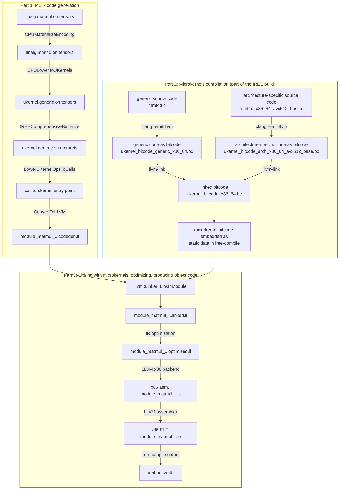

# Exploring CPU microkernels on a matmul example

## Basic setup, command lines

Source file: `matmul.mlir`:

```mlir
func.func @matmul_dynamic(%lhs: tensor<?x?xf32>, %rhs: tensor<?x?xf32>, %acc: tensor<?x?xf32>) -> tensor<?x?xf32> {
  %result = linalg.matmul ins(%lhs, %rhs: tensor<?x?xf32>, tensor<?x?xf32>) outs(%acc: tensor<?x?xf32>) -> tensor<?x?xf32>
  return %result: tensor<?x?xf32>
}
```

Basic compilation command line:

```bash
$ iree-compile matmul.mlir -o /tmp/matmul.vmfb \
  --iree-hal-target-backends=llvm-cpu \
  --iree-llvmcpu-target-cpu=znver4 \
  --iree-llvmcpu-enable-ukernels=all
```

This creates a IREE bytecode module:

```console
$ ls -l /tmp/matmul.vmfb

-rw-rw-r-- 1 2884 Jan 22 10:37 /tmp/matmul.vmfb
```

<!-- more -->

The above `.vmfb` is the only thing that's needed to run this matmul on the
target device. But to understand microkernels, we are now going to generate
additional intermediate files.

Additional `iree-compile` flags to save intermediate files (IR, assembly, object
code):

```bash
--iree-hal-dump-executable-intermediates-to=/tmp/matmul --x86-asm-syntax=intel
```

This saves LLVM IR in binary serialization ("bitcode", filename extension
`.bc`). To read it, we need to "disassemble" it using `llvm-dis` to obtain
textual IR (filename extension `.ll`).

```shell
llvm-dis /tmp/matmul/*.bc
```

Intermediate files:

```console
  35196 /tmp/matmul/module_matmul_linked_llvm_cpu_embedded_elf_x86_64.codegen.bc
 251597 /tmp/matmul/module_matmul_linked_llvm_cpu_embedded_elf_x86_64.codegen.ll
 181740 /tmp/matmul/module_matmul_linked_llvm_cpu_embedded_elf_x86_64.linked.bc
1396190 /tmp/matmul/module_matmul_linked_llvm_cpu_embedded_elf_x86_64.linked.ll
  32096 /tmp/matmul/module_matmul_linked_llvm_cpu_embedded_elf_x86_64.o
  34504 /tmp/matmul/module_matmul_linked_llvm_cpu_embedded_elf_x86_64.optimized.bc
 184981 /tmp/matmul/module_matmul_linked_llvm_cpu_embedded_elf_x86_64.optimized.ll
  82016 /tmp/matmul/module_matmul_linked_llvm_cpu_embedded_elf_x86_64.s
```

Another important `iree-compile` flag: `--mlir-print-ir-after-all` records the
IR after each pass. We save that (stderr) output to a file, `ir.log` by
appending to the `iree-compile` command line:

```bash
--mlir-print-ir-after-all 2>/tmp/matmul/ir.log
```

## Overview of the compilation and linking flow

This graph shows the transformations from the source `matmul.mlir` to the final
`matmul.vmfb` with the various intermediates met in the previous section:



## 🟨 Part 1: MLIR code generation

Some initial boilerplate happens *around* our `linalg.matmul` before anything
interesting happens *to* it.:

[➤ Appendix: IR dump after WrapEntryPointsPass](#ir-dump-after-wrapentrypointspass)

Next, the first interesting thing is the `CPUMaterializeEncoding` pass, where
the `linalg.matmul` gets rewritten into a `linalg.mmt4d` which is a matmul with
a tiled data layout. This is where we start specializing to the target ISA
feature set, AVX-512, favoring a 16x16 tile size for this float32 matmul.

[➤ Appendix: IR Dump After CPUMaterializeEncoding](#ir-dump-after-cpumaterializeencoding)

The idea is that `linalg.mmt4d` is what we will have a microkernel for, below.
There is no need to have microkernels for anything but the target-optimal tiled
layout, so we don't bother carrying a microkernel for `linalg.matmul` itself.
The matrix layout transformation, bringing matrix data into this tiled layout,
is also out of the scope of this `linalg.mmt4d` and hence of the `mmt4d`
microkernel: we can rely on generic code-generation to take care of these
byte-permutations, which is our preference as we aim to let that fuse into
producers/consumers.

Next comes the rewrite of `linalg.mmt4d` into a microkernel op, done by the
`CPULowerToUKernels` pass. Here is the TableGen definition of the generic
microkernel op we're going to generate:

[TableGen definition of `ukernel.generic`](https://github.com/iree-org/iree/blob/e82cfa99b3dc6447fe926329c12414bce75c0507/compiler/src/iree/compiler/Codegen/Dialect/Codegen/IR/UKernelOps.td#L22)

[C++ compiler code for CPULowerToUKernels](https://github.com/iree-org/iree/blob/e82cfa99b3dc6447fe926329c12414bce75c0507/compiler/src/iree/compiler/Codegen/Common/CPU/CPULowerToUKernels.cpp#L247-L251)

[➤ Appendix: IR Dump After CPULowerToUKernels](#ir-dump-after-cpulowertoukernels)

Notice that this IR is still working on `tensor` values, not on `memref` values.

* Rewrites are much nicer to perform on tensors than on memrefs.
* `ukernel.generic` works with both tensors and memrefs.
* Allows performing the rewrite to `ukernel.generic` while still on tensors,
  then just ride bufferization.

Next, bufferization takes place. `tensor` values become `memref`.

[➤ Appendix: IR Dump After IREEComprehensiveBufferize](#ir-dump-after-ireecomprehensivebufferize)

Next, the `LowerUKernelOpsToCalls` runs, rewriting `ukernel.generic` ops into
function calls.

* Made possible by bufferization: there now are buffer pointers and strides to
  pass to the target function.

[➤ Appendix: IR Dump After LowerUKernelOpsToCalls](#ir-dump-after-lowerukernelopstocalls)

Finally, this gets lowered to the MLIR LLVM dialect, in preparation for
outputting plain LLVM IR.

[➤ Appendix: IR Dump After ConvertToLLVM](#ir-dump-after-converttollvm)

The above gets converted to plain LLVM IR and that's our first intermediate
file, `module_matmul_linked_llvm_cpu_embedded_elf_x86_64.codegen.bc`, which
`llvm-dis` helps disassemble into a textual IR file (`.ll`).

[➤ Appendix: Intermediate file: `...codegen.bc`, disassembled to `...codegen.ll`](#intermediate-file-codegenbc-disassembled-to-codegenll)

The above IR references an external symbol `iree_uk_mmt4d` for the microkernel
that it calls, so it now needs to be linked against the ukernels bitcode.

## 🟦 Part 2: Microkernels compilation (part of the IREE build)

Microkernels are:

* Compiled to self-contained bitcode, once for each target architecture.
    - That puts requirement on the source languages that they can be defined in.
        - Can use C via `clang -emit-llvm` plus extra flags like `-ffreestanding`.
            - The source must not `#include` standard library headers or do
              anything OS-specific.
        - Can use inline assembly but not out-of-line assembly.
* Taking scalar parameters, including buffer pointers and strides.
    - Array-processing microkernels have a *memory-to-memory* interface.
    - No vector-to-vector microkernels.
        - Store-to-load-forwarding can still happen post-linking, effectively
          achieving the same.
        - Microkernel ops avoid MLIR vector dialect altogether.

C source code for the
[`iree_uk_mmt4d` microkernel entry point](https://github.com/iree-org/iree/blob/c437add6a3b1e3e873cec95505d37c4938fee74f/runtime/src/iree/builtins/ukernel/mmt4d.c#L118-L131)

This calls an
[architecture-specific function](https://github.com/iree-org/iree/blob/c437add6a3b1e3e873cec95505d37c4938fee74f/runtime/src/iree/builtins/ukernel/arch/x86_64/mmt4d_x86_64_entry_point.c#L395)
to return a function pointer to the optimized inner-loop implementation to use
for given data types and SIMD ISA features, and then uses that in a
[generic outer-loop implementation](https://github.com/iree-org/iree/blob/c437add6a3b1e3e873cec95505d37c4938fee74f/runtime/src/iree/builtins/ukernel/mmt4d.c#L53-L102).

So the really interesting part is the implementation of the inner-loop function
that we got a function pointer to. For example,
[here](https://github.com/iree-org/iree/blob/c437add6a3b1e3e873cec95505d37c4938fee74f/runtime/src/iree/builtins/ukernel/arch/x86_64/mmt4d_x86_64_avx512_base.c#L12-L61)
is the one used in our example where the element type is `f32` and the target
has AVX-512.

A custom CMake function,
[`iree_bitcode_library`](https://github.com/iree-org/iree/blob/c437add6a3b1e3e873cec95505d37c4938fee74f/build_tools/cmake/iree_bitcode_library.cmake#L9-L139),
wraps `clang` to compile these C source files with special flags to obtain
freestanding bitcode.

Likewise, a custom CMake function,
[`iree_link_bitcode`](https://github.com/iree-org/iree/blob/c437add6a3b1e3e873cec95505d37c4938fee74f/build_tools/cmake/iree_bitcode_library.cmake#L231-L278),
wraps `llvm-link` to link bitcode files.

These are used during the IREE compiler build (as a dependency of
`iree-compile`) to build microkernels as bitcode for all supported target
architectures, generating one bitcode file for each architecture in the build
directory:

```console
~/iree-build$ ls ./runtime/src/iree/builtins/ukernel/ukernel_bitcode_*.bc | grep -v generic
./runtime/src/iree/builtins/ukernel/ukernel_bitcode_arm_32.bc
./runtime/src/iree/builtins/ukernel/ukernel_bitcode_arm_64.bc
./runtime/src/iree/builtins/ukernel/ukernel_bitcode_riscv_32.bc
./runtime/src/iree/builtins/ukernel/ukernel_bitcode_riscv_64.bc
./runtime/src/iree/builtins/ukernel/ukernel_bitcode_x86_64.bc
```

These files are then embedded as static data within `iree-compile`, so that
`iree-compile` stays self-contained.

Here are some samples of ukernel bitcode if you are curious what it looks like:

[➤ Appendix: embedded microkernel bitcode: `iree_uk_mmt4d` ukernel entry point](#ukernel-bitcode-entry-point)

[➤ Appendix: embedded microkernel bitcode: inner-loop tile function](#ukernel-bitcode-tile-function)

## 🟩 Part 3: Linking with microkernels, optimizing, producing object code

The previous two sections covered respectively the compilation of the MLIR
module, and the compilation of microkernels, as two separate bitcode modules.
Now we turn to how these two bitcode modules are linked together.

After code generation, `iree-compile` loads microkernel bitcode:
<https://github.com/iree-org/iree/blob/c437add6a3b1e3e873cec95505d37c4938fee74f/compiler/src/iree/compiler/Dialect/HAL/Target/LLVMCPU/LLVMCPUTarget.cpp#L490>

It is worth zooming into that `loadUKernelBitcode` function as, in addition to
just loading the bitcode, it does one important thing: it adds the
`alwaysinline` attribute on every function. As we will see just below, always
inlining microkernels is key to achieving perfect results with no downsides
compared to a pure code-generation approach.
<https://github.com/iree-org/iree/blob/c437add6a3b1e3e873cec95505d37c4938fee74f/compiler/src/iree/compiler/Dialect/HAL/Target/LLVMCPU/Builtins/UKernel.cpp#L36-L62>

And links it into the current module:
<https://github.com/iree-org/iree/blob/c437add6a3b1e3e873cec95505d37c4938fee74f/compiler/src/iree/compiler/Dialect/HAL/Target/LLVMCPU/LLVMCPUTarget.cpp#L499>

The linked IR so far is not very interesting, as it is still essentially just
the concatenation of the above-discussed codegen and microkernel bitcode
(except now with `alwaysinline` attributes). If you are curious, it is dumped as
the `...linked.bc` file.

Where it gets interesting is that immediately after that, we run LLVM IR
optimization passes, which can be thought of as a form of link-time optimization
(LTO):
<https://github.com/iree-org/iree/blob/c437add6a3b1e3e873cec95505d37c4938fee74f/compiler/src/iree/compiler/Dialect/HAL/Target/LLVMCPU/LLVMCPUTarget.cpp#L527>

At this point, all the microkernel code gets inlined into the dispatch function,
the correct AVX-512 optimized tile function is selected and inlined, and
everything else is DCE'd. That's how the user pays no cost for what they don't
use --- not only for the microkernel entry points that they don't call, but also
for all the unused code paths within each microkernel.

[➤ Appendix: Intermediate file: `...optimized.bc`, disassembled to `...optimized.ll`](#intermediate-file-optimizedbc-disassembled-to-optimizedll)

This then goes to the LLVM x86 backend, which produces x86 assembly.

[➤ Appendix: x86 assembly](#x86-assembly)

## Appendix

### IR dump after WrapEntryPointsPass

```mlir
// -----// IR Dump After mlir::iree_compiler::IREE::ABI::WrapEntryPointsPass (iree-abi-wrap-entry-points) //----- //
[...]
// -----// IR Dump After Inliner (inline) //----- //
#executable_target_embedded_elf_x86_64_ = #hal.executable.target<"llvm-cpu", "embedded-elf-x86_64", {cpu = "znver4", cpu_features = "+mmx,+popcnt,+sse,+sse2,+sse3,+ssse3,+sse4.1,+sse4.2,+avx,+avx2,+sse4a,+fma,+avx512f,+bmi,+bmi2,+aes,+pclmul,+avx512vl,+avx512bw,+avx512dq,+avx512cd,+avx512vbmi,+avx512ifma,+avx512vpopcntdq,+avx512vbmi2,+gfni,+vpclmulqdq,+avx512vnni,+avx512bitalg,+avx512bf16,+adx,+clflushopt,+clwb,+clzero,+cx16,+cx8,+crc32,+f16c,+fsgsbase,+fxsr,+invpcid,+lzcnt,+movbe,+mwaitx,+pku,+prfchw,+rdpid,+rdpru,+rdrnd,+rdseed,+sahf,+sha,+shstk,+vaes,+wbnoinvd,+x87,+xsave,+xsavec,+xsaveopt,+xsaves,+evex512", data_layout = "e-m:e-p270:32:32-p271:32:32-p272:64:64-i64:64-i128:128-f80:128-n8:16:32:64-S128", native_vector_size = 64 : index, target_triple = "x86_64-unknown-unknown-eabi-elf", ukernels = "all"}>
#device_target_llvm_cpu = #hal.device.target<"llvm-cpu", {executable_targets = [#executable_target_embedded_elf_x86_64_]}> : !hal.device
module attributes {hal.device.targets = [#device_target_llvm_cpu]} {
  func.func @matmul_dynamic(%arg0: !hal.buffer_view, %arg1: !hal.buffer_view, %arg2: !hal.buffer_view) -> !hal.buffer_view attributes {iree.abi.stub, iree.reflection = {iree.abi.declaration = "sync func @matmul_dynamic(%input0: tensor<?x?xf32>, %input1: tensor<?x?xf32>, %input2: tensor<?x?xf32>) -> (%output0: tensor<?x?xf32>)"}} {
    %0 = hal.buffer_view.dim<%arg0 : !hal.buffer_view>[0] : index
    %1 = hal.buffer_view.dim<%arg0 : !hal.buffer_view>[1] : index
    %2 = hal.tensor.import %arg0 "input0" : !hal.buffer_view -> tensor<?x?xf32>{%0, %1}
    %3 = hal.buffer_view.dim<%arg1 : !hal.buffer_view>[0] : index
    %4 = hal.buffer_view.dim<%arg1 : !hal.buffer_view>[1] : index
    %5 = hal.tensor.import %arg1 "input1" : !hal.buffer_view -> tensor<?x?xf32>{%3, %4}
    %6 = hal.buffer_view.dim<%arg2 : !hal.buffer_view>[0] : index
    %7 = hal.buffer_view.dim<%arg2 : !hal.buffer_view>[1] : index
    %8 = hal.tensor.import %arg2 "input2" : !hal.buffer_view -> tensor<?x?xf32>{%6, %7}
    %9 = linalg.matmul ins(%2, %5 : tensor<?x?xf32>, tensor<?x?xf32>) outs(%8 : tensor<?x?xf32>) -> tensor<?x?xf32>
    %10 = hal.tensor.export %9 "output0" : tensor<?x?xf32>{%6, %7} -> !hal.buffer_view
    return %10 : !hal.buffer_view
  }
}
```

### IR Dump After CPUMaterializeHostEncoding

```mlir
// -----// IR Dump After CPUMaterializeHostEncoding (iree-codegen-cpu-materialize-host-encoding) //----- //
[...]
// -----// IR Dump After Canonicalizer (canonicalize) //----- //
[...]
// -----// IR Dump After CSE (cse) //----- //
#executable_target_embedded_elf_x86_64_ = #hal.executable.target<"llvm-cpu", "embedded-elf-x86_64", {cpu = "znver4", cpu_features = "+mmx,+popcnt,+sse,+sse2,+sse3,+ssse3,+sse4.1,+sse4.2,+avx,+avx2,+sse4a,+fma,+avx512f,+bmi,+bmi2,+aes,+pclmul,+avx512vl,+avx512bw,+avx512dq,+avx512cd,+avx512vbmi,+avx512ifma,+avx512vpopcntdq,+avx512vbmi2,+gfni,+vpclmulqdq,+avx512vnni,+avx512bitalg,+avx512bf16,+adx,+clflushopt,+clwb,+clzero,+cx16,+cx8,+crc32,+f16c,+fsgsbase,+fxsr,+invpcid,+lzcnt,+movbe,+mwaitx,+pku,+prfchw,+rdpid,+rdpru,+rdrnd,+rdseed,+sahf,+sha,+shstk,+vaes,+wbnoinvd,+x87,+xsave,+xsavec,+xsaveopt,+xsaves,+evex512", data_layout = "e-m:e-p270:32:32-p271:32:32-p272:64:64-i64:64-i128:128-f80:128-n8:16:32:64-S128", native_vector_size = 64 : index, target_triple = "x86_64-unknown-unknown-eabi-elf", ukernels = "all"}>
#map = affine_map<()[s0] -> (s0 ceildiv 16)>
#device_target_llvm_cpu = #hal.device.target<"llvm-cpu", {executable_targets = [#executable_target_embedded_elf_x86_64_]}> : !hal.device
module attributes {hal.device.targets = [#device_target_llvm_cpu]} {
  func.func @matmul_dynamic(%arg0: !hal.buffer_view, %arg1: !hal.buffer_view, %arg2: !hal.buffer_view) -> !hal.buffer_view attributes {iree.abi.stub, iree.reflection = {iree.abi.declaration = "sync func @matmul_dynamic(%input0: tensor<?x?xf32>, %input1: tensor<?x?xf32>, %input2: tensor<?x?xf32>) -> (%output0: tensor<?x?xf32>)"}} {
    %cst = arith.constant 0.000000e+00 : f32
    %0 = hal.buffer_view.dim<%arg0 : !hal.buffer_view>[0] : index
    %1 = hal.buffer_view.dim<%arg0 : !hal.buffer_view>[1] : index
    %2 = hal.tensor.import %arg0 "input0" : !hal.buffer_view -> tensor<?x?xf32>{%0, %1}
    %3 = hal.buffer_view.dim<%arg1 : !hal.buffer_view>[0] : index
    %4 = hal.buffer_view.dim<%arg1 : !hal.buffer_view>[1] : index
    %5 = hal.tensor.import %arg1 "input1" : !hal.buffer_view -> tensor<?x?xf32>{%3, %4}
    %6 = hal.buffer_view.dim<%arg2 : !hal.buffer_view>[0] : index
    %7 = hal.buffer_view.dim<%arg2 : !hal.buffer_view>[1] : index
    %8 = hal.tensor.import %arg2 "input2" : !hal.buffer_view -> tensor<?x?xf32>{%6, %7}
    %9 = affine.apply #map()[%0]
    %10 = tensor.empty(%9, %1) : tensor<?x?x16x1xf32>
    %pack = tensor.pack %2 padding_value(%cst : f32) outer_dims_perm = [0, 1] inner_dims_pos = [0, 1] inner_tiles = [16, 1] into %10 : tensor<?x?xf32> -> tensor<?x?x16x1xf32>
    %11 = affine.apply #map()[%4]
    %12 = tensor.empty(%11, %3) : tensor<?x?x16x1xf32>
    %pack_0 = tensor.pack %5 padding_value(%cst : f32) outer_dims_perm = [1, 0] inner_dims_pos = [1, 0] inner_tiles = [16, 1] into %12 : tensor<?x?xf32> -> tensor<?x?x16x1xf32>
    %13 = affine.apply #map()[%6]
    %14 = affine.apply #map()[%7]
    %15 = tensor.empty(%13, %14) : tensor<?x?x16x16xf32>
    %pack_1 = tensor.pack %8 padding_value(%cst : f32) outer_dims_perm = [0, 1] inner_dims_pos = [0, 1] inner_tiles = [16, 16] into %15 : tensor<?x?xf32> -> tensor<?x?x16x16xf32>
    %16 = linalg.mmt4d ins(%pack, %pack_0 : tensor<?x?x16x1xf32>, tensor<?x?x16x1xf32>) outs(%pack_1 : tensor<?x?x16x16xf32>) -> tensor<?x?x16x16xf32>
    %17 = tensor.empty(%6, %7) : tensor<?x?xf32>
    %unpack = tensor.unpack %16 outer_dims_perm = [0, 1] inner_dims_pos = [0, 1] inner_tiles = [16, 16] into %17 : tensor<?x?x16x16xf32> -> tensor<?x?xf32>
    %18 = hal.tensor.export %unpack "output0" : tensor<?x?xf32>{%6, %7} -> !hal.buffer_view
    return %18 : !hal.buffer_view
  }
}
```

### IR Dump After CPULowerToUKernels

```mlir
// -----// IR Dump After CPULowerToUKernels (iree-codegen-cpu-lower-to-ukernels) //----- //
module {
  func.func @matmul_dynamic_dispatch_3_mmt4d_DxDxDx16x16x1_f32() {
    %c1281_i32 = arith.constant 1281 : i32
    %c1_i32 = arith.constant 1 : i32
    %c16_i32 = arith.constant 16 : i32
    %c1 = arith.constant 1 : index
    %c0 = arith.constant 0 : index
    %c32_i64 = arith.constant 32 : i64
    %0 = hal.interface.constant.load[0] : i32
    %1 = hal.interface.constant.load[1] : i32
    %2 = hal.interface.constant.load[2] : i32
    %3 = hal.interface.constant.load[3] : i32
    %4 = hal.interface.constant.load[4] : i32
    %5 = hal.interface.constant.load[5] : i32
    %6 = hal.interface.constant.load[6] : i32
    %7 = hal.interface.constant.load[7] : i32
    %8 = hal.interface.constant.load[8] : i32
    %9 = hal.interface.constant.load[9] : i32
    %10 = hal.interface.constant.load[10] : i32
    %11 = hal.interface.constant.load[11] : i32
    %12 = hal.interface.constant.load[12] : i32
    %13 = hal.interface.constant.load[13] : i32
    %14 = hal.interface.constant.load[14] : i32
    %15 = hal.interface.constant.load[15] : i32
    %16 = arith.extui %0 : i32 to i64
    %17 = arith.extui %1 : i32 to i64
    %18 = arith.shli %17, %c32_i64 : i64
    %19 = arith.ori %16, %18 : i64
    %20 = arith.index_castui %19 : i64 to index
    %21 = arith.extui %2 : i32 to i64
    %22 = arith.extui %3 : i32 to i64
    %23 = arith.shli %22, %c32_i64 : i64
    %24 = arith.ori %21, %23 : i64
    %25 = arith.index_castui %24 : i64 to index
    %26 = arith.extui %4 : i32 to i64
    %27 = arith.extui %5 : i32 to i64
    %28 = arith.shli %27, %c32_i64 : i64
    %29 = arith.ori %26, %28 : i64
    %30 = arith.index_castui %29 : i64 to index
    %31 = arith.extui %6 : i32 to i64
    %32 = arith.extui %7 : i32 to i64
    %33 = arith.shli %32, %c32_i64 : i64
    %34 = arith.ori %31, %33 : i64
    %35 = arith.index_castui %34 : i64 to index
    %36 = arith.extui %8 : i32 to i64
    %37 = arith.extui %9 : i32 to i64
    %38 = arith.shli %37, %c32_i64 : i64
    %39 = arith.ori %36, %38 : i64
    %40 = arith.index_castui %39 : i64 to index
    %41 = arith.extui %10 : i32 to i64
    %42 = arith.extui %11 : i32 to i64
    %43 = arith.shli %42, %c32_i64 : i64
    %44 = arith.ori %41, %43 : i64
    %45 = arith.index_castui %44 : i64 to index
    %46 = arith.extui %12 : i32 to i64
    %47 = arith.extui %13 : i32 to i64
    %48 = arith.shli %47, %c32_i64 : i64
    %49 = arith.ori %46, %48 : i64
    %50 = arith.index_castui %49 : i64 to index
    %51 = arith.extui %14 : i32 to i64
    %52 = arith.extui %15 : i32 to i64
    %53 = arith.shli %52, %c32_i64 : i64
    %54 = arith.ori %51, %53 : i64
    %55 = arith.index_castui %54 : i64 to index
    %56 = hal.interface.binding.subspan set(0) binding(0) type(storage_buffer) alignment(64) offset(%c0) flags(ReadOnly) : !flow.dispatch.tensor<readonly:tensor<?x?x16x1xf32>>{%30, %35}
    %57 = hal.interface.binding.subspan set(0) binding(0) type(storage_buffer) alignment(64) offset(%20) flags(ReadOnly) : !flow.dispatch.tensor<readonly:tensor<?x?x16x1xf32>>{%40, %45}
    %58 = hal.interface.binding.subspan set(0) binding(1) type(storage_buffer) alignment(64) offset(%25) : !flow.dispatch.tensor<readwrite:tensor<?x?x16x16xf32>>{%50, %55}
    %workgroup_id_x = hal.interface.workgroup.id[0] : index
    %workgroup_count_x = hal.interface.workgroup.count[0] : index
    %workgroup_id_y = hal.interface.workgroup.id[1] : index
    %workgroup_count_y = hal.interface.workgroup.count[1] : index
    scf.for %arg0 = %workgroup_id_y to %30 step %workgroup_count_y {
      scf.for %arg1 = %workgroup_id_x to %40 step %workgroup_count_x {
        %59 = flow.dispatch.tensor.load %56, offsets = [%arg0, 0, 0, 0], sizes = [1, %35, 16, 1], strides = [1, 1, 1, 1] : !flow.dispatch.tensor<readonly:tensor<?x?x16x1xf32>>{%30, %35} -> tensor<1x?x16x1xf32>
        %60 = flow.dispatch.tensor.load %57, offsets = [%arg1, 0, 0, 0], sizes = [1, %35, 16, 1], strides = [1, 1, 1, 1] : !flow.dispatch.tensor<readonly:tensor<?x?x16x1xf32>>{%40, %45} -> tensor<1x?x16x1xf32>
        %61 = flow.dispatch.tensor.load %58, offsets = [%arg0, %arg1, 0, 0], sizes = [1, 1, 16, 16], strides = [1, 1, 1, 1] : !flow.dispatch.tensor<readwrite:tensor<?x?x16x16xf32>>{%50, %55} -> tensor<1x1x16x16xf32>
        %dim = tensor.dim %60, %c1 : tensor<1x?x16x1xf32>
        %62 = iree_codegen.ukernel.generic "iree_uk_mmt4d" ins(%59, %60 : tensor<1x?x16x1xf32>, tensor<1x?x16x1xf32>) outs(%61 : tensor<1x1x16x16xf32>) (%c1, %c1, %dim, %c16_i32, %c16_i32, %c1_i32, %c1281_i32 : index, index, index, i32, i32, i32, i32) fn_def_attrs {hal.import.bitcode = true, hal.import.cconv = 1 : i32, hal.import.fields = ["processor_data"]} strided_outer_dims(1) -> tensor<1x1x16x16xf32>
        flow.dispatch.tensor.store %62, %58, offsets = [%arg0, %arg1, 0, 0], sizes = [1, 1, 16, 16], strides = [1, 1, 1, 1] : tensor<1x1x16x16xf32> -> !flow.dispatch.tensor<readwrite:tensor<?x?x16x16xf32>>{%50, %55}
      }
    }
    return
  }
}
```

### IR Dump After IREEComprehensiveBufferize

```mlir
// -----// IR Dump After IREEComprehensiveBufferize (iree-codegen-iree-comprehensive-bufferize) //----- //
[...]
// -----// IR Dump After EmptyTensorToAllocTensor (empty-tensor-to-alloc-tensor) //----- //
[...]
// -----// IR Dump After ResolveShapedTypeResultDims (resolve-shaped-type-result-dims) //----- //
[...]
// -----// IR Dump After Canonicalizer (canonicalize) //----- //
[...]
// -----// IR Dump After CSE (cse) //----- //
[...]
// -----// IR Dump After CleanupBufferAllocView (iree-codegen-cleanup-buffer-alloc-view) //----- //
func.func @matmul_dynamic_dispatch_3_mmt4d_DxDxDx16x16x1_f32() {
  %c1281_i32 = arith.constant 1281 : i32
  %c1_i32 = arith.constant 1 : i32
  %c16_i32 = arith.constant 16 : i32
  %c1 = arith.constant 1 : index
  %c0 = arith.constant 0 : index
  %c32_i64 = arith.constant 32 : i64
  %0 = hal.interface.constant.load[0] : i32
  %1 = hal.interface.constant.load[1] : i32
  %2 = hal.interface.constant.load[2] : i32
  %3 = hal.interface.constant.load[3] : i32
  %4 = hal.interface.constant.load[4] : i32
  %5 = hal.interface.constant.load[5] : i32
  %6 = hal.interface.constant.load[6] : i32
  %7 = hal.interface.constant.load[7] : i32
  %8 = hal.interface.constant.load[8] : i32
  %9 = hal.interface.constant.load[9] : i32
  %10 = hal.interface.constant.load[10] : i32
  %11 = hal.interface.constant.load[11] : i32
  %12 = hal.interface.constant.load[12] : i32
  %13 = hal.interface.constant.load[13] : i32
  %14 = hal.interface.constant.load[14] : i32
  %15 = hal.interface.constant.load[15] : i32
  %16 = arith.extui %0 : i32 to i64
  %17 = arith.extui %1 : i32 to i64
  %18 = arith.shli %17, %c32_i64 : i64
  %19 = arith.ori %16, %18 : i64
  %20 = arith.index_castui %19 : i64 to index
  %21 = arith.extui %2 : i32 to i64
  %22 = arith.extui %3 : i32 to i64
  %23 = arith.shli %22, %c32_i64 : i64
  %24 = arith.ori %21, %23 : i64
  %25 = arith.index_castui %24 : i64 to index
  %26 = arith.extui %4 : i32 to i64
  %27 = arith.extui %5 : i32 to i64
  %28 = arith.shli %27, %c32_i64 : i64
  %29 = arith.ori %26, %28 : i64
  %30 = arith.index_castui %29 : i64 to index
  %31 = arith.extui %6 : i32 to i64
  %32 = arith.extui %7 : i32 to i64
  %33 = arith.shli %32, %c32_i64 : i64
  %34 = arith.ori %31, %33 : i64
  %35 = arith.index_castui %34 : i64 to index
  %36 = arith.extui %8 : i32 to i64
  %37 = arith.extui %9 : i32 to i64
  %38 = arith.shli %37, %c32_i64 : i64
  %39 = arith.ori %36, %38 : i64
  %40 = arith.index_castui %39 : i64 to index
  %41 = arith.extui %10 : i32 to i64
  %42 = arith.extui %11 : i32 to i64
  %43 = arith.shli %42, %c32_i64 : i64
  %44 = arith.ori %41, %43 : i64
  %45 = arith.index_castui %44 : i64 to index
  %46 = arith.extui %12 : i32 to i64
  %47 = arith.extui %13 : i32 to i64
  %48 = arith.shli %47, %c32_i64 : i64
  %49 = arith.ori %46, %48 : i64
  %50 = arith.index_castui %49 : i64 to index
  %51 = arith.extui %14 : i32 to i64
  %52 = arith.extui %15 : i32 to i64
  %53 = arith.shli %52, %c32_i64 : i64
  %54 = arith.ori %51, %53 : i64
  %55 = arith.index_castui %54 : i64 to index
  %56 = hal.interface.binding.subspan set(0) binding(0) type(storage_buffer) alignment(64) offset(%c0) flags(ReadOnly) : memref<?x?x16x1xf32, #hal.descriptor_type<storage_buffer>>{%30, %35}
  memref.assume_alignment %56, 64 : memref<?x?x16x1xf32, #hal.descriptor_type<storage_buffer>>
  %57 = hal.interface.binding.subspan set(0) binding(0) type(storage_buffer) alignment(64) offset(%20) flags(ReadOnly) : memref<?x?x16x1xf32, strided<[?, 16, 1, 1], offset: ?>, #hal.descriptor_type<storage_buffer>>{%40, %45}
  memref.assume_alignment %57, 1 : memref<?x?x16x1xf32, strided<[?, 16, 1, 1], offset: ?>, #hal.descriptor_type<storage_buffer>>
  %58 = hal.interface.binding.subspan set(0) binding(1) type(storage_buffer) alignment(64) offset(%25) : memref<?x?x16x16xf32, strided<[?, 256, 16, 1], offset: ?>, #hal.descriptor_type<storage_buffer>>{%50, %55}
  memref.assume_alignment %58, 1 : memref<?x?x16x16xf32, strided<[?, 256, 16, 1], offset: ?>, #hal.descriptor_type<storage_buffer>>
  %workgroup_id_x = hal.interface.workgroup.id[0] : index
  %workgroup_count_x = hal.interface.workgroup.count[0] : index
  %workgroup_id_y = hal.interface.workgroup.id[1] : index
  %workgroup_count_y = hal.interface.workgroup.count[1] : index
  scf.for %arg0 = %workgroup_id_y to %30 step %workgroup_count_y {
    %subview = memref.subview %56[%arg0, 0, 0, 0] [1, %35, 16, 1] [1, 1, 1, 1] : memref<?x?x16x1xf32, #hal.descriptor_type<storage_buffer>> to memref<1x?x16x1xf32, strided<[?, 16, 1, 1], offset: ?>, #hal.descriptor_type<storage_buffer>>
    scf.for %arg1 = %workgroup_id_x to %40 step %workgroup_count_x {
      %subview_0 = memref.subview %57[%arg1, 0, 0, 0] [1, %35, 16, 1] [1, 1, 1, 1] : memref<?x?x16x1xf32, strided<[?, 16, 1, 1], offset: ?>, #hal.descriptor_type<storage_buffer>> to memref<1x?x16x1xf32, strided<[?, 16, 1, 1], offset: ?>, #hal.descriptor_type<storage_buffer>>
      %subview_1 = memref.subview %58[%arg0, %arg1, 0, 0] [1, 1, 16, 16] [1, 1, 1, 1] : memref<?x?x16x16xf32, strided<[?, 256, 16, 1], offset: ?>, #hal.descriptor_type<storage_buffer>> to memref<1x1x16x16xf32, strided<[?, 256, 16, 1], offset: ?>, #hal.descriptor_type<storage_buffer>>
      iree_codegen.ukernel.generic "iree_uk_mmt4d" ins(%subview, %subview_0 : memref<1x?x16x1xf32, strided<[?, 16, 1, 1], offset: ?>, #hal.descriptor_type<storage_buffer>>, memref<1x?x16x1xf32, strided<[?, 16, 1, 1], offset: ?>, #hal.descriptor_type<storage_buffer>>) outs(%subview_1 : memref<1x1x16x16xf32, strided<[?, 256, 16, 1], offset: ?>, #hal.descriptor_type<storage_buffer>>) (%c1, %c1, %35, %c16_i32, %c16_i32, %c1_i32, %c1281_i32 : index, index, index, i32, i32, i32, i32) fn_def_attrs {hal.import.bitcode = true, hal.import.cconv = 1 : i32, hal.import.fields = ["processor_data"]} strided_outer_dims(1)
    }
  }
  return
}
```

### IR Dump After LowerUKernelOpsToCalls

```mlir
// -----// IR Dump After LowerUKernelOpsToCalls (iree-codegen-lower-ukernel-ops-to-calls) //----- //
module {
  func.func private @iree_uk_mmt4d(memref<f32>, index, index, memref<f32>, index, index, memref<f32>, index, index, index, index, index, i32, i32, i32, i32) attributes {hal.import.bitcode = true, hal.import.cconv = 1 : i32, hal.import.fields = ["processor_data"], llvm.bareptr = true}
  func.func @matmul_dynamic_dispatch_3_mmt4d_DxDxDx16x16x1_f32() {
    %c1281_i32 = arith.constant 1281 : i32
    %c1_i32 = arith.constant 1 : i32
    %c16_i32 = arith.constant 16 : i32
    %c1 = arith.constant 1 : index
    %c0 = arith.constant 0 : index
    %c32_i64 = arith.constant 32 : i64
    %0 = hal.interface.constant.load[0] : i32
    %1 = hal.interface.constant.load[1] : i32
    %2 = hal.interface.constant.load[2] : i32
    %3 = hal.interface.constant.load[3] : i32
    %4 = hal.interface.constant.load[4] : i32
    %5 = hal.interface.constant.load[5] : i32
    %6 = hal.interface.constant.load[6] : i32
    %7 = hal.interface.constant.load[7] : i32
    %8 = hal.interface.constant.load[8] : i32
    %9 = hal.interface.constant.load[9] : i32
    %10 = hal.interface.constant.load[10] : i32
    %11 = hal.interface.constant.load[11] : i32
    %12 = hal.interface.constant.load[12] : i32
    %13 = hal.interface.constant.load[13] : i32
    %14 = hal.interface.constant.load[14] : i32
    %15 = hal.interface.constant.load[15] : i32
    %16 = arith.extui %0 : i32 to i64
    %17 = arith.extui %1 : i32 to i64
    %18 = arith.shli %17, %c32_i64 : i64
    %19 = arith.ori %16, %18 : i64
    %20 = arith.index_castui %19 : i64 to index
    %21 = arith.extui %2 : i32 to i64
    %22 = arith.extui %3 : i32 to i64
    %23 = arith.shli %22, %c32_i64 : i64
    %24 = arith.ori %21, %23 : i64
    %25 = arith.index_castui %24 : i64 to index
    %26 = arith.extui %4 : i32 to i64
    %27 = arith.extui %5 : i32 to i64
    %28 = arith.shli %27, %c32_i64 : i64
    %29 = arith.ori %26, %28 : i64
    %30 = arith.index_castui %29 : i64 to index
    %31 = arith.extui %6 : i32 to i64
    %32 = arith.extui %7 : i32 to i64
    %33 = arith.shli %32, %c32_i64 : i64
    %34 = arith.ori %31, %33 : i64
    %35 = arith.index_castui %34 : i64 to index
    %36 = arith.extui %8 : i32 to i64
    %37 = arith.extui %9 : i32 to i64
    %38 = arith.shli %37, %c32_i64 : i64
    %39 = arith.ori %36, %38 : i64
    %40 = arith.index_castui %39 : i64 to index
    %41 = arith.extui %10 : i32 to i64
    %42 = arith.extui %11 : i32 to i64
    %43 = arith.shli %42, %c32_i64 : i64
    %44 = arith.ori %41, %43 : i64
    %45 = arith.index_castui %44 : i64 to index
    %46 = arith.extui %12 : i32 to i64
    %47 = arith.extui %13 : i32 to i64
    %48 = arith.shli %47, %c32_i64 : i64
    %49 = arith.ori %46, %48 : i64
    %50 = arith.index_castui %49 : i64 to index
    %51 = arith.extui %14 : i32 to i64
    %52 = arith.extui %15 : i32 to i64
    %53 = arith.shli %52, %c32_i64 : i64
    %54 = arith.ori %51, %53 : i64
    %55 = arith.index_castui %54 : i64 to index
    %56 = hal.interface.binding.subspan set(0) binding(0) type(storage_buffer) alignment(64) offset(%c0) flags(ReadOnly) : memref<?x?x16x1xf32>{%30, %35}
    memref.assume_alignment %56, 64 : memref<?x?x16x1xf32>
    %57 = hal.interface.binding.subspan set(0) binding(0) type(storage_buffer) alignment(64) offset(%20) flags(ReadOnly) : memref<?x?x16x1xf32, strided<[?, 16, 1, 1], offset: ?>>{%40, %45}
    memref.assume_alignment %57, 1 : memref<?x?x16x1xf32, strided<[?, 16, 1, 1], offset: ?>>
    %58 = hal.interface.binding.subspan set(0) binding(1) type(storage_buffer) alignment(64) offset(%25) : memref<?x?x16x16xf32, strided<[?, 256, 16, 1], offset: ?>>{%50, %55}
    memref.assume_alignment %58, 1 : memref<?x?x16x16xf32, strided<[?, 256, 16, 1], offset: ?>>
    %workgroup_id_x = hal.interface.workgroup.id[0] : index
    %workgroup_count_x = hal.interface.workgroup.count[0] : index
    %workgroup_id_y = hal.interface.workgroup.id[1] : index
    %workgroup_count_y = hal.interface.workgroup.count[1] : index
    scf.for %arg0 = %workgroup_id_y to %30 step %workgroup_count_y {
      %subview = memref.subview %56[%arg0, 0, 0, 0] [1, %35, 16, 1] [1, 1, 1, 1] : memref<?x?x16x1xf32> to memref<1x?x16x1xf32, strided<[?, 16, 1, 1], offset: ?>>
      scf.for %arg1 = %workgroup_id_x to %40 step %workgroup_count_x {
        %subview_0 = memref.subview %57[%arg1, 0, 0, 0] [1, %35, 16, 1] [1, 1, 1, 1] : memref<?x?x16x1xf32, strided<[?, 16, 1, 1], offset: ?>> to memref<1x?x16x1xf32, strided<[?, 16, 1, 1], offset: ?>>
        %subview_1 = memref.subview %58[%arg0, %arg1, 0, 0] [1, 1, 16, 16] [1, 1, 1, 1] : memref<?x?x16x16xf32, strided<[?, 256, 16, 1], offset: ?>> to memref<1x1x16x16xf32, strided<[?, 256, 16, 1], offset: ?>>
        %base_buffer, %offset, %sizes:4, %strides:4 = memref.extract_strided_metadata %subview : memref<1x?x16x1xf32, strided<[?, 16, 1, 1], offset: ?>> -> memref<f32>, index, index, index, index, index, index, index, index, index
        %base_buffer_2, %offset_3, %sizes_4:4, %strides_5:4 = memref.extract_strided_metadata %subview_0 : memref<1x?x16x1xf32, strided<[?, 16, 1, 1], offset: ?>> -> memref<f32>, index, index, index, index, index, index, index, index, index
        %base_buffer_6, %offset_7, %sizes_8:4, %strides_9:4 = memref.extract_strided_metadata %subview_1 : memref<1x1x16x16xf32, strided<[?, 256, 16, 1], offset: ?>> -> memref<f32>, index, index, index, index, index, index, index, index, index
        func.call @iree_uk_mmt4d(%base_buffer, %offset, %strides#0, %base_buffer_2, %offset_3, %strides_5#0, %base_buffer_6, %offset_7, %strides_9#0, %c1, %c1, %35, %c16_i32, %c16_i32, %c1_i32, %c1281_i32) : (memref<f32>, index, index, memref<f32>, index, index, memref<f32>, index, index, index, index, index, i32, i32, i32, i32) -> ()
      }
    }
    return
  }
}
```

### IR Dump After ConvertToLLVM

```mlir
// -----// IR Dump After ConvertToLLVM (iree-convert-to-llvm) //----- //
module attributes {llvm.data_layout = "e-m:e-p270:32:32-p271:32:32-p272:64:64-i64:64-i128:128-f80:128-n8:16:32:64-S128", llvm.target_triple = "x86_64-unknown-unknown-eabi-elf"} {
  llvm.func @iree_uk_mmt4d(!llvm.ptr) attributes {hal.import.bitcode = true, hal.import.cconv = 1 : i32, hal.import.fields = ["processor_data"], llvm.bareptr = true}
  llvm.func @matmul_dynamic_dispatch_3_mmt4d_DxDxDx16x16x1_f32(%arg0: !llvm.ptr {llvm.align = 16 : i64, llvm.noalias}, %arg1: !llvm.ptr {llvm.align = 16 : i64, llvm.noalias}, %arg2: !llvm.ptr {llvm.align = 16 : i64, llvm.noalias}) -> i32 {
    %0 = llvm.mlir.constant(4293970975 : i64) : i64
    %1 = llvm.mlir.constant(8 : i64) : i64
    %2 = llvm.mlir.constant(0 : i32) : i32
    %3 = llvm.mlir.constant(256 : index) : i64
    %4 = llvm.mlir.constant(-1 : index) : i64
    %5 = llvm.mlir.constant(4 : index) : i64
    %6 = llvm.mlir.constant(16 : index) : i64
    %7 = llvm.mlir.constant(0 : index) : i64
    %8 = llvm.mlir.constant(1281 : i32) : i32
    %9 = llvm.mlir.constant(1 : i32) : i32
    %10 = llvm.mlir.constant(16 : i32) : i32
    %11 = llvm.mlir.constant(1 : index) : i64
    %12 = llvm.mlir.constant(32 : i64) : i64
    %13 = llvm.load %arg1 : !llvm.ptr -> !llvm.struct<"iree_hal_executable_dispatch_state_v0_t", (i32, i32, i16, i16, i32, i32, i16, i8, i8, ptr, ptr, ptr)>
    %14 = llvm.extractvalue %13[9] : !llvm.struct<"iree_hal_executable_dispatch_state_v0_t", (i32, i32, i16, i16, i32, i32, i16, i8, i8, ptr, ptr, ptr)>
    %15 = llvm.load %14 : !llvm.ptr -> i32
    %16 = llvm.load %arg1 : !llvm.ptr -> !llvm.struct<"iree_hal_executable_dispatch_state_v0_t", (i32, i32, i16, i16, i32, i32, i16, i8, i8, ptr, ptr, ptr)>
    %17 = llvm.extractvalue %16[9] : !llvm.struct<"iree_hal_executable_dispatch_state_v0_t", (i32, i32, i16, i16, i32, i32, i16, i8, i8, ptr, ptr, ptr)>
    %18 = llvm.getelementptr %17[1] : (!llvm.ptr) -> !llvm.ptr, i32
    %19 = llvm.load %18 : !llvm.ptr -> i32
    %20 = llvm.load %arg1 : !llvm.ptr -> !llvm.struct<"iree_hal_executable_dispatch_state_v0_t", (i32, i32, i16, i16, i32, i32, i16, i8, i8, ptr, ptr, ptr)>
    %21 = llvm.extractvalue %20[9] : !llvm.struct<"iree_hal_executable_dispatch_state_v0_t", (i32, i32, i16, i16, i32, i32, i16, i8, i8, ptr, ptr, ptr)>
    %22 = llvm.getelementptr %21[2] : (!llvm.ptr) -> !llvm.ptr, i32
    %23 = llvm.load %22 : !llvm.ptr -> i32
    %24 = llvm.load %arg1 : !llvm.ptr -> !llvm.struct<"iree_hal_executable_dispatch_state_v0_t", (i32, i32, i16, i16, i32, i32, i16, i8, i8, ptr, ptr, ptr)>
    %25 = llvm.extractvalue %24[9] : !llvm.struct<"iree_hal_executable_dispatch_state_v0_t", (i32, i32, i16, i16, i32, i32, i16, i8, i8, ptr, ptr, ptr)>
    %26 = llvm.getelementptr %25[3] : (!llvm.ptr) -> !llvm.ptr, i32
    %27 = llvm.load %26 : !llvm.ptr -> i32
    %28 = llvm.load %arg1 : !llvm.ptr -> !llvm.struct<"iree_hal_executable_dispatch_state_v0_t", (i32, i32, i16, i16, i32, i32, i16, i8, i8, ptr, ptr, ptr)>
    %29 = llvm.extractvalue %28[9] : !llvm.struct<"iree_hal_executable_dispatch_state_v0_t", (i32, i32, i16, i16, i32, i32, i16, i8, i8, ptr, ptr, ptr)>
    %30 = llvm.getelementptr %29[4] : (!llvm.ptr) -> !llvm.ptr, i32
    %31 = llvm.load %30 : !llvm.ptr -> i32
    %32 = llvm.load %arg1 : !llvm.ptr -> !llvm.struct<"iree_hal_executable_dispatch_state_v0_t", (i32, i32, i16, i16, i32, i32, i16, i8, i8, ptr, ptr, ptr)>
    %33 = llvm.extractvalue %32[9] : !llvm.struct<"iree_hal_executable_dispatch_state_v0_t", (i32, i32, i16, i16, i32, i32, i16, i8, i8, ptr, ptr, ptr)>
    %34 = llvm.getelementptr %33[5] : (!llvm.ptr) -> !llvm.ptr, i32
    %35 = llvm.load %34 : !llvm.ptr -> i32
    %36 = llvm.load %arg1 : !llvm.ptr -> !llvm.struct<"iree_hal_executable_dispatch_state_v0_t", (i32, i32, i16, i16, i32, i32, i16, i8, i8, ptr, ptr, ptr)>
    %37 = llvm.extractvalue %36[9] : !llvm.struct<"iree_hal_executable_dispatch_state_v0_t", (i32, i32, i16, i16, i32, i32, i16, i8, i8, ptr, ptr, ptr)>
    %38 = llvm.getelementptr %37[6] : (!llvm.ptr) -> !llvm.ptr, i32
    %39 = llvm.load %38 : !llvm.ptr -> i32
    %40 = llvm.load %arg1 : !llvm.ptr -> !llvm.struct<"iree_hal_executable_dispatch_state_v0_t", (i32, i32, i16, i16, i32, i32, i16, i8, i8, ptr, ptr, ptr)>
    %41 = llvm.extractvalue %40[9] : !llvm.struct<"iree_hal_executable_dispatch_state_v0_t", (i32, i32, i16, i16, i32, i32, i16, i8, i8, ptr, ptr, ptr)>
    %42 = llvm.getelementptr %41[7] : (!llvm.ptr) -> !llvm.ptr, i32
    %43 = llvm.load %42 : !llvm.ptr -> i32
    %44 = llvm.load %arg1 : !llvm.ptr -> !llvm.struct<"iree_hal_executable_dispatch_state_v0_t", (i32, i32, i16, i16, i32, i32, i16, i8, i8, ptr, ptr, ptr)>
    %45 = llvm.extractvalue %44[9] : !llvm.struct<"iree_hal_executable_dispatch_state_v0_t", (i32, i32, i16, i16, i32, i32, i16, i8, i8, ptr, ptr, ptr)>
    %46 = llvm.getelementptr %45[8] : (!llvm.ptr) -> !llvm.ptr, i32
    %47 = llvm.load %46 : !llvm.ptr -> i32
    %48 = llvm.load %arg1 : !llvm.ptr -> !llvm.struct<"iree_hal_executable_dispatch_state_v0_t", (i32, i32, i16, i16, i32, i32, i16, i8, i8, ptr, ptr, ptr)>
    %49 = llvm.extractvalue %48[9] : !llvm.struct<"iree_hal_executable_dispatch_state_v0_t", (i32, i32, i16, i16, i32, i32, i16, i8, i8, ptr, ptr, ptr)>
    %50 = llvm.getelementptr %49[9] : (!llvm.ptr) -> !llvm.ptr, i32
    %51 = llvm.load %50 : !llvm.ptr -> i32
    %52 = llvm.load %arg1 : !llvm.ptr -> !llvm.struct<"iree_hal_executable_dispatch_state_v0_t", (i32, i32, i16, i16, i32, i32, i16, i8, i8, ptr, ptr, ptr)>
    %53 = llvm.extractvalue %52[9] : !llvm.struct<"iree_hal_executable_dispatch_state_v0_t", (i32, i32, i16, i16, i32, i32, i16, i8, i8, ptr, ptr, ptr)>
    %54 = llvm.getelementptr %53[10] : (!llvm.ptr) -> !llvm.ptr, i32
    %55 = llvm.load %54 : !llvm.ptr -> i32
    %56 = llvm.load %arg1 : !llvm.ptr -> !llvm.struct<"iree_hal_executable_dispatch_state_v0_t", (i32, i32, i16, i16, i32, i32, i16, i8, i8, ptr, ptr, ptr)>
    %57 = llvm.extractvalue %56[9] : !llvm.struct<"iree_hal_executable_dispatch_state_v0_t", (i32, i32, i16, i16, i32, i32, i16, i8, i8, ptr, ptr, ptr)>
    %58 = llvm.getelementptr %57[11] : (!llvm.ptr) -> !llvm.ptr, i32
    %59 = llvm.load %58 : !llvm.ptr -> i32
    %60 = llvm.load %arg1 : !llvm.ptr -> !llvm.struct<"iree_hal_executable_dispatch_state_v0_t", (i32, i32, i16, i16, i32, i32, i16, i8, i8, ptr, ptr, ptr)>
    %61 = llvm.extractvalue %60[9] : !llvm.struct<"iree_hal_executable_dispatch_state_v0_t", (i32, i32, i16, i16, i32, i32, i16, i8, i8, ptr, ptr, ptr)>
    %62 = llvm.getelementptr %61[14] : (!llvm.ptr) -> !llvm.ptr, i32
    %63 = llvm.load %62 : !llvm.ptr -> i32
    %64 = llvm.load %arg1 : !llvm.ptr -> !llvm.struct<"iree_hal_executable_dispatch_state_v0_t", (i32, i32, i16, i16, i32, i32, i16, i8, i8, ptr, ptr, ptr)>
    %65 = llvm.extractvalue %64[9] : !llvm.struct<"iree_hal_executable_dispatch_state_v0_t", (i32, i32, i16, i16, i32, i32, i16, i8, i8, ptr, ptr, ptr)>
    %66 = llvm.getelementptr %65[15] : (!llvm.ptr) -> !llvm.ptr, i32
    %67 = llvm.load %66 : !llvm.ptr -> i32
    %68 = llvm.zext %15 : i32 to i64
    %69 = llvm.zext %19 : i32 to i64
    %70 = llvm.shl %69, %12  : i64
    %71 = llvm.or %68, %70  : i64
    %72 = llvm.zext %23 : i32 to i64
    %73 = llvm.zext %27 : i32 to i64
    %74 = llvm.shl %73, %12  : i64
    %75 = llvm.or %72, %74  : i64
    %76 = llvm.zext %31 : i32 to i64
    %77 = llvm.zext %35 : i32 to i64
    %78 = llvm.shl %77, %12  : i64
    %79 = llvm.or %76, %78  : i64
    %80 = llvm.zext %39 : i32 to i64
    %81 = llvm.zext %43 : i32 to i64
    %82 = llvm.shl %81, %12  : i64
    %83 = llvm.or %80, %82  : i64
    %84 = llvm.zext %47 : i32 to i64
    %85 = llvm.zext %51 : i32 to i64
    %86 = llvm.shl %85, %12  : i64
    %87 = llvm.or %84, %86  : i64
    %88 = llvm.zext %55 : i32 to i64
    %89 = llvm.zext %59 : i32 to i64
    %90 = llvm.shl %89, %12  : i64
    %91 = llvm.or %88, %90  : i64
    %92 = llvm.zext %63 : i32 to i64
    %93 = llvm.zext %67 : i32 to i64
    %94 = llvm.shl %93, %12  : i64
    %95 = llvm.or %92, %94  : i64
    %96 = llvm.mul %83, %6  : i64
    %97 = llvm.load %arg1 : !llvm.ptr -> !llvm.struct<"iree_hal_executable_dispatch_state_v0_t", (i32, i32, i16, i16, i32, i32, i16, i8, i8, ptr, ptr, ptr)>
    %98 = llvm.extractvalue %97[10] : !llvm.struct<"iree_hal_executable_dispatch_state_v0_t", (i32, i32, i16, i16, i32, i32, i16, i8, i8, ptr, ptr, ptr)>
    %99 = llvm.load %98 : !llvm.ptr -> !llvm.ptr
    %100 = llvm.mul %91, %6  : i64
    %101 = llvm.load %arg1 : !llvm.ptr -> !llvm.struct<"iree_hal_executable_dispatch_state_v0_t", (i32, i32, i16, i16, i32, i32, i16, i8, i8, ptr, ptr, ptr)>
    %102 = llvm.extractvalue %101[10] : !llvm.struct<"iree_hal_executable_dispatch_state_v0_t", (i32, i32, i16, i16, i32, i32, i16, i8, i8, ptr, ptr, ptr)>
    %103 = llvm.load %102 : !llvm.ptr -> !llvm.ptr
    %104 = llvm.mul %95, %3  : i64
    %105 = llvm.load %arg1 : !llvm.ptr -> !llvm.struct<"iree_hal_executable_dispatch_state_v0_t", (i32, i32, i16, i16, i32, i32, i16, i8, i8, ptr, ptr, ptr)>
    %106 = llvm.extractvalue %105[10] : !llvm.struct<"iree_hal_executable_dispatch_state_v0_t", (i32, i32, i16, i16, i32, i32, i16, i8, i8, ptr, ptr, ptr)>
    %107 = llvm.getelementptr %106[1] : (!llvm.ptr) -> !llvm.ptr, !llvm.ptr
    %108 = llvm.load %107 : !llvm.ptr -> !llvm.ptr
    %109 = llvm.load %arg2 : !llvm.ptr -> !llvm.struct<"iree_hal_executable_workgroup_state_v0_t", (i32, i32, i16, i16, i32, ptr, i32)>
    %110 = llvm.extractvalue %109[0] : !llvm.struct<"iree_hal_executable_workgroup_state_v0_t", (i32, i32, i16, i16, i32, ptr, i32)>
    %111 = llvm.zext %110 : i32 to i64
    %112 = llvm.load %arg1 : !llvm.ptr -> !llvm.struct<"iree_hal_executable_dispatch_state_v0_t", (i32, i32, i16, i16, i32, i32, i16, i8, i8, ptr, ptr, ptr)>
    %113 = llvm.extractvalue %112[4] : !llvm.struct<"iree_hal_executable_dispatch_state_v0_t", (i32, i32, i16, i16, i32, i32, i16, i8, i8, ptr, ptr, ptr)>
    %114 = llvm.zext %113 : i32 to i64
    %115 = llvm.load %arg2 : !llvm.ptr -> !llvm.struct<"iree_hal_executable_workgroup_state_v0_t", (i32, i32, i16, i16, i32, ptr, i32)>
    %116 = llvm.extractvalue %115[1] : !llvm.struct<"iree_hal_executable_workgroup_state_v0_t", (i32, i32, i16, i16, i32, ptr, i32)>
    %117 = llvm.zext %116 : i32 to i64
    %118 = llvm.load %arg1 : !llvm.ptr -> !llvm.struct<"iree_hal_executable_dispatch_state_v0_t", (i32, i32, i16, i16, i32, i32, i16, i8, i8, ptr, ptr, ptr)>
    %119 = llvm.extractvalue %118[5] : !llvm.struct<"iree_hal_executable_dispatch_state_v0_t", (i32, i32, i16, i16, i32, i32, i16, i8, i8, ptr, ptr, ptr)>
    %120 = llvm.zext %119 : i32 to i64
    llvm.br ^bb1(%117 : i64)
  ^bb1(%121: i64):  // 2 preds: ^bb0, ^bb4
    %122 = llvm.icmp "slt" %121, %79 : i64
    llvm.cond_br %122, ^bb2(%111 : i64), ^bb5
  ^bb2(%123: i64):  // 2 preds: ^bb1, ^bb3
    %124 = llvm.icmp "slt" %123, %87 : i64
    llvm.cond_br %124, ^bb3, ^bb4
  ^bb3:  // pred: ^bb2
    %125 = llvm.mul %83, %6  : i64
    %126 = llvm.mul %121, %125  : i64
    %127 = llvm.icmp "slt" %71, %7 : i64
    %128 = llvm.sub %4, %71  : i64
    %129 = llvm.select %127, %128, %71 : i1, i64
    %130 = llvm.sdiv %129, %5  : i64
    %131 = llvm.sub %4, %130  : i64
    %132 = llvm.select %127, %131, %130 : i1, i64
    %133 = llvm.mul %91, %6  : i64
    %134 = llvm.mul %123, %133  : i64
    %135 = llvm.add %132, %134  : i64
    %136 = llvm.mul %123, %3  : i64
    %137 = llvm.icmp "slt" %75, %7 : i64
    %138 = llvm.sub %4, %75  : i64
    %139 = llvm.select %137, %138, %75 : i1, i64
    %140 = llvm.sdiv %139, %5  : i64
    %141 = llvm.sub %4, %140  : i64
    %142 = llvm.select %137, %141, %140 : i1, i64
    %143 = llvm.add %136, %142  : i64
    %144 = llvm.mul %95, %3  : i64
    %145 = llvm.mul %121, %144  : i64
    %146 = llvm.add %143, %145  : i64
    %147 = llvm.getelementptr inbounds %arg0[4] : (!llvm.ptr) -> !llvm.ptr, !llvm.ptr
    %148 = llvm.alloca %1 x i64 {alignment = 8 : i64} : (i64) -> !llvm.ptr
    %149 = llvm.load %147 : !llvm.ptr -> i64
    %150 = llvm.or %149, %0  : i64
    llvm.store %150, %148 : i64, !llvm.ptr
    %151 = llvm.getelementptr inbounds %147[1] : (!llvm.ptr) -> !llvm.ptr, i64
    %152 = llvm.load %151 : !llvm.ptr -> i64
    %153 = llvm.getelementptr inbounds %148[1] : (!llvm.ptr) -> !llvm.ptr, i64
    llvm.store %152, %153 : i64, !llvm.ptr
    %154 = llvm.getelementptr inbounds %147[2] : (!llvm.ptr) -> !llvm.ptr, i64
    %155 = llvm.load %154 : !llvm.ptr -> i64
    %156 = llvm.getelementptr inbounds %148[2] : (!llvm.ptr) -> !llvm.ptr, i64
    llvm.store %155, %156 : i64, !llvm.ptr
    %157 = llvm.getelementptr inbounds %147[3] : (!llvm.ptr) -> !llvm.ptr, i64
    %158 = llvm.load %157 : !llvm.ptr -> i64
    %159 = llvm.getelementptr inbounds %148[3] : (!llvm.ptr) -> !llvm.ptr, i64
    llvm.store %158, %159 : i64, !llvm.ptr
    %160 = llvm.getelementptr inbounds %147[4] : (!llvm.ptr) -> !llvm.ptr, i64
    %161 = llvm.load %160 : !llvm.ptr -> i64
    %162 = llvm.getelementptr inbounds %148[4] : (!llvm.ptr) -> !llvm.ptr, i64
    llvm.store %161, %162 : i64, !llvm.ptr
    %163 = llvm.getelementptr inbounds %147[5] : (!llvm.ptr) -> !llvm.ptr, i64
    %164 = llvm.load %163 : !llvm.ptr -> i64
    %165 = llvm.getelementptr inbounds %148[5] : (!llvm.ptr) -> !llvm.ptr, i64
    llvm.store %164, %165 : i64, !llvm.ptr
    %166 = llvm.getelementptr inbounds %147[6] : (!llvm.ptr) -> !llvm.ptr, i64
    %167 = llvm.load %166 : !llvm.ptr -> i64
    %168 = llvm.getelementptr inbounds %148[6] : (!llvm.ptr) -> !llvm.ptr, i64
    llvm.store %167, %168 : i64, !llvm.ptr
    %169 = llvm.getelementptr inbounds %147[7] : (!llvm.ptr) -> !llvm.ptr, i64
    %170 = llvm.load %169 : !llvm.ptr -> i64
    %171 = llvm.getelementptr inbounds %148[7] : (!llvm.ptr) -> !llvm.ptr, i64
    llvm.store %170, %171 : i64, !llvm.ptr
    %172 = llvm.alloca %11 x !llvm.struct<(ptr, i64, i64, ptr, i64, i64, ptr, i64, i64, i64, i64, i64, i32, i32, i32, i32, ptr)> : (i64) -> !llvm.ptr
    %173 = llvm.mlir.undef : !llvm.struct<(ptr, i64, i64, ptr, i64, i64, ptr, i64, i64, i64, i64, i64, i32, i32, i32, i32, ptr)>
    %174 = llvm.insertvalue %99, %173[0] : !llvm.struct<(ptr, i64, i64, ptr, i64, i64, ptr, i64, i64, i64, i64, i64, i32, i32, i32, i32, ptr)>
    %175 = llvm.insertvalue %126, %174[1] : !llvm.struct<(ptr, i64, i64, ptr, i64, i64, ptr, i64, i64, i64, i64, i64, i32, i32, i32, i32, ptr)>
    %176 = llvm.insertvalue %96, %175[2] : !llvm.struct<(ptr, i64, i64, ptr, i64, i64, ptr, i64, i64, i64, i64, i64, i32, i32, i32, i32, ptr)>
    %177 = llvm.insertvalue %103, %176[3] : !llvm.struct<(ptr, i64, i64, ptr, i64, i64, ptr, i64, i64, i64, i64, i64, i32, i32, i32, i32, ptr)>
    %178 = llvm.insertvalue %135, %177[4] : !llvm.struct<(ptr, i64, i64, ptr, i64, i64, ptr, i64, i64, i64, i64, i64, i32, i32, i32, i32, ptr)>
    %179 = llvm.insertvalue %100, %178[5] : !llvm.struct<(ptr, i64, i64, ptr, i64, i64, ptr, i64, i64, i64, i64, i64, i32, i32, i32, i32, ptr)>
    %180 = llvm.insertvalue %108, %179[6] : !llvm.struct<(ptr, i64, i64, ptr, i64, i64, ptr, i64, i64, i64, i64, i64, i32, i32, i32, i32, ptr)>
    %181 = llvm.insertvalue %146, %180[7] : !llvm.struct<(ptr, i64, i64, ptr, i64, i64, ptr, i64, i64, i64, i64, i64, i32, i32, i32, i32, ptr)>
    %182 = llvm.insertvalue %104, %181[8] : !llvm.struct<(ptr, i64, i64, ptr, i64, i64, ptr, i64, i64, i64, i64, i64, i32, i32, i32, i32, ptr)>
    %183 = llvm.insertvalue %11, %182[9] : !llvm.struct<(ptr, i64, i64, ptr, i64, i64, ptr, i64, i64, i64, i64, i64, i32, i32, i32, i32, ptr)>
    %184 = llvm.insertvalue %11, %183[10] : !llvm.struct<(ptr, i64, i64, ptr, i64, i64, ptr, i64, i64, i64, i64, i64, i32, i32, i32, i32, ptr)>
    %185 = llvm.insertvalue %83, %184[11] : !llvm.struct<(ptr, i64, i64, ptr, i64, i64, ptr, i64, i64, i64, i64, i64, i32, i32, i32, i32, ptr)>
    %186 = llvm.insertvalue %10, %185[12] : !llvm.struct<(ptr, i64, i64, ptr, i64, i64, ptr, i64, i64, i64, i64, i64, i32, i32, i32, i32, ptr)>
    %187 = llvm.insertvalue %10, %186[13] : !llvm.struct<(ptr, i64, i64, ptr, i64, i64, ptr, i64, i64, i64, i64, i64, i32, i32, i32, i32, ptr)>
    %188 = llvm.insertvalue %9, %187[14] : !llvm.struct<(ptr, i64, i64, ptr, i64, i64, ptr, i64, i64, i64, i64, i64, i32, i32, i32, i32, ptr)>
    %189 = llvm.insertvalue %8, %188[15] : !llvm.struct<(ptr, i64, i64, ptr, i64, i64, ptr, i64, i64, i64, i64, i64, i32, i32, i32, i32, ptr)>
    %190 = llvm.insertvalue %148, %189[16] : !llvm.struct<(ptr, i64, i64, ptr, i64, i64, ptr, i64, i64, i64, i64, i64, i32, i32, i32, i32, ptr)>
    llvm.store %190, %172 : !llvm.struct<(ptr, i64, i64, ptr, i64, i64, ptr, i64, i64, i64, i64, i64, i32, i32, i32, i32, ptr)>, !llvm.ptr
    llvm.call @iree_uk_mmt4d(%172) : (!llvm.ptr) -> ()
    %191 = llvm.add %123, %114  : i64
    llvm.br ^bb2(%191 : i64)
  ^bb4:  // pred: ^bb2
    %192 = llvm.add %121, %120  : i64
    llvm.br ^bb1(%192 : i64)
  ^bb5:  // pred: ^bb1
    llvm.return %2 : i32
  }
}
```

### Intermediate file: `...codegen.bc`, disassembled to `...codegen.ll`

```llvm
define internal i32 @matmul_dynamic_dispatch_3_mmt4d_DxDxDx16x16x1_f32(ptr noalias nonnull align 16 %0, ptr noalias nonnull align 16 %1, ptr noalias nonnull align 16 %2) #0 !dbg !90 {
  %4 = load %iree_hal_executable_dispatch_state_v0_t.7, ptr %1, align 8, !dbg !91
  %5 = extractvalue %iree_hal_executable_dispatch_state_v0_t.7 %4, 9, !dbg !91
  %6 = load i32, ptr %5, align 4, !dbg !91
  %7 = getelementptr i32, ptr %5, i32 1, !dbg !91
  %8 = load i32, ptr %7, align 4, !dbg !91
  %9 = getelementptr i32, ptr %5, i32 2, !dbg !91
  %10 = load i32, ptr %9, align 4, !dbg !91
  %11 = getelementptr i32, ptr %5, i32 3, !dbg !91
  %12 = load i32, ptr %11, align 4, !dbg !91
  %13 = getelementptr i32, ptr %5, i32 4, !dbg !91
  %14 = load i32, ptr %13, align 4, !dbg !91
  %15 = getelementptr i32, ptr %5, i32 5, !dbg !91
  %16 = load i32, ptr %15, align 4, !dbg !91
  %17 = getelementptr i32, ptr %5, i32 6, !dbg !91
  %18 = load i32, ptr %17, align 4, !dbg !91
  %19 = getelementptr i32, ptr %5, i32 7, !dbg !91
  %20 = load i32, ptr %19, align 4, !dbg !91
  %21 = getelementptr i32, ptr %5, i32 8, !dbg !91
  %22 = load i32, ptr %21, align 4, !dbg !91
  %23 = getelementptr i32, ptr %5, i32 9, !dbg !91
  %24 = load i32, ptr %23, align 4, !dbg !91
  %25 = getelementptr i32, ptr %5, i32 10, !dbg !91
  %26 = load i32, ptr %25, align 4, !dbg !91
  %27 = getelementptr i32, ptr %5, i32 11, !dbg !91
  %28 = load i32, ptr %27, align 4, !dbg !91
  %29 = getelementptr i32, ptr %5, i32 14, !dbg !91
  %30 = load i32, ptr %29, align 4, !dbg !91
  %31 = getelementptr i32, ptr %5, i32 15, !dbg !91
  %32 = load i32, ptr %31, align 4, !dbg !91
  %33 = zext i32 %6 to i64, !dbg !91
  %34 = zext i32 %8 to i64, !dbg !91
  %35 = shl i64 %34, 32, !dbg !91
  %36 = or i64 %33, %35, !dbg !91
  %37 = zext i32 %10 to i64, !dbg !91
  %38 = zext i32 %12 to i64, !dbg !91
  %39 = shl i64 %38, 32, !dbg !91
  %40 = or i64 %37, %39, !dbg !91
  %41 = zext i32 %14 to i64, !dbg !91
  %42 = zext i32 %16 to i64, !dbg !91
  %43 = shl i64 %42, 32, !dbg !91
  %44 = or i64 %41, %43, !dbg !91
  %45 = zext i32 %18 to i64, !dbg !91
  %46 = zext i32 %20 to i64, !dbg !91
  %47 = shl i64 %46, 32, !dbg !91
  %48 = or i64 %45, %47, !dbg !91
  %49 = zext i32 %22 to i64, !dbg !91
  %50 = zext i32 %24 to i64, !dbg !91
  %51 = shl i64 %50, 32, !dbg !91
  %52 = or i64 %49, %51, !dbg !91
  %53 = zext i32 %26 to i64, !dbg !91
  %54 = zext i32 %28 to i64, !dbg !91
  %55 = shl i64 %54, 32, !dbg !91
  %56 = or i64 %53, %55, !dbg !91
  %57 = zext i32 %30 to i64, !dbg !91
  %58 = zext i32 %32 to i64, !dbg !91
  %59 = shl i64 %58, 32, !dbg !91
  %60 = or i64 %57, %59, !dbg !91
  %61 = mul i64 %48, 16, !dbg !91
  %62 = extractvalue %iree_hal_executable_dispatch_state_v0_t.7 %4, 10, !dbg !91
  %63 = load ptr, ptr %62, align 8, !dbg !91
  %64 = mul i64 %56, 16, !dbg !91
  %65 = mul i64 %60, 256, !dbg !91
  %66 = getelementptr ptr, ptr %62, i32 1, !dbg !91
  %67 = load ptr, ptr %66, align 8, !dbg !91
  %68 = load %iree_hal_executable_workgroup_state_v0_t.8, ptr %2, align 8, !dbg !91
  %69 = extractvalue %iree_hal_executable_workgroup_state_v0_t.8 %68, 0, !dbg !91
  %70 = zext i32 %69 to i64, !dbg !91
  %71 = extractvalue %iree_hal_executable_dispatch_state_v0_t.7 %4, 4, !dbg !91
  %72 = zext i32 %71 to i64, !dbg !91
  %73 = extractvalue %iree_hal_executable_workgroup_state_v0_t.8 %68, 1, !dbg !91
  %74 = zext i32 %73 to i64, !dbg !91
  %75 = extractvalue %iree_hal_executable_dispatch_state_v0_t.7 %4, 5, !dbg !91
  %76 = zext i32 %75 to i64, !dbg !91
  br label %77, !dbg !91

77:                                               ; preds = %147, %3
  %78 = phi i64 [ %148, %147 ], [ %74, %3 ]
  %79 = icmp slt i64 %78, %44, !dbg !91
  br i1 %79, label %80, label %149, !dbg !91

80:                                               ; preds = %83, %77
  %81 = phi i64 [ %146, %83 ], [ %70, %77 ]
  %82 = icmp slt i64 %81, %52, !dbg !91
  br i1 %82, label %83, label %147, !dbg !91

83:                                               ; preds = %80
  %84 = mul i64 %78, %61, !dbg !91
  %85 = icmp slt i64 %36, 0, !dbg !91
  %86 = sub i64 -1, %36, !dbg !91
  %87 = select i1 %85, i64 %86, i64 %36, !dbg !91
  %88 = sdiv i64 %87, 4, !dbg !91
  %89 = sub i64 -1, %88, !dbg !91
  %90 = select i1 %85, i64 %89, i64 %88, !dbg !91
  %91 = mul i64 %81, %64, !dbg !91
  %92 = add i64 %90, %91, !dbg !91
  %93 = mul i64 %81, 256, !dbg !91
  %94 = icmp slt i64 %40, 0, !dbg !91
  %95 = sub i64 -1, %40, !dbg !91
  %96 = select i1 %94, i64 %95, i64 %40, !dbg !91
  %97 = sdiv i64 %96, 4, !dbg !91
  %98 = sub i64 -1, %97, !dbg !91
  %99 = select i1 %94, i64 %98, i64 %97, !dbg !91
  %100 = add i64 %93, %99, !dbg !91
  %101 = mul i64 %78, %65, !dbg !91
  %102 = add i64 %100, %101, !dbg !91
  %103 = getelementptr inbounds ptr, ptr %0, i32 4, !dbg !91
  %104 = alloca i64, i64 8, align 8, !dbg !91
  %105 = load i64, ptr %103, align 4, !dbg !91
  %106 = or i64 %105, 4293970975, !dbg !91
  store i64 %106, ptr %104, align 4, !dbg !91
  %107 = getelementptr inbounds i64, ptr %103, i32 1, !dbg !91
  %108 = load i64, ptr %107, align 4, !dbg !91
  %109 = getelementptr inbounds i64, ptr %104, i32 1, !dbg !91
  store i64 %108, ptr %109, align 4, !dbg !91
  %110 = getelementptr inbounds i64, ptr %103, i32 2, !dbg !91
  %111 = load i64, ptr %110, align 4, !dbg !91
  %112 = getelementptr inbounds i64, ptr %104, i32 2, !dbg !91
  store i64 %111, ptr %112, align 4, !dbg !91
  %113 = getelementptr inbounds i64, ptr %103, i32 3, !dbg !91
  %114 = load i64, ptr %113, align 4, !dbg !91
  %115 = getelementptr inbounds i64, ptr %104, i32 3, !dbg !91
  store i64 %114, ptr %115, align 4, !dbg !91
  %116 = getelementptr inbounds i64, ptr %103, i32 4, !dbg !91
  %117 = load i64, ptr %116, align 4, !dbg !91
  %118 = getelementptr inbounds i64, ptr %104, i32 4, !dbg !91
  store i64 %117, ptr %118, align 4, !dbg !91
  %119 = getelementptr inbounds i64, ptr %103, i32 5, !dbg !91
  %120 = load i64, ptr %119, align 4, !dbg !91
  %121 = getelementptr inbounds i64, ptr %104, i32 5, !dbg !91
  store i64 %120, ptr %121, align 4, !dbg !91
  %122 = getelementptr inbounds i64, ptr %103, i32 6, !dbg !91
  %123 = load i64, ptr %122, align 4, !dbg !91
  %124 = getelementptr inbounds i64, ptr %104, i32 6, !dbg !91
  store i64 %123, ptr %124, align 4, !dbg !91
  %125 = getelementptr inbounds i64, ptr %103, i32 7, !dbg !91
  %126 = load i64, ptr %125, align 4, !dbg !91
  %127 = getelementptr inbounds i64, ptr %104, i32 7, !dbg !91
  store i64 %126, ptr %127, align 4, !dbg !91
  %128 = alloca { ptr, i64, i64, ptr, i64, i64, ptr, i64, i64, i64, i64, i64, i32, i32, i32, i32, ptr }, i64 1, align 8, !dbg !91
  %129 = insertvalue { ptr, i64, i64, ptr, i64, i64, ptr, i64, i64, i64, i64, i64, i32, i32, i32, i32, ptr } undef, ptr %63, 0, !dbg !91
  %130 = insertvalue { ptr, i64, i64, ptr, i64, i64, ptr, i64, i64, i64, i64, i64, i32, i32, i32, i32, ptr } %129, i64 %84, 1, !dbg !91
  %131 = insertvalue { ptr, i64, i64, ptr, i64, i64, ptr, i64, i64, i64, i64, i64, i32, i32, i32, i32, ptr } %130, i64 %61, 2, !dbg !91
  %132 = insertvalue { ptr, i64, i64, ptr, i64, i64, ptr, i64, i64, i64, i64, i64, i32, i32, i32, i32, ptr } %131, ptr %63, 3, !dbg !91
  %133 = insertvalue { ptr, i64, i64, ptr, i64, i64, ptr, i64, i64, i64, i64, i64, i32, i32, i32, i32, ptr } %132, i64 %92, 4, !dbg !91
  %134 = insertvalue { ptr, i64, i64, ptr, i64, i64, ptr, i64, i64, i64, i64, i64, i32, i32, i32, i32, ptr } %133, i64 %64, 5, !dbg !91
  %135 = insertvalue { ptr, i64, i64, ptr, i64, i64, ptr, i64, i64, i64, i64, i64, i32, i32, i32, i32, ptr } %134, ptr %67, 6, !dbg !91
  %136 = insertvalue { ptr, i64, i64, ptr, i64, i64, ptr, i64, i64, i64, i64, i64, i32, i32, i32, i32, ptr } %135, i64 %102, 7, !dbg !91
  %137 = insertvalue { ptr, i64, i64, ptr, i64, i64, ptr, i64, i64, i64, i64, i64, i32, i32, i32, i32, ptr } %136, i64 %65, 8, !dbg !91
  %138 = insertvalue { ptr, i64, i64, ptr, i64, i64, ptr, i64, i64, i64, i64, i64, i32, i32, i32, i32, ptr } %137, i64 1, 9, !dbg !91
  %139 = insertvalue { ptr, i64, i64, ptr, i64, i64, ptr, i64, i64, i64, i64, i64, i32, i32, i32, i32, ptr } %138, i64 1, 10, !dbg !91
  %140 = insertvalue { ptr, i64, i64, ptr, i64, i64, ptr, i64, i64, i64, i64, i64, i32, i32, i32, i32, ptr } %139, i64 %48, 11, !dbg !91
  %141 = insertvalue { ptr, i64, i64, ptr, i64, i64, ptr, i64, i64, i64, i64, i64, i32, i32, i32, i32, ptr } %140, i32 16, 12, !dbg !91
  %142 = insertvalue { ptr, i64, i64, ptr, i64, i64, ptr, i64, i64, i64, i64, i64, i32, i32, i32, i32, ptr } %141, i32 16, 13, !dbg !91
  %143 = insertvalue { ptr, i64, i64, ptr, i64, i64, ptr, i64, i64, i64, i64, i64, i32, i32, i32, i32, ptr } %142, i32 1, 14, !dbg !91
  %144 = insertvalue { ptr, i64, i64, ptr, i64, i64, ptr, i64, i64, i64, i64, i64, i32, i32, i32, i32, ptr } %143, i32 1281, 15, !dbg !91
  %145 = insertvalue { ptr, i64, i64, ptr, i64, i64, ptr, i64, i64, i64, i64, i64, i32, i32, i32, i32, ptr } %144, ptr %104, 16, !dbg !91
  store { ptr, i64, i64, ptr, i64, i64, ptr, i64, i64, i64, i64, i64, i32, i32, i32, i32, ptr } %145, ptr %128, align 8, !dbg !91
  call void @iree_uk_mmt4d(ptr %128), !dbg !91
  %146 = add i64 %81, %72, !dbg !91
  br label %80, !dbg !91

147:                                              ; preds = %80
  %148 = add i64 %78, %76, !dbg !91
  br label %77, !dbg !91

149:                                              ; preds = %77
  ret i32 0, !dbg !91
}
```

### Ukernel bitcode: entry point

```llvm
; Function Attrs: nounwind
define dso_local noundef i32 @iree_uk_mmt4d(ptr noundef %0) local_unnamed_addr #10 {
  %2 = getelementptr inbounds %struct.iree_uk_mmt4d_params_t, ptr %0, i64 0, i32 9
  %3 = load i64, ptr %2, align 8, !tbaa !1001
  %4 = icmp eq i64 %3, 0
  br i1 %4, label %133, label %5

5:                                                ; preds = %1
  %6 = getelementptr inbounds %struct.iree_uk_mmt4d_params_t, ptr %0, i64 0, i32 10
  %7 = load i64, ptr %6, align 8, !tbaa !1002
  %8 = icmp eq i64 %7, 0
  br i1 %8, label %133, label %9

9:                                                ; preds = %5
  %10 = getelementptr inbounds %struct.iree_uk_mmt4d_params_t, ptr %0, i64 0, i32 11
  %11 = load i64, ptr %10, align 8, !tbaa !19
  %12 = icmp eq i64 %11, 0
  br i1 %12, label %13, label %18

13:                                               ; preds = %9
  %14 = getelementptr inbounds %struct.iree_uk_mmt4d_params_t, ptr %0, i64 0, i32 15
  %15 = load i32, ptr %14, align 4, !tbaa !9
  %16 = and i32 %15, 256
  %17 = icmp eq i32 %16, 0
  br i1 %17, label %18, label %133

18:                                               ; preds = %13, %9
  %19 = tail call ptr @iree_uk_mmt4d_select_tile_func(ptr noundef nonnull %0) #14
  %20 = load i64, ptr %2, align 8, !tbaa !1001
  %21 = trunc i64 %20 to i32
  %22 = load i64, ptr %6, align 8, !tbaa !1002
  %23 = trunc i64 %22 to i32
  %24 = getelementptr inbounds %struct.iree_uk_mmt4d_params_t, ptr %0, i64 0, i32 15
  %25 = load i32, ptr %24, align 4, !tbaa !9
  %26 = zext i32 %25 to i64
  %27 = shl i64 %26, 56
  %28 = add i64 %27, -72057594037927936
  %29 = ashr exact i64 %28, 56
  %30 = getelementptr inbounds [9 x i32], ptr @switch.table.iree_uk_mmt4d, i64 0, i64 %29
  %31 = load i32, ptr %30, align 4
  %32 = lshr i32 %31, 8
  %33 = and i32 %31, 7
  %34 = and i32 %32, 7
  %35 = and i32 %31, 327680
  %36 = add nsw i32 %35, -196608
  %37 = lshr exact i32 %36, 16
  %38 = zext nneg i32 %37 to i64
  %39 = zext nneg i32 %33 to i64
  %40 = getelementptr inbounds %struct.iree_uk_mmt4d_params_t, ptr %0, i64 0, i32 3
  %41 = load ptr, ptr %40, align 8, !tbaa !1003
  %42 = getelementptr inbounds %struct.iree_uk_mmt4d_params_t, ptr %0, i64 0, i32 4
  %43 = load i64, ptr %42, align 8, !tbaa !1004
  %44 = zext nneg i32 %34 to i64
  %45 = shl i64 %43, %44
  %46 = sdiv i64 %45, 8
  %47 = getelementptr inbounds i8, ptr %41, i64 %46
  %48 = getelementptr inbounds %struct.iree_uk_mmt4d_params_t, ptr %0, i64 0, i32 2
  %49 = load i64, ptr %48, align 8, !tbaa !1005
  %50 = shl i64 %49, %39
  %51 = sdiv i64 %50, 8
  %52 = getelementptr inbounds %struct.iree_uk_mmt4d_params_t, ptr %0, i64 0, i32 5
  %53 = load i64, ptr %52, align 8, !tbaa !1006
  %54 = shl i64 %53, %44
  %55 = sdiv i64 %54, 8
  %56 = getelementptr inbounds %struct.iree_uk_mmt4d_params_t, ptr %0, i64 0, i32 8
  %57 = load i64, ptr %56, align 8, !tbaa !1007
  %58 = shl i64 %57, %38
  %59 = icmp sgt i32 %21, 0
  br i1 %59, label %60, label %133

60:                                               ; preds = %18
  %61 = getelementptr inbounds %struct.iree_uk_mmt4d_params_t, ptr %0, i64 0, i32 13
  %62 = load i32, ptr %61, align 4, !tbaa !996
  %63 = getelementptr inbounds %struct.iree_uk_mmt4d_params_t, ptr %0, i64 0, i32 12
  %64 = load i32, ptr %63, align 8, !tbaa !1000
  %65 = shl i32 %62, 16
  %66 = ashr exact i32 %65, 16
  %67 = shl i32 %64, 16
  %68 = ashr exact i32 %67, 16
  %69 = mul nsw i32 %66, %68
  %70 = shl i32 %69, %37
  %71 = load ptr, ptr %0, align 8, !tbaa !1008
  %72 = getelementptr inbounds %struct.iree_uk_mmt4d_params_t, ptr %0, i64 0, i32 1
  %73 = load i64, ptr %72, align 8, !tbaa !1009
  %74 = shl i64 %73, %39
  %75 = sdiv i64 %74, 8
  %76 = getelementptr inbounds i8, ptr %71, i64 %75
  %77 = getelementptr inbounds %struct.iree_uk_mmt4d_params_t, ptr %0, i64 0, i32 6
  %78 = load ptr, ptr %77, align 8, !tbaa !1010
  %79 = getelementptr inbounds %struct.iree_uk_mmt4d_params_t, ptr %0, i64 0, i32 7
  %80 = load i64, ptr %79, align 8, !tbaa !1011
  %81 = shl i64 %80, %38
  %82 = getelementptr inbounds i8, ptr %78, i64 %81
  %83 = icmp sgt i32 %23, 0
  %84 = sext i32 %70 to i64
  br i1 %83, label %90, label %85

85:                                               ; preds = %60
  %86 = and i32 %21, 3
  %87 = icmp ult i32 %21, 4
  br i1 %87, label %121, label %88

88:                                               ; preds = %85
  %89 = and i32 %21, 2147483644
  br label %107

90:                                               ; preds = %60, %102
  %91 = phi i32 [ %105, %102 ], [ 0, %60 ]
  %92 = phi ptr [ %103, %102 ], [ %82, %60 ]
  %93 = phi ptr [ %104, %102 ], [ %76, %60 ]
  tail call void @llvm.prefetch.p0(ptr %92, i32 1, i32 1, i32 1)
  tail call void @llvm.prefetch.p0(ptr %93, i32 0, i32 3, i32 1)
  tail call void @llvm.prefetch.p0(ptr %47, i32 0, i32 3, i32 1)
  br label %94

94:                                               ; preds = %94, %90
  %95 = phi i32 [ 0, %90 ], [ %100, %94 ]
  %96 = phi ptr [ %47, %90 ], [ %99, %94 ]
  %97 = phi ptr [ %92, %90 ], [ %98, %94 ]
  tail call void %19(ptr noundef %97, ptr noundef %93, ptr noundef %96, ptr noundef nonnull %0) #14
  %98 = getelementptr inbounds i8, ptr %97, i64 %84
  %99 = getelementptr inbounds i8, ptr %96, i64 %55
  %100 = add nuw nsw i32 %95, 1
  %101 = icmp eq i32 %100, %23
  br i1 %101, label %102, label %94, !llvm.loop !1012

102:                                              ; preds = %94
  %103 = getelementptr inbounds i8, ptr %92, i64 %58
  %104 = getelementptr inbounds i8, ptr %93, i64 %51
  %105 = add nuw nsw i32 %91, 1
  %106 = icmp eq i32 %105, %21
  br i1 %106, label %133, label %90, !llvm.loop !1013

107:                                              ; preds = %107, %88
  %108 = phi ptr [ %82, %88 ], [ %117, %107 ]
  %109 = phi ptr [ %76, %88 ], [ %118, %107 ]
  %110 = phi i32 [ 0, %88 ], [ %119, %107 ]
  tail call void @llvm.prefetch.p0(ptr %108, i32 1, i32 1, i32 1)
  tail call void @llvm.prefetch.p0(ptr %109, i32 0, i32 3, i32 1)
  tail call void @llvm.prefetch.p0(ptr %47, i32 0, i32 3, i32 1)
  %111 = getelementptr inbounds i8, ptr %108, i64 %58
  %112 = getelementptr inbounds i8, ptr %109, i64 %51
  tail call void @llvm.prefetch.p0(ptr %111, i32 1, i32 1, i32 1)
  tail call void @llvm.prefetch.p0(ptr %112, i32 0, i32 3, i32 1)
  tail call void @llvm.prefetch.p0(ptr %47, i32 0, i32 3, i32 1)
  %113 = getelementptr inbounds i8, ptr %111, i64 %58
  %114 = getelementptr inbounds i8, ptr %112, i64 %51
  tail call void @llvm.prefetch.p0(ptr %113, i32 1, i32 1, i32 1)
  tail call void @llvm.prefetch.p0(ptr %114, i32 0, i32 3, i32 1)
  tail call void @llvm.prefetch.p0(ptr %47, i32 0, i32 3, i32 1)
  %115 = getelementptr inbounds i8, ptr %113, i64 %58
  %116 = getelementptr inbounds i8, ptr %114, i64 %51
  tail call void @llvm.prefetch.p0(ptr %115, i32 1, i32 1, i32 1)
  tail call void @llvm.prefetch.p0(ptr %116, i32 0, i32 3, i32 1)
  tail call void @llvm.prefetch.p0(ptr %47, i32 0, i32 3, i32 1)
  %117 = getelementptr inbounds i8, ptr %115, i64 %58
  %118 = getelementptr inbounds i8, ptr %116, i64 %51
  %119 = add i32 %110, 4
  %120 = icmp eq i32 %119, %89
  br i1 %120, label %121, label %107, !llvm.loop !1013

121:                                              ; preds = %107, %85
  %122 = phi ptr [ %82, %85 ], [ %117, %107 ]
  %123 = phi ptr [ %76, %85 ], [ %118, %107 ]
  %124 = icmp eq i32 %86, 0
  br i1 %124, label %133, label %125

125:                                              ; preds = %121, %125
  %126 = phi ptr [ %129, %125 ], [ %122, %121 ]
  %127 = phi ptr [ %130, %125 ], [ %123, %121 ]
  %128 = phi i32 [ %131, %125 ], [ 0, %121 ]
  tail call void @llvm.prefetch.p0(ptr %126, i32 1, i32 1, i32 1)
  tail call void @llvm.prefetch.p0(ptr %127, i32 0, i32 3, i32 1)
  tail call void @llvm.prefetch.p0(ptr %47, i32 0, i32 3, i32 1)
  %129 = getelementptr inbounds i8, ptr %126, i64 %58
  %130 = getelementptr inbounds i8, ptr %127, i64 %51
  %131 = add i32 %128, 1
  %132 = icmp eq i32 %131, %86
  br i1 %132, label %133, label %125, !llvm.loop !1014

133:                                              ; preds = %121, %125, %102, %1, %5, %13, %18
  ret i32 0
}
```

### Ukernel bitcode: tile function

```llvm
; Function Attrs: nofree norecurse nosync nounwind memory(read, argmem: readwrite, inaccessiblemem: readwrite)
define dso_local void @iree_uk_mmt4d_tile_f32f32f32_16x16x1_x86_64_avx512_base(ptr noalias nocapture noundef %0, ptr noalias nocapture noundef readonly %1, ptr noalias nocapture noundef readonly %2, ptr nocapture noundef readonly %3) #4 {
  tail call void @llvm.experimental.noalias.scope.decl(metadata !367)
  tail call void @llvm.experimental.noalias.scope.decl(metadata !370)
  tail call void @llvm.experimental.noalias.scope.decl(metadata !372)
  tail call void @llvm.prefetch.p0(ptr %1, i32 0, i32 3, i32 1), !noalias !374
  tail call void @llvm.prefetch.p0(ptr %2, i32 0, i32 3, i32 1), !noalias !375
  %5 = getelementptr inbounds %struct.iree_uk_mmt4d_params_t, ptr %3, i64 0, i32 15
  %6 = load i32, ptr %5, align 4, !tbaa !9, !noalias !376
  %7 = and i32 %6, 256
  %8 = icmp eq i32 %7, 0
  br i1 %8, label %41, label %9

9:                                                ; preds = %4
  %10 = load <16 x float>, ptr %0, align 1, !tbaa !17, !alias.scope !367, !noalias !377
  %11 = getelementptr inbounds float, ptr %0, i64 16
  %12 = load <16 x float>, ptr %11, align 1, !tbaa !17, !alias.scope !367, !noalias !377
  %13 = getelementptr inbounds float, ptr %0, i64 32
  %14 = load <16 x float>, ptr %13, align 1, !tbaa !17, !alias.scope !367, !noalias !377
  %15 = getelementptr inbounds float, ptr %0, i64 48
  %16 = load <16 x float>, ptr %15, align 1, !tbaa !17, !alias.scope !367, !noalias !377
  %17 = getelementptr inbounds float, ptr %0, i64 64
  %18 = load <16 x float>, ptr %17, align 1, !tbaa !17, !alias.scope !367, !noalias !377
  %19 = getelementptr inbounds float, ptr %0, i64 80
  %20 = load <16 x float>, ptr %19, align 1, !tbaa !17, !alias.scope !367, !noalias !377
  %21 = getelementptr inbounds float, ptr %0, i64 96
  %22 = load <16 x float>, ptr %21, align 1, !tbaa !17, !alias.scope !367, !noalias !377
  %23 = getelementptr inbounds float, ptr %0, i64 112
  %24 = load <16 x float>, ptr %23, align 1, !tbaa !17, !alias.scope !367, !noalias !377
  %25 = getelementptr inbounds float, ptr %0, i64 128
  %26 = load <16 x float>, ptr %25, align 1, !tbaa !17, !alias.scope !367, !noalias !377
  %27 = getelementptr inbounds float, ptr %0, i64 144
  %28 = load <16 x float>, ptr %27, align 1, !tbaa !17, !alias.scope !367, !noalias !377
  %29 = getelementptr inbounds float, ptr %0, i64 160
  %30 = load <16 x float>, ptr %29, align 1, !tbaa !17, !alias.scope !367, !noalias !377
  %31 = getelementptr inbounds float, ptr %0, i64 176
  %32 = load <16 x float>, ptr %31, align 1, !tbaa !17, !alias.scope !367, !noalias !377
  %33 = getelementptr inbounds float, ptr %0, i64 192
  %34 = load <16 x float>, ptr %33, align 1, !tbaa !17, !alias.scope !367, !noalias !377
  %35 = getelementptr inbounds float, ptr %0, i64 208
  %36 = load <16 x float>, ptr %35, align 1, !tbaa !17, !alias.scope !367, !noalias !377
  %37 = getelementptr inbounds float, ptr %0, i64 224
  %38 = load <16 x float>, ptr %37, align 1, !tbaa !17, !alias.scope !367, !noalias !377
  %39 = getelementptr inbounds float, ptr %0, i64 240
  %40 = load <16 x float>, ptr %39, align 1, !tbaa !17, !alias.scope !367, !noalias !377
  br label %41

41:                                               ; preds = %4, %9
  %42 = phi <16 x float> [ %40, %9 ], [ zeroinitializer, %4 ]
  %43 = phi <16 x float> [ %38, %9 ], [ zeroinitializer, %4 ]
  %44 = phi <16 x float> [ %36, %9 ], [ zeroinitializer, %4 ]
  %45 = phi <16 x float> [ %34, %9 ], [ zeroinitializer, %4 ]
  %46 = phi <16 x float> [ %32, %9 ], [ zeroinitializer, %4 ]
  %47 = phi <16 x float> [ %30, %9 ], [ zeroinitializer, %4 ]
  %48 = phi <16 x float> [ %28, %9 ], [ zeroinitializer, %4 ]
  %49 = phi <16 x float> [ %26, %9 ], [ zeroinitializer, %4 ]
  %50 = phi <16 x float> [ %24, %9 ], [ zeroinitializer, %4 ]
  %51 = phi <16 x float> [ %22, %9 ], [ zeroinitializer, %4 ]
  %52 = phi <16 x float> [ %20, %9 ], [ zeroinitializer, %4 ]
  %53 = phi <16 x float> [ %18, %9 ], [ zeroinitializer, %4 ]
  %54 = phi <16 x float> [ %16, %9 ], [ zeroinitializer, %4 ]
  %55 = phi <16 x float> [ %14, %9 ], [ zeroinitializer, %4 ]
  %56 = phi <16 x float> [ %12, %9 ], [ zeroinitializer, %4 ]
  %57 = phi <16 x float> [ %10, %9 ], [ zeroinitializer, %4 ]
  %58 = getelementptr inbounds %struct.iree_uk_mmt4d_params_t, ptr %3, i64 0, i32 11
  %59 = load i64, ptr %58, align 8, !tbaa !19, !noalias !376
  %60 = icmp sgt i64 %59, 0
  br i1 %60, label %61, label %167

61:                                               ; preds = %41, %61
  %62 = phi <16 x float> [ %161, %61 ], [ %42, %41 ]
  %63 = phi <16 x float> [ %156, %61 ], [ %43, %41 ]
  %64 = phi <16 x float> [ %151, %61 ], [ %44, %41 ]
  %65 = phi <16 x float> [ %146, %61 ], [ %45, %41 ]
  %66 = phi <16 x float> [ %141, %61 ], [ %46, %41 ]
  %67 = phi <16 x float> [ %136, %61 ], [ %47, %41 ]
  %68 = phi <16 x float> [ %131, %61 ], [ %48, %41 ]
  %69 = phi <16 x float> [ %126, %61 ], [ %49, %41 ]
  %70 = phi <16 x float> [ %121, %61 ], [ %50, %41 ]
  %71 = phi <16 x float> [ %116, %61 ], [ %51, %41 ]
  %72 = phi <16 x float> [ %111, %61 ], [ %52, %41 ]
  %73 = phi <16 x float> [ %106, %61 ], [ %53, %41 ]
  %74 = phi <16 x float> [ %101, %61 ], [ %54, %41 ]
  %75 = phi <16 x float> [ %96, %61 ], [ %55, %41 ]
  %76 = phi <16 x float> [ %91, %61 ], [ %56, %41 ]
  %77 = phi <16 x float> [ %86, %61 ], [ %57, %41 ]
  %78 = phi i64 [ %165, %61 ], [ 0, %41 ]
  %79 = phi ptr [ %164, %61 ], [ %1, %41 ]
  %80 = phi ptr [ %162, %61 ], [ %2, %41 ]
  %81 = load <16 x float>, ptr %80, align 1, !tbaa !17, !alias.scope !372, !noalias !375
  %82 = getelementptr inbounds float, ptr %80, i64 128
  tail call void @llvm.prefetch.p0(ptr nonnull %82, i32 0, i32 3, i32 1), !noalias !375
  %83 = load float, ptr %79, align 4, !tbaa !331, !alias.scope !370, !noalias !374
  %84 = insertelement <16 x float> poison, float %83, i64 0
  %85 = shufflevector <16 x float> %84, <16 x float> poison, <16 x i32> zeroinitializer
  %86 = tail call <16 x float> @llvm.fma.v16f32(<16 x float> %85, <16 x float> %81, <16 x float> %77)
  %87 = getelementptr inbounds float, ptr %79, i64 1
  %88 = load float, ptr %87, align 4, !tbaa !331, !alias.scope !370, !noalias !374
  %89 = insertelement <16 x float> poison, float %88, i64 0
  %90 = shufflevector <16 x float> %89, <16 x float> poison, <16 x i32> zeroinitializer
  %91 = tail call <16 x float> @llvm.fma.v16f32(<16 x float> %90, <16 x float> %81, <16 x float> %76)
  %92 = getelementptr inbounds float, ptr %79, i64 2
  %93 = load float, ptr %92, align 4, !tbaa !331, !alias.scope !370, !noalias !374
  %94 = insertelement <16 x float> poison, float %93, i64 0
  %95 = shufflevector <16 x float> %94, <16 x float> poison, <16 x i32> zeroinitializer
  %96 = tail call <16 x float> @llvm.fma.v16f32(<16 x float> %95, <16 x float> %81, <16 x float> %75)
  %97 = getelementptr inbounds float, ptr %79, i64 3
  %98 = load float, ptr %97, align 4, !tbaa !331, !alias.scope !370, !noalias !374
  %99 = insertelement <16 x float> poison, float %98, i64 0
  %100 = shufflevector <16 x float> %99, <16 x float> poison, <16 x i32> zeroinitializer
  %101 = tail call <16 x float> @llvm.fma.v16f32(<16 x float> %100, <16 x float> %81, <16 x float> %74)
  %102 = getelementptr inbounds float, ptr %79, i64 4
  %103 = load float, ptr %102, align 4, !tbaa !331, !alias.scope !370, !noalias !374
  %104 = insertelement <16 x float> poison, float %103, i64 0
  %105 = shufflevector <16 x float> %104, <16 x float> poison, <16 x i32> zeroinitializer
  %106 = tail call <16 x float> @llvm.fma.v16f32(<16 x float> %105, <16 x float> %81, <16 x float> %73)
  %107 = getelementptr inbounds float, ptr %79, i64 5
  %108 = load float, ptr %107, align 4, !tbaa !331, !alias.scope !370, !noalias !374
  %109 = insertelement <16 x float> poison, float %108, i64 0
  %110 = shufflevector <16 x float> %109, <16 x float> poison, <16 x i32> zeroinitializer
  %111 = tail call <16 x float> @llvm.fma.v16f32(<16 x float> %110, <16 x float> %81, <16 x float> %72)
  %112 = getelementptr inbounds float, ptr %79, i64 6
  %113 = load float, ptr %112, align 4, !tbaa !331, !alias.scope !370, !noalias !374
  %114 = insertelement <16 x float> poison, float %113, i64 0
  %115 = shufflevector <16 x float> %114, <16 x float> poison, <16 x i32> zeroinitializer
  %116 = tail call <16 x float> @llvm.fma.v16f32(<16 x float> %115, <16 x float> %81, <16 x float> %71)
  %117 = getelementptr inbounds float, ptr %79, i64 7
  %118 = load float, ptr %117, align 4, !tbaa !331, !alias.scope !370, !noalias !374
  %119 = insertelement <16 x float> poison, float %118, i64 0
  %120 = shufflevector <16 x float> %119, <16 x float> poison, <16 x i32> zeroinitializer
  %121 = tail call <16 x float> @llvm.fma.v16f32(<16 x float> %120, <16 x float> %81, <16 x float> %70)
  %122 = getelementptr inbounds float, ptr %79, i64 8
  %123 = load float, ptr %122, align 4, !tbaa !331, !alias.scope !370, !noalias !374
  %124 = insertelement <16 x float> poison, float %123, i64 0
  %125 = shufflevector <16 x float> %124, <16 x float> poison, <16 x i32> zeroinitializer
  %126 = tail call <16 x float> @llvm.fma.v16f32(<16 x float> %125, <16 x float> %81, <16 x float> %69)
  %127 = getelementptr inbounds float, ptr %79, i64 9
  %128 = load float, ptr %127, align 4, !tbaa !331, !alias.scope !370, !noalias !374
  %129 = insertelement <16 x float> poison, float %128, i64 0
  %130 = shufflevector <16 x float> %129, <16 x float> poison, <16 x i32> zeroinitializer
  %131 = tail call <16 x float> @llvm.fma.v16f32(<16 x float> %130, <16 x float> %81, <16 x float> %68)
  %132 = getelementptr inbounds float, ptr %79, i64 10
  %133 = load float, ptr %132, align 4, !tbaa !331, !alias.scope !370, !noalias !374
  %134 = insertelement <16 x float> poison, float %133, i64 0
  %135 = shufflevector <16 x float> %134, <16 x float> poison, <16 x i32> zeroinitializer
  %136 = tail call <16 x float> @llvm.fma.v16f32(<16 x float> %135, <16 x float> %81, <16 x float> %67)
  %137 = getelementptr inbounds float, ptr %79, i64 11
  %138 = load float, ptr %137, align 4, !tbaa !331, !alias.scope !370, !noalias !374
  %139 = insertelement <16 x float> poison, float %138, i64 0
  %140 = shufflevector <16 x float> %139, <16 x float> poison, <16 x i32> zeroinitializer
  %141 = tail call <16 x float> @llvm.fma.v16f32(<16 x float> %140, <16 x float> %81, <16 x float> %66)
  %142 = getelementptr inbounds float, ptr %79, i64 12
  %143 = load float, ptr %142, align 4, !tbaa !331, !alias.scope !370, !noalias !374
  %144 = insertelement <16 x float> poison, float %143, i64 0
  %145 = shufflevector <16 x float> %144, <16 x float> poison, <16 x i32> zeroinitializer
  %146 = tail call <16 x float> @llvm.fma.v16f32(<16 x float> %145, <16 x float> %81, <16 x float> %65)
  %147 = getelementptr inbounds float, ptr %79, i64 13
  %148 = load float, ptr %147, align 4, !tbaa !331, !alias.scope !370, !noalias !374
  %149 = insertelement <16 x float> poison, float %148, i64 0
  %150 = shufflevector <16 x float> %149, <16 x float> poison, <16 x i32> zeroinitializer
  %151 = tail call <16 x float> @llvm.fma.v16f32(<16 x float> %150, <16 x float> %81, <16 x float> %64)
  %152 = getelementptr inbounds float, ptr %79, i64 14
  %153 = load float, ptr %152, align 4, !tbaa !331, !alias.scope !370, !noalias !374
  %154 = insertelement <16 x float> poison, float %153, i64 0
  %155 = shufflevector <16 x float> %154, <16 x float> poison, <16 x i32> zeroinitializer
  %156 = tail call <16 x float> @llvm.fma.v16f32(<16 x float> %155, <16 x float> %81, <16 x float> %63)
  %157 = getelementptr inbounds float, ptr %79, i64 15
  %158 = load float, ptr %157, align 4, !tbaa !331, !alias.scope !370, !noalias !374
  %159 = insertelement <16 x float> poison, float %158, i64 0
  %160 = shufflevector <16 x float> %159, <16 x float> poison, <16 x i32> zeroinitializer
  %161 = tail call <16 x float> @llvm.fma.v16f32(<16 x float> %160, <16 x float> %81, <16 x float> %62)
  %162 = getelementptr inbounds float, ptr %80, i64 16
  %163 = getelementptr inbounds float, ptr %79, i64 128
  tail call void @llvm.prefetch.p0(ptr nonnull %163, i32 0, i32 3, i32 1), !noalias !374
  %164 = getelementptr inbounds float, ptr %79, i64 16
  %165 = add nuw nsw i64 %78, 1
  %166 = icmp eq i64 %165, %59
  br i1 %166, label %167, label %61, !llvm.loop !333

167:                                              ; preds = %61, %41
  %168 = phi <16 x float> [ %42, %41 ], [ %161, %61 ]
  %169 = phi <16 x float> [ %43, %41 ], [ %156, %61 ]
  %170 = phi <16 x float> [ %44, %41 ], [ %151, %61 ]
  %171 = phi <16 x float> [ %45, %41 ], [ %146, %61 ]
  %172 = phi <16 x float> [ %46, %41 ], [ %141, %61 ]
  %173 = phi <16 x float> [ %47, %41 ], [ %136, %61 ]
  %174 = phi <16 x float> [ %48, %41 ], [ %131, %61 ]
  %175 = phi <16 x float> [ %49, %41 ], [ %126, %61 ]
  %176 = phi <16 x float> [ %50, %41 ], [ %121, %61 ]
  %177 = phi <16 x float> [ %51, %41 ], [ %116, %61 ]
  %178 = phi <16 x float> [ %52, %41 ], [ %111, %61 ]
  %179 = phi <16 x float> [ %53, %41 ], [ %106, %61 ]
  %180 = phi <16 x float> [ %54, %41 ], [ %101, %61 ]
  %181 = phi <16 x float> [ %55, %41 ], [ %96, %61 ]
  %182 = phi <16 x float> [ %56, %41 ], [ %91, %61 ]
  %183 = phi <16 x float> [ %57, %41 ], [ %86, %61 ]
  store <16 x float> %183, ptr %0, align 1, !tbaa !17, !alias.scope !367, !noalias !377
  %184 = getelementptr inbounds float, ptr %0, i64 16
  store <16 x float> %182, ptr %184, align 1, !tbaa !17, !alias.scope !367, !noalias !377
  %185 = getelementptr inbounds float, ptr %0, i64 32
  store <16 x float> %181, ptr %185, align 1, !tbaa !17, !alias.scope !367, !noalias !377
  %186 = getelementptr inbounds float, ptr %0, i64 48
  store <16 x float> %180, ptr %186, align 1, !tbaa !17, !alias.scope !367, !noalias !377
  %187 = getelementptr inbounds float, ptr %0, i64 64
  store <16 x float> %179, ptr %187, align 1, !tbaa !17, !alias.scope !367, !noalias !377
  %188 = getelementptr inbounds float, ptr %0, i64 80
  store <16 x float> %178, ptr %188, align 1, !tbaa !17, !alias.scope !367, !noalias !377
  %189 = getelementptr inbounds float, ptr %0, i64 96
  store <16 x float> %177, ptr %189, align 1, !tbaa !17, !alias.scope !367, !noalias !377
  %190 = getelementptr inbounds float, ptr %0, i64 112
  store <16 x float> %176, ptr %190, align 1, !tbaa !17, !alias.scope !367, !noalias !377
  %191 = getelementptr inbounds float, ptr %0, i64 128
  store <16 x float> %175, ptr %191, align 1, !tbaa !17, !alias.scope !367, !noalias !377
  %192 = getelementptr inbounds float, ptr %0, i64 144
  store <16 x float> %174, ptr %192, align 1, !tbaa !17, !alias.scope !367, !noalias !377
  %193 = getelementptr inbounds float, ptr %0, i64 160
  store <16 x float> %173, ptr %193, align 1, !tbaa !17, !alias.scope !367, !noalias !377
  %194 = getelementptr inbounds float, ptr %0, i64 176
  store <16 x float> %172, ptr %194, align 1, !tbaa !17, !alias.scope !367, !noalias !377
  %195 = getelementptr inbounds float, ptr %0, i64 192
  store <16 x float> %171, ptr %195, align 1, !tbaa !17, !alias.scope !367, !noalias !377
  %196 = getelementptr inbounds float, ptr %0, i64 208
  store <16 x float> %170, ptr %196, align 1, !tbaa !17, !alias.scope !367, !noalias !377
  %197 = getelementptr inbounds float, ptr %0, i64 224
  store <16 x float> %169, ptr %197, align 1, !tbaa !17, !alias.scope !367, !noalias !377
  %198 = getelementptr inbounds float, ptr %0, i64 240
  store <16 x float> %168, ptr %198, align 1, !tbaa !17, !alias.scope !367, !noalias !377
  ret void
}
```

### Intermediate file: `...optimized.bc`, disassembled to `...optimized.ll`

```llvm
; Function Attrs: nofree norecurse nosync nounwind
define internal noundef i32 @matmul_dynamic_dispatch_3_mmt4d_DxDxDx16x16x1_f32(ptr noalias nocapture nonnull readonly align 16 %0, ptr noalias nocapture nonnull readonly align 16 %1, ptr noalias nocapture nonnull readonly align 16 %2) #1 !dbg !90 {
  %.elt7 = getelementptr inbounds %iree_hal_executable_dispatch_state_v0_t.19, ptr %1, i64 0, i32 4, !dbg !91
  %.unpack8 = load i32, ptr %.elt7, align 4, !dbg !91
  %.elt9 = getelementptr inbounds %iree_hal_executable_dispatch_state_v0_t.19, ptr %1, i64 0, i32 5, !dbg !91
  %.unpack10 = load i32, ptr %.elt9, align 16, !dbg !91
  %.elt17 = getelementptr inbounds %iree_hal_executable_dispatch_state_v0_t.19, ptr %1, i64 0, i32 9, !dbg !91
  %.unpack18 = load ptr, ptr %.elt17, align 8, !dbg !91
  %.elt19 = getelementptr inbounds %iree_hal_executable_dispatch_state_v0_t.19, ptr %1, i64 0, i32 10, !dbg !91
  %.unpack20 = load ptr, ptr %.elt19, align 16, !dbg !91
  %4 = getelementptr i32, ptr %.unpack18, i64 4, !dbg !91
  %5 = load i64, ptr %4, align 4, !dbg !91
  %6 = getelementptr i32, ptr %.unpack18, i64 6, !dbg !91
  %7 = load i32, ptr %6, align 4, !dbg !91
  %8 = getelementptr i32, ptr %.unpack18, i64 7, !dbg !91
  %9 = load i32, ptr %8, align 4, !dbg !91
  %10 = getelementptr i32, ptr %.unpack18, i64 8, !dbg !91
  %11 = load i64, ptr %10, align 4, !dbg !91
  %12 = getelementptr i32, ptr %.unpack18, i64 10, !dbg !91
  %13 = load i64, ptr %12, align 4, !dbg !91
  %14 = shl i64 %13, 4, !dbg !91
  %15 = getelementptr i32, ptr %.unpack18, i64 14, !dbg !91
  %16 = load i64, ptr %15, align 4, !dbg !91
  %17 = shl i64 %16, 8, !dbg !91
  %18 = zext i32 %7 to i64, !dbg !91
  %19 = zext i32 %9 to i64, !dbg !91
  %20 = shl nuw i64 %19, 32, !dbg !91
  %21 = or disjoint i64 %20, %18, !dbg !91
  %22 = load ptr, ptr %.unpack20, align 8, !dbg !91
  %23 = getelementptr ptr, ptr %.unpack20, i64 1, !dbg !91
  %24 = load ptr, ptr %23, align 8, !dbg !91
  %25 = load %iree_hal_executable_workgroup_state_v0_t.20, ptr %2, align 16, !dbg !91
  %26 = extractvalue %iree_hal_executable_workgroup_state_v0_t.20 %25, 0, !dbg !91
  %27 = zext i32 %26 to i64, !dbg !91
  %28 = zext i32 %.unpack8 to i64, !dbg !91
  %29 = extractvalue %iree_hal_executable_workgroup_state_v0_t.20 %25, 1, !dbg !91
  %30 = zext i32 %29 to i64, !dbg !91
  %31 = zext i32 %.unpack10 to i64, !dbg !91
  %32 = icmp sgt i64 %5, %30, !dbg !91
  br i1 %32, label %.preheader.lr.ph, label %._crit_edge58, !dbg !91

.preheader.lr.ph:                                 ; preds = %3
  %33 = getelementptr i32, ptr %.unpack18, i64 3, !dbg !91
  %34 = load i32, ptr %33, align 4, !dbg !91
  %35 = zext i32 %34 to i64, !dbg !91
  %36 = shl nuw i64 %35, 32, !dbg !91
  %37 = getelementptr i32, ptr %.unpack18, i64 2, !dbg !91
  %38 = load i32, ptr %37, align 4, !dbg !91
  %39 = zext i32 %38 to i64, !dbg !91
  %40 = or disjoint i64 %36, %39, !dbg !91
  %41 = getelementptr i32, ptr %.unpack18, i64 1, !dbg !91
  %42 = load i32, ptr %41, align 4, !dbg !91
  %43 = zext i32 %42 to i64, !dbg !91
  %44 = shl nuw i64 %43, 32, !dbg !91
  %45 = load i32, ptr %.unpack18, align 4, !dbg !91
  %46 = zext i32 %45 to i64, !dbg !91
  %47 = or disjoint i64 %44, %46, !dbg !91
  %48 = icmp sgt i64 %11, %27
  %.lobit = ashr i64 %44, 63
  %49 = xor i64 %47, %.lobit
  %50 = sdiv i64 %49, 4
  %51 = xor i64 %50, %.lobit
  %.lobit24 = ashr i64 %36, 63
  %52 = xor i64 %40, %.lobit24
  %53 = sdiv i64 %52, 4
  %54 = xor i64 %53, %.lobit24
  %55 = icmp eq i64 %21, 0
  %56 = shl i64 %21, 9
  %57 = icmp sgt i64 %21, 0
  br label %.preheader, !dbg !91

.preheader:                                       ; preds = %._crit_edge, %.preheader.lr.ph
  %58 = phi i64 [ %30, %.preheader.lr.ph ], [ %228, %._crit_edge ]
  br i1 %48, label %.lr.ph, label %._crit_edge, !dbg !91

.lr.ph:                                           ; preds = %.preheader
  %59 = mul i64 %17, %58
  %60 = add i64 %59, %54
  %61 = mul i64 %56, %58
  %62 = ashr exact i64 %61, 3
  %63 = getelementptr inbounds i8, ptr %22, i64 %62
  %64 = shl i64 %60, 2
  %invariant.gep = getelementptr i8, ptr %24, i64 %64, !dbg !91
  br label %65, !dbg !91

65:                                               ; preds = %iree_uk_mmt4d.exit, %.lr.ph
  %66 = phi i64 [ %27, %.lr.ph ], [ %226, %iree_uk_mmt4d.exit ]
  br i1 %55, label %iree_uk_mmt4d.exit, label %67, !dbg !91

67:                                               ; preds = %65
  %68 = mul i64 %14, %66, !dbg !91
  %69 = add i64 %68, %51, !dbg !91
  %70 = shl i64 %69, 5, !dbg !91
  %71 = ashr exact i64 %70, 3, !dbg !91
  %72 = getelementptr inbounds i8, ptr %22, i64 %71, !dbg !91
  %73 = shl i64 %66, 10, !dbg !91
  %gep = getelementptr i8, ptr %invariant.gep, i64 %73, !dbg !91
  tail call void @llvm.prefetch.p0(ptr %gep, i32 1, i32 1, i32 1), !dbg !91
  tail call void @llvm.prefetch.p0(ptr %63, i32 0, i32 3, i32 1), !dbg !91
  tail call void @llvm.prefetch.p0(ptr %72, i32 0, i32 3, i32 1), !dbg !91
  tail call void @llvm.experimental.noalias.scope.decl(metadata !92), !dbg !91
  tail call void @llvm.experimental.noalias.scope.decl(metadata !95), !dbg !91
  tail call void @llvm.experimental.noalias.scope.decl(metadata !97), !dbg !91
  tail call void @llvm.experimental.noalias.scope.decl(metadata !99), !dbg !91
  tail call void @llvm.experimental.noalias.scope.decl(metadata !102), !dbg !91
  tail call void @llvm.experimental.noalias.scope.decl(metadata !104), !dbg !91
  tail call void @llvm.prefetch.p0(ptr %63, i32 0, i32 3, i32 1), !dbg !91, !noalias !106
  tail call void @llvm.prefetch.p0(ptr %72, i32 0, i32 3, i32 1), !dbg !91, !noalias !107
  %74 = load <16 x float>, ptr %gep, align 1, !dbg !91, !tbaa !108, !alias.scope !111, !noalias !112
  %75 = getelementptr inbounds float, ptr %gep, i64 16, !dbg !91
  %76 = load <16 x float>, ptr %75, align 1, !dbg !91, !tbaa !108, !alias.scope !111, !noalias !112
  %77 = getelementptr inbounds float, ptr %gep, i64 32, !dbg !91
  %78 = load <16 x float>, ptr %77, align 1, !dbg !91, !tbaa !108, !alias.scope !111, !noalias !112
  %79 = getelementptr inbounds float, ptr %gep, i64 48, !dbg !91
  %80 = load <16 x float>, ptr %79, align 1, !dbg !91, !tbaa !108, !alias.scope !111, !noalias !112
  %81 = getelementptr inbounds float, ptr %gep, i64 64, !dbg !91
  %82 = load <16 x float>, ptr %81, align 1, !dbg !91, !tbaa !108, !alias.scope !111, !noalias !112
  %83 = getelementptr inbounds float, ptr %gep, i64 80, !dbg !91
  %84 = load <16 x float>, ptr %83, align 1, !dbg !91, !tbaa !108, !alias.scope !111, !noalias !112
  %85 = getelementptr inbounds float, ptr %gep, i64 96, !dbg !91
  %86 = load <16 x float>, ptr %85, align 1, !dbg !91, !tbaa !108, !alias.scope !111, !noalias !112
  %87 = getelementptr inbounds float, ptr %gep, i64 112, !dbg !91
  %88 = load <16 x float>, ptr %87, align 1, !dbg !91, !tbaa !108, !alias.scope !111, !noalias !112
  %89 = getelementptr inbounds float, ptr %gep, i64 128, !dbg !91
  %90 = load <16 x float>, ptr %89, align 1, !dbg !91, !tbaa !108, !alias.scope !111, !noalias !112
  %91 = getelementptr inbounds float, ptr %gep, i64 144, !dbg !91
  %92 = load <16 x float>, ptr %91, align 1, !dbg !91, !tbaa !108, !alias.scope !111, !noalias !112
  %93 = getelementptr inbounds float, ptr %gep, i64 160, !dbg !91
  %94 = load <16 x float>, ptr %93, align 1, !dbg !91, !tbaa !108, !alias.scope !111, !noalias !112
  %95 = getelementptr inbounds float, ptr %gep, i64 176, !dbg !91
  %96 = load <16 x float>, ptr %95, align 1, !dbg !91, !tbaa !108, !alias.scope !111, !noalias !112
  %97 = getelementptr inbounds float, ptr %gep, i64 192, !dbg !91
  %98 = load <16 x float>, ptr %97, align 1, !dbg !91, !tbaa !108, !alias.scope !111, !noalias !112
  %99 = getelementptr inbounds float, ptr %gep, i64 208, !dbg !91
  %100 = load <16 x float>, ptr %99, align 1, !dbg !91, !tbaa !108, !alias.scope !111, !noalias !112
  %101 = getelementptr inbounds float, ptr %gep, i64 224, !dbg !91
  %102 = load <16 x float>, ptr %101, align 1, !dbg !91, !tbaa !108, !alias.scope !111, !noalias !112
  %103 = getelementptr inbounds float, ptr %gep, i64 240, !dbg !91
  %104 = load <16 x float>, ptr %103, align 1, !dbg !91, !tbaa !108, !alias.scope !111, !noalias !112
  br i1 %57, label %.preheader.i, label %iree_uk_mmt4d_tile_f32f32f32_16x16x1_x86_64_avx512_base.exit, !dbg !91

.preheader.i:                                     ; preds = %.preheader.i, %67
  %105 = phi <16 x float> [ %204, %.preheader.i ], [ %104, %67 ], !dbg !91
  %106 = phi <16 x float> [ %199, %.preheader.i ], [ %102, %67 ], !dbg !91
  %107 = phi <16 x float> [ %194, %.preheader.i ], [ %100, %67 ], !dbg !91
  %108 = phi <16 x float> [ %189, %.preheader.i ], [ %98, %67 ], !dbg !91
  %109 = phi <16 x float> [ %184, %.preheader.i ], [ %96, %67 ], !dbg !91
  %110 = phi <16 x float> [ %179, %.preheader.i ], [ %94, %67 ], !dbg !91
  %111 = phi <16 x float> [ %174, %.preheader.i ], [ %92, %67 ], !dbg !91
  %112 = phi <16 x float> [ %169, %.preheader.i ], [ %90, %67 ], !dbg !91
  %113 = phi <16 x float> [ %164, %.preheader.i ], [ %88, %67 ], !dbg !91
  %114 = phi <16 x float> [ %159, %.preheader.i ], [ %86, %67 ], !dbg !91
  %115 = phi <16 x float> [ %154, %.preheader.i ], [ %84, %67 ], !dbg !91
  %116 = phi <16 x float> [ %149, %.preheader.i ], [ %82, %67 ], !dbg !91
  %117 = phi <16 x float> [ %144, %.preheader.i ], [ %80, %67 ], !dbg !91
  %118 = phi <16 x float> [ %139, %.preheader.i ], [ %78, %67 ], !dbg !91
  %119 = phi <16 x float> [ %134, %.preheader.i ], [ %76, %67 ], !dbg !91
  %120 = phi <16 x float> [ %129, %.preheader.i ], [ %74, %67 ], !dbg !91
  %121 = phi i64 [ %208, %.preheader.i ], [ 0, %67 ], !dbg !91
  %122 = phi ptr [ %207, %.preheader.i ], [ %63, %67 ], !dbg !91
  %123 = phi ptr [ %205, %.preheader.i ], [ %72, %67 ], !dbg !91
  %124 = load <16 x float>, ptr %123, align 1, !dbg !91, !tbaa !108, !alias.scope !113, !noalias !107
  %125 = getelementptr inbounds float, ptr %123, i64 128, !dbg !91
  tail call void @llvm.prefetch.p0(ptr nonnull %125, i32 0, i32 3, i32 1), !dbg !91, !noalias !107
  %126 = load float, ptr %122, align 4, !dbg !91, !tbaa !114, !alias.scope !116, !noalias !106
  %127 = insertelement <16 x float> poison, float %126, i64 0, !dbg !91
  %128 = shufflevector <16 x float> %127, <16 x float> poison, <16 x i32> zeroinitializer, !dbg !91
  %129 = tail call <16 x float> @llvm.fma.v16f32(<16 x float> %128, <16 x float> %124, <16 x float> %120), !dbg !91
  %130 = getelementptr inbounds float, ptr %122, i64 1, !dbg !91
  %131 = load float, ptr %130, align 4, !dbg !91, !tbaa !114, !alias.scope !116, !noalias !106
  %132 = insertelement <16 x float> poison, float %131, i64 0, !dbg !91
  %133 = shufflevector <16 x float> %132, <16 x float> poison, <16 x i32> zeroinitializer, !dbg !91
  %134 = tail call <16 x float> @llvm.fma.v16f32(<16 x float> %133, <16 x float> %124, <16 x float> %119), !dbg !91
  %135 = getelementptr inbounds float, ptr %122, i64 2, !dbg !91
  %136 = load float, ptr %135, align 4, !dbg !91, !tbaa !114, !alias.scope !116, !noalias !106
  %137 = insertelement <16 x float> poison, float %136, i64 0, !dbg !91
  %138 = shufflevector <16 x float> %137, <16 x float> poison, <16 x i32> zeroinitializer, !dbg !91
  %139 = tail call <16 x float> @llvm.fma.v16f32(<16 x float> %138, <16 x float> %124, <16 x float> %118), !dbg !91
  %140 = getelementptr inbounds float, ptr %122, i64 3, !dbg !91
  %141 = load float, ptr %140, align 4, !dbg !91, !tbaa !114, !alias.scope !116, !noalias !106
  %142 = insertelement <16 x float> poison, float %141, i64 0, !dbg !91
  %143 = shufflevector <16 x float> %142, <16 x float> poison, <16 x i32> zeroinitializer, !dbg !91
  %144 = tail call <16 x float> @llvm.fma.v16f32(<16 x float> %143, <16 x float> %124, <16 x float> %117), !dbg !91
  %145 = getelementptr inbounds float, ptr %122, i64 4, !dbg !91
  %146 = load float, ptr %145, align 4, !dbg !91, !tbaa !114, !alias.scope !116, !noalias !106
  %147 = insertelement <16 x float> poison, float %146, i64 0, !dbg !91
  %148 = shufflevector <16 x float> %147, <16 x float> poison, <16 x i32> zeroinitializer, !dbg !91
  %149 = tail call <16 x float> @llvm.fma.v16f32(<16 x float> %148, <16 x float> %124, <16 x float> %116), !dbg !91
  %150 = getelementptr inbounds float, ptr %122, i64 5, !dbg !91
  %151 = load float, ptr %150, align 4, !dbg !91, !tbaa !114, !alias.scope !116, !noalias !106
  %152 = insertelement <16 x float> poison, float %151, i64 0, !dbg !91
  %153 = shufflevector <16 x float> %152, <16 x float> poison, <16 x i32> zeroinitializer, !dbg !91
  %154 = tail call <16 x float> @llvm.fma.v16f32(<16 x float> %153, <16 x float> %124, <16 x float> %115), !dbg !91
  %155 = getelementptr inbounds float, ptr %122, i64 6, !dbg !91
  %156 = load float, ptr %155, align 4, !dbg !91, !tbaa !114, !alias.scope !116, !noalias !106
  %157 = insertelement <16 x float> poison, float %156, i64 0, !dbg !91
  %158 = shufflevector <16 x float> %157, <16 x float> poison, <16 x i32> zeroinitializer, !dbg !91
  %159 = tail call <16 x float> @llvm.fma.v16f32(<16 x float> %158, <16 x float> %124, <16 x float> %114), !dbg !91
  %160 = getelementptr inbounds float, ptr %122, i64 7, !dbg !91
  %161 = load float, ptr %160, align 4, !dbg !91, !tbaa !114, !alias.scope !116, !noalias !106
  %162 = insertelement <16 x float> poison, float %161, i64 0, !dbg !91
  %163 = shufflevector <16 x float> %162, <16 x float> poison, <16 x i32> zeroinitializer, !dbg !91
  %164 = tail call <16 x float> @llvm.fma.v16f32(<16 x float> %163, <16 x float> %124, <16 x float> %113), !dbg !91
  %165 = getelementptr inbounds float, ptr %122, i64 8, !dbg !91
  %166 = load float, ptr %165, align 4, !dbg !91, !tbaa !114, !alias.scope !116, !noalias !106
  %167 = insertelement <16 x float> poison, float %166, i64 0, !dbg !91
  %168 = shufflevector <16 x float> %167, <16 x float> poison, <16 x i32> zeroinitializer, !dbg !91
  %169 = tail call <16 x float> @llvm.fma.v16f32(<16 x float> %168, <16 x float> %124, <16 x float> %112), !dbg !91
  %170 = getelementptr inbounds float, ptr %122, i64 9, !dbg !91
  %171 = load float, ptr %170, align 4, !dbg !91, !tbaa !114, !alias.scope !116, !noalias !106
  %172 = insertelement <16 x float> poison, float %171, i64 0, !dbg !91
  %173 = shufflevector <16 x float> %172, <16 x float> poison, <16 x i32> zeroinitializer, !dbg !91
  %174 = tail call <16 x float> @llvm.fma.v16f32(<16 x float> %173, <16 x float> %124, <16 x float> %111), !dbg !91
  %175 = getelementptr inbounds float, ptr %122, i64 10, !dbg !91
  %176 = load float, ptr %175, align 4, !dbg !91, !tbaa !114, !alias.scope !116, !noalias !106
  %177 = insertelement <16 x float> poison, float %176, i64 0, !dbg !91
  %178 = shufflevector <16 x float> %177, <16 x float> poison, <16 x i32> zeroinitializer, !dbg !91
  %179 = tail call <16 x float> @llvm.fma.v16f32(<16 x float> %178, <16 x float> %124, <16 x float> %110), !dbg !91
  %180 = getelementptr inbounds float, ptr %122, i64 11, !dbg !91
  %181 = load float, ptr %180, align 4, !dbg !91, !tbaa !114, !alias.scope !116, !noalias !106
  %182 = insertelement <16 x float> poison, float %181, i64 0, !dbg !91
  %183 = shufflevector <16 x float> %182, <16 x float> poison, <16 x i32> zeroinitializer, !dbg !91
  %184 = tail call <16 x float> @llvm.fma.v16f32(<16 x float> %183, <16 x float> %124, <16 x float> %109), !dbg !91
  %185 = getelementptr inbounds float, ptr %122, i64 12, !dbg !91
  %186 = load float, ptr %185, align 4, !dbg !91, !tbaa !114, !alias.scope !116, !noalias !106
  %187 = insertelement <16 x float> poison, float %186, i64 0, !dbg !91
  %188 = shufflevector <16 x float> %187, <16 x float> poison, <16 x i32> zeroinitializer, !dbg !91
  %189 = tail call <16 x float> @llvm.fma.v16f32(<16 x float> %188, <16 x float> %124, <16 x float> %108), !dbg !91
  %190 = getelementptr inbounds float, ptr %122, i64 13, !dbg !91
  %191 = load float, ptr %190, align 4, !dbg !91, !tbaa !114, !alias.scope !116, !noalias !106
  %192 = insertelement <16 x float> poison, float %191, i64 0, !dbg !91
  %193 = shufflevector <16 x float> %192, <16 x float> poison, <16 x i32> zeroinitializer, !dbg !91
  %194 = tail call <16 x float> @llvm.fma.v16f32(<16 x float> %193, <16 x float> %124, <16 x float> %107), !dbg !91
  %195 = getelementptr inbounds float, ptr %122, i64 14, !dbg !91
  %196 = load float, ptr %195, align 4, !dbg !91, !tbaa !114, !alias.scope !116, !noalias !106
  %197 = insertelement <16 x float> poison, float %196, i64 0, !dbg !91
  %198 = shufflevector <16 x float> %197, <16 x float> poison, <16 x i32> zeroinitializer, !dbg !91
  %199 = tail call <16 x float> @llvm.fma.v16f32(<16 x float> %198, <16 x float> %124, <16 x float> %106), !dbg !91
  %200 = getelementptr inbounds float, ptr %122, i64 15, !dbg !91
  %201 = load float, ptr %200, align 4, !dbg !91, !tbaa !114, !alias.scope !116, !noalias !106
  %202 = insertelement <16 x float> poison, float %201, i64 0, !dbg !91
  %203 = shufflevector <16 x float> %202, <16 x float> poison, <16 x i32> zeroinitializer, !dbg !91
  %204 = tail call <16 x float> @llvm.fma.v16f32(<16 x float> %203, <16 x float> %124, <16 x float> %105), !dbg !91
  %205 = getelementptr inbounds float, ptr %123, i64 16, !dbg !91
  %206 = getelementptr inbounds float, ptr %122, i64 128, !dbg !91
  tail call void @llvm.prefetch.p0(ptr nonnull %206, i32 0, i32 3, i32 1), !dbg !91, !noalias !106
  %207 = getelementptr inbounds float, ptr %122, i64 16, !dbg !91
  %208 = add nuw nsw i64 %121, 1, !dbg !91
  %209 = icmp eq i64 %208, %21, !dbg !91
  br i1 %209, label %iree_uk_mmt4d_tile_f32f32f32_16x16x1_x86_64_avx512_base.exit, label %.preheader.i, !dbg !91, !llvm.loop !117

iree_uk_mmt4d_tile_f32f32f32_16x16x1_x86_64_avx512_base.exit: ; preds = %.preheader.i, %67
  %210 = phi <16 x float> [ %104, %67 ], [ %204, %.preheader.i ], !dbg !91
  %211 = phi <16 x float> [ %102, %67 ], [ %199, %.preheader.i ], !dbg !91
  %212 = phi <16 x float> [ %100, %67 ], [ %194, %.preheader.i ], !dbg !91
  %213 = phi <16 x float> [ %98, %67 ], [ %189, %.preheader.i ], !dbg !91
  %214 = phi <16 x float> [ %96, %67 ], [ %184, %.preheader.i ], !dbg !91
  %215 = phi <16 x float> [ %94, %67 ], [ %179, %.preheader.i ], !dbg !91
  %216 = phi <16 x float> [ %92, %67 ], [ %174, %.preheader.i ], !dbg !91
  %217 = phi <16 x float> [ %90, %67 ], [ %169, %.preheader.i ], !dbg !91
  %218 = phi <16 x float> [ %88, %67 ], [ %164, %.preheader.i ], !dbg !91
  %219 = phi <16 x float> [ %86, %67 ], [ %159, %.preheader.i ], !dbg !91
  %220 = phi <16 x float> [ %84, %67 ], [ %154, %.preheader.i ], !dbg !91
  %221 = phi <16 x float> [ %82, %67 ], [ %149, %.preheader.i ], !dbg !91
  %222 = phi <16 x float> [ %80, %67 ], [ %144, %.preheader.i ], !dbg !91
  %223 = phi <16 x float> [ %78, %67 ], [ %139, %.preheader.i ], !dbg !91
  %224 = phi <16 x float> [ %76, %67 ], [ %134, %.preheader.i ], !dbg !91
  %225 = phi <16 x float> [ %74, %67 ], [ %129, %.preheader.i ], !dbg !91
  store <16 x float> %225, ptr %gep, align 1, !dbg !91, !tbaa !108, !alias.scope !111, !noalias !112
  store <16 x float> %224, ptr %75, align 1, !dbg !91, !tbaa !108, !alias.scope !111, !noalias !112
  store <16 x float> %223, ptr %77, align 1, !dbg !91, !tbaa !108, !alias.scope !111, !noalias !112
  store <16 x float> %222, ptr %79, align 1, !dbg !91, !tbaa !108, !alias.scope !111, !noalias !112
  store <16 x float> %221, ptr %81, align 1, !dbg !91, !tbaa !108, !alias.scope !111, !noalias !112
  store <16 x float> %220, ptr %83, align 1, !dbg !91, !tbaa !108, !alias.scope !111, !noalias !112
  store <16 x float> %219, ptr %85, align 1, !dbg !91, !tbaa !108, !alias.scope !111, !noalias !112
  store <16 x float> %218, ptr %87, align 1, !dbg !91, !tbaa !108, !alias.scope !111, !noalias !112
  store <16 x float> %217, ptr %89, align 1, !dbg !91, !tbaa !108, !alias.scope !111, !noalias !112
  store <16 x float> %216, ptr %91, align 1, !dbg !91, !tbaa !108, !alias.scope !111, !noalias !112
  store <16 x float> %215, ptr %93, align 1, !dbg !91, !tbaa !108, !alias.scope !111, !noalias !112
  store <16 x float> %214, ptr %95, align 1, !dbg !91, !tbaa !108, !alias.scope !111, !noalias !112
  store <16 x float> %213, ptr %97, align 1, !dbg !91, !tbaa !108, !alias.scope !111, !noalias !112
  store <16 x float> %212, ptr %99, align 1, !dbg !91, !tbaa !108, !alias.scope !111, !noalias !112
  store <16 x float> %211, ptr %101, align 1, !dbg !91, !tbaa !108, !alias.scope !111, !noalias !112
  store <16 x float> %210, ptr %103, align 1, !dbg !91, !tbaa !108, !alias.scope !111, !noalias !112
  br label %iree_uk_mmt4d.exit, !dbg !91

iree_uk_mmt4d.exit:                               ; preds = %iree_uk_mmt4d_tile_f32f32f32_16x16x1_x86_64_avx512_base.exit, %65
  %226 = add i64 %66, %28, !dbg !91
  %227 = icmp slt i64 %226, %11, !dbg !91
  br i1 %227, label %65, label %._crit_edge, !dbg !91

._crit_edge:                                      ; preds = %iree_uk_mmt4d.exit, %.preheader
  %228 = add i64 %58, %31, !dbg !91
  %229 = icmp slt i64 %228, %5, !dbg !91
  br i1 %229, label %.preheader, label %._crit_edge58, !dbg !91

._crit_edge58:                                    ; preds = %._crit_edge, %3
  ret i32 0, !dbg !91
}
```

### x86 assembly

```asm
  .section  .text.matmul_dynamic_dispatch_3_mmt4d_DxDxDx16x16x1_f32,"ax",@progbits
  .p2align  4, 0x90
  .type  matmul_dynamic_dispatch_3_mmt4d_DxDxDx16x16x1_f32,@function
matmul_dynamic_dispatch_3_mmt4d_DxDxDx16x16x1_f32:
.Lfunc_begin3:
  .loc  1 1 0 is_stmt 1
  .cfi_startproc
  push  rbp
  .cfi_def_cfa_offset 16
  .cfi_offset rbp, -16
  mov  rbp, rsp
  .cfi_def_cfa_register rbp
.Ltmp6:
  push  r15
  push  r14
  push  r13
  push  r12
  push  rbx
  .cfi_offset rbx, -56
  .cfi_offset r12, -48
  .cfi_offset r13, -40
  .cfi_offset r14, -32
  .cfi_offset r15, -24
  .loc  1 1 1 prologue_end
  mov  rcx, qword ptr [rsi + 24]
  mov  edi, dword ptr [rdx + 4]
  mov  rax, qword ptr [rcx + 16]
  mov  qword ptr [rbp - 48], rdi
  mov  qword ptr [rbp - 112], rax
  cmp  rax, rdi
  jle  .LBB3_11
  mov  eax, dword ptr [rsi + 16]
  mov  edi, dword ptr [rsi + 12]
  mov  r12, qword ptr [rsi + 32]
  mov  rsi, qword ptr [rcx + 40]
  mov  r9, qword ptr [rcx + 56]
  mov  ebx, dword ptr [rcx + 4]
  mov  r10d, dword ptr [rcx]
  mov  r11, qword ptr [rcx + 24]
  mov  r14, qword ptr [rcx + 32]
  mov  r8, rsi
  shl  r8, 4
  mov  qword ptr [rbp - 104], rax
  shl  r9, 8
  mov  rax, qword ptr [r12 + 8]
  shl  rbx, 32
  mov  qword ptr [rbp - 128], r8
  mov  r8d, dword ptr [rcx + 12]
  mov  qword ptr [rbp - 96], r9
  mov  r9d, dword ptr [rcx + 8]
  or  r10, rbx
  sar  rbx, 63
  xor  r10, rbx
  lea  r15, [r10 + 3]
  mov  qword ptr [rbp - 80], rax
  mov  eax, dword ptr [rdx]
  shl  r8, 32
  or  r9, r8
  test  r10, r10
  cmovns  r15, r10
  sar  r8, 63
  sar  r15, 2
  xor  r9, r8
  xor  r15, rbx
  lea  rcx, [r9 + 3]
  test  r9, r9
  mov  qword ptr [rbp - 56], rax
  cmovns  rcx, r9
  imul  rax, rsi
  mov  r9, qword ptr [r12]
  imul  rsi, rdi
  mov  qword ptr [rbp - 120], r15
  sar  rcx, 2
  xor  rcx, r8
  shl  rax, 6
  mov  qword ptr [rbp - 88], rcx
  mov  rcx, r11
  shl  rcx, 9
  shl  rsi, 6
  lea  rax, [rax + 4*r15]
  mov  qword ptr [rbp - 72], rcx
  mov  qword ptr [rbp - 64], rax
  jmp  .LBB3_2
  .p2align  4, 0x90
.LBB3_10:
  .loc  1 0 1 is_stmt 0
  mov  rax, qword ptr [rbp - 48]
  .loc  1 1 1
  add  rax, qword ptr [rbp - 104]
  mov  qword ptr [rbp - 48], rax
  cmp  rax, qword ptr [rbp - 112]
  jge  .LBB3_11
.LBB3_2:
  .loc  1 0 1
  cmp  r14, qword ptr [rbp - 56]
  .loc  1 1 1
  jle  .LBB3_10
  .loc  1 0 1
  mov  rax, qword ptr [rbp - 96]
  mov  rcx, qword ptr [rbp - 48]
  mov  r10, qword ptr [rbp - 72]
  mov  rdx, qword ptr [rbp - 80]
  mov  r8, qword ptr [rbp - 64]
  imul  rax, rcx
  add  rax, qword ptr [rbp - 88]
  imul  r10, rcx
  sar  r10, 3
  lea  r13, [r9 + r10]
  .loc  1 1 1
  lea  r15, [rdx + 4*rax]
  mov  rax, qword ptr [rbp - 56]
  jmp  .LBB3_4
  .p2align  4, 0x90
.LBB3_8:
  add  rdx, r15
  vmovups  zmmword ptr [rdx], zmm15
  vmovups  zmmword ptr [rdx + 64], zmm14
  vmovups  zmmword ptr [rdx + 128], zmm13
  vmovups  zmmword ptr [rdx + 192], zmm12
  vmovups  zmmword ptr [rdx + 256], zmm11
  vmovups  zmmword ptr [rdx + 320], zmm10
  vmovups  zmmword ptr [rdx + 384], zmm9
  vmovups  zmmword ptr [rdx + 448], zmm8
  vmovups  zmmword ptr [rdx + 512], zmm7
  vmovups  zmmword ptr [rdx + 576], zmm6
  vmovups  zmmword ptr [rdx + 640], zmm5
  vmovups  zmmword ptr [rdx + 704], zmm4
  vmovups  zmmword ptr [rdx + 768], zmm3
  vmovups  zmmword ptr [rdx + 832], zmm2
  vmovups  zmmword ptr [rdx + 896], zmm1
  vmovups  zmmword ptr [rdx + 960], zmm0
.LBB3_9:
  add  rax, rdi
  add  r8, rsi
  cmp  rax, r14
  jge  .LBB3_10
.LBB3_4:
  .loc  1 0 1
  test  r11, r11
  .loc  1 1 1
  je  .LBB3_9
  .loc  1 0 1
  mov  rcx, qword ptr [rbp - 128]
  .loc  1 1 1
  mov  rdx, rax
  shl  rdx, 10
  prefetchw  byte ptr [r15 + rdx]
  prefetcht0  byte ptr [r13]
  imul  rcx, rax
  add  rcx, qword ptr [rbp - 120]
  shl  rcx, 5
  sar  rcx, 3
  prefetcht0  byte ptr [r9 + rcx]
  prefetcht0  byte ptr [r13]
  prefetcht0  byte ptr [r9 + rcx]
  vmovups  zmm15, zmmword ptr [r15 + rdx]
  vmovups  zmm14, zmmword ptr [r15 + rdx + 64]
  vmovups  zmm13, zmmword ptr [r15 + rdx + 128]
  vmovups  zmm12, zmmword ptr [r15 + rdx + 192]
  vmovups  zmm11, zmmword ptr [r15 + rdx + 256]
  vmovups  zmm10, zmmword ptr [r15 + rdx + 320]
  vmovups  zmm9, zmmword ptr [r15 + rdx + 384]
  vmovups  zmm8, zmmword ptr [r15 + rdx + 448]
  vmovups  zmm7, zmmword ptr [r15 + rdx + 512]
  vmovups  zmm6, zmmword ptr [r15 + rdx + 576]
  vmovups  zmm5, zmmword ptr [r15 + rdx + 640]
  vmovups  zmm4, zmmword ptr [r15 + rdx + 704]
  vmovups  zmm3, zmmword ptr [r15 + rdx + 768]
  vmovups  zmm2, zmmword ptr [r15 + rdx + 832]
  vmovups  zmm1, zmmword ptr [r15 + rdx + 896]
  vmovups  zmm0, zmmword ptr [r15 + rdx + 960]
  test  r11, r11
  jle  .LBB3_8
  .loc  1 0 1
  lea  rcx, [8*r8]
  mov  r12, r9
  mov  rbx, r11
  sar  rcx, 3
  add  rcx, 512
  .p2align  4, 0x90
.LBB3_7:
  .loc  1 1 1
  vmovups  zmm16, zmmword ptr [r12 + rcx - 512]
  prefetcht0  byte ptr [r12 + rcx]
  vfmadd231ps  zmm15, zmm16, dword ptr [r12 + r10]{1to16}
  vfmadd231ps  zmm14, zmm16, dword ptr [r12 + r10 + 4]{1to16}
  vfmadd231ps  zmm13, zmm16, dword ptr [r12 + r10 + 8]{1to16}
  vfmadd231ps  zmm12, zmm16, dword ptr [r12 + r10 + 12]{1to16}
  vfmadd231ps  zmm11, zmm16, dword ptr [r12 + r10 + 16]{1to16}
  vfmadd231ps  zmm10, zmm16, dword ptr [r12 + r10 + 20]{1to16}
  vfmadd231ps  zmm9, zmm16, dword ptr [r12 + r10 + 24]{1to16}
  vfmadd231ps  zmm8, zmm16, dword ptr [r12 + r10 + 28]{1to16}
  vfmadd231ps  zmm7, zmm16, dword ptr [r12 + r10 + 32]{1to16}
  vfmadd231ps  zmm6, zmm16, dword ptr [r12 + r10 + 36]{1to16}
  vfmadd231ps  zmm5, zmm16, dword ptr [r12 + r10 + 40]{1to16}
  vfmadd231ps  zmm4, zmm16, dword ptr [r12 + r10 + 44]{1to16}
  vfmadd231ps  zmm3, zmm16, dword ptr [r12 + r10 + 48]{1to16}
  vfmadd231ps  zmm2, zmm16, dword ptr [r12 + r10 + 52]{1to16}
  vfmadd231ps  zmm1, zmm16, dword ptr [r12 + r10 + 56]{1to16}
  vfmadd231ps  zmm0, zmm16, dword ptr [r12 + r10 + 60]{1to16}
  prefetcht0  byte ptr [r12 + r10 + 512]
  add  r12, 64
  dec  rbx
  jne  .LBB3_7
  jmp  .LBB3_8
.LBB3_11:
  xor  eax, eax
  .loc  1 1 1 epilogue_begin
  pop  rbx
  pop  r12
  pop  r13
  pop  r14
  pop  r15
  pop  rbp
  .cfi_def_cfa rsp, 8
  vzeroupper
  ret
.Ltmp7:
.Lfunc_end3:
  .size  matmul_dynamic_dispatch_3_mmt4d_DxDxDx16x16x1_f32, .Lfunc_end3-matmul_dynamic_dispatch_3_mmt4d_DxDxDx16x16x1_f32
  .cfi_endproc
```
