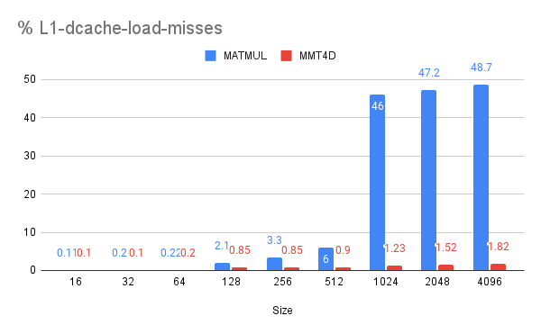

# Matrix Multiplication with MMT4D

## Introduction

[Matrix multiplication](https://en.wikipedia.org/wiki/Matrix_multiplication)
(matmul) is an important operation in ML workloads that poses specific
challenges to code generation. For example, matmul makes repeated accesses to
the same data, which makes
[locality of reference](https://en.wikipedia.org/wiki/Locality_of_reference) a
top concern.

Moreover, modern CPUs
[instruction set architectures](https://en.wikipedia.org/wiki/Instruction_set_architecture)
(ISAs) offer specialized [SIMD](https://en.wikipedia.org/wiki/SIMD) instructions
that the matmul implementation needs to use to achieve optimal performance, and
these instructions expect data to be in a particular layout.

This article is about an in-development MLIR operation,
[`linalg.mmt4d`](https://github.com/llvm/llvm-project/blob/6e98ec9b2099475c057612a7af680a27c0b91a24/mlir/python/mlir/dialects/linalg/opdsl/ops/core_named_ops.py#L54-L71),
offering a compilation path for
[`linalg.matmul`](https://github.com/llvm/llvm-project/blob/6e98ec9b2099475c057612a7af680a27c0b91a24/mlir/python/mlir/dialects/linalg/opdsl/ops/core_named_ops.py#L9-L21)
that is designed from the ground up for these efficiency considerations.

<!-- more -->

We are still in the early implementation phase of this
[`linalg.mmt4d`](https://github.com/llvm/llvm-project/blob/6e98ec9b2099475c057612a7af680a27c0b91a24/mlir/python/mlir/dialects/linalg/opdsl/ops/core_named_ops.py#L54-L71)
plan, but we feel confident that we know where we are going because what we are
really doing here is importing into the compiler what we have learned working on
optimized matrix multiplication libraries, particularly
[Ruy](https://github.com/google/ruy). We know *what* loop schedule and kernel we
want the compiler to generate &mdash; essentially the same as we wrote in Ruy,
give or take additional optimizations such as
[fusions](https://en.wikipedia.org/wiki/Loop_fission_and_fusion) and
[constant folding](https://en.wikipedia.org/wiki/Constant_folding) that become
possible now that we are doing this within a compiler. This allows us to focus
on *how* we get the compiler to generate that schedule and kernel with purely
algebraic transformations that compose and enable further compiler
optimizations.

At the basis of this work is the
[extensible op system of the Linalg dialect](https://mlir.llvm.org/docs/Dialects/Linalg/OpDSL/)
in the MLIR compiler toolkit. In this case, a general purpose, mixed precision
mmt4d op is defined via a high level description directly in the compiler and is
then available to both users of the compiler (as a `linalg.mmt4d` op) or for
direct emission via Python based IR construction (i.e. for direct integration
into high level frameworks without rebuilding the compiler). The ability to
define such new special forms cheaply, and without any systemic framework level
cost, is part of the extensibility and composition story that we expect will
become increasingly important in development and deployment scenarios in the
future, and in this case, it let us spring board off of high quality code
generation which was already well integrated and composed well with other
features of the compiler.

## Existing Matrix Multplication Code Generation

Let us start by discussing IREE’s existing matmul code generation and highlight
the issues that `mmt4d` aims to overcome.

The existing approach operates in-place on the source matrices. When we discuss
"tiling" in this paragraph, we refer exclusively to the traversal &mdash; how
these source matrices are traversed by the matmul loop. There is no "tiled
layout" here, which will be the key difference with `mmt4d` below.

The destination matrix is tiled into workgroups (CPU threads) tiles, then each
workgroup tile is tiled to fit some level of CPU cache, and finally each tile is
further tiled to fit target architecture registers (e.g. 8x8).

That multi-level tiling means that the code works like the following loop nest:

```python
def tiled_matmul(A, B, C, tile_m, tile_n, tile_k, tile_m_v, tile_n_v, tile_k_v):
 m = A.shape[0]
 k = A.shape[1]
 n = B.shape[1]
 for m1 in range(0, m, tile_m):
   for n1 in range(0, n, tile_n):
     for k1 in range(0, k, tile_k):
       # First level of tiling views...
       lhs_tile = A[m1:m1+tile_m, k1:k1+tile_k]
       rhs_tile = B[k1:k1+tile_k, n1:n1+tile_n]
       dst_tile = C[m1:m1+tile_m, n1:n1+tile_n]
       for mv in range(0, tile_m, tile_m_v):
         for nv in range(0, tile_n, tile_n_v):
           for kv in range(0, tile_k, tile_k_v):
             # Register tiling views...
             lhs_tile_v = lhs_tile[mv:mv+tile_m_v, kv:kv+tile_k_v]
             rhs_tile_v = rhs_tile[kv:kv+tile_k_v, nv:nv+tile_n_v]
             # kernel.
             dst_tile[mv:mv+tile_m_v, nv:nv+tile_n_v] += np.matmul(lhs_tile_v, rhs_tile_v)
 return C
```

The two main problems with this approach are:

- **Overhead to meet SIMD ISA layout requirements**: In practice, the kernel
    needs to use specific [SIMD](https://en.wikipedia.org/wiki/SIMD)
    instructions to perform the arithmetic. They expect small tiles of the
    matrices to be loaded in registers, in a specific layout. If the matrix data
    wasn't already stored in memory in such a tiled layout, then the kernel has
    to perform such a data rearrangement on the fly, incurring substantial
    overhead. For NxN matrix multiplication, the kernel performs
    O(N<sup>3</sup>) work on O(N<sup>2</sup>) data, so doing that rearrangement
    there means O(N<sup>3</sup>) overhead where O(N<sup>2</sup>) should have
    sufficed, as this could have been done as a pre-processing step on
    O(N<sup>2</sup>) data.

- **Inefficent memory traversal:** For efficiency reasons, we always need
    `tile_m_v>1` and `tile_n_v>1`. That is because the higher these values, the
    fewer memory-load instructions are needed overall; and this is also dictated
    by the SIMD instructions that we want to use. But that means that the kernel
    is accessing simultaneously multiple rows or columns of the left-hand and
    right-hand side matrices. And in this existing approach, they are stored in
    linear layout, not in a tiled layout, so these accesses are not contiguous
    in memory. This is detrimental to memory access performance, meaning the
    [CPU caches](https://en.wikipedia.org/wiki/CPU_cache), in multiple ways. One
    is that these multiple non-contiguous accesses may alias each other in the
    L1 cache because of low
    [associativity](https://en.wikipedia.org/wiki/CPU_cache#Associativity).

## Matrix Multiplication Operation With 4D Tiled Operands

For the reasons above, an efficient matmul implementation must reorder data into
a tiled layout matching the target SIMD ISA and making the memory access
patterns as contiguous as possible.

IREE/MLIR defaults to bufferizing all tensors into a "row-major" order, meaning
that the last-enumerated dimension is the one that is contiguous in memory. As
we prefer not to write custom bufferization code, we can't specify an
alternative layout for a tensor. Fortunately, it is possible to represent a 2D
tiled layout as a 4D layout. For example, `tensor<2x2x2x2xf32>` can represent a
4x4 matrix made of 2x2 tiles, each of which is 2x2. The row-major layout on
`tensor<2x2x2x2xf32>` makes each 2x2 tile contiguous and row-major, and arranges
the 2x2 tiles themselves into a row-major 2x2 layout in the overall 4x4 matrix.

Such a row-major-tiled layout is exactly what we need for the left-hand side of
a matrix multiplication, because matrix multiplication traverses the left-hand
side matrix row by row. But for the right-hand side matrix, we want a
column-major-tiled layout. To solve this problem, we decide to implement not
matrix multiplication, but matrix-multiplication-by-transposed-right-hand-side
which is where the `t` in the `linalg.mmt4d` came from. Now such an op is happy
with both the left and right-hand sides being row-major-tiled.

The following example illustrates that. In these diagrams, each matrix element
is rendered its memory offset.


To compute the 2x2 block in the destination matrix, we will have to load two
yellow blocks from LHS, RHS matrices respectively compute their matmul results
(i.e. call the kernel), then the two blue blocks, and so on. As we can see, each
tile loads data that is not contiguous. It would be better if we rearranged the
elements in the following layout:


Now tiles are stored contiguously in memory and the kernel can simply load them
from memory into the registers that will be directly consumed by the SIMD
instructions performing the multiplications. Moreover, the kernel is now loading
from just two contiguous data streams, a simple memory access pattern which is
sure to be efficient (regarding caches, etc) on any reasonable target hardware.

We introduce a `linalg.mmt4d` operation that performs such a matrix
multiplication on matrices in a tiled layout represented as 4D tensors. That
leaves the question of how to represent, within the linalg dialect, the
conversions between ordinary matrices represented as 2D tensors, and these tiled
matrices represented as 4D tensors. Moreover, these conversions should be
tileable and decompose well. Thankfully, the transformation from 2D to 4D can be
written as a reshape followed by a transpose as in the following digram:


So we can think of the outermost two dimensions of the 4D representations as the
tile position in the overall matrix, and the innermost two as the element
position within one tile. Hopefully the following Python pseudocode makes it
more concrete:

```python
def pack_2d_4d(operand, parallel_size, reduction_size):
 i1 = operand.shape[0] // parallel_size # M1
 i2 = parallel_size    # M0
 j1 = operand.shape[1] // reduction_size # K1
 j2 = reduction_size   # K0
 operand_4d = np.reshape(operand, [i1, i2, j1, j2])
 return np.transpose(operand_4d, [0, 2, 1, 3]) # [M1, K1, M0, K0]
```

Now the mmt4d operation will follow a structure as the multi level tiling, for
simplicity we considered the case here where no L1 tiling is required only first
level of distribution to workgroups:

```python
def mmt4d(A, B, C, M0, N0, K0):
 M = A.shape[0]
 N = B.shape[1]
 Bt = np.transpose(B, [1, 0])
 A4d = pack_2d_4d(A, M0, K0)
 Bt4d = pack_2d_4d(Bt, N0, K0)
 M1 = A4d.shape[0]
 N1 = Bt4d.shape[0]
 K1 = A4d.shape[1]
 for m1 in range(0, M1):
   for n1 in range(0, N1):
     for k1 in range(0, K1):
       # Tile views that are contiguous in memory.
       lhs_tile = np.reshape(A4d[m1, k1, :, :], [M0, K0])
       rhs_tile = np.reshape(Bt4d[n1, k1, :, :], [N0, K0])
       # Inner kernel.
       C[m1, n1, :, :] += np.matmul(lhs_tile, np.transpose(rhs_tile, [1, 0]))
 # 4d -> 2D
 C2d = unpack_4d_2d(C)
 return C2d

```

The resulting 4D tiled matrix still needs be rearranged back to the original
layout as 2D tensor:

```python
def unpack_4d_2d(operand):
 i1 = operand.shape[0] # M1
 j1 = operand.shape[1] # N1
 i2 = operand.shape[2] # M0
 j2 = operand.shape[3] # N0
 operand_transposed = operand.transpose([0, 2, 1, 3]) # [M1, M0, N1, N0]
 return operand_transposed.reshape([i1 * i2, j1 * j2]) # [M, N]
```

## Performance Results

We benchmarked various float32 matmul problems of different sizes and the result
showed that mmt4d is faster than the existing matmul implementation for bigger
matrices as we can see the in the following chart:


The SIMD instruction being used here is the simplest kind, a `vector*scalar`
multiplication, and the storage orders of the matrices allow the existing
implementation to directly load the vectors from the source matrices without any
rearrangement overhead. So this case is particularly friendly to the existing
code, which is why the mmt4d code is only faster for bigger matrices. To
understand why mmt4d is faster in that case, we collected statistics of L1 cache
misses:



This shows that in this case, the better cache-friendliness of mmt4d, thanks to
its simple contiguous memory access pattern, accounts for its higher
performance.

As we proceed with increasingly sophisticated SIMD targets, starting with the
dot-product instructions found in current mobile devices for the int8 case and
going to become generalized to all data types all the way to float32 over the
next few years with upcoming ARM SIMD instructions, the advantage of mmt4d will
widen for all sizes, not just the larger ones.

Part of why we feel confident about the eventual performance that our approach
will achieve is that, as mentioned in the introduction, we are rebuilding within
the compiler an [existing library](https://github.com/google/ruy)'s schedule and
kernel, and we have
[benchmark results](https://docs.google.com/spreadsheets/d/1CB4gsI7pujNRAf5Iz5vuD783QQqO2zOu8up9IpTKdlU/edit?usp=sharing)
about it.

## Conclusion

We introduced a 4d tiled representation for 2d matrix-matrix multiplication with
a decomposable algebric transformations that requires only reshape and transpose
of input operands, we discussed and empirically showed how that solves major
drawbacks in row-major linear matmul by providing a flexible way to match
different ISA layout along with better cache locality achieving near peak
performance.

As was mentioned in the introduction, this work in under active development and
the next immediate steps are to prove the rest of the hypothesis by:

* Handling dynamic sizes and padding to the next multiple of the target tile
  size.

* Implementing the integer case (`int32 += int8 * int8`).

* Implementing the dispatch to different SIMD ISA variants at runtime.

* Implementing cache-friendly traversal for larger matmuls and multi-threading
  by interfacing with IREE's runtime dispatch.

* Improving the generated code by fusing the 4d tiled layout with the
  producers and consumers of the `linalg.mmt4d`.
