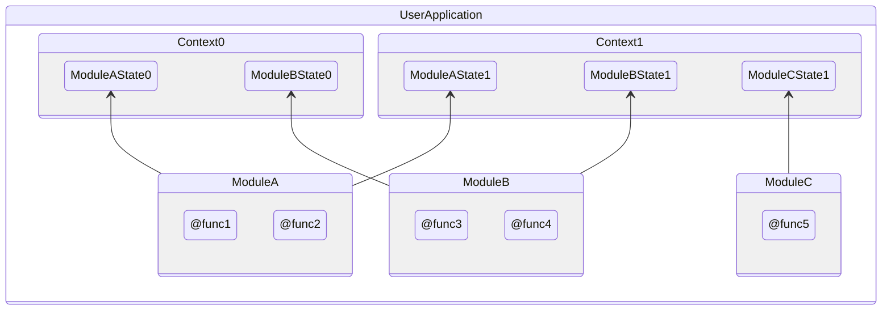
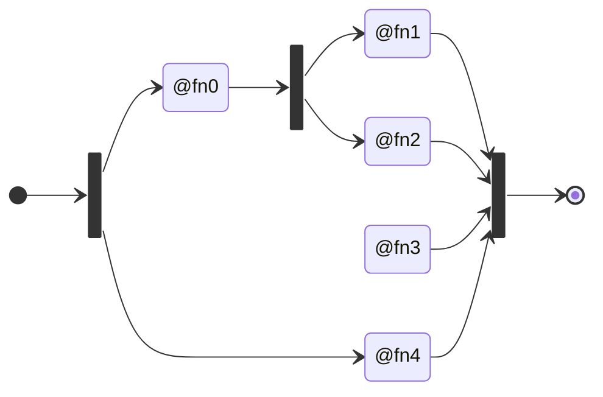
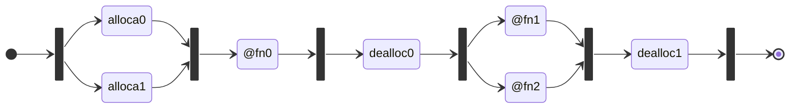
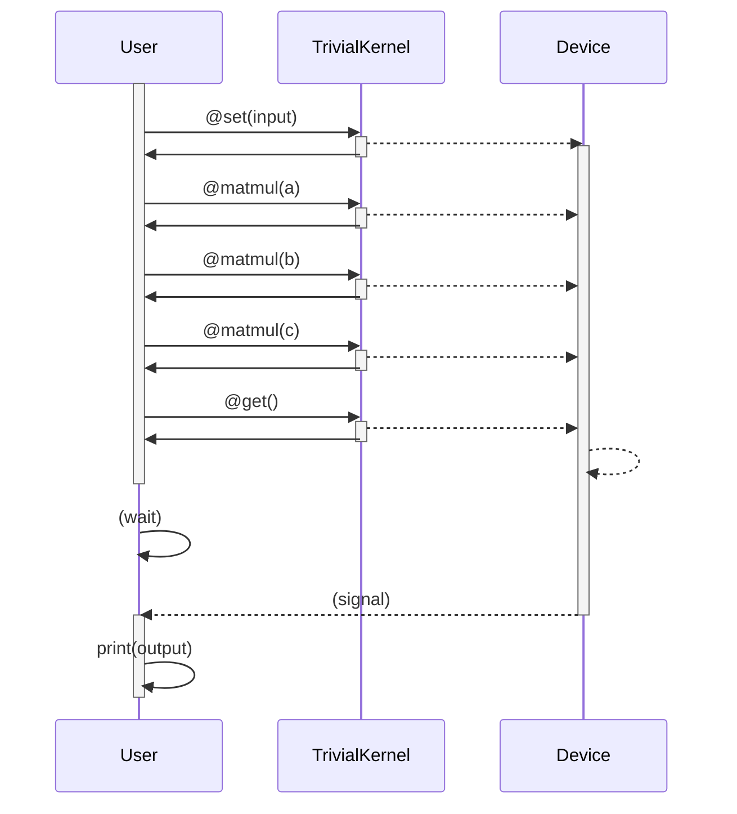

# Invocation execution model

!!! note - "Authored June, 2022"

This documents the behavior of the user-visible invocation mechanism IREE uses
to schedule program execution. Internally IREE uses a very similar modeling for
tracking its internal workloads and in kind carries that down to target APIs
and devices that themselves use a very similar model. The intent is to expose
the device model in an abstracted way that allows for the full capture and
communication of the execution intent to be propagated to the hardware that
executes it. Though here we focus on the user-visible portion of execution
there is really only one "IREE execution model" and the entire stack follows
the same design. At its core this design is just an instantiation of an
[out-of-order execution](https://en.wikipedia.org/wiki/Out-of-order_execution)
algorithm such as those
[originating from the 1960's](https://en.wikipedia.org/wiki/Tomasulo_algorithm).

## Glossary



### Program

An IREE _program_ is a collection of _modules_ instantiated in a _context_ from
which _invocations_ can be made. Invocations are ordered on a user-controlled
_timeline_ that uses _fences_ to define the execution order requirements to
enable out-of-order execution. A hosting user application may have multiple
programs or multiple instances of the same program available and running
invocations at a time across multiple timelines.

### Module

_Modules_ define executable code and data that can be loaded, linked, and run à
la [ELF shared libraries](https://en.wikipedia.org/wiki/Executable_and_Linkable_Format).
Modules may be implemented as C/C++, generated bytecode or C sources from the
IREE compiler, or any other mechanism that can run code and implement the
[`iree_vm_module_t` interface](https://github.com/google/iree/blob/0e8d8370699912c6b51889e8f7e967690102402c/runtime/src/iree/vm/module.h#L335-L437).
Modules on their own are read-only and can be reused across many contexts.

Traditional ML runtimes would use a model (graph, etc) as their module
representation. In IREE everything is a module including runtime subsystems like
the HAL and user-provided custom code. This ensures that anything IREE can do
can be externalized and replaced by users without needing to modify the core
IREE code.

### Context

A collection of _modules_ are linked and instantiated in a _context_. Each
context operates independently and carries its own copies of mutable module
state. _Invocations_ execute within a context scope and hosting applications
coordinate across contexts as required. Contexts are cheap to create
(microseconds) and retain (~100B + program state) such that users can decide
how to manage them based on their scenario.

Traditional ML runtimes would call these "sessions" but in IREE everything is a
_program_. Whether the program is stateful or stateless and how the program is
invoked is up to the program author.

### Invocation

An _invocation_ represents a single call into a module exported function using
the program state stored in a context. Users can decide whether to perform
synchronous blocking invocations or asynchronous non-blocking invocations
per-call; the behavior of the invocation is independent from the target function
and a user program may contain a mix of both.

As an example a user program may synchronously invoke a `@query_output_shapes`
function to preallocate storage for an asynchronous `@execute_in_place`
function to write into.

### Timeline

A _timeline_ represents the observable order of execution. Users define their
own timelines and communicate them to IREE via _fences_. Timelines do not match
up with the order of invocations unless the user dictates they must by way of
fences. In the absence of fences all invocations execute in an arbitrary order
and they may execute concurrently just as threads in C with no barriers.

Each timeline can be thought of as an independent clock domain that may operate
asynchronously at its own frequency with only fences acting to tie separate
timelines together. This directly mirrors real hardware constraints like
[clock domain crossing](https://en.wikipedia.org/wiki/Globally_asynchronous_locally_synchronous)
as each execution scope (thread on core, driver calls to queues, kernel queues
to device queues, device queues to compute unit queues, etc) is naturally
operating at different rates and well-designed systems must tolerate that
variability.

### Fence

A _fence_ is a specific point of progress in one or more _timelines_ acting as
a barrier, fork, or join point. Fences only guard execution ordering and not any
particular resources though users can use them to guard resources by defining
when in time the resources are available for use.

Waits on fences are wait-until operations specifying that the timeline must
reach  _at least_ a specific point. This allows for flexible reordering and
deferral of execution as executors can pull forward scheduled work based on
policy (run similar work together, etc).

### Hardware Abstraction Layer (HAL)

The HAL is an optional feature of IREE that is used to provide a consistent
interface across execution resources. It is used internally by IREE programs to
define and submit work to devices and signal across them but may also be used by
users to directly interface with hardware in a compatible way. Exposing the
HAL API allows for users to efficiently manage their data and custom
execution without expensive marshaling. Most users will only interact with HAL
buffers as they work with their data but more advanced integrations can directly
insert IREE into existing device contexts to transparently share scheduling and
resources or insert their own code into IREE to pipeline custom execution.

## Execution by Timelines

**NOTE**: this defines _an_ execution scheme that IREE supports but a user may
use one or more such schemes in a single program - just as a C application may
mix single- and multi-threaded code within itself for different components.

The combination of _invocations_, _timelines_, and _fences_ allows users
to provide future knowledge to lower layers of the system by declaring their
availability requirements and the lower layers are then able to execute the work
out-of-order so long as the specified requirements are met. The primary goal
when designing for such a system is to specify as few requirements as possible
in order to provide the maximum amount of scheduling freedom to the
implementation.

This makes timelines one of the most critical components of the interface.
The purpose of invocations is to schedule work against one or more timelines and
what happens within the invocations is an implementation detail of the program.

### Sequential Execution

Here we say _"a user invokes a function to schedule execution on a timeline"_
vs. a more traditional _"a user invokes a function to execute work"_ and this
manifests in the IREE ABI as invocations taking fences defining specific points
on timelines of which the user may observe:

```python
# Fences are effectively just timeline + integer tuples and are cheap to hold.
wait_fence = my_timeline.at(t)
signal_fence = my_timeline.at(t+1)
# Schedule work against the timeline.
# All work prior to t must complete before execution can occur and after
# execution the timeline will advance to t+1.
async_invoke(@some_fn, wait_fence, signal_fence)
# The invocation may have returned immediately after the work was scheduled;
# until the fence is reached no actual execution may have occurred. To
# synchronize the user code with the timeline the user can block until the fence
# is reached.
signal_fence.wait()
```

To the user this would appear as:
```mermaid
sequenceDiagram
    User->>@some_func: invoke
    activate @some_func
    @some_func->>User: ;
    @some_func-->>@some_func: wait t
    @some_func-->>User: signal t+1
    deactivate @some_func
```

This means from the user's perspective the _actual_ operations performed by the
invocation are not important: the only thing the user can observe in this
situation is when the timeline reaches `t+1` as they specified. Whether
internally the invocation needs many steps to complete as there are timelines
internal to the program is an implementation detail. Actual execution may look
like this:

```mermaid
sequenceDiagram
    User->>@some_func: invoke
    activate @some_func
    @some_func->>User:  ;
    @some_func->>@some_func: ;
    @some_func-->>Device A: ;
    Device A-->>Device A: wait t
    activate Device A
    @some_func->>@some_func: ;
    @some_func-->>Device B: ;
    activate Device B
    @some_func->>@some_func: ;
    Device A-->>@some_func: ;
    deactivate Device A
    @some_func->>@some_func: ;
    @some_func-->>Device B: ;
    activate Device B
    deactivate @some_func
    Device B-->>User: signal t+1
    deactivate Device B
    deactivate Device B
```

Even in this simple user-synchronous example the system is able to internally
run several concurrent timelines with a minimal number of synchronization points
and the lowest possible latency as the user is immediately notified without
any intermediate layers needing to be woken, scheduled, executed, and passed on.

### Pipelined Execution

The true power of timelines comes from the ability to pipeline execution. Users
define DAGs with fences and can construct arbitrarily complex execution
topologies whether from the same program or across multiple programs:



This is a simple extension to the synchronous example using the same primitives:

```python
# Timeline is defined by the user.
fence_a = my_timeline.at(t)
fence_b = my_timeline.at(t+1)
fence_c = my_timeline.at(t+2)
# Invocations are launched using the fences and may not complete immediately.
async_invoke(@fn0, fence_a, fence_b)
async_invoke(@fn1, fence_b, fence_c)
async_invoke(@fn2, fence_b, fence_c)
async_invoke(@fn3, None, fence_c)
async_invoke(@fn4, fence_a, fence_c)
# Blocking here but no need to; could pass fence_c on to other invocations.
fence_c.wait()
```

The critical point of this being that the user never had to wait for any
particular invocation to complete before being able to schedule more work
against the timeline, even if those invocations could themselves not complete
synchronously. The lower layers of the system are able to fully model the
execution as early as possible without needing to communicate (and importantly
synchronize) with the user.

### I/O

Users define the semantics of their programs themselves. For example if the user
knows the precise shape of an output buffer they can preallocate the buffer and
pass it in. If they don't know they can decide to factor out the shape
calculation and invoke that synchronously in order to compute the shape,
allocate the appropriately sized buffer, and pass that in. Or they could decide
to only deal with synchronous invocations and return a program-allocated buffer
view with the appropriate shape in their callback. IREE does not dictate the
design of user programs and as such enables mixed stateful/stateless,
asynchronous/synchronous, and arbitrary scheduling models (enqueue/drain,
windowing, etc).

Inputs and outputs to invocations are provided by the user as primitive values
(integers, floats, etc), supported builtin types (lists, byte buffers/strings),
custom user types, and HAL types like buffers or buffer views (buffers + shape
and type metadata). One or more wait fences can be used to order invocation
access to one or more inputs by indicating that the resource is not available
until a certain fence is reached. Similarly one or more signal fences can be
used to order subsequent access to the resources by indicating the advancement
of the timeline when they are available.

```python
# wait_fence_a must be reached before buffer_a and buffer_b can be read.
# wait_fence_b must be reached before buffer_c can be read.
# buffer_a will be ready to read when signal_fence_a has been reached.
async_invoke(@fn,
             (wait_fence_a, buffer_a, buffer_b),
             42,  # no ordering required on value types
             (wait_fence_b, buffer_c),
             (signal_fence_a, buffer_a))
```

The above example demonstrates an in-place operation on `buffer_a`. It's also
possible for invocations to return values:

```python
result = invoke(@sum, 1, 2)  # = 3
```

When executed asynchronously a callback or any construct that can be built upon
them (like promises/futures) can receive the results:

```python
def my_callback(result):
  print(result)  # 3
async_invoke(@sum, 1, 2, my_callback)
```

### Stream-ordered Allocations

Invocations generally have only a few KB of overhead and pipelined command
buffers take only a small amount more. Storage buffers, however, can easily
take hundreds of MB per invocation for I/O and transient state. This compounds
as program usage becomes more complex or multiple programs are involved. IREE
supports traditional host-ordered allocations (à la malloc/free) for persistent
buffers like large constants/read-only data or user-managed ringbuffers.
Stream-ordered allocations are also supported to allow for pooled buffer
reservations that can be allocated in a scheduled order alongside program
execution.

For more detailed examples see the CUDA blog posts describing their
implementation:
[part 1](https://developer.nvidia.com/blog/using-cuda-stream-ordered-memory-allocator-part-1/),
[part 2](https://developer.nvidia.com/blog/using-cuda-stream-ordered-memory-allocator-part-2/).

With stream-ordered allocations each allocation and deallocation operation is
scheduled with wait and signal fences just as with invocations. This allows
these allocation operations to execute remotely on device without host
program involvement. For example, scheduling `alloca0`/`dealloca0` and
`alloca1`/`dealloca1` interleaved with the function execution allows for the
transient memory required for executing `@fn0` to remain uncommitted until
immediately before it is executed, committed during execution, and then
decommitted immediately after execution. The memory required for passing
data from `@fn0` to the subsequent `@fn1` and `@fn2` survives until after they
have completed executing before being decommitted. By using the same scheduling
primitives as execution the allocation topology can be as arbitrarily complex as
the invocation topology:



When operating in this way allocations from the host-perspective are just
reservations for a slice of pooled storage that will be committed at some point
in the future. Likewise deallocations from the host-perspective release the
prior reservation and schedule the paired decommit at some point in the future.
Scheduling N sequential invocations thus requires only enough committed storage
for a single invocation in addition to the I/O (unless that too is
stream-ordered).

This scheduling behavior allows for both minimal peak memory consumption
regardless of the number of programs or invocation pipeline depth and sharing
of committed storage across programs: the memory consumption of a program at
rest is near zero when stateless and the sum of all state when stateful. Target
devices that natively support stream-ordered allocations (like CUDA) can even
share pools across processes.

The other provided feature in combination with the fence guaranteed forward
progress is that so long as the memory pool can service a single request
execution can still continue even when constrained. A device can serialize two
independent invocations requiring 400MB of transient memory when the system only
has 512MB available with no user-visible impact besides increased latency. This
does require the user to ensure they schedule work that is possible to run or
rely on the target system having paging in order to lighten the strictness of
the pool quotas.

Stream-ordered allocations performed by the user for invocation inputs can be
declared as transferred to the program. This allows the program to eagerly
deallocate or reuse the input storage while still preserving the internal
scheduling requirements of the program.

### Internal State

A stateful program may contain internal timelines that it uses to order its own
execution. Take for example
[this simple stateful program](https://github.com/google/iree-jax/blob/main/tests/program/dynamic_state.py):

```python
class TrivialKernel(Program):
  _x0 = Program.export_global(x_type)
  def get(self):
    return self._x0
  def set(self, x=x_type):
    self._x0 = x
  def matmul(self, x=y_type):
    self._x0 = self._matmul(x, self._x0)
  @Program.kernel
  def _matmul(x, x0):
    return jnp.matmul(x, x0)
```

Each invocation of `matmul` needs to be executed in-order with prior invocations
as there is a data dependency established on `self._x0`. Attempts to `get` or
`set` must also be sequenced correctly with the `matmul` invocations. A basic
usage like this:

```python
m = TrivialKernel()
m.set(input)
m.matmul(a)
m.matmul(b)
m.matmul(c)
output = m.get()
print(output)  # implicit wait
```

Would be executed as:



Note that although the user provided no timeline of their own execution is still
ordered correctly due to the internal timeline constructed by the program. If
the user wanted to also pipeline execution with another program they could do
so by providing their own fences.
