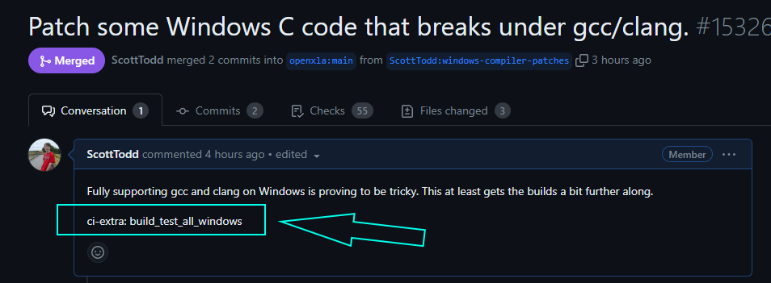
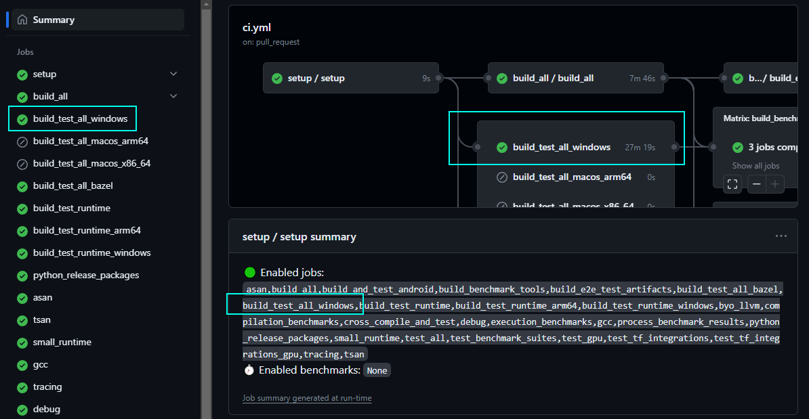

# Contributing to IREE

We'd love to accept your patches and contributions to this project.

Please [file issues](https://github.com/openxla/iree/issues/new/choose) or
reach out on any of our other
[communication channels](../../index.md#communication-channels) before doing
substantial work; this will ensure that others don't duplicate the work and
that there's a chance to discuss any design issues.

## Developer policies

### :octicons-code-of-conduct-16: Code of conduct

This project follows the
[OpenXLA Code of Conduct](https://github.com/openxla/community/blob/main/CODE-OF-CONDUCT.md).

### :octicons-law-16: Contributor License Agreement

Contributions to this project must be accompanied by a Contributor License
Agreement (CLA). Head over to <https://cla.developers.google.com/> to see
your current agreements on file or to sign a new one.

* You (or your employer) retain the copyright to your contribution; this simply
  gives us permission to use and redistribute your contributions as part of the
  project.
* You generally only need to submit a CLA once, so if you've already submitted
  one (even if it was for a different project), you probably don't need to do it
  again.

### :octicons-pencil-16: Coding style guidelines

Most of the code style is derived from the
[Google Style Guides](http://google.github.io/styleguide/) for the appropriate
language and is generally not something we accept changes on (as clang-format
and other linters set that for us). The C++ compiler portion of the project
follows the
[MLIR/LLVM style guide](https://mlir.llvm.org/getting_started/DeveloperGuide/#style-guide).

Improvements to code structure and clarity are welcome but please file issues
to track such work first. Pure style changes are unlikely to be accepted unless
they are applied consistently across the project.

??? tip - "Tip - code formatters and lint scripts"

    Formatters like
    [`clang-format`](https://clang.llvm.org/docs/ClangFormat.html) (C/C++) and
    [_Black_](https://black.readthedocs.io/en/stable/) (Python) can be set to
    run automatically in your editor of choice.

    The script at
    [`build_tools/scripts/lint.sh`](https://github.com/openxla/iree/blob/main/build_tools/scripts/lint.sh)
    can also be used to run the full suite of lint checks.

### :octicons-code-review-16: Code reviews

All submissions, including submissions by maintainers, require review. We
use GitHub pull requests (PRs) for this purpose. Consult
[GitHub Help](https://help.github.com/articles/about-pull-requests/) for more
information on using pull requests.

* Please keep PRs small (focused on a single issue) to make reviews and later
  culprit-finding easier.

### :material-check-all: GitHub Actions workflows

We use [GitHub Actions](https://docs.github.com/en/actions) to automatically
build and test various parts of the project.

* Most presubmit workflows will only run automatically on PRs if you are a
  project collaborator. Otherwise a maintainer must
  [approve workflow runs](https://docs.github.com/en/actions/managing-workflow-runs/approving-workflow-runs-from-public-forks).
  If you are sending code changes to the project, please ask to be added as a
  collaborator, so that these can run automatically.
* It is generally expected that PRs will only be merged when all checks are
  passing. In some cases, pre-existing failures may be bypassed by a maintainer.

??? tip - "Tip - adjusting workflow behavior"

    Some workflows only run on commits after they are merged. See the
    [CI behavior manipulation](#ci-behavior-manipulation) section below to
    learn how to customize this behavior.

<!-- TODO(scotttodd): link to infrastructure / CI docs when they exist -->
<!-- TODO(scotttodd): link to "obtaining commit access" -->

### :octicons-git-pull-request-16: Merging approved changes

After review and presubmit checks, PRs should typically be merged using
"squash and merge".

* The squashed commit summary should match the PR title and the commit
  description should match the PR body (this is the default behavior).
  Accordingly, please write these as you would a helpful commit message.

It is assumed that the PR author will merge their change unless they ask
someone else to merge it for them (e.g. because they don't have write access
yet).

### :octicons-git-merge-16: Obtaining commit access

!!! note "TODO(jpienaar): write this :)"

### :octicons-people-16: Credits in the AUTHORS file

If you would like additional recognition for your contributions, you may add
yourself or your organization to the
[AUTHORS file](https://github.com/openxla/iree/blob/main/AUTHORS) that keeps
track of those who have made significant contributions to the project.

* Please add the entity who owns the copyright for your contribution.
* The source control history remains the most accurate source for individual
  contributions.

<!-- TODO(scotttodd): merge the sections below into "developer overview"? -->

## Tips for contributors

### Tool recommendations

| Program or tool | Description |
| -- | -- |
[:material-microsoft-visual-studio-code: Visual Studio Code (VSCode)](<https://code.visualstudio.com/>) | The most commonly used editor amongst IREE developers
[:simple-cmake: Ccache](<https://ccache.dev/>) | A fast C/C++ compiler cache. See the [CMake with `ccache`](../building/cmake-with-ccache.md) page
[:simple-github: GitHub CLI](<https://github.com/cli/cli>) | A CLI for interacting with GitHub
[:simple-github: "Refined GitHub" browser extensions](<https://github.com/sindresorhus/refined-github>) | Extension that add features to the GitHub UI

### :material-hammer-wrench: Build systems

IREE supports building from source with both Bazel and CMake.

* CMake is the preferred build system and offers the most flexible
  configuration options
* Bazel is a stricter build system and helps with usage in Google's downstream
  source repository
* Certain dependencies (think large/complex projects like CUDA, TensorFlow,
  PyTorch, etc.) may be difficult to support with one build system or the
  other, so the project may configure these as optional

### :octicons-server-16: Continuous integration (CI)

IREE uses [GitHub Actions](https://docs.github.com/en/actions) for CI. The
primary CI is configured in the
[ci.yml workflow file](https://github.com/openxla/iree/blob/main/.github/workflows/ci.yml).

#### Self-hosted runners

In addition to the default runners GitHub provides, IREE uses
[self-hosted runners](https://docs.github.com/en/actions/hosting-your-own-runners/managing-self-hosted-runners/about-self-hosted-runners)
to run many of its workflow jobs. These enable access to additional compute and
custom configurations such as accelerators. Configuration scripting is checked
in to this repository (see the
[README for that directory](https://github.com/openxla/iree/blob/main/build_tools/github_actions/runner/README.md)).

#### Custom managed runners

In addition to our self-hosted runners, we use GitHub's
[large managed runners](https://docs.github.com/en/actions/using-github-hosted-runners/about-larger-runners)
for some platforms.

#### CI behavior manipulation

The setup step of the CI determines which CI jobs to run. This is controlled by
the
[configure_ci.py](https://github.com/openxla/iree/blob/main/build_tools/github_actions/configure_ci.py)
script. It will generally run a pre-determined set of jobs on presubmit with
some jobs kept as post-submit only. If changes are only to a certain set of
excluded files that we know don't affect CI (e.g. Markdown files), then it will
skip the jobs.

You can customize which jobs run using
[git trailers](https://git-scm.com/docs/git-interpret-trailers) in the PR
description.

The available options are

``` text
ci-skip: jobs,to,skip
ci-extra: extra,jobs,to,run
ci-exactly: exact,set,of,jobs,to,run
skip-ci: free form reason
skip-llvm-integrate-benchmark: free form reason
benchmark-extra: extra,benchmarks,to,run
runner-env: [testing|prod]
```

??? info - "Using `skip-ci`"

    `skip-ci` skips all jobs. It is mutually exclusive with the other `ci-*`
    options and is synonomous with `ci-skip: all`.

    ``` text
    skip-ci: free form reason
    ```

??? info - "Using `ci-skip`, `ci-extra`, `ci-exactly`"

    The `ci-*` options instruct the setup script on which jobs to include or
    exclude from its run. They take a comma-separated list of jobs which must be
    from the set of top-level job identifiers in the `ci.yml` file or the
    special keyword "all" to indicate all jobs.

    ``` text
    ci-skip: jobs,to,skip
    ci-extra: extra,jobs,to,run
    ci-exactly: exact,set,of,jobs,to,run
    ```

    * `ci-skip` removes jobs that would otherwise be included, though it is not
    an error to list jobs that would not be included by default.
    * `ci-extra` adds additional jobs that would not have otherwise been run,
    though it is not an error to list jobs that would have been included anyway.
    It *is* an error to list a job in both "skip" and "extra".
    * `ci-exactly` provides an exact list of jobs that should run. It is
    mutually exclusive with both "skip" and "extra".

    In all these cases, the setup does not make any effort to ensure that job
    dependencies are satisfied. Thus, if you request skipping the `build_all`
    job, all the jobs that depend on it will fail, not be skipped.

??? info - "Using `benchmark-extra`, `skip-llvm-integrate-benchmark`"

    ``` text
    benchmark-extra: extra,benchmarks,to,run
    skip-llvm-integrate-benchmark: free form reason
    ```

    Benchmarks don't run by default on PRs, and must be specifically requested.

    The `benchmark-extra` option allows specifying additional benchmark presets
    to run as part of benchmarking. It accepts a comma-separated list of
    benchmark presets. This combines with labels added to the PR (which are a
    more limited set of options). See the
    [benchmark suites documentation](../performance/benchmark-suites.md).

    Benchmarks *do* run by default on PRs detected to be an integration of LLVM
    into IREE, but this behavior can be disabled with
    `skip-llvm-integrate-benchmark`.

??? info - "Using `runner-env`"

    The `runner-env` option controls which runner environment to target for our
    self-hosted runners. We maintain a test environment to allow testing out new
    configurations prior to rolling them out. This trailer is for advanced users
    who are working on the CI infrastructure itself.

    ``` text
    runner-env: [testing|prod]
    ```

##### CI configuration recipes

Copy/paste any of these at the bottom of a PR description to change what the CI
runs.

* Also run Windows and macOS builds that are normally post-merge only:

    ``` text
    ci-extra: build_test_all_windows,build_test_all_macos_arm64,build_test_all_macos_x86_64
    ```

* Also run GPU tests on NVIDIA A100 runners (opt-in due to low availability):

    ``` text
    ci-extra: test_a100
    ```

* Skip all CI builds and tests, e.g. for comment-only changes:

    ``` text
    skip-ci: Comment-only change.
    ```

* Only run Bazel builds, e.g. for changes only affecting Bazel rules:

    ``` text
    ci-exactly: build_test_all_bazel
    ```

For example, this PR opted in to running the `build_test_all_windows` job:



The enabled jobs can be viewed from the Summary page of an action run:



### Git workflows

We tend to use the "triangular" or "forking" workflow. Develop primarily on a
clone of the repository on your development machine. Any local branches named
the same as persistent branches from the
[main repository](https://github.com/openxla/iree) are pristine (though
potentially stale) copies. You only fastforward these to match upstream and
otherwise do development on other branches. When sending PRs, you push to a
different branch on your public fork and create the PR from there.

<!-- TODO(scotttodd): screenshots / diagrams here
  (https://mermaid.js.org/syntax/gitgraph.html?) -->

#### Setup

1. Create a fork of the main repository.

2. Create a local git repository with remotes `upstream` (the main repository)
    and `origin` (your personal fork). To list your current remotes
    `git remote -v`.

    a. If you already cloned from the main repository (e.g. by following the
    getting started guide):

      ```shell
      # From your existing git repo
      $ git remote rename origin upstream
      $ git remote add origin https://github.com/<github_username>/iree.git
      ```

    b. If you haven't already cloned:

      ```shell
      # From whatever directory under which you want to nest your repo
      $ git clone https://github.com/<github_username>/iree.git
      $ cd iree
      $ git remote add upstream https://github.com/openxla/iree.git
      ```

    This is especially important for maintainers who have write access (so can
    push directly to the main repository) and admins who have elevated
    privileges (so can push directly to protected branches).

    These names are just suggestions, but you might find some scripts where the
    defaults are for remotes named like this.

    For extra safety, you can make it difficult to push directly to upstream by
    setting the push url to something invalid:
    `git remote set-url --push upstream DISABLE`, which requires re-enabling the
    push URL explicitly before pushing. You can wrap this behavior in a custom
    git command like
    [git-sudo](https://gist.github.com/GMNGeoffrey/42dd9a9792390094a43bdb69659320c0).

3. Use a script like
    [git_update.sh](https://github.com/openxla/iree/blob/main/build_tools/scripts/git/git_update.sh)
    to easily synchronize `main` with `upstream`. Submodules make this is a
    little trickier than it should be. You can also turn this into a git command
    by adding it to your path as `git-update`.

#### Git config

These are some additional options you could put in your top-level `.gitconfig`
or repository-specific `.git/config` files that are conducive the recommended
workflow

<!-- TODO(scotttodd): move to auto-collapsed tip -->

```ini
[push]
  default = current
[alias]
  # Delete branches that you pushed and have been deleted upstream, e.g. because
  # the PR was merged.
  gone = ! "git fetch -p  && git for-each-ref --format '%(refname:short) %(upstream:track)' | awk '$2 == \"[gone]\" {print $1}' | xargs -r git branch -D"
  # Update from upstream (custom command) and delete obsolete local branches.
  sync = ! (git update main && git gone)
  # Create a new branch based off of main (requires a clean working directory).
  new = "!f(){ \\\ngit checkout main && git switch -c $1; \\\n}; f"
  # Display branches in a useful "latest last" format
  br = for-each-ref --sort=committerdate refs/heads/ --format='%(HEAD) %(color:yellow)%(refname:short)%(color:reset) - %(color:red)%(objectname:short)%(color:reset) - %(contents:subject) (%(color:green)%(committerdate:relative)%(color:reset))'
  # `git git foo` -> `git foo` typo fixer
  git = "!f(){ \\\n git \"$@\"; \\\n}; f"
  # Get the git root directory
  root = rev-parse --show-toplevel
  # checkout, but also sync submodules
  ch = "!f() { \\\n git checkout \"$@\"; git submodule sync && git submodule update --init; \\\n}; f"
  # See the diff for a PR branch vs the main branch
  diffmain = diff --merge-base main
  # See only the files that differ vs the main branch
  whatsout = diffmain --name-only
[checkout]
  # If the checkout command
  defaultRemote = origin
[pull]
  # When pulling, only complete the pull if its a clean fast forward.
  ff = only
[remote]
  # Push to your fork (origin) by default
  pushDefault = origin
[url "ssh://git@github.com/"]
  # Pull with https (so no auth required), but push with ssh.
  pushInsteadOf = https://github.com/
```
