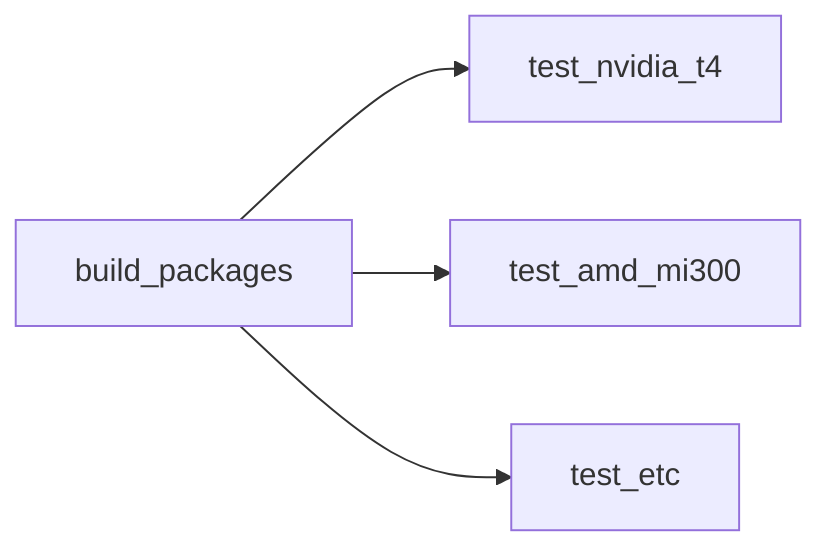

# GitHub Actions

## :octicons-book-16: Overview

We use [GitHub Actions](https://docs.github.com/en/actions) for continuous
automation (CI) and continuous delivery (CD) workflows:

* Code formating and linting.
* Building from source and running tests.
* Building packages for testing and releases.
* Testing packages across a variety of platforms.
* Publishing the <https://iree.dev> website.
* Updating dependencies.

Workflows are defined directly in the repository at
[`.github/workflows/`](https://github.com/iree-org/iree/tree/main/.github/workflows),
using a mix of official actions
(e.g. [actions/checkout](https://github.com/actions/checkout)),
community actions
(e.g. [pre-commit/action](https://github.com/pre-commit/action)),
and custom code. We use a mix of GitHub-hosted runners and self-hosted runners
to get automated build and test coverage across a variety of platforms and
hardware accelerators.

### Terminology primer

_(Read more on
<https://docs.github.com/en/actions/learn-github-actions/understanding-github-actions>)_

* _Workflows_ are configurable automated processes that run one or more _jobs_.
* _Jobs_ are a set of _steps_ in a workflow that are executed on the same
  _runner_.
* _Steps_ are lists of commands or meta actions to run in a shell environment.
* _Runners_ are servers (physical or virtual machines) that run _workflows_
  when triggered.
* _Events_ are specific activities in a repository that trigger a
  _workflow run_.


## :material-list-status: Workflow descriptions and status

### Package tests

These workflows build packages from source then run test suites using them.



* Treat test workflows as code that downstream users would write - the
  packages used in workflows should be interchangeable with packages
  installed directly from PyPI or GitHub Releases.
* Test workflows can build the IREE runtime from source (possibly
  cross-compiling) but they should use `iree-compile` and any other host tools
  from the built packages.
* Test workflows can install other packages (e.g. `tensorflow`, `torch`) and
  fetch from model repositories like
  [Hugging Face](https://huggingface.co/models) as needed to run test suites.

Workflow file | Build status | Event triggers
-- | --: | --
Package tests | |
[`pkgci.yml`](https://github.com/iree-org/iree/blob/main/.github/workflows/pkgci.yml) | [](https://github.com/iree-org/iree/actions/workflows/pkgci.yml?query=branch%3Amain+event%3Apush) | `pull_request`, `push`

### Platform builds

These workflows build the full project from source using standard options then
run basic tests.

* To keep these workflows focused, they should not need any special hardware
  (e.g. GPUs).

Workflow file | Build status | Event triggers
-- | --: | --
[`ci_linux_x64_clang.yml`](https://github.com/iree-org/iree/blob/main/.github/workflows/ci_linux_x64_clang.yml) | [](https://github.com/iree-org/iree/actions/workflows/ci_linux_x64_clang.yml?query=branch%3Amain+event%3Apush) | `pull_request`, `push`
[`ci_linux_arm64_clang.yml`](https://github.com/iree-org/iree/blob/main/.github/workflows/ci_linux_arm64_clang.yml) | [](https://github.com/iree-org/iree/actions/workflows/ci_linux_arm64_clang.yml?query=branch%3Amain+event%3Aschedule) | `schedule`
[`ci_macos_x64_clang.yml`](https://github.com/iree-org/iree/blob/main/.github/workflows/ci_macos_x64_clang.yml) | [](https://github.com/iree-org/iree/actions/workflows/ci_macos_x64_clang.yml?query=branch%3Amain+event%3Aschedule) | `schedule`
[`ci_windows_x64_msvc.yml`](https://github.com/iree-org/iree/blob/main/.github/workflows/ci_windows_x64_msvc.yml) | [](https://github.com/iree-org/iree/actions/workflows/ci_windows_x64_msvc.yml?query=branch%3Amain+event%3Aschedule) | `schedule`

<!-- TODO(scotttodd): macos_arm64_clang -->

### Other build configurations

These workflows build the full project from source using optional settings
then run basic tests.

* Workflows in this category can use sanitizers, debug builds, alternate
  compilers, and other features that maintainers want automated coverage for.

Workflow file | Build status | Event triggers
-- | --: | --
[`ci_linux_x64_clang_asan.yml`](https://github.com/iree-org/iree/blob/main/.github/workflows/ci_linux_x64_clang_asan.yml) | [](https://github.com/iree-org/iree/actions/workflows/ci_linux_x64_clang_asan.yml?query=branch%3Amain+event%3Apush) | `pull_request`, `push`
[`ci_linux_x64_clang_tsan.yml`](https://github.com/iree-org/iree/blob/main/.github/workflows/ci_linux_x64_clang_tsan.yml) | [](https://github.com/iree-org/iree/actions/workflows/ci_linux_x64_clang_tsan.yml?query=branch%3Amain+event%3Aschedule) | `schedule`
[`ci_linux_x64_clang_debug.yml`](https://github.com/iree-org/iree/blob/main/.github/workflows/ci_linux_x64_clang_debug.yml) | [](https://github.com/iree-org/iree/actions/workflows/ci_linux_x64_clang_debug.yml?query=branch%3Amain+event%3Aschedule) | `schedule`
[`ci_linux_x64_gcc.yml`](https://github.com/iree-org/iree/blob/main/.github/workflows/ci_linux_x64_gcc.yml) | [](https://github.com/iree-org/iree/actions/workflows/ci_linux_x64_gcc.yml?query=branch%3Amain+event%3Aschedule) | `schedule`

<!-- TODO(scotttodd): the remains of ci.yml (bazel, runtime builds, etc.) -->
<!-- TODO(scotttodd): cross-compilation jobs -->

### Other workflows

Workflow file | Build status | Event triggers
-- | --: | --
[`ci.yml`](https://github.com/iree-org/iree/blob/main/.github/workflows/ci.yml) | [](https://github.com/iree-org/iree/actions/workflows/ci.yml?query=branch%3Amain+event%3Apush) | `pull_request`, `push`
[`build_package.yml`](https://github.com/iree-org/iree/blob/main/.github/workflows/build_package.yml) | [](https://github.com/iree-org/iree/actions/workflows/build_package.yml) | `schedule`
[`publish_website.yml`](https://github.com/iree-org/iree/blob/main/.github/workflows/publish_website.yml) | [](https://github.com/iree-org/iree/actions/workflows/publish_website.yml?query=branch%3Amain+event%3Apush) | `push`
[`samples.yml`](https://github.com/iree-org/iree/blob/main/.github/workflows/samples.yml) | [](https://github.com/iree-org/iree/actions/workflows/samples.yml?query=branch%3Amain+event%3Aschedule) | `schedule`

## :octicons-pencil-16: Writing and editing workflows

### :simple-docker: Docker and dependencies

Workflow files typically require some external dependencies in the form of
software packages, environment settings, and sometimes even system/hardware
drivers. One way to manage these dependencies is to bundle them into a container
using a tool like [Docker](https://www.docker.com/).

!!! tip

    We recommend only using Docker containers within workflow files in specific
    cicumstances and with moderation.

    IREE contains a cross-compiler and minimal runtime, both of which are
    designed to run on a wide range of systems. Using carefully constructed
    containers for basic development risks the project _only_ working within
    such containers.

These sorts of dependencies _may_ be a good fit for using Docker containers:

* Infrequently changing large dependencies like compiler toolchains.
* Dependencies with complicated installs (e.g. building from source, moving
  files to specific paths).
* System dependencies like GPU drivers.
* Environment settings like disk partitions.

Here are alternative ways to fetch and configure workflow/job dependencies:

* Install from a package manager like `pip` or `apt`.
* Use an action like
  [actions/setup-python](https://github.com/actions/setup-python) to install
  packages and add them to `PATH`.
* Use GitHub-hosted runners and their
  [installed software](https://github.com/actions/runner-images/blob/main/images/ubuntu/Ubuntu2204-Readme.md#installed-software).

### :octicons-workflow-16: Workflow triggers

Of the
[events that trigger workflows](https://docs.github.com/en/actions/using-workflows/events-that-trigger-workflows),
we most commonly use:

* `pull_request`
    * Jobs most representative of core developer workflows should aim to run
      here. Jobs can be marked [required](#required-and-optional-checks) or
      [opt-in on presubmit](#opt-in-for-presubmit-jobs) on a case-by-case basis.
* `push`
    * Jobs running here should be a superset of jobs running on `pull_request`.
* `schedule`
    * Jobs designed to run nightly (e.g. nightly releases), jobs for non-core
      configurations (like certain sanitizers/fuzzers), and jobs using
      self-hosted runners in low supply can run on a schedule instead of on
      every commit.
* `workflow_dispatch`
    * This trigger is mostly used for manual workflow debugging.
    * Where possible, jobs should allow this trigger so maintainers can test
      workflows without needing to send pull requests.

!!! example - "Example workflow triggers"

    * [`ci_linux_x64_clang_asan.yml`](https://github.com/iree-org/iree/blob/main/.github/workflows/ci_linux_x64_clang_asan.yml)
      runs on `pull_request` and `push` events despite building the compiler
      and needing to use large build machines because it is generally useful
      for all C/C++ compiler and runtime changes.
    * [`ci_linux_x64_clang_tsan.yml`](https://github.com/iree-org/iree/blob/main/.github/workflows/ci_linux_x64_clang_tsan.yml)
      is similar to the ASan build but it runs on the `schedule` event because
      it is only situationally useful and we want to limit use of large build
      machines. It would run on GitHub-hosted runners if they could handle it
      without running out of disk space.
    * [`ci_linux_arm64_clang.yml`](https://github.com/iree-org/iree/blob/main/.github/workflows/ci_linux_arm64_clang.yml)
      uses the `schedule` event since GitHub does not offer free Linux arm64
      runners.

#### :octicons-check-circle-16: Required and optional checks

Any workflow that runs on the `pull_request` event can be either optional
(the default) or
[required](https://docs.github.com/en/repositories/configuring-branches-and-merges-in-your-repository/managing-protected-branches/about-protected-branches#require-status-checks-before-merging).

* All required checks must be passing for a pull request to be merged.
* Pull requests can be merged with optional checks pending or even failing.
* The [auto-merge feature](https://docs.github.com/en/pull-requests/collaborating-with-pull-requests/incorporating-changes-from-a-pull-request/automatically-merging-a-pull-request)
  will wait for required reviews to be met and required status checks to pass.

!!! note

    Required checks must use only either standard GitHub-hosted runners or
    runners from the CPU builder pool.

#### :octicons-skip-16: Opt-in for presubmit jobs

GitHub supports
[`paths` and `paths-ignore` filters](https://docs.github.com/en/actions/using-workflows/workflow-syntax-for-github-actions#onpushpull_requestpull_request_targetpathspaths-ignore)
for `push` and `pull_request` events that can be used to configure which
workflows run based on paths modified. This mechanism is simple but somewhat
limited in what it can express, so we have a custom mechanism for marking
certain jobs as conditionally enabled:

* All jobs run on `push` events, after pull requests are merged ('postsubmit').
* Jobs may be marked as opt-in for `pull_request` events ('presubmit') by editing
  [`build_tools/github_actions/configure_ci.py`](https://github.com/iree-org/iree/blob/main/build_tools/github_actions/configure_ci.py).
  That script runs as part of the
  [`setup.yml`](https://github.com/iree-org/iree/blob/main/.github/workflows/setup.yml)
  action, which jobs can depend on like so:

    ```yaml
    jobs:
      setup:
        uses: ./.github/workflows/setup.yml

      test:
        needs: [setup]
        if: contains(fromJson(needs.setup.outputs.enabled-jobs), 'test')
        steps:
          - ...
    ```

* Opt-in jobs can also be set up to run automatically if specific file paths
  are modified, much like GitHub's `paths` and `paths-ignore` filters.

To bypass the computed configuration of workflows to run, see the
[CI behavior manipulation](./contributing.md#ci-behavior-manipulation) section
of our contributing guide.

### :octicons-server-16: Using GitHub-hosted and self-hosted runners

We group runners into categories:

1. GitHub-hosted runners: [standard (free)](https://docs.github.com/en/actions/using-github-hosted-runners/about-github-hosted-runners/about-github-hosted-runners)
    * Workflow jobs should use these GitHub-hosted runners when at all possible.
2. GitHub-hosted runners: [large (paid)](https://docs.github.com/en/actions/using-github-hosted-runners/about-larger-runners/about-larger-runners)
    * We aren't currently using these, but they have been useful where
      self-hosting is difficult.
3. Self-hosted runners: CPU builders
    * The core project maintainers sponsor a pool of powerful CPU build machines
      used to build the core project and packages. To limit the load on this
      pool, we restrict jobs using these runners to only the most essential.
4. Self-hosted runners: special hardware
    * Project contributors can offer their own hardware as self-hosted runners,
      allowing tests to be run on that hardware at whatever frequency they
      have the capacity to support.
    * Due to how difficult it can be to keep self-hosted runners operating
      reliably, and how access is limited to the group that maintains the
      hardware, any jobs using these self-hosted runners must be optional and
      easy to disable.
    * Self-hosted runners can either be ephemeral (one job per runner,
      compatible with
      [autoscaling](https://docs.github.com/en/actions/hosting-your-own-runners/managing-self-hosted-runners/autoscaling-with-self-hosted-runners)),
      or persistent. Persistent runners can retain local build and artifact
      caches to improve workflow time substantially.

!!! info - "Contributing self-hosted runners"

    Want to run tests on your own hardware as part of IREE's upstream CI? Get
    in touch with us on one of our
    [communication channels](../../index.md#communication-channels) and we'd be
    happy to discuss the options available.

## :material-book-open-outline: Maintenance tips

* Certain workflow failures are posted in the `#github-ci` channel in IREE's
  Discord server.
* GitHub supports
  [notifications for workflow runs](https://docs.github.com/en/actions/monitoring-and-troubleshooting-workflows/monitoring-workflows/notifications-for-workflow-runs)
  but only for the user that last modified a workflow.
* GitHub sometimes experiences incidents outside of our control. Monitor
  <https://www.githubstatus.com/> to see if issues are widespread.
* Repository admins can monitor repository runners at
  <https://github.com/iree-org/iree/settings/actions/runners>.
* Organization admins can monitor organization runners at
  <https://github.com/organizations/iree-org/settings/actions/runners>.

### Self-hosted runner maintenance

Configuration scripting for runners hosted on Google Cloud Platform (GCP) is
stored at
[`./build_tools/github_actions/runner/`](https://github.com/iree-org/iree/tree/main/build_tools/github_actions/runner/).

## :material-help-box-multiple-outline: Useful resources

Official:

* Guides for GitHub Actions: <https://docs.github.com/en/actions/guides>.
* Events that trigger workflows:
  <https://docs.github.com/en/actions/using-workflows/events-that-trigger-workflows>.
* About GitHub-hosted runners:
  <https://docs.github.com/en/actions/using-github-hosted-runners/about-github-hosted-runners/about-github-hosted-runners>.
* About large runners:
  <https://docs.github.com/en/actions/using-github-hosted-runners/about-larger-runners/about-larger-runners>.
* GitHub Actions Runner application: <https://github.com/actions/runner>.
* GitHub Actions Runner Images with included software:
  <https://github.com/actions/runner-images>.

Community:

* A curated list of awesome things related to GitHub Actions:
  <https://github.com/sdras/awesome-actions>.
