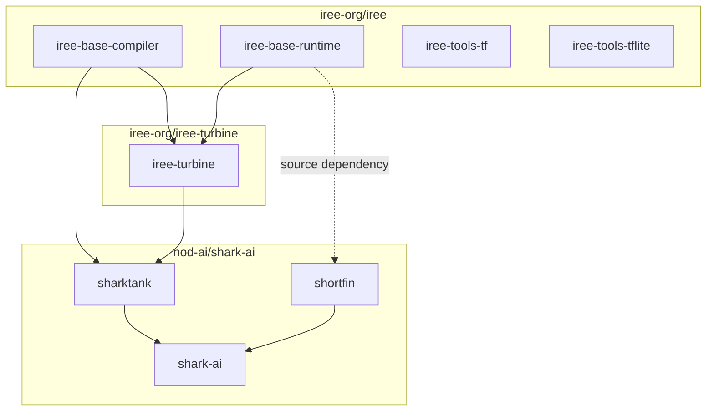
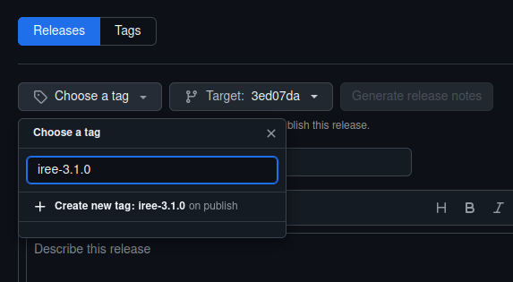
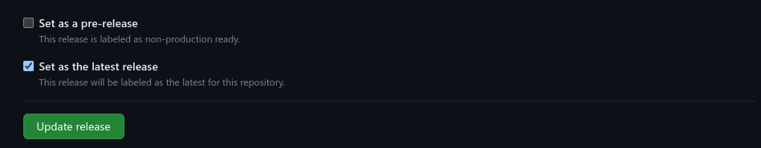

# Release management

## :octicons-book-16: Overview

Releases are the process by which we build and deliver software to our users.
We use a mix of automation and operational practices as part of our continuous
delivery (CD) efforts.

Releases have the following goals (among others):

* Produce and publish easily installable packages to common package managers
  for users.
* Introduce checkpoints with predictable versions around which release notes,
  testing efforts, and other related activities can align.
* Improve project and ecosystem velocity and stability.

### :octicons-calendar-16: Stable and nightly releases

In addition to stable releases, we build and publish nightly releases too.
Nightly releases are less tested and may not include all configurations at all
times, but they are convenient to install as a preview for what the next stable
release will contain.


* Stable releases are published to GitHub releases, are pushed to PyPI, and are
installable via `pip install` using default options.
* Nightly releases are published to only GitHub releases as "pre-releases" and
are installable via `pip install` using non-default options like
[`--find-links`](https://pip.pypa.io/en/stable/cli/pip_install/#finding-packages)
and our hosted index page at <https://iree.dev/pip-release-links.html>.

### :material-graph-outline: Projects in scope

The IREE release process currently considers packages in these projects to be
in scope:

* [iree-org/iree](https://github.com/iree-org/iree)
* [iree-org/iree-turbine](https://github.com/iree-org/iree-turbine)
* [nod-ai/amd-shark-ai](https://github.com/nod-ai/amd-shark-ai)

!!! info

    If you maintain a project that you would like to connect with this release
    process, please reach out on one of our
    [communication channels](../../index.md#communication-channels). The current
    project list is driven by the priorities of the core project maintainers and
    we would be happy to adapt the process to include other projects too.

The dependency graph looks like this:



#### :fontawesome-solid-circle-nodes: Types of dependency links

Most dependencies are loose requirements, not imposing strict limitations on
the versions installed. This allows users to freely install similar versions of
each package without risking issues during pip dependency resolution. This is
important for libraries near the root or middle of a dependency graph.

```text title="iree-turbine METADATA snippet" hl_lines="2-3"
Requires-Dist: numpy
Requires-Dist: iree-base-compiler
Requires-Dist: iree-base-runtime
Requires-Dist: Jinja2>=3.1.3
Requires-Dist: ml_dtypes>=0.5.0
```

The shark-ai package is special in that it is a leaf project acting as a full
solution for ML model development that _does_ specify precise versions. By
installing this package, users will receive packages that have been more
rigorously tested together:

```text title="shark-ai METADATA snippet"
Requires-Dist: iree-base-compiler==3.2.*
Requires-Dist: iree-base-runtime==3.2.*
Requires-Dist: iree-turbine==3.2.*
Requires-Dist: sharktank==3.2.0
Requires-Dist: shortfin==3.2.0
```

This feeds back into the release process - while release candidate selection
typically flows from the base projects outwards, leaf projects are responsible
for testing regularly and ensuring that the entire collective continues to work
as expected.

### :octicons-calendar-16: Release timeline

Over the course of a release cycle there are several milestones to look out for:

* Week 0
    * Release `X.Y.0` is published (see also
      [Versioning scheme](./versioning-scheme.md))
    * Versions in source code are updated to `X.{Y+1}.0` (see also
      [Creating a patch release](#creating-a-patch-release))
    * The next release date target is set for ~6 weeks later
    * Subprojects set goals for the release
* ~1 week before the release date
    * Any unstable build/test/release workflows must be stabilized
    * Calls for release note contributions are sent out
    * Release notes are drafted
    * Release candidates are selected
    * Release candidates are tested
* Release day
    * Release candidates are promoted, release notes are published
    * The cycle repeats

Downstream projects are encouraged to test as close to HEAD as possible leading
up to each release, so there are multiple high quality candidates to choose from
and release candidate testing processes require minimal manual effort.

!!! Note

    We do not yet have a process for creating release branches. Instead, we
    choose a release candidate from nightly builds of the `main` branch. We
    also do not choose a cutoff point in advance for the release candidate
    selection.

    This process will likely need to evolve for future releases.

## :material-list-status: Release status

Stable release history:
<https://github.com/iree-org/iree/releases?q=prerelease%3Afalse>.

### iree-org projects

| Project | Package | Release status |
| -- | -- | -- |
| [iree-org/iree](https://github.com/iree-org/iree) | GitHub release (stable) | [](https://github.com/iree-org/iree/releases/latest) |
| | GitHub release (nightly) | [](https://github.com/iree-org/iree/releases) |
| | `iree-base-compiler` | [](https://pypi.org/project/iree-base-compiler) |
| | `iree-base-runtime` | [](https://pypi.org/project/iree-base-runtime) |
| | `iree-tools-tf` | [](https://pypi.org/project/iree-tools-tf) |
| | `iree-tools-tflite` | [](https://pypi.org/project/iree-tools-tflite) |
| [iree-org/iree-turbine](https://github.com/iree-org/iree-turbine) | GitHub release (stable) | [](https://github.com/iree-org/iree-turbine/releases/latest) |
| | `iree-turbine` | [](https://pypi.org/project/iree-turbine) |

### Community projects

| Project | Package | Release status |
| -- | -- | -- |
| [nod-ai/amd-shark-ai](https://github.com/nod-ai/amd-shark-ai) | GitHub release (stable) | [](https://github.com/nod-ai/amd-shark-ai/releases/latest) |
| | `shark-ai` | [](https://pypi.org/project/shark-ai) |
| | `sharktank` | [](https://pypi.org/project/sharktank) |
| | `shortfin` | [](https://pypi.org/project/shortfin) |

### Deprecated packages

| Project | Package | Release status | Notes |
| -- | -- | -- | -- |
| [iree-org/iree](https://github.com/iree-org/iree) | `iree-compiler` | [](https://pypi.org/project/iree-compiler) | Renamed to `iree-base-compiler`
| | `iree-runtime` | [](https://pypi.org/project/iree-runtime) | Renamed to `iree-base-runtime`
| | `iree-runtime-instrumented` | [](https://pypi.org/project/iree-runtime-instrumented) | Merged into `iree[-base]-runtime`
| | `iree-tools-xla` | [](https://pypi.org/project/iree-tools-xla) | Merged into `iree-tools-tf`
| [nod-ai/AMD-SHARK-ModelDev](https://github.com/nod-ai/AMD-SHARK-ModelDev) | `shark-turbine` | [](https://pypi.org/project/shark-turbine) | Renamed to `iree-turbine`

## :material-hammer-wrench: Release mechanics

IREE cuts automated releases via a workflow that is
[triggered daily](https://github.com/iree-org/iree/blob/main/.github/workflows/schedule_candidate_release.yml).
The only constraint placed on the commit that is released is that it has
[passed certain CI checks](https://github.com/iree-org/iree/blob/main/build_tools/scripts/get_latest_green.sh).
These are published on GitHub with the "pre-release" status. For debugging this
process, see the [Release debugging playbook](../debugging/releases.md).

We periodically promote one of these candidates to a "stable" release.

## :octicons-rocket-16: Running a release

A pinned issue tracking the next release should be filed like
<https://github.com/iree-org/iree/issues/18380>. Developers authoring patches
that include major or breaking changes should coordinate merge timing and
contribute release notes on those issues.

### :material-check-all: Picking a candidate to promote

After approximately one month since the previous release, a new release should
be promoted from nightly release candidates.

When selecting a candidate we aim to meet the following criteria:

1. Includes packages for all platforms, including macOS and Windows
2. ⪆2 days old so that problems with it may have been spotted
3. Contains no major regressions vs the previous stable release

When you've identified a potential candidate, comment on the tracking issue with
the proposal and solicit feedback. People may point out known regressions or
request that some feature make the cut.

### :octicons-package-dependents-16: Promoting a candidate to stable

1. (Authorized users only) Push to PyPI using
    [pypi_deploy.sh](https://github.com/iree-org/iree/blob/main//build_tools/python_deploy/pypi_deploy.sh)

2. Create a new release on GitHub:

    * Set the tag to be created and select a target commit. For example, if the
        candidate release was tagged `iree-3.1.0rc20241119` at commit `3ed07da`,
        set the new release tag `v3.1.0` and use the same commit.

        

        If the commit does not appear in the list, create and push a tag
        manually:

        ```bash
        git checkout iree-3.1.0rc20250107
        git tag -a v3.1.0 -m "Version 3.1.0 release."
        git push upstream v3.1.0
        ```

    * Set the title to `Release vX.Y.Z`.

    * Paste the release notes from the release tracking issue.

    * Upload the `.whl` files produced by the `pypy_deploy.sh` script (look for
        them in your `/tmp/` directory). These have the stable release versions
        in them.

    * Download the `iree-dist-.*.tar.xz` files from the candidate release and
        upload them to the new stable release.

    * Uncheck the option for "pre-release", and check the option for "latest".

        

3. Complete any remaining checkbox items on the release tracking issue then
   close it and open a new one for the next release.

## :octicons-stack-16: Creating a patch release

1. Create a new branch.

    Checkout the corresponding stable release and create a branch for the patch release:

    <!-- TODO(scotttodd): Does this need a branch, or would just a tag work? -->

    ```shell
    git checkout v3.0.0
    git checkout -b v3.0.1
    ```

2. Apply and commit the patches.

3. Set the patch level:

    * Adjust `compiler/version.json` if patches are applied to the compiler.

    * Adjust `runtime/version.json` if patches are applied to the runtime.

4. Push all changes to the new branch.

5. Trigger the
    [_Oneshot candidate release_ workflow](https://github.com/iree-org/iree/actions/workflows/oneshot_candidate_release.yml)
    to create a release.

    * Select to run the workflow from the patch branch.

    * Set the type of build version to produce to "stable".

        

6. Follow the documentation above to promote to stable.
   The step to create a new tag can be skipped.

## :octicons-cross-reference-16: Useful references

* [Chapter 24: Continuous Delivery](https://abseil.io/resources/swe-book/html/ch24.html)
  in the
  [_Software Engineering at Google_ Book](https://abseil.io/resources/swe-book)
* [Chapter 8: Release Engineering](https://sre.google/sre-book/release-engineering/)
  in the
  [_Site Reliability Engineering at Google_ Book](https://sre.google/sre-book/table-of-contents/)
* [RELEASE.md](https://github.com/pytorch/pytorch/blob/main/RELEASE.md) in the
  [PyTorch repository](https://github.com/pytorch/pytorch)
* [ONNX Releases](https://onnx.ai/onnx/repo-docs/OnnxReleases.html) for the
  [ONNX project](https://github.com/onnx/onnx)
