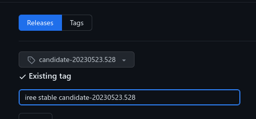

# Release management

IREE cuts automated releases via a workflow that is
[triggered daily](https://github.com/openxla/iree/blob/main/.github/workflows/schedule_candidate_release.yml).
The only constraint placed on the commit that is released is that it has passed
all CI checks. These are published on GitHub with the "pre-release" status. For
debugging this process, see the
[Release debugging playbook](../debugging/releases.md).

We periodically promote one of these candidates to a "stable" release by
removing the "pre-release" status. This makes it show up as a "latest" release
on GitHub. We also push the Python packages for this release to PyPI.

## Picking a candidate to promote

When selecting a candidate we use the following criteria:

1. ⪆4 days old so that problems with it may have been spotted
2. Contains no P0 regressions vs the previous stable release
3. LLVM submodule commit ideally exists upstream (no cherry picks or patches)

When you've identified a potential candidate, email the iree-discuss list with
the proposal and solicit feedback. People may point out known regressions or
request that some feature make the cut.

## Promoting a candidate to stable

1. (Authorized users only) Push to PyPI using
    [pypi_deploy.sh](https://github.com/openxla/iree/blob/main//build_tools/python_deploy/pypi_deploy.sh)

    * For Googlers, the password is stored at <http://go/iree-pypi-password>

2. Open the release on GitHub. Rename the release from "candidate" to "stable",
    uncheck the option for "pre-release", and check the option for "latest".

    

    
