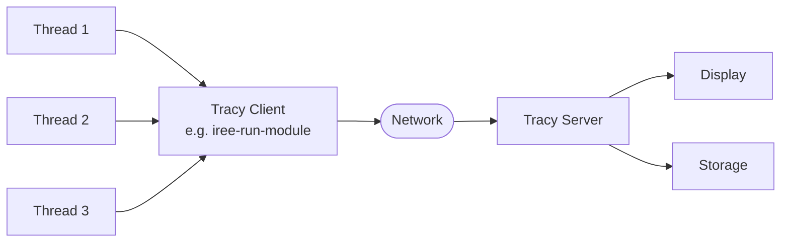

# Profiling with Tracy

## :octicons-book-16: Overview

[Tracy](https://github.com/wolfpld/tracy) is a hybrid instrumentation and
sampling profiler that IREE uses for performance analysis.

[](https://github.com/openxla/iree/assets/4010439/3df4f682-9215-4f55-b7b0-5fe2dce860b0)

### :material-eyedropper: Instrumentation and sampling

* *Instrumentation* is generic code built into the program being profiled,
    recording zone start and end timestamps where a developer requests them:

    [](https://github.com/openxla/iree/assets/4010439/70706e6d-d253-4ca3-85bf-165f23d24635)

    Most of IREE's runtime code is instrumented using the macros defined in
    [iree/base/tracing.h](https://github.com/openxla/iree/blob/main/runtime/src/iree/base/tracing.h):

    ```c
    void iree_sample_function() {
      IREE_TRACE_ZONE_BEGIN(z0);
      // All code here will be included in the zone for `iree_sample_function`.
      IREE_TRACE_ZONE_END(z0);
    }
    ```

* *Sampling* collects program state and information about the machine using
    platform-specific APIs at a regular sampling frequency. Sampled data
    includes callstacks, hardware counters, and more:

    [](https://github.com/openxla/iree/assets/4010439/d637a692-8bfa-42c4-bd0d-75ea3dce2e69)

    While recording instrumentation data requires no special setup, recording
    sampling data will need some configuration depending on your operating
    system. Refer to the "Automated data collection" section in the
    [Tracy PDF manual](#the-tracy-manual) for full details. Generally, sampling
    needs:

    * Debug information from `-DCMAKE_BUILD_TYPE=RelWithDebInfo` or `Debug`
    * Privilege elevation from `sudo` on Unix or adminstrator on Windows

### :material-connection: Remote or embedded telemetry

Tracy uses a client-server model with communication over a TCP socket:

* The "client" is the program being profiled.
* The "server" is either the Tracy profiler UI or the Tracy command-line
  capture tool.



This allows for [remote capture](#remote-capture-eg-ssh-android), such as over
SSH, as well as sharing of saved traces across machines.

### :octicons-file-16: The Tracy manual

The primary source of Tracy documentation, including how to build the profiler
UI and CLI capture tool, is a PDF manual:

<!-- markdownlint-disable-next-line -->
[Download tracy.pdf :octicons-download-16:](https://github.com/wolfpld/tracy/releases/latest/download/tracy.pdf){ .md-button .md-button--primary } [View tracy.pdf in browser :material-magnify:](https://docs.google.com/viewer?url=https://github.com/wolfpld/tracy/releases/latest/download/tracy.pdf){ .md-button .md-button--primary }

## :octicons-telescope-16: Capturing a trace

You will need three things to capture a trace:

1. The Tracy profiler UI (or CLI capture tool)
2. A binary tool to trace, such as `iree-run-module`, built with tracing
    support enabled
3. A program to profile, e.g. a `.vmfb` file with parameters and input values

The Tracy tools can either be downloaded from
[the official releases](https://github.com/wolfpld/tracy/releases) or they can
be built from source by using either the upstream CMake build or IREE's
[downstream CMake build](#building-tracy-from-source).

### :octicons-rocket-16: Quickstart

1. Build `iree-run-module` (or other tools like `iree-benchmark-module`) with
    tracing support:

    ```shell hl_lines="4-5"
    # Sampling needs debug info from the `RelWithDebInfo` or `Debug` build type.

    cmake -G Ninja -B ../iree-build/ -S . \
        -DCMAKE_BUILD_TYPE=RelWithDebInfo \
        -DIREE_ENABLE_RUNTIME_TRACING=ON
    cmake --build ../iree-build/ --target iree-run-module
    ```

    For more information about building from source, follow the
    [Getting started](../../building-from-source/getting-started.md) page.

    ??? tip - "Tip - Instrumented Python packages"

        The `iree-runtime` Python package includes prebuilt instrumented tools.
        Set the `IREE_PY_RUNTIME=tracy` environment variable to use them:

        ```shell
        python -m pip install iree-runtime
        IREE_PY_RUNTIME=tracy iree-run-module ...
        ```

        You should see the following message printed to stderr:

        > `-- Using Tracy runtime (IREE_PY_RUNTIME=tracy)`

        See [this section](../../reference/bindings/python.md#profiling) in the
        Python bindings documentation for more details.

2. Compile a program to profile:

    ```shell hl_lines="8"
    # The --iree-hal-executable-debug-level=3 flag embeds source information
    # about each executable into the .vmfb file for the runtime to pass to
    # Tracy. Without this flag, source locations are included on a best-effort
    # basis, typically coming from the input .mlir or .py file.

    iree-compile program_input.mlir \
      --iree-hal-target-backends={target} \
      --iree-hal-executable-debug-level=3 \
      -o program.vmfb
    ```

3. Run the program using the instrumented `iree-run-module`:

    ```shell hl_lines="9"
    # Set the TRACY_NO_EXIT environment variable to keep short-running programs
    # from exiting before connecting.
    #
    # Some platforms need elevated permissions (root / sudo / administrator)
    # to collect sampling data using kernel facilities. If you only want to
    # collect instrumentation data or your platform does not require it, you
    # can run with more limited permissions.

    TRACY_NO_EXIT=1 sudo iree-run-module \
      --module=program.vmfb \
      --device={device} \
      --entry_function={entry} \
      --parameters={parameters} \
      --input={arg0} \
      --input={arg1} \
      ...
    ```

4. While the program is running, connect using the Tracy profiler UI or capture
    tool:

    === "Tracy profiler UI"

        The profiler UI lists available clients or can be set to connect to the
        next instrumented process:

        

    === "Tracy capture tool"

        The capture tool can be used programmatically and over SSH:

        ```console
        $ capture -o /tmp/capture.tracy

        Connecting to 127.0.0.1:8086...
        ```

5. View the captured trace once it finishes collecting events. Traces captured
    by the profiler UI can also be saved to `.tracy` files for sharing and
    archival.

### Including more information in traces

#### Changing `IREE_TRACING_MODE`

Set IREE's `IREE_TRACING_MODE` value (defined in
[iree/base/tracing.h](https://github.com/openxla/iree/blob/main/runtime/src/iree/base/tracing.h))
to adjust which tracing features are enabled. Each feature adds tracing overhead
and increases the size of trace files, so adjust this setting with care.

For example, to track memory allocations with callstacks:

```shell hl_lines="3-4"
cmake -G Ninja -B ../iree-build/ -S . \
    -DCMAKE_BUILD_TYPE=RelWithDebInfo \
    -DIREE_ENABLE_RUNTIME_TRACING=ON \
    -DIREE_TRACING_MODE=4
cmake --build ../iree-build/ --target iree-run-module
```

The Memory window in the Tracy profiler should then show callstacks for each
allocation:

[](https://github.com/openxla/iree/assets/4010439/c0732eec-3fc5-476b-8e6a-fa8c8631eaac)

#### Options for the `llvm-cpu` backend

When using the `llvm-cpu` backend (`--iree-hal-target-backends=llvm-cpu` with
`--device=local-task` or `--device=local-sync`), these options are available:

* The `--iree-llvmcpu-link-embedded=false` flag uses the "system" linker
    (.so/.dylib/.dll) instead of the generic
    "embedded" ELF linker, allowing Tracy to look more deeply at generated code:

    [](https://github.com/openxla/iree/assets/4010439/29b72647-f242-41d9-8a6c-10b48dc155fa)

* The `IREE_PRESERVE_DYLIB_TEMP_FILES` environment variable can be used on
    Posix platforms to ensure that Tracy can view IREE's generated native code.

* Ensure that `--iree-llvmcpu-debug-symbols=true` is set (it is by default).

Putting those flags and environment variables together in an example:

```shell hl_lines="2-5 8"
iree-compile program_input.mlir \
  --iree-hal-target-backends=llvm-cpu \
  --iree-hal-executable-debug-level=3 \
  --iree-llvmcpu-link-embedded=false \
  --iree-llvmcpu-debug-symbols=true \
  -o program_full_info.vmfb

TRACY_NO_EXIT=1 IREE_PRESERVE_DYLIB_TEMP_FILES=1 sudo iree-run-module \
  --device=local-task \
  --module=program_full_info.vmfb \
  ...
```

### :octicons-server-16: Remote capture (e.g. SSH, Android)

Tracy's client/server connection uses TCP port 8086 by default. If the
Tracy-instrumented program is running on a separate machine, this port needs to
be forwarded.

In particular, when profiling on Android, this is needed:

```shell
adb forward tcp:8086 tcp:8086
```

You can also pass `-p <port>` to the capture tool to override the default port
to connect to, or use the Tracy GUI which scans other ports too.

## :octicons-graph-16: Touring the Tracy profiler UI

The initial view should look like this:


Before going further, take a second to check that your recorded profile data has
all the data that it should have. Permissions issues could cause it to lack
"sampling" or "CPU data" information. For example, here is what he initial view
looks like when one forgot to run the profiled program as root on Desktop Linux
(where running as root is required):


Notice how the latter screenshot is lacking the following elements:

* No 'CPU data' header in the top left, with the list of all CPU cores.
* No 'ghost' icon next to the 'Main thread' header.

Click the 'Statistics' button at the top. It will open a window like this:


See how the above screenshot has two radio buttons at the top: 'Instrumentation'
and 'Sampling'. At this point, if you don't see the 'Sampling' radio button, you
need to resolve that first, as discussed above about possible permissions
issues.

These 'Instrumentation' and 'Sampling' statistics correspond the two kinds of
data that Tracy collects about your program. In the Tracy main view, they
correspond, respectively, to 'instrumentation' and 'ghost' zones. Refer to the
[Tracy PDF manual](#the-tracy-manual) for a general introduction to these
concepts. For each thread, the ghost icon toggles the view between these two
kinds of zones.

Back to the main view, look for the part of the timeline that is of interest to
you. Your area of interest might not be on the Main thread. In fact, it might be
on a thread that's not visible in the initial view at all. To pan around with
the mouse, hold the **right mouse button** down (or its keyboard equivalent on
macOS). Alternatively, look for the 'Frame' control at the top of the Tracy
window. Use the 'next frame' arrow button until more interesting threads appear.

IREE module code tends to run on a thread whose name contains the word `worker`.

Once you have identified the thread of interest, you typically want to click its
ghost icon to view its "ghost" (i.e. sampling) zones. Here is what you should
get when clicking on a ghost zone:

[](https://gist.githubusercontent.com/bjacob/ff7dec20c1dfc7d0fc556cc7275bca9a/raw/fe4e22ca0301ebbfd537c47332a4a2c300a417b3/tracy_source_view.jpeg)

The percentages column to the left of the disassembly shows where time is being
spent. This is unique to the sampling data (ghost zones) and has no equivalent
in the instrumentation data (instrumentation zones). Here is what we get
clicking on the corresponding instrumentation zone:


This still has a 'Source' button but that only shows the last C++ caller that
had explicit Tracy information, so here we see a file under `iree/hal` whereas
the Ghost zone saw into the IREE compiled module that that calls into, with the
source view pointing to the `.mlir` file.

<!-- TODO: more on using statistics -->
<!-- TODO: discuss comparing trace files -->

## Tracing `iree-compile`

Tracing `iree-compile` is much like tracing the runtime tools, except that
*both* of these options need to be set with CMake:
`-DIREE_ENABLE_RUNTIME_TRACING=ON -DIREE_ENABLE_COMPILER_TRACING=ON`:

```shell hl_lines="3-4"
cmake -G Ninja -B ../iree-build/ -S . \
    -DCMAKE_BUILD_TYPE=RelWithDebInfo \
    -DIREE_ENABLE_RUNTIME_TRACING=ON \
    -DIREE_ENABLE_COMPILER_TRACING=ON
cmake --build ../iree-build/ --target iree-compile
```

The steps for collecting traces are the same: run the instrumented program and
connect using the Tracy profiler UI or capture tool.

[](https://github.com/openxla/iree/assets/4010439/bf5c0502-6b1b-4caa-bdd9-132281245421)

* MLIR passes are instrumented using
  [Pass Instrumentation](https://mlir.llvm.org/docs/PassManagement/#pass-instrumentation),
  (see
  [`TracingUtils.h`](https://github.com/openxla/iree/blob/main/compiler/src/iree/compiler/Utils/TracingUtils.h))
* Zones are annotated with op breadcrumbs indicating which root op was processed
* Each compilation phase (e.g. Flow, Stream, HAL) is tagged as a "frame", so
  you can jump between them, limit statistics to them, and see how much time
  each took

??? caution "Caution - Tracy sampling with `iree-compile`"

    When tracing the compiler, the LLVM/MLIR code can easily generate millions
    of trace events. Traces captured with sampling can thus take hours to
    collect, require 40GB+ of RAM to view, and take 1GB+ on disk to store.

    

    However, sampling is especially useful in diagnosing long compile times,
    since only the MLIR passes are instrumentated, unlike in IREE's runtime
    where most functions are covered.

For more tips on profiling the compiler, see the
[Compile time regression debugging](../debugging/compile-time-regressions.md)
page.

## :octicons-question-16: Troubleshooting

### "RESOURCE_EXHAUSTED; failed to open file" issue

This is a
[known issue with how tracy operates](https://github.com/wolfpld/tracy/issues/512).
One way to workaround it is to manually increase the total number of files
that can be kept opened simultaneously and run the command with that setting:

```shell
sudo sh -c "ulimit -n <bigNum> && <myTracyInstrumentedProgram>"
```

!!! info

    Tracy keeps a number of file descriptors open that, depending on the
    machine and its settings, may exceed the limit allowed by the system
    resulting in IREE failing to open more files. In particular, it is commom
    to have a relatively low limit when running with `sudo`.

---

## :octicons-log-16: Appendix

### Building Tracy from source

#### Install dependencies

##### Do you need capstone-next?

You can skip this section if you don't need disassembly of CPU code.

[Capstone](https://github.com/capstone-engine/capstone) is the disassembly
framework used by Tracy. The default branch, which is what OS packages still
distribute, is running a few years behind current CPU architectures.

Newer CPU architectures such as RISC-V, or newer extensions of existing
architectures (e.g. new SIMD instructions in the ARM architecture) are typically
only supported in the
[`next`](https://github.com/capstone-engine/capstone/tree/next) branch. If you
need that support, check out and build that branch. Consider uninstalling any OS
package for `capstone` or otherwise ensure that your IREE build will pick up
your `next` branch build.

##### Linux

If you haven't opted to build `capstone-next` (see above section), install the
OS package for `capstone` now (Debian-based distributions):

```shell
sudo apt install libcapstone-dev
```

Install other dependencies:

```shell
sudo apt install libtbb-dev libzstd-dev libglfw3-dev libfreetype6-dev libgtk-3-dev
```

If you only build the command-line tool `iree-tracy-capture` and not the
graphical `iree-tracy-profiler`, you can install only:

```shell
sudo apt install libtbb-dev libzstd-dev
```

The zstd version on Ubuntu 18.04 is old. You will need to install it from source
from <https://github.com/facebook/zstd.git>

##### Mac

If you haven't opted to build `capstone-next` (see above section), install the
system `capstone` now:

```shell
brew install capstone
```

Install other dependencies:

```shell
brew install pkg-config glfw freetype tbb zstd
```

#### Build the Tracy tools

A CMake-based build system for Tracy is maintained as part of IREE. In your IREE
host build directory, set the following CMake option:

```shell
cmake -DIREE_BUILD_TRACY=ON -DIREE_ENABLE_LLD=ON .
```

That enables building the Tracy server tools, `iree-tracy-profiler` and
`iree-tracy-capture`, introduced above. It also enables building the tool
`iree-tracy-csvexport` which can be used to export a captured trace as a
CSV file (see Section 6 "Exporting zone statistics to CSV" in the Tracy manual).

!!! note "TODO - switch to using upstream CMake project"

    Tracy now has an upstream CMake build for each of its components. We may
    be able to use this directly.

If profiling on Android/ARM, you might need the patch discussed in the next
paragraph.

Consider building **without** assertions (`cmake -DIREE_ENABLE_ASSERTIONS=OFF`).
At least `iree-tracy-profiler` has some
[faulty assertions](https://github.com/wolfpld/tracy/pull/382) that can cause
the profiler UI to crash during normal usage.

Rebuild, either everything or just these specific targets:

```shell
cmake --build . --target iree-tracy-profiler iree-tracy-capture iree-tracy-csvexport
```

This should have created the `iree-tracy-profiler`, `iree-tracy-capture`, and
`iree-tracy-csvexport` binaries:

```shell
$ find . -name iree-tracy-*
./tracy/iree-tracy-profiler
./tracy/iree-tracy-capture
./tracy/iree-tracy-csvexport
```

### Android system settings required for Sampling and SysTrace

When profiling on an Android device, in order to get the most useful information
in the trace, tweak system permissions as follows before profiling. This needs
to be done again after every reboot of the Android device.

From your desktop, get a shell on the Android device:

```shell
adb shell
```

The following commands are meant to be run from that Android device shell.
First, get root access:

```shell
su
```

Now run the following commands as root on the Android device:

```shell
setenforce 0
mount -o remount,hidepid=0 /proc
echo 0 > /proc/sys/kernel/perf_event_paranoid
echo 0 > /proc/sys/kernel/kptr_restrict
```

Note: in order for this to work, the device needs to be *rooted*, which means
that the above `su` command must succeed. This is sometimes confused with the
`adb root` command, but that's not the same. `adb root` restarts the `adbd`
daemon as root, which causes device shells to be root shells by default. This is
unnecessary here and we don't recommend it: real Android applications *never*
run as root, so Tracy/Android *has* to support running benchmarks as regular
user and it's best to stick to this for the sake of realistic benchmarks.
Internally, Tracy executes `su` commands to perform certain actions, so it too
relies on the device being *rooted* without relying on the benchmark process
being run as root.
