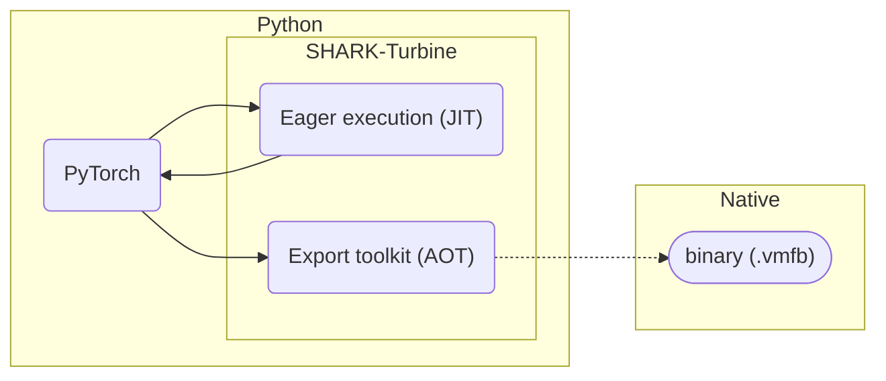
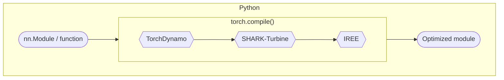

---
hide:
  - tags
tags:
  - Python
  - PyTorch
icon: simple/pytorch
status: new
---

# PyTorch + IREE = :octicons-heart-16:

!!! caution "Caution - under development"
    We are still validating and fixing specific models. Between bug fixes in
    flight and releases running behind, we don't expect that you will be able
    to do a lot of advanced things without using nightly releases or working
    with us.

    Stay tuned and join the discussion in our
    [Discord server](https://discord.gg/26P4xW4)'s `#pytorch` channel.

## :octicons-book-16: Overview

[SHARK-Turbine](https://github.com/nod-ai/SHARK-Turbine) offers a tight
integration between compatible versions of IREE,
[torch-mlir](https://github.com/llvm/torch-mlir), and
[PyTorch](https://pytorch.org/).

- [x] Seamless integration with standard PyTorch workflows
- [x] Deployment support for running PyTorch models on cloud and edge devices
- [x] General purpose model compilation and execution tools

Both just-in-time (JIT) and ahead-of-time (AOT) workflows are supported:



## :octicons-download-16: Prerequisites

Install Turbine and its requirements:

``` shell
python -m pip install shark-turbine
```

## :octicons-flame-16: Just-in-time (JIT) execution

Just-in-time integration allows for Python code using TorchDynamo to optimize
PyTorch models/functions using IREE, all within an interactive Python session.

<!-- TODO(scotttodd): mention targets like AMD GPUs when supported
                      https://github.com/nod-ai/SHARK-Turbine/issues/94 -->



For deployment outside of Python, see the ahead-of-time sections below.

### :octicons-rocket-16: Quickstart

Turbine integrates into PyTorch as a
[custom backend](https://pytorch.org/docs/2.0/dynamo/custom-backends.html) for
[`torch.compile`](https://pytorch.org/docs/stable/generated/torch.compile.html).

Behind the scenes, PyTorch captures the structure of the input model into a
computation graph and feeds that graph through to the selected backend compiler.

```python
import torch

# Define the `nn.Module` or Python function to run.
class LinearModule(torch.nn.Module):
  def __init__(self, in_features, out_features):
    super().__init__()
    self.weight = torch.nn.Parameter(torch.randn(in_features, out_features))
    self.bias = torch.nn.Parameter(torch.randn(out_features))

  def forward(self, input):
    return (input @ self.weight) + self.bias

linear_module = LinearModule(4, 3)

# Compile the program using the turbine backend.(1)
opt_linear_module = torch.compile(linear_module, backend="turbine_cpu")

# Use the compiled program as you would the original program.
args = torch.randn(4)
turbine_output = opt_linear_module(args)
```

1. Initial integration only supports CPU, but support for many of IREE's other
   targets is coming soon.

### :octicons-code-16: Samples

| Code samples |  |
| -- | -- |
JIT compilation notebook | [](https://colab.research.google.com/github/openxla/iree/blob/main/samples/colab/pytorch_jit.ipynb)
Simple MLP eager | [`examples/eager_mlp/mlp_eager_simple.py`](https://github.com/nod-ai/SHARK-Turbine/blob/main/examples/eager_mlp/mlp_eager_simple.py)

## :octicons-package-dependents-16: Ahead-of-time (AOT) export

The ahead-of-time toolkit allows developers to define a program's structure in
Python and then export deployment-ready artifacts that can be used in IREE's
[deployment configurations](../deployment-configurations/index.md) via the
[API bindings](../../reference/bindings/index.md).

### :octicons-plug-16: Simple API

For simple models, a one-shot export API is available.


```python
import iree.runtime as ireert
import numpy as np
import shark_turbine.aot as aot
import torch

# Define the `nn.Module` to export.
class LinearModule(torch.nn.Module):
  def __init__(self, in_features, out_features):
    super().__init__()
    self.weight = torch.nn.Parameter(torch.randn(in_features, out_features))
    self.bias = torch.nn.Parameter(torch.randn(out_features))

  def forward(self, input):
    return (input @ self.weight) + self.bias

linear_module = LinearModule(4, 3)

# Export the program using the simple API.
example_arg = torch.randn(4)
export_output = aot.export(linear_module, example_arg)

# Compile to a deployable artifact.
binary = export_output.compile(save_to=None)

# Use the IREE runtime API to test the compiled program.
config = ireert.Config("local-task")
vm_module = ireert.load_vm_module(
    ireert.VmModule.wrap_buffer(config.vm_instance, binary.map_memory()),
    config,
)
input = np.array([1.0, 2.0, 3.0, 4.0], dtype=np.float32)
result = vm_module.main(input)
print(result.to_host())
```

#### :octicons-code-16: Samples

| Code samples |  |
| -- | -- |
Simple AOT export notebook | [](https://colab.research.google.com/github/openxla/iree/blob/main/samples/colab/pytorch_aot_simple.ipynb)
Simple MLP export | [`examples/aot_mlp/mlp_export_simple.py`](https://github.com/nod-ai/SHARK-Turbine/blob/main/examples/aot_mlp/mlp_export_simple.py)

### :octicons-tools-16: Advanced API

For more complex models, an underlying advanced API is available that gives
access to more features.


Advanced export workflows can use the
[`aot.CompiledModule`](https://github.com/nod-ai/SHARK-Turbine/blob/main/python/shark_turbine/aot/compiled_module.py)
class to define and constrain the structure of a program prior to compiling it.

<!-- TODO(scotttodd): API reference pages for aot.CompiledModule etc.?
                      https://github.com/nod-ai/SHARK-Turbine/issues/106
-->

```python
import shark_turbine.aot as aot

# A minimal program, with no functions or variables.
class BasicModule(aot.CompiledModule):
  ...

# Create an instance of the program and convert it to MLIR.
from iree.compiler.ir import Context
instance = BasicModule(context=Context())
module_str = str(aot.CompiledModule.get_mlir_module(instance))

print(module_str)
# module @basic {
# }
```

#### :material-function: Exporting functions

_Exported functions_ are the API entry points into a compiled program.

Simple feed-forward neural networks used for inference may have a single
exported function (typically called "forward"), while more complex programs can
have multiple computation functions, initialization functions, "backward"
methods for training, state management functions, debugging functions, etc.

* Each instance method on a `aot.CompiledModule`-derived class is exported.
  These instance methods can include calls to other `aot` components, such as
  `aot.jittable` compute functions:

    ```python
    class GetOnesModule(aot.CompiledModule):
      @aot.jittable
      def compute_ones():
        return torch.ones(3)

      def get_ones(self):
        return self.compute_ones()
    ```

* Instance methods can use `aot.AbstractTensor` to specify data types:

    ```python hl_lines="8-9"
    class IntSumModule(aot.CompiledModule):
      @aot.jittable
      def compute_sum(a, b):
        return a + b

      def sum_int32(
        self,
        a=aot.AbstractTensor(2, dtype=torch.int32),
        b=aot.AbstractTensor(2, dtype=torch.int32),
      ):
        return self.compute_sum(a, b)
    ```

* Shapes can be made dynamic using `aot.AbstractTensor` and `aot.jittable`
  constraints:

    ```python hl_lines="8-9 14-16"
    class DynamicSumModule(aot.CompiledModule):
      @aot.jittable
      def compute_sum(a, b):
        return a + b

      def sum_dynamic(
        self,
        a=aot.AbstractTensor(None),
        b=aot.AbstractTensor(None),
      ):
        return self.compute_sum(
            a,
            b,
            constraints=[
                a.dynamic_dim(0) == b.dynamic_dim(0),
            ],
        )
    ```

#### :material-variable: Global variables

_Global variables_ are used to represent persistent state within a program
instance.

For example, they can be used to represent the weights and biases in a neural
network, and exporting these as mutable variables can allow for setting
their values independently at runtime.

* Individual globals can be exported using `aot.export_global()`:

    ```python
    state_example = torch.tensor(0, dtype=torch.int32)
    update_example = torch.tensor(0, dtype=torch.int32)

    class SampleModule(aot.CompiledModule):
      value = aot.export_global(state_example, mutable=True)

      def get_value(self):
        return self.value

      def update_value(self, new_value=aot.abstractify(update_example)):
        self.value = new_value
    ```

* All named parameters on a `nn.Module` can be exported using
  `export_parameters()`:

    ```python hl_lines="12 18-26"
    class SimpleParams(torch.nn.Module):
      def __init__(self):
        super().__init__()
        self.classifier = torch.nn.Linear(20, 30)

      def forward(self, x):
        return self.classifier(x)

    m = SimpleParams()

    class SimpleParamsModule(aot.CompiledModule):
      params = aot.export_parameters(m)
      compute = aot.jittable(m.forward)

      def run(self, x=aot.AbstractTensor(128, 20)):
        return self.compute(x)

      # torch.nn.Linear has 'weight' and 'bias' variables:
      #   https://pytorch.org/docs/stable/generated/torch.nn.Linear.html
      # Add getters for both exported parameters.

      def get_weight(self):
        return self.params["classifier.weight"]

      def get_bias(self):
        return self.params["classifier.bias"]
    ```

#### :octicons-code-16: Samples

| Code samples |  |
| -- | -- |
Advanced AOT export notebook | [](https://colab.research.google.com/github/openxla/iree/blob/main/samples/colab/pytorch_aot_advanced.ipynb)
PyTorch dynamic shapes notebook | [](https://colab.research.google.com/github/openxla/iree/blob/main/samples/dynamic_shapes/pytorch_dynamic_shapes.ipynb)
Unit tests | [`tests/aot/`](https://github.com/nod-ai/SHARK-Turbine/tree/main/tests/aot)
Dynamic MLP export | [`examples/aot_mlp/mlp_export_dynamic.py`](https://github.com/nod-ai/SHARK-Turbine/blob/main/examples/aot_mlp/mlp_export_dynamic.py)
llama2 inference example | [`examples/llama2_inference/stateless_llama.py`](https://github.com/nod-ai/SHARK-Turbine/blob/main/examples/llama2_inference/stateless_llama.py)

## Alternate workflows

!!! caution "Caution - These are due for migration to SHARK-Turbine."

| Code samples |  |
| -- | -- |
(Deprecated) Inference on BERT | [](https://colab.research.google.com/github/iree-org/iree-torch/blob/main/examples/bert.ipynb)

### Native / on-device training

A small (~100-250KB), self-contained binary can be built for deploying to
resource-constrained environments without a Python interpreter.

| Example scripts |
| -- |
| [Basic Inference and Training Example](https://github.com/iree-org/iree-torch/blob/main/examples/regression.py) |
| [Native On-device Training Example](https://github.com/iree-org/iree-torch/tree/main/examples/native_training) |
