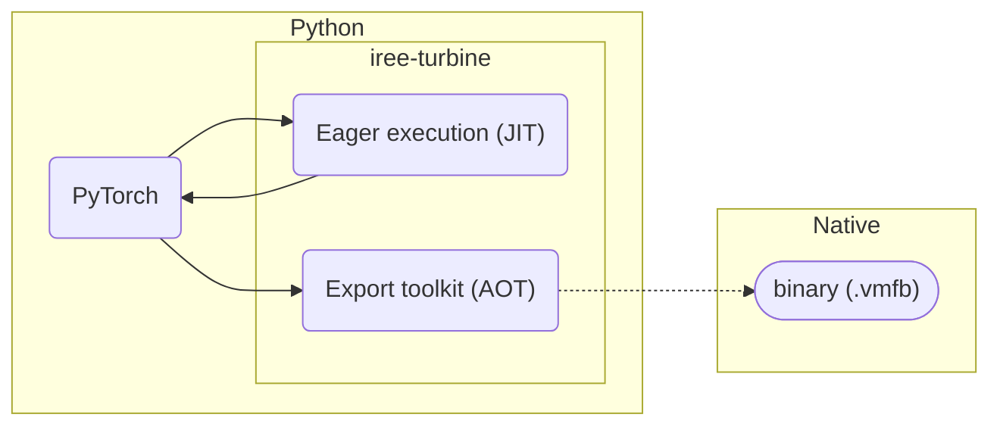
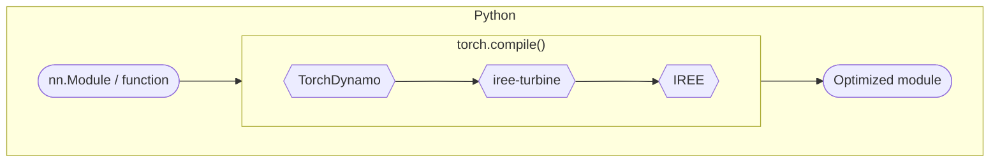
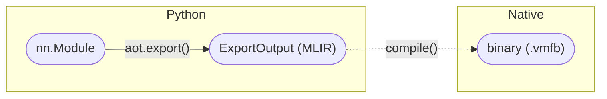
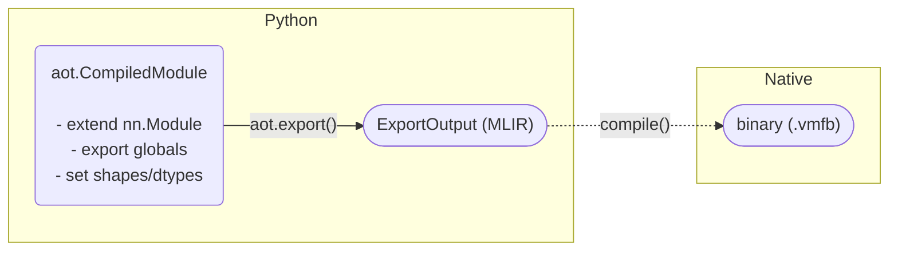

---
hide:
  - tags
tags:
  - Python
  - PyTorch
icon: simple/pytorch
status: new
---

# PyTorch + IREE = :octicons-heart-16:

!!! caution "Caution - under development"

    We are still validating and fixing specific models. Between bug fixes in
    flight and releases running behind, we don't expect that you will be able
    to do a lot of advanced things without using nightly releases or working
    with us.

    Stay tuned and join the discussion in our
    [Discord server](https://discord.gg/wEWh6Z9nMU)'s `#pytorch` channel.

## :octicons-book-16: Overview

[iree-turbine](https://pypi.org/project/iree-turbine/) (rebrand pending from
"shark-turbine") offers a tight integration between compatible versions of IREE,
[torch-mlir](https://github.com/llvm/torch-mlir), and
[PyTorch](https://pytorch.org/).

- [x] Seamless integration with standard PyTorch workflows
- [x] Deployment support for running PyTorch models on cloud and edge devices
- [x] General purpose model compilation and execution tools

Both just-in-time (JIT) and ahead-of-time (AOT) workflows are supported:



## :octicons-download-16: Prerequisites

Install a recent version of PyTorch
(`2.4.1`, latest stable release as of September 2024):

``` shell
python -m pip install \
  --index-url https://download.pytorch.org/whl/test/cpu torch==2.4.1
```

Install iree-turbine:

``` shell
python -m pip install iree-turbine
```

## :octicons-flame-16: Just-in-time (JIT) execution

Just-in-time integration allows for Python code using TorchDynamo to optimize
PyTorch models/functions using IREE, all within an interactive Python session.

<!-- TODO(scotttodd): mention targets like AMD GPUs when supported
                      https://github.com/iree-org/iree-turbine/issues/78 -->



For deployment outside of Python, see the
[ahead-of-time sections below](#ahead-of-time-aot-export).

### :octicons-rocket-16: Quickstart

Turbine integrates into PyTorch as a
[custom backend](https://pytorch.org/docs/stable/torch.compiler_custom_backends.html)
for
[`torch.compile`](https://pytorch.org/docs/stable/generated/torch.compile.html).

Behind the scenes, PyTorch captures the structure of the input model into a
computation graph and feeds that graph through to the selected backend compiler.

```python
import torch

# Define the `nn.Module` or Python function to run.
class LinearModule(torch.nn.Module):
  def __init__(self, in_features, out_features):
    super().__init__()
    self.weight = torch.nn.Parameter(torch.randn(in_features, out_features))
    self.bias = torch.nn.Parameter(torch.randn(out_features))

  def forward(self, input):
    return (input @ self.weight) + self.bias

linear_module = LinearModule(4, 3)

# Compile the program using the turbine backend.(1)
opt_linear_module = torch.compile(linear_module, backend="turbine_cpu")

# Use the compiled program as you would the original program.
args = torch.randn(4)
turbine_output = opt_linear_module(args)
```

1. Initial integration only supports CPU, but support for many of IREE's other
   targets is coming soon.

### :octicons-code-16: Samples

| Code samples |  |
| -- | -- |
JIT compilation notebook | [](https://colab.research.google.com/github/iree-org/iree/blob/main/samples/colab/pytorch_jit.ipynb)
Simple MLP eager | [`core/examples/eager_mlp/mlp_eager_simple.py`](https://github.com/iree-org/iree-turbine/tree/main/examples/eager_mlp/mlp_eager_simple.py)

## :octicons-package-dependents-16: Ahead-of-time (AOT) export

The ahead-of-time toolkit allows developers to define a program's structure in
Python and then export deployment-ready artifacts that can be used in IREE's
[deployment configurations](../deployment-configurations/index.md) via the
[API bindings](../../reference/bindings/index.md).

### :octicons-plug-16: Simple API

For simple models, a one-shot export API is available.



```python
import iree.runtime as ireert
import numpy as np
import shark_turbine.aot as aot
import torch

# Define the `nn.Module` to export.
class LinearModule(torch.nn.Module):
  def __init__(self, in_features, out_features):
    super().__init__()
    self.weight = torch.nn.Parameter(torch.randn(in_features, out_features))
    self.bias = torch.nn.Parameter(torch.randn(out_features))

  def forward(self, input):
    return (input @ self.weight) + self.bias

linear_module = LinearModule(4, 3)

# Export the program using the simple API.
example_arg = torch.randn(4)
export_output = aot.export(linear_module, example_arg)

# Compile to a deployable artifact.
binary = export_output.compile(save_to=None)

# Use the IREE runtime API to test the compiled program.
config = ireert.Config("local-task")
vm_module = ireert.load_vm_module(
    ireert.VmModule.copy_buffer(config.vm_instance, binary.map_memory()),
    config,
)
input = np.array([1.0, 2.0, 3.0, 4.0], dtype=np.float32)
result = vm_module.main(input)
print(result.to_host())
```

#### :octicons-code-16: Samples

| Code samples |  |
| -- | -- |
Simple AOT export notebook | [](https://colab.research.google.com/github/iree-org/iree/blob/main/samples/colab/pytorch_aot_simple.ipynb)
Import [Whisper](https://huggingface.co/openai/whisper-small) from [:hugging: Hugging Face](https://huggingface.co/) notebook | [](https://colab.research.google.com/github/iree-org/iree/blob/main/samples/colab/pytorch_huggingface_whisper.ipynb)
Simple MLP export | [`core/examples/aot_mlp/mlp_export_simple.py`](https://github.com/iree-org/iree-turbine/tree/main/examples/aot_mlp/mlp_export_simple.py)

### :octicons-tools-16: Advanced API

For more complex models, an underlying advanced API is available that gives
access to more features.



Advanced export workflows can use the
[`aot.CompiledModule`](https://github.com/iree-org/iree-turbine/tree/main/shark_turbine/aot/compiled_module.py)
class to define and constrain the structure of a program prior to compiling it.

<!-- TODO(scotttodd): API reference pages for aot.CompiledModule etc.?
                      https://github.com/iree-org/iree-turbine/issues/77
-->

```python
import shark_turbine.aot as aot

# A minimal program, with no functions or variables.
class BasicModule(aot.CompiledModule):
  ...

# Create an instance of the program and convert it to MLIR.
from iree.compiler.ir import Context
instance = BasicModule(context=Context())
module_str = str(aot.CompiledModule.get_mlir_module(instance))

print(module_str)
# module @basic {
# }
```

#### :material-function: Exporting functions

_Exported functions_ are the API entry points into a compiled program.

Simple feed-forward neural networks used for inference may have a single
exported function (typically called "forward"), while more complex programs can
have multiple computation functions, initialization functions, "backward"
methods for training, state management functions, debugging functions, etc.

#### :material-variable: Global variables

_Global variables_ are used to represent persistent state within a program
instance.

For example, they can be used to represent the weights and biases in a neural
network, and exporting these as mutable variables can allow for setting
their values independently at runtime.

* Individual globals can be exported using `aot.export_global()`:

    ```python
    state_example = torch.zeros([1], dtype=torch.int32)

    class SampleModule(aot.CompiledModule):
      value = aot.export_global(state_example, mutable=True)

      def get_value(self):
        return self.value

      def update_value(self, new_value=aot.abstractify(value)):
        self.value = new_value
    ```

#### :octicons-file-symlink-file-16: Using external parameters

Model parameters can be stored in standalone files that can be efficiently
stored and loaded separately from model compute graphs. See the
[Parameters guide](../parameters.md) for more general information about
parameters in IREE.

When using iree-turbine, the `aot.externalize_module_parameters()` function
separates parameters from program modules and encodes a symbolic relationship
between them so they can be loaded at runtime.

We use [Safetensors](https://huggingface.co/docs/safetensors/) here to store the
models parameters on disk, so that they can be loaded later during runtime.

```python
import torch
from safetensors.torch import save_file
import numpy as np
import shark_turbine.aot as aot

class LinearModule(torch.nn.Module):
    def __init__(self, in_features, out_features):
        super().__init__()
        self.weight = torch.nn.Parameter(torch.randn(in_features, out_features))
        self.bias = torch.nn.Parameter(torch.randn(out_features))

    def forward(self, input):
        return (input @ self.weight) + self.bias

linear_module = LinearModule(4,3)

# Create a params dictionary. Note that the keys here match LinearModule's
# attributes. We will use the saved safetensor file for use from the command
# line.
wt = linear_module.weight.data.contiguous()
bias = linear_module.bias.data.contiguous()
params = { "weight": wt, "bias": bias }
save_file(params, "params.safetensors")

# Externalize the model parameters. This removes weight tensors from the IR
# module, allowing them to be loaded at runtime. Symbolic references to these
# parameters are still retained in the IR.
aot.externalize_module_parameters(linear_module)

input = torch.randn(4)
exported_module = aot.export(linear_module, input)

# Compile the exported module, to generate the binary. When `save_to` is
# not None, the binary will be stored at the path passed in to `save_to`.
# Here, we pass in None, so that the binary can stored in a variable.
binary = exported_module.compile(save_to=None)

# Save the input as an npy tensor, so that it can be passed in through the
# command line to `iree-run-module`.
input_np = input.numpy()
np.save("input.npy", input_np)
```

=== "Python runtime"

    Runtime invocation now requires loading the parameters as a separate module.
    To get the parameters as a module, iree.runtime provides a convenient method,
    called `create_io_parameters_module()`.

    ```python
    import iree.runtime as ireert

    # To load the parameters, we need to define ParameterIndex for each
    # parameter class.
    idx = ireert.ParameterIndex()
    idx.add_buffer("weight", wt.detach().numpy().tobytes())
    idx.add_buffer("bias", bias.detach().numpy().tobytes())


    # Create the runtime instance, and load the runtime.
    config = ireert.Config(driver_name="local-task")
    instance = config.vm_instance

    param_module = ireert.create_io_parameters_module(
        instance, idx.create_provider(scope="model"),
    )

    # Load the runtime. There are essentially two modules to load, one for the
    # weights, and one for the main module. Ensure that the VMFB file is not
    # already open or deleted before use.
    vm_modules = ireert.load_vm_modules(
        param_module,
        ireert.create_hal_module(instance, config.device),
        ireert.VmModule.copy_buffer(instance, binary.map_memory()),
        config=config,
    )

    # vm_modules is a list of modules. The last module in the list is the one
    # generated from the binary, so we use that to generate an output.
    result = vm_modules[-1].main(input)
    print(result.to_host())
    ```

=== "Command line tools"

    It is also possible to save the VMFB binary to disk, then call `iree-run-module`
    through the command line to generate outputs.

    ```python
    # When save_to is not None, the binary is saved to the given path,
    # and a None value is returned.
    binary = exported_module.compile(save_to="compiled_module.vmfb")
    ```

    The stored safetensors file, the input tensor, and the VMFB can now be passed
    in to IREE through the command line.

    ```bash
    iree-run-module --module=compiled_module.vmfb --parameters=model=params.safetensors \
                    --input=@input.npy
    ```

    Note here that the `--parameters` flag has `model=` following it immediately.
    This simply specifies the scope of the parameters, and is reflected in the
    compiled module.

#### :octicons-code-16: Samples

| Code samples |  |
| -- | -- |
Advanced AOT export notebook | [](https://colab.research.google.com/github/iree-org/iree/blob/main/samples/colab/pytorch_aot_advanced.ipynb)
PyTorch dynamic shapes notebook | [](https://colab.research.google.com/github/iree-org/iree/blob/main/samples/dynamic_shapes/pytorch_dynamic_shapes.ipynb)
AOT unit tests | [`tests/aot/`](https://github.com/iree-org/iree-turbine/tree/main/tests/aot)
Dynamic MLP export | [`core/examples/aot_mlp/mlp_export_dynamic.py`](https://github.com/iree-org/iree-turbine/tree/main/examples/aot_mlp/mlp_export_dynamic.py)
stateless llama2 | [`models/turbine_models/custom_models/stateless_llama.py`](https://github.com/nod-ai/SHARK-ModelDev/blob/main/models/turbine_models/custom_models/stateless_llama.py)
