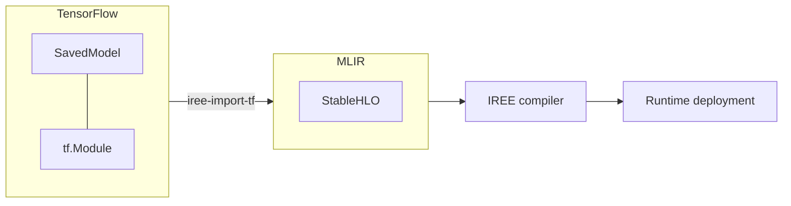

---
hide:
  - tags
tags:
  - Python
  - TensorFlow
icon: simple/tensorflow
---

# TensorFlow integration

## :octicons-book-16: Overview

IREE supports compiling and running TensorFlow programs represented as
`tf.Module` [classes](https://www.tensorflow.org/api_docs/python/tf/Module)
or stored in the `SavedModel`
[format](https://www.tensorflow.org/guide/saved_model).



## :octicons-download-16: Prerequisites

1. Install TensorFlow by following the
    [official documentation](https://www.tensorflow.org/install):

    ```shell
    python -m pip install tf-nightly
    ```

2. Install IREE packages, either by
    [building from source](../../building-from-source/getting-started.md#python-bindings)
    or from pip:

    === "Stable releases"

        Stable release packages are
        [published to PyPI](https://pypi.org/user/google-iree-pypi-deploy/).

        ``` shell
        python -m pip install \
          iree-compiler \
          iree-runtime \
          iree-tools-tf
        ```

    === ":material-alert: Nightly releases"

        Nightly releases are published on
        [GitHub releases](https://github.com/openxla/iree/releases).

        ``` shell
        python -m pip install \
          --find-links https://openxla.github.io/iree/pip-release-links.html \
          --upgrade \
          iree-compiler \
          iree-runtime \
          iree-tools-tf
        ```

## :octicons-package-dependents-16: Importing models

IREE compilers transform a model into its final deployable format in several
sequential steps. The first step for a TensorFlow model is to use either the
`iree-import-tf` command-line tool or IREE's Python APIs to import the model
into a format (i.e., [MLIR](https://mlir.llvm.org/)) compatible with the generic
IREE compilers.

### From SavedModel on TensorFlow Hub

IREE supports importing and using SavedModels from
[TensorFlow Hub](https://www.tensorflow.org/hub).

#### Using the command-line tool

First download the SavedModel and load it to get the serving signature, which
is used as the entry point for IREE compilation flow:

``` python
import tensorflow.compat.v2 as tf
loaded_model = tf.saved_model.load('/path/to/downloaded/model/')
print(list(loaded_model.signatures.keys()))
```

!!! note
    If there are no serving signatures in the original SavedModel, you may add
    them by yourself by following
    ["Missing serving signature in SavedModel"](#missing-serving-signature-in-savedmodel).

Then you can import the model with `iree-import-tf`. You can read the options
supported via `iree-import-tf -help`. Using
[MobileNet v2](https://tfhub.dev/google/tf2-preview/mobilenet_v2/classification)
as an example and assuming the serving signature is `predict`:

``` shell
iree-import-tf
  --tf-import-type=savedmodel_v1 \
  --tf-savedmodel-exported-names=predict \
  /path/to/savedmodel -o iree_input.mlir
```

!!! tip

    `iree-import-tf` is installed as
    `/path/to/python/site-packages/iree/tools/tf/iree-import-tf`.
    You can find out the full path to the `site-packages` directory via the
    `python -m site` command.

!!! tip

    `-tf-import-type` needs to match the SavedModel version. You can try both v1
    and v2 if you see one of them gives an empty dump.

Next, you can compile the model in `iree_input.mlir` for one of IREE's
supported targets by following one of the
[deployment configuration guides](../deployment-configurations/index.md).

<!-- TODO(??): overview of APIs available, code snippets (lift from Colab?) -->

## :octicons-code-16: Samples

| Colab notebooks |  |
| -- | -- |
Training an MNIST digits classifier | [](https://colab.research.google.com/github/openxla/iree/blob/main/samples/colab/tensorflow_mnist_training.ipynb)
Edge detection | [](https://colab.research.google.com/github/openxla/iree/blob/main/samples/colab/tensorflow_edge_detection.ipynb)
Pretrained ResNet50 inference | [](https://colab.research.google.com/github/openxla/iree/blob/main/samples/colab/tensorflow_resnet.ipynb)
TensorFlow Hub import | [](https://colab.research.google.com/github/openxla/iree/blob/main/samples/colab/tensorflow_hub_import.ipynb)

End-to-end execution tests can be found in IREE's
[integrations/tensorflow/e2e/](https://github.com/openxla/iree/tree/main/integrations/tensorflow/e2e)
directory.

## :octicons-question-16: Troubleshooting

### Missing serving signature in SavedModel

Sometimes SavedModels are exported without explicit
[serving signatures](https://www.tensorflow.org/guide/saved_model#specifying_signatures_during_export).
This happens by default for TensorFlow Hub SavedModels. However, serving
signatures are required as entry points for IREE compilation flow. You
can use Python to load and re-export the SavedModel to give it serving
signatures. For example, for
[MobileNet v2](https://tfhub.dev/google/tf2-preview/mobilenet_v2/classification),
assuming we want the serving signature to be `predict` and operating on a
224x224 RGB image:

``` python
import tensorflow.compat.v2 as tf
loaded_model = tf.saved_model.load('/path/to/downloaded/model/')
call = loaded_model.__call__.get_concrete_function(
         tf.TensorSpec([1, 224, 224, 3], tf.float32))
signatures = {'predict': call}
tf.saved_model.save(loaded_model,
  '/path/to/resaved/model/', signatures=signatures)
```

The above will create a new SavedModel with a serving signature, `predict`, and
save it to `/path/to/resaved/model/`.
