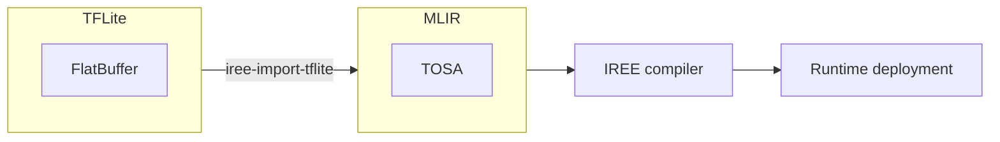

---
hide:
  - tags
tags:
  - Python
  - TensorFlow
icon: simple/tensorflow
---

# TensorFlow Lite (LiteRT) integration

!!! warning

    Support for TensorFlow Lite depends on the TOSA MLIR dialect, which
    is undergoing a major version change that will introduce a new backwards
    compatibility baseline. During this transition, support will be unstable.

    See <https://github.com/iree-org/iree/issues/19777> for details.

## :octicons-book-16: Overview

IREE supports compiling and running TensorFlow Lite (TFLite) programs stored as
[TFLite FlatBuffers](https://www.tensorflow.org/lite/guide). These files can be
imported into an IREE-compatible format then compiled to a series of backends.



## :octicons-download-16: Prerequisites

1. Install TensorFlow by following the
    [official documentation](https://www.tensorflow.org/install):

    ```shell
    python -m pip install "tensorflow<=2.18.0"
    ```

2. Install IREE packages, either by
    [building from source](../../building-from-source/getting-started.md#python-bindings)
    or from pip:

    === "Stable releases"

        Stable release packages are [published to PyPI](https://pypi.org/).

        !!! note

            Until the major version updates in
            <https://github.com/iree-org/iree/issues/19777> are completed, we
            recommend users install old versions.

        ``` shell
        python -m pip install \
          "iree-base-compiler<=3.1.0" \
          "iree-base-runtime<=3.1.0" \
          "iree-tools-tflite<=20250107.1133"
        ```

    === ":material-alert: Nightly releases"

        Nightly releases are published on
        [GitHub releases](https://github.com/iree-org/iree/releases).

        ``` shell
        python -m pip install \
          --find-links https://iree.dev/pip-release-links.html \
          --upgrade \
          --pre \
          iree-base-compiler \
          iree-base-runtime \
          iree-tools-tflite
        ```

## :octicons-package-dependents-16: Importing and Compiling

IREE's tooling is divided into two components: import and compilation.

1. The import tool converts the TFLite FlatBuffer to an IREE compatible form,
  validating that only IREE compatible operations remain. Containing a combination
  of TOSA and IREE operations.
2. The compilation stage generates the bytecode module for a list of targets,
  which can be executed by IREE.

### Using Command Line Tools

These two stages can be completed entirely via the command line.

``` shell
WORKDIR="/tmp/workdir"
mkdir -p ${WORKDIR}
cd ${WORKDIR}

# Fetch a model from https://www.kaggle.com/models/tensorflow/posenet-mobilenet
TFLITE_URL="https://www.kaggle.com/api/v1/models/tensorflow/posenet-mobilenet/tfLite/float-075/1/download"
curl -L -o posenet.tar.gz ${TFLITE_URL}
tar xf posenet.tar.gz

TFLITE_PATH=${WORKDIR}/1.tflite
IMPORT_PATH=${WORKDIR}/tosa.mlir
MODULE_PATH=${WORKDIR}/module.vmfb

# Import the model to MLIR (in the TOSA dialect) so IREE can compile it.
iree-import-tflite ${TFLITE_PATH} -o ${IMPORT_PATH}

# Compile for the CPU backend
iree-compile \
    --iree-hal-target-device=local \
    --iree-hal-local-target-device-backends=llvm-cpu \
    ${IMPORT_PATH} \
    -o ${MODULE_PATH}
```

### Using the Python API

The example below demonstrates downloading, compiling, and executing a TFLite
model using the Python API. This includes some initial setup to declare global
variables, download the sample module, and download the sample inputs.

The default setup uses the CPU backend as the only target. This can be
reconfigured to select alternative targets.

First install some extra packages:

```bash
python -m pip install kagglehub pillow
```

Then run the demo Python script:

``` python
import iree.compiler.tflite as iree_tflite_compile
import iree.runtime as iree_rt
import kagglehub
import numpy as np
import os
import urllib.request

from PIL import Image

workdir = "/tmp/workdir"
os.makedirs(workdir, exist_ok=True)

# Download a model.
download_path = kagglehub.model_download(
    "tensorflow/posenet-mobilenet/tfLite/float-075"
)
tflite_file = os.path.join(download_path, "1.tflite")

# Once downloaded we can compile the model for the selected backends. Both the
# TFLite and TOSA representations of the model are saved for debugging purposes.
# This is optional and can be omitted.
tosa_ir = os.path.join(workdir, "tosa.mlirbc")
bytecode_module = os.path.join(workdir, "iree.vmfb")
backends = ["llvm-cpu"]
backend_extra_args = ["--iree-llvmcpu-target-cpu=host"]

iree_tflite_compile.compile_file(
    tflite_file,
    input_type="tosa",
    extra_args=backend_extra_args,
    output_file=bytecode_module,
    save_temp_iree_input=tosa_ir,
    target_backends=backends,
    import_only=False,
)

# After compilation is completed we configure the VmModule using the local-task
# configuration and compiled IREE module.
config = iree_rt.Config("local-task")
context = iree_rt.SystemContext(config=config)
with open(bytecode_module, "rb") as f:
    vm_module = iree_rt.VmModule.from_flatbuffer(config.vm_instance, f.read())
    context.add_vm_module(vm_module)

# Finally, the IREE module is loaded and ready for execution. Here we load the
# sample image, manipulate to the expected input size, and execute the module.
# By default TFLite models include a single function named 'main'. The final
# results are printed.

jpg_file = "/".join([workdir, "input.jpg"])
jpg_url = "https://raw.githubusercontent.com/tensorflow/tfjs-models/refs/heads/master/pose-detection/test_data/pose.jpg"
urllib.request.urlretrieve(jpg_url, jpg_file)

im = (
    np.array(Image.open(jpg_file).resize((353, 257)))
    .astype(np.float32)
    .reshape((1, 353, 257, 3))
)
args = [im]

invoke = context.modules.module["main"]
iree_results = invoke(*args)
print(iree_results[0].to_host())
```

## :octicons-code-16: Samples

* The
[tflitehub folder](https://github.com/iree-org/iree-experimental/tree/main/tflitehub)
in the
[iree-experimental repository](https://github.com/iree-org/iree-experimental)
contains test scripts to compile, run, and compare various TensorFlow Lite
models sourced from [TensorFlow Hub](https://tfhub.dev/).

* An example smoke test of the
[TensorFlow Lite C API](https://github.com/iree-org/iree/tree/main/runtime/bindings/tflite)
is available
[here](https://github.com/iree-org/iree/blob/main/runtime/bindings/tflite/smoke_test.cc).

| Colab notebooks |  |
| -- | -- |
Text classification with TFLite and IREE | [](https://colab.research.google.com/github/iree-org/iree/blob/main/samples/colab/tflite_text_classification.ipynb)

## :octicons-question-16: Troubleshooting

Failures during the import step usually indicate a failure to lower from
TensorFlow Lite's operations to TOSA, the intermediate representation used by
IREE. Some TensorFlow Lite operations are not fully supported. Please reach out
on one of IREE's
[communication channels](../../index.md#communication-channels) if you notice
something missing.
