# Parameters

## :octicons-book-16: Overview

_Parameters_ in IREE are externalized storage for resources that are
asynchronously accessible and device-aware. Parameters offer efficient ways to
store, manipulate, and load data for large resources like the weights in a
machine learning model.

Without using parameters, compiled programs include both code and data:


Using parameters, data can be stored, transmitted, and loaded from separate
sources:

```mermaid
graph BT
  accTitle: .vmfb file using parameters
  accDescr {
    Using parameters, .vmfb files contain host code, device code, small
    constants, and parameters. External .irpa, .safetensors, and .gguf files
    can be linked to these parameters.
  }

  subgraph VMFB[".vmfb file using parameters"]
    HostCode(Host code)
    DeviceCode(Device code)
    SmallData(Small data)
    Parameters("Parameters
    • scope_1::key_1
    • scope_1::key_2
    • scope_2::key_1
    • scope_2::key_2")
  end

  subgraph IRPA[".irpa file"]
    key_1
    key_2
  end

  subgraph Safetensors[".safetensors file"]
    key_1a[key_1]
  end

  subgraph GGUF[".gguf file"]
    key_2a[key_2]
  end

  IRPA -. "scope_1" .-> Parameters
  Safetensors -. "scope_2" .-> Parameters
  GGUF -. "scope_2" .-> Parameters
```



!!! note

    Notice that parameters are identified by a scope and a unique key within
    that scope, _not_ strong references to specific file paths. Data from any
    supported file format or "parameter index provider" can be loaded.

## :octicons-file-directory-16: Supported formats

### :iree-ghost: IRPA

The IREE Parameter Archive (IRPA) file format
([`iree/schemas/parameter_archive.h`](https://github.com/iree-org/iree/blob/main/runtime/src/iree/schemas/parameter_archive.h))
is IREE's own format optimized for deployment. Formats like [GGUF](#gguf) and
[safetensors](#safetensors) can be
[converted to IRPA](#converting-to-the-irpa-format).

* Data is always aligned in IRPA files for efficient loading
* IRPA files contain minimal metadata and are fully hermetic. Buffers are
  stored as opaque byte range blobs, _not_ as tensors with explicit types and
  shapes
* For testing and benchmarking workflows, IRPA files may include a mix of real
  data and splatted values (repeating patterns with no storage requirements on
  disk)

### GGUF

The [GGUF format](https://github.com/ggerganov/ggml/blob/master/docs/gguf.md)
is used by the [GGML project](https://github.com/ggerganov/ggml) and other
projects in that ecosystem like
[llama.cpp](https://github.com/ggerganov/llama.cpp).

* GGUF files are non-hermetic - using them requires knowledge about the settings
  used to compile GGML in order to interpret the contents of each file
  (particularly for various quantization formats)
* GGUF files _are_ aligned, so they should have matching performance with IRPA
  files

### :hugging: Safetensors

The [safetensors format](https://huggingface.co/docs/safetensors/index) is used
by the Hugging Face community.

* Safetensors files are _not_ naturally aligned to support efficient loading, so
  using them across runtime devices comes with (possibly severe) performance
  penalties

### :octicons-stack-16: Extensibility and other formats

The core IREE tools are written in C and aim to be simple and pragmatic, with
minimal dependencies. Other formats could be converted into supported file
types:

* PyTorch `.pt` and `.pth` files (serialized state dictionaries produced with
  [`torch.save`](https://pytorch.org/docs/stable/generated/torch.save.html))
* TensorFlow checkpoint (`.ckpt`, `.h5`) files or SavedModel /
  [`model.keras`](https://www.tensorflow.org/tutorials/keras/save_and_load)
  archives (see the [TensorFlow guide](./ml-frameworks/tensorflow.md))

In-tree formats for file-backed parameters are defined in the
[`iree/io/formats/`](https://github.com/iree-org/iree/tree/main/runtime/src/iree/io/formats)
folder. Additional formats could be defined out-of-tree to make use of external
libraries as needed.

Parameter loading from memory (or a cache, or some other location) is possible
by adding new providers implementing
[`iree_io_parameter_provider_t`](https://github.com/iree-org/iree/blob/main/runtime/src/iree/io/parameter_provider.h).
The default parameter index provider operates on files on local disk.

## :material-hammer-wrench: Working with parameter files

### :material-file-edit: Creating parameter files

The `iree-create-parameters` tool can create IREE Parameter Archive (.irpa)
files. Each parameter in the archive can be created with either a real data
value (taking up storage space in the final archive) or a splatted value
(zeroed contents or a repeated value, taking up no storage space on disk).

??? Tip "Tip: `--help` output"

    For a detailed list of options, pass `--help`:

    ```console
    $ iree-create-parameters --help

    # ============================================================================
    # 👻 IREE: iree-create-parameters
    # ============================================================================

    Creates IREE Parameter Archive (.irpa) files. Provide zero or more
    parameter value declarations and an output file with
    `--output=file.irpa` to produce a new file with zeroed or patterned
    contents.

    ...
    ```

* Example creating a file with two zeroed embedded parameters and one with a
  repeating pattern:

    ```console
    $ iree-create-parameters \
        --data=my.zeroed_param_1=4096xf32 \
        --data=my.zeroed_param_2=2x4096xi16 \
        --data=my.pattern_param_2=8x2xf32=2.1 \
        --output=output_with_storage.irpa
    ```

* Example creating a file with splatted values (no storage on disk):

    ```console
    $ iree-create-parameters \
        --splat=my.splat_param_1=4096xf32=4.1 \
        --splat=my.splat_param_2=2x4096xi16=123 \
        --output=output_without_storage.irpa
    ```

Parameter archives can also be created using IREE's
[Python bindings](../reference/bindings/python.md):

```python
import iree.runtime as rt
import numpy as np

parameter_index = rt.ParameterIndex()
parameter_index.add_buffer("weight", np.zeros([32, 16]) + 2.0)
parameter_index.add_buffer("bias", np.zeros([32, 16]) + 0.5)
parameter_index.create_archive_file("parameters.irpa")
```

See the
[`runtime/bindings/python/tests/io_test.py`](https://github.com/iree-org/iree/blob/main/runtime/bindings/python/tests/io_test.py)
file for more usage examples.

### :material-file-move: Converting to the IRPA format

The `iree-convert-parameters` tool converts supported files into IREE Parameter
Archives (.irpa) files.

??? Tip "Tip: `--help` output"

    For a detailed list of options, pass `--help`:

    ```console
    $ iree-convert-parameters --help

    # ============================================================================
    # 👻 IREE: iree-convert-parameters
    # ============================================================================

    Converts supported parameter file formats into IREE Parameter Archives
    (.irpa) files. Provide one or more input parameter files in the same
    form as expected by the iree-run-module tool (`--parameters=foo.gguf`)
    and an output file with `--output=file.irpa`.

    ...
    ```

* Example converting from safetensors to IRPA:

    ```console
    $ iree-convert-parameters \
        --parameters=input.safetensors \
        --output=output.irpa
    ```

* Example mutating parameters:

    ```console
    $ iree-convert-parameters \
        --parameters=a.gguf \
        --parameters=b.safetensors \
        --exclude=unneeded_param \
        --rename=old_name=new_name \
        --splat=some_name=f32=4.2 \
        --output=ab.irpa
    ```

* Example stripping parameters and replacing them with zeros except for one
  with special handling:

    ```console
    $ iree-convert-parameters \
        --parameters=input.irpa \
        --strip \
        --splat=special_param=f32=1.0 \
        --output=output.irpa
    ```

### :material-file-search: Inspecting parameter files

The `iree-dump-parameters` tool outputs information about parsed parameter
files.

??? Tip "Tip: `--help` output"

    For a detailed list of options, pass `--help`:

    ```console
    $ iree-dump-parameters --help

    # ============================================================================
    # 👻 IREE: iree-dump-parameters
    # ============================================================================

    Dumps information about parsed parameter files.

    ...
    ```

* Example listing all available parameters and their index information:

    ```console
    $ iree-dump-parameters \
        --parameters=my_scope=my_file.gguf \
        [--parameters=...]
    ```

* Example extracting parameter binary contents from a file:

    ```console
    $ iree-dump-parameters ... \
        --extract=scope::key0=file0.bin \
        [--extract=...]
    ```

### Loading parameters from files

#### :material-console: On the command line

IREE command line tooling can load parameter files alongside module files:

```console
iree-run-module --module=program.vmfb --parameters=data.irpa ...
```

For concrete examples, see these test files:

* [`tools/test/parameters_scoped.mlir`](https://github.com/iree-org/iree/blob/main/tools/test/parameters_scoped.mlir)
* [`tools/test/parameters_unscoped.mlir`](https://github.com/iree-org/iree/blob/main/tools/test/parameters_unscoped.mlir)

#### :simple-python: From Python

See the
[`runtime/bindings/python/tests/io_runtime_test.py`](https://github.com/iree-org/iree/blob/main/runtime/bindings/python/tests/io_runtime_test.py)
file for usage examples.

#### :octicons-code-16: Using the C API

!!! TODO "TODO: `iree_io_parameters_module_create()` sample code"
