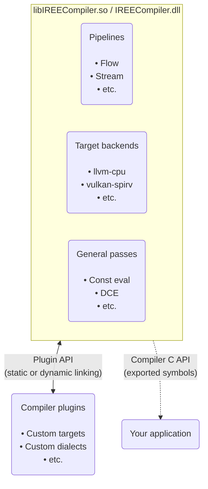
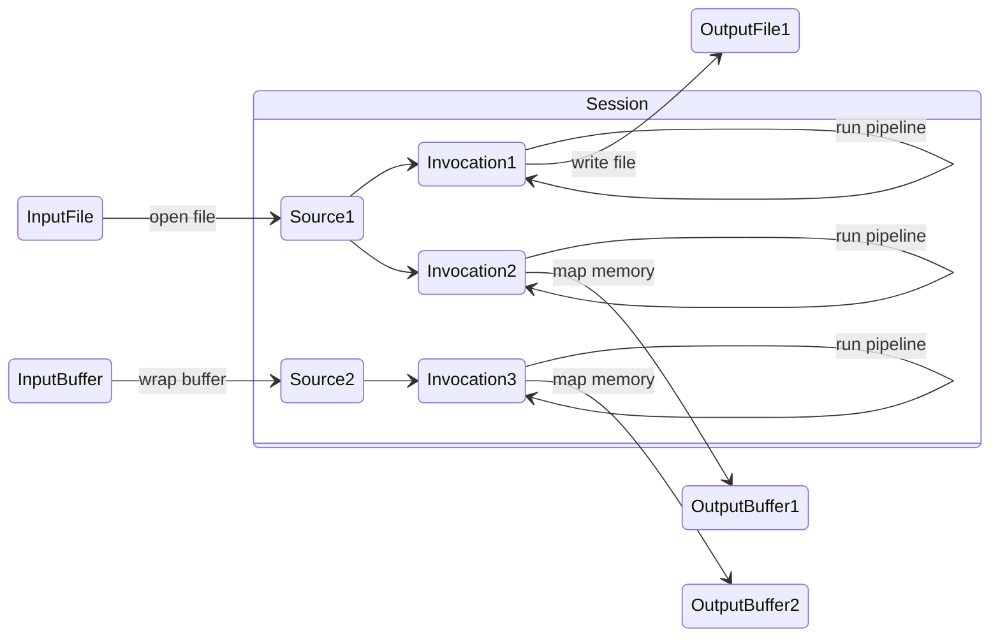

# C API bindings

## Overview

The IREE compiler and IREE runtime both have their own C/C++ APIs for use in
other projects.

!!! note

    There are multiple ways to distribute and depend on C/C++ projects, each
    with varying levels of portability, flexibility, and toolchain
    compatibility. IREE aims to support common configurations and platforms.

## Compiler API

The IREE compiler is structured as a monolithic shared object with a dynamic
plugin system allowing for extensions. The shared object exports symbols for
versioned API functions.



API definitions can be found in the following locations:

| Source location | Overview |
| --------------- | -------- |
[`iree/compiler/embedding_api.h`](https://github.com/openxla/iree/blob/main/compiler/bindings/c/iree/compiler/embedding_api.h) | Top-level IREE compiler embedding API
[`iree/compiler/PluginAPI/` directory](https://github.com/openxla/iree/tree/main/compiler/src/iree/compiler/PluginAPI) | IREE compiler plugin API
[`mlir/include/mlir-c/` directory](https://github.com/llvm/llvm-project/tree/main/mlir/include/mlir-c) | MLIR C API headers

### Concepts

The compiler API is centered around running pipelines to translate inputs to
artifacts. These are modeled via _sessions_, _invocations_, _sources_, and
_outputs_.



#### Sessions

A _session_ represents a scope where one or more invocations can be executed.

* Internally, _sessions_ consist of an `MLIRContext` and a private set of
  _options_.
* _Sessions_ may activate available _plugins_ based on their _options_.

#### Invocations

An _invocation_ represents a discrete run of the compiler.

* _Invocations_ run _pipelines_, consisting of _passes_, to translate from
  _sources_ to _outputs_.

#### Sources

A _source_ represents an input program, including operations and data.

* _Sources_ may refer to files or buffers in memory.

#### Outputs

An _output_ represents a compilation artifact.

* _Outputs_ can be standalone files or more advanced streams.

#### Plugins

A _plugin_ extends the compiler with some combination of target backends,
options, passes, or pipelines.

### Usage

!!! todo - "Under construction, more coming soon"

!!! Tip "Tip - building from source"

    When [building from source](../../building-from-source/getting-started.md),
    some components may be disabled to reduce binary size and improve build
    time. There are also options for using your own LLVM or linking in external
    target backends.

#### Samples

| Project | Source | Description |
| ------- |------- | ----------- |
[openxla-pjrt-plugin](https://github.com/openxla/openxla-pjrt-plugin/) | [`iree_compiler.cc`](https://github.com/openxla/openxla-pjrt-plugin/blob/main/iree/integrations/pjrt/common/iree_compiler.cc) | JIT engine connecting TensorFlow and JAX to IREE

## Runtime API

The IREE runtime is structured as a modular set of library components. Each
component is designed to be linked into applications directly and compiled
with LTO style optimizations.

The low level library components can be used directly or through a higher level
API.

=== "High level API"

    The high level 'runtime' API sits on top of the low level components. It is
    relatively terse but does not expose the full flexibility of the underlying
    systems.

    ```mermaid
    graph TD
      accTitle: IREE runtime high level API diagram
      accDescr {
      The IREE runtime includes 'base', 'HAL', and 'VM' components, each with
      their own types and API methods.
      A high level "runtime API" sits on top of these component APIs.
      Applications can interface indirectly with the IREE runtime via this
      high level runtime API.
      }

      subgraph iree_runtime[IREE Runtime]
        subgraph base
          base_types("Types

          • allocator
          • status
          • etc.")
        end

        subgraph hal[HAL]
          hal_types("Types

          • buffer
          • device
          • etc.")

          hal_drivers("Drivers

          • local-*
          • vulkan
          • etc.")
        end

        subgraph vm[VM]
          vm_types("Types

          • context
          • invocation
          • etc.")
        end

        runtime_api("Runtime API

        • instance
        • session
        • call")

        base_types & hal_types & hal_drivers & vm_types --> runtime_api
      end

      application(Your application)

      runtime_api --> application
    ```

=== "Low level API"

    Each runtime component has its own low level API. The low level APIs are
    typically verbose as they expose the full flexibility of each underlying
    system.

    ```mermaid
    graph TD
      accTitle: IREE runtime low level API diagram
      accDescr {
        The IREE runtime includes 'base', 'HAL', and 'VM' components, each with
        their own types and API methods.
        Applications can interface directly with the IREE runtime via the low
        level component APIs.
      }

      subgraph iree_runtime[IREE Runtime]
        subgraph base
          base_types("Types

          • allocator
          • status
          • etc.")
        end
        subgraph hal[HAL]
          hal_types("Types

          • buffer
          • device
          • etc.")

          hal_drivers("Drivers

          • local-*
          • vulkan
          • etc.")
        end
        subgraph vm[VM]
          vm_types("Types

          • context
          • invocation
          • etc.")
        end
      end

      application(Your application)

      base_types & hal_types & hal_drivers & vm_types --> application
    ```

Runtime API header files are organized by component:

| Component header file | Overview |
| --------------------- | -------- |
[`iree/runtime/api.h`](https://github.com/openxla/iree/blob/main/runtime/src/iree/runtime/api.h) | High level runtime API
[`iree/base/api.h`](https://github.com/openxla/iree/blob/main/runtime/src/iree/base/api.h) | Core API, type definitions, ownership policies, utilities
[`iree/vm/api.h`](https://github.com/openxla/iree/blob/main/runtime/src/iree/vm/api.h) | VM APIs: loading modules, I/O, calling functions
[`iree/hal/api.h`](https://github.com/openxla/iree/blob/main/runtime/src/iree/hal/api.h) | HAL APIs: device management, synchronization, accessing hardware features

### Concepts

<!-- TODO(scotttodd): high level runtime API diagram(s) -->

#### High level - Session

!!! todo - "Under construction, more coming soon"

#### High level - Instance

!!! todo - "Under construction, more coming soon"

#### High level - Call

!!! todo - "Under construction, more coming soon"

#### Low level - VM

<!-- TODO(scotttodd): VM module diagram (bytecode, HAL, custom) -->

By default, IREE uses its own tiny Virtual Machine (VM) at runtime to interpret
program instructions on the host system. VM instructions may also be lowered
further to LLVM IR, C, or other representations for static or resource
constrained deployment.

The VM supports generic operations like loads, stores, arithmetic, function
calls, and control flow. The VM builds streams of more complex program logic and
dense math into HAL command buffers that are dispatched to hardware backends.

* VM _instances_ can serve multiple isolated execution _contexts_
* VM _contexts_ are effectively sandboxes for loading modules and running
  programs
* VM _modules_ provide extra functionality to execution _contexts_, such as
  access to hardware accelerators through the HAL. Compiled user programs are
  also modules.

#### Low level - HAL

<!-- TODO(scotttodd): command buffer construction -> dispatch diagram -->
<!-- TODO(scotttodd): input buffers -> output buffers diagram -->
<!-- TODO(scotttodd): HAL interface diagram -->

* HAL _drivers_ are used to enumerate and create HAL _devices_
* HAL _devices_ interface with hardware, such as by allocating device memory,
  preparing executables, recording and dispatching command buffers, and
  synchronizing with the host
* HAL _buffers_ and _buffer views_ represent storage and shaped/typed views
  into that storage (aka "tensors")

### Usage

!!! todo - "Under construction, more coming soon"

#### Samples

| Source location | Description |
| --------------- | ----------- |
[iree `runtime/demo/`](https://github.com/openxla/iree/blob/main/runtime/src/iree/runtime/demo/) | In-tree demos of the high level runtime API
[iree `samples/`](https://github.com/openxla/iree/tree/main/samples) | In-tree sample applications
[iree-template-runtime-cmake](https://github.com/benvanik/iree-template-runtime-cmake/) | Template repository for runtime applications
[iree-template-cpp](https://github.com/iml130/iree-template-cpp) | Demonstration of integration into a downstream project
[iree-samples `runtime-library/`](https://github.com/iree-org/iree-samples/tree/main/runtime-library) | Shared runtime library builder

## Compiler + Runtime = JIT

The compiler and runtime APIs may be used together to build a "just in time"
(JIT) execution engine. JIT compilation allows for last-minute specialization
with no prior knowledge of target devices and avoids issues with version drift,
but it can also constrain deployment options and usage scenarios.
