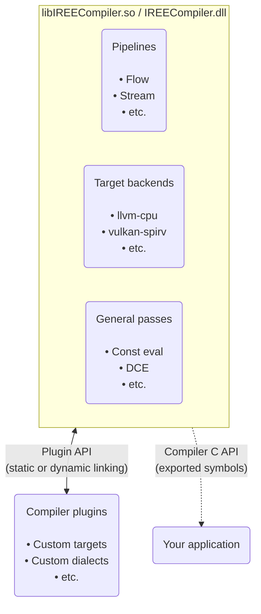
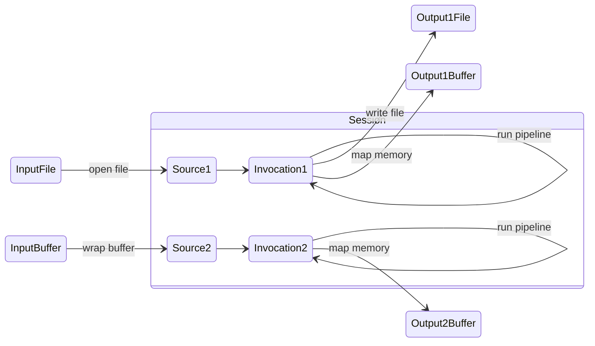
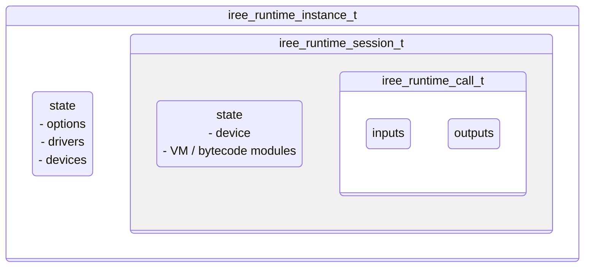

# C API bindings

## Overview

The IREE compiler and IREE runtime both have their own C/C++ APIs. This page
introduces the available APIs and describes how to use them from your
applications.

!!! note

    There are multiple ways to distribute and depend on C/C++ projects, each
    with varying levels of portability, flexibility, and toolchain
    compatibility. IREE aims to support common configurations and platforms.

## Compiler API

The IREE compiler is structured as a monolithic shared object with a dynamic
plugin system allowing for extensions. The shared object exports symbols for
versioned API functions.



API definitions can be found in the following locations:

| Source location | Overview |
| --------------- | -------- |
[`iree/compiler/embedding_api.h`](https://github.com/openxla/iree/blob/main/compiler/bindings/c/iree/compiler/embedding_api.h) | Top-level IREE compiler embedding API
[`iree/compiler/PluginAPI/` directory](https://github.com/openxla/iree/tree/main/compiler/src/iree/compiler/PluginAPI) | IREE compiler plugin API
[`mlir/include/mlir-c/` directory](https://github.com/llvm/llvm-project/tree/main/mlir/include/mlir-c) | MLIR C API headers

### Concepts

The compiler API is centered around running pipelines to translate inputs to
artifacts. These are modeled via _sessions_, _invocations_, _sources_, and
_outputs_.



#### Sessions

A _session_ (`iree_compiler_session_t`) is a scope where one or more invocations
can run.

* Internally, _sessions_ consist of an `MLIRContext` and a private set of
  _options_.
* _Sessions_ may activate available _plugins_ based on their _options_.

#### Invocations

An _invocation_ (`iree_compiler_invocation_t`) is a discrete run of the
compiler.

* _Invocations_ run _pipelines_, consisting of _passes_, to translate from
  _sources_ to _outputs_.

#### Sources

A _source_ (`iree_compiler_source_t`) represents an input program, including
operations and data.

* _Sources_ may refer to files or buffers in memory.

#### Outputs

An _output_ (`iree_compiler_output_t`) represents a compilation artifact.

* _Outputs_ can be standalone files or more advanced streams.

#### Plugins

A _plugin_ extends the compiler with some combination of target backends,
options, passes, or pipelines. For documentation on compiler plugins, see
[`compiler/PluginAPI/README.md`](https://github.com/openxla/iree/blob/main/compiler/src/iree/compiler/PluginAPI/README.md).

### Usage

!!! info ""

    This snippet shows the general layout of the API. For working examples, see
    the [samples below](#samples).

To build a custom tool using the compiler API:

<!-- TODO(scotttodd): snippet that links to a working in-tree sample instead -->

```cmake title="CMakeLists.txt" linenums="1"
set(_IREE_COMPILER_API "${_IREE_COMPILER_ROOT}/bindings/c/iree/compiler")
target_include_directories(${_NAME} SYSTEM PRIVATE ${_IREE_COMPILER_API})
target_link_libraries(${_NAME} iree_compiler_bindings_c_loader)
```

```c title="iree_compiler_demo.c" linenums="1"
#include <iree/compiler/embedding_api.h>
#include <iree/compiler/loader.h>

int main(int argc, char** argv) {
  // Load the compiler library then initialize it.
  ireeCompilerLoadLibrary("libIREECompiler.so");
  ireeCompilerGlobalInitialize();

  // Create a session to track compiler state and set flags.
  iree_compiler_session_t *session = ireeCompilerSessionCreate();
  ireeCompilerSessionSetFlags(session, argc, argv);

  // Open a file as an input source to the compiler.
  iree_compiler_source_t *source = NULL;
  ireeCompilerSourceOpenFile(session, "input.mlir", &source);

  // Use an invocation to compile from the input source to one or more outputs.
  iree_compiler_invocation_t *inv = ireeCompilerInvocationCreate(session);
  ireeCompilerInvocationPipeline(inv, IREE_COMPILER_PIPELINE_STD);

  // Output the compiled artifact to a file.
  iree_compiler_output_t *output = NULL;
  ireeCompilerOutputOpenFile("output.vmfb", &output);
  ireeCompilerInvocationOutputVMBytecode(inv, output);

  // Cleanup state.
  ireeCompilerInvocationDestroy(inv);
  ireeCompilerOutputDestroy(output);
  ireeCompilerSourceDestroy(source);
  ireeCompilerSessionDestroy(session);
  ireeCompilerGlobalShutdown();
}
```

#### Samples

| Project | Source | Description |
| ------- | ------ | ----------- |
[iree-org/iree-template-compiler-cmake](https://github.com/iree-org/iree-template-compiler-cmake/) |[`hello_compiler.c`](https://github.com/iree-org/iree-template-compiler-cmake/blob/main/hello_compiler/hello_compiler.c) | Compiler application template
[openxla/iree](https://github.com/openxla/iree/) | [`integrations/pjrt/.../iree_compiler.cc`](https://github.com/openxla/iree/blob/main/integrations/pjrt/src/iree_pjrt/common/iree_compiler.cc) | JIT for TensorFlow + JAX to IREE
[openxla/iree](https://github.com/openxla/iree/) | [`compiler/plugins`](https://github.com/openxla/iree/tree/main/compiler/plugins) | In-tree supported compiler plugins
[openxla/iree](https://github.com/openxla/iree/) | [`samples/compiler_plugins/`](https://github.com/openxla/iree/tree/main/samples/compiler_plugins) | In-tree sample compiler plugins
[nod-ai/iree-amd-aie](https://github.com/nod-ai/iree-amd-aie/) | [`plugins/.../iree-amd-aie`](https://github.com/nod-ai/iree-amd-aie/tree/main/compiler/plugins/target/AMD-AIE/iree-amd-aie) | Early-phase plugins for interfacing with AMD AIE accelerators

## Runtime API

The IREE runtime is structured as a modular set of library components. Each
component is designed to be linked into applications directly and compiled
with LTO style optimizations.

The low level library components can be used directly or through a higher level
API.

=== "High level API"

    The high level 'runtime' API sits on top of the low level components. It is
    relatively terse but does not expose the full flexibility of the underlying
    systems.

    ```mermaid
    graph TD
      accTitle: IREE runtime high level API diagram
      accDescr {
        The IREE runtime includes 'base', 'HAL', and 'VM' components, each with
        their own types and API methods.
        A high level "runtime API" sits on top of these component APIs.
        Applications can interface indirectly with the IREE runtime via this
        high level runtime API.
      }

      subgraph iree_runtime[IREE Runtime]
        subgraph base
          base_types("Types

          • allocator
          • status
          • etc.")
        end

        subgraph hal[HAL]
          hal_types("Types

          • buffer
          • device
          • etc.")

          hal_drivers("Drivers

          • local-*
          • vulkan
          • etc.")
        end

        subgraph vm[VM]
          vm_types("Types

          • context
          • invocation
          • etc.")
        end

        runtime_api("Runtime API

        • instance
        • session
        • call")

        base_types & hal_types & hal_drivers & vm_types --> runtime_api
      end

      application(Your application)

      runtime_api --> application
    ```

=== "Low level API"

    Each runtime component has its own low level API. The low level APIs are
    typically verbose as they expose the full flexibility of each underlying
    system.

    ```mermaid
    graph TD
      accTitle: IREE runtime low level API diagram
      accDescr {
        The IREE runtime includes 'base', 'HAL', and 'VM' components, each with
        their own types and API methods.
        Applications can interface directly with the IREE runtime via the low
        level component APIs.
      }

      subgraph iree_runtime[IREE Runtime]
        subgraph base
          base_types("Types

          • allocator
          • status
          • etc.")
        end
        subgraph hal[HAL]
          hal_types("Types

          • buffer
          • device
          • etc.")

          hal_drivers("Drivers

          • local-*
          • vulkan
          • etc.")
        end
        subgraph vm[VM]
          vm_types("Types

          • context
          • invocation
          • etc.")
        end
      end

      application(Your application)

      base_types & hal_types & hal_drivers & vm_types --> application
    ```

Runtime API header files are organized by component:

| Component header file | Overview |
| --------------------- | -------- |
[`iree/runtime/api.h`](https://github.com/openxla/iree/blob/main/runtime/src/iree/runtime/api.h) | High level runtime API
[`iree/base/api.h`](https://github.com/openxla/iree/blob/main/runtime/src/iree/base/api.h) | Core API, type definitions, ownership policies, utilities
[`iree/vm/api.h`](https://github.com/openxla/iree/blob/main/runtime/src/iree/vm/api.h) | VM APIs: loading modules, I/O, calling functions
[`iree/hal/api.h`](https://github.com/openxla/iree/blob/main/runtime/src/iree/hal/api.h) | HAL APIs: device management, synchronization, accessing hardware features

### High level concepts

The high level API uses _instances_, _sessions_, and _calls_ to run programs
with a small API surface.



#### Instance

An _instance_ (`iree_runtime_instance_t`) isolates runtime usage and manages
device resources.

* _Instances_ may service multiple sessions to avoid extra device interaction
  and reuse caches/pools.
* Separate _instances_ are isolated/sandboxed from one another.

#### Session

A _session_ (`iree_runtime_session_t`) contains a set of loaded modules and
their state.

* _Sessions_ that share an _instance_ may share resources directly.
* _Sessions_ that do _not_ share an _instance_ can transfer resources using
  import and export APIs.

#### Call

A _call_ (`iree_runtime_call_t`) is a stateful VM function call builder.

* _Calls_ can be reused to avoid having to construct input lists for each
  invocation.

### Low level concepts

#### Base

!!! todo - "Under construction, more coming soon"

#### VM

IREE uses its own Virtual Machine (VM) at runtime to interpret program
instructions on the host system.

??? tip "Tip - EmitC alternate lowering path"
    VM instructions may be further lowered to C source code for static or
    resource constrained deployment.

    See the `--output-format=vm-c` compiler option and the samples in
    [`samples/emitc_modules/`](https://github.com/openxla/iree/tree/main/samples/emitc_modules)
    for more information.

The VM supports generic operations like loads, stores, arithmetic, function
calls, and control flow. The VM builds streams of more complex program logic and
dense math into HAL command buffers that are dispatched to hardware backends.

* VM _instances_ can serve multiple isolated execution _contexts_.
* VM _contexts_ are effectively sandboxes for loading modules and running
  programs.
* VM _modules_ provide all functionality to execution _contexts_, including
  access to hardware accelerators through the HAL. Compiled user programs are
  also modules.

    ```mermaid
    stateDiagram-v2
      accTitle: Sample VM Modules
      accDescr {
        Bytecode modules contain program state, program functions, and debug
        information.
        HAL modules contain devices, executables, HAL functions, and HAL types.
        Custom modules may contain external functions and custom types.
      }

      state "Bytecode module" as bytecode {
        bytecode_contents: Module state<br>Program functions<br>Debug information
      }

      state "HAL module" as HAL {
        hal_contents: Devices<br>Executables<br>HAL functions<br>HAL types
      }

      state "Custom module" as custom {
        custom_contents: External functions<br>Custom types
      }
    ```

#### HAL

<!-- TODO(scotttodd): command buffer construction -> dispatch diagram -->
<!-- TODO(scotttodd): input buffers -> output buffers diagram -->
<!-- TODO(scotttodd): HAL interface diagram -->

IREE uses a Hardware Abstraction Layer (HAL) to model and interact with
hardware devices like CPUs, GPUs and other accelerators.

* HAL _drivers_ are used to enumerate and create HAL _devices_.
* HAL _devices_ interface with hardware, such as by allocating device memory,
  preparing executables, recording and dispatching command buffers, and
  synchronizing with the host.
* HAL _buffers_ represent data storage and _buffer views_ represent views into
  that storage with associated shapes and types (similar to "tensors").

### Usage

!!! info ""

    For other examples, see the [samples below](#samples_1).

=== "hello_world_terse.c"

    Source file: [`runtime/src/iree/runtime/demo/hello_world_terse.c`](https://github.com/openxla/iree/tree/main/runtime/src/iree/runtime/demo/hello_world_terse.c)

    ```c++ title="runtime/src/iree/runtime/demo/hello_world_terse.c" linenums="1"
    --8<-- "runtime/src/iree/runtime/demo/hello_world_terse.c:7"
    ```

=== "hello_world_explained.c"

    Source file: [`runtime/src/iree/runtime/demo/hello_world_explained.c`](https://github.com/openxla/iree/tree/main/runtime/src/iree/runtime/demo/hello_world_explained.c)

    ```c++ title="runtime/src/iree/runtime/demo/hello_world_explained.c" linenums="1"
    --8<-- "runtime/src/iree/runtime/demo/hello_world_explained.c:7"
    ```

#### Samples

| Project | Source | Description |
| ------- |------- | ----------- |
[iree-org/iree-template-runtime-cmake](https://github.com/iree-org/iree-template-runtime-cmake/) | [`hello_world.c`](https://github.com/iree-org/iree-template-runtime-cmake/blob/main/hello_world.c) | Runtime application template
[openxla/iree](https://github.com/openxla/iree/) | [`runtime/demo/`](https://github.com/openxla/iree/blob/main/runtime/src/iree/runtime/demo/) | In-tree demos of the high level runtime API
[openxla/iree](https://github.com/openxla/iree/) | [`samples/`](https://github.com/openxla/iree/tree/main/samples) | In-tree sample applications
[iree-org/iree-samples](https://github.com/iree-org/iree-samples/) | [`runtime-library/`](https://github.com/iree-org/iree-samples/tree/main/runtime-library) | Shared runtime library builder<br>Builds `libireert.so` to aid development
[iml130/iree-template-cpp](https://github.com/iml130/iree-template-cpp) | [`simple_embedding.c`](https://github.com/iml130/iree-template-cpp/blob/main/iree_simple_embedding/simple_embedding.c) | Demo integration into a project

## Compiler + Runtime = JIT

The compiler and runtime APIs may be used together to build a "just in time"
(JIT) execution engine. JIT compilation allows for last-minute specialization
with no prior knowledge of target devices and avoids issues with version drift,
but it can also constrain deployment options and usage scenarios.
