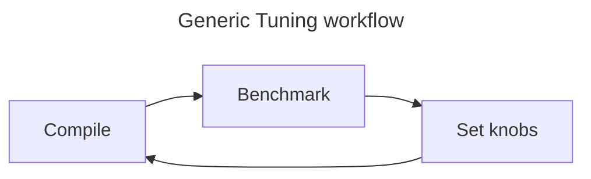
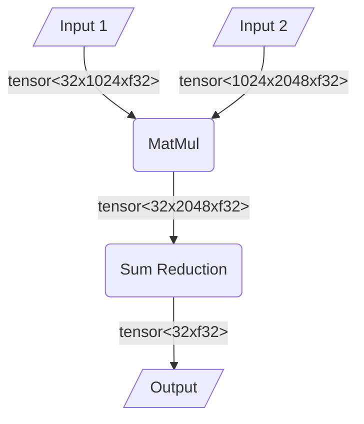
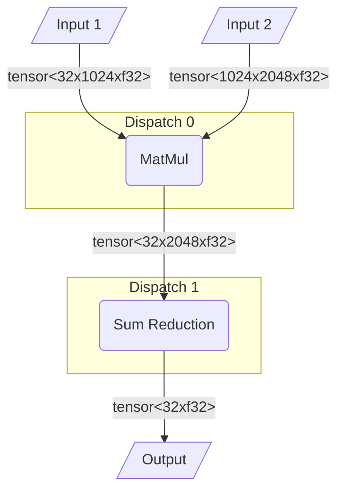

---
hide:
  - tags
tags:
  - performance
icon: octicons/meter-16
status: new
---

# :octicons-meter-16: Tuning

Tuning is an important step in the process of extracting performance from your
hardware. During the compilation of a workload, IREE makes decisions on how to
set certain parameters that define how a workload is run on targeted hardware.
For example, when targeting a GPU, there could be multiple options for thread
count or tile size for a given input graph. By default, these parameters are
chosen in a way that performs well for any generic workload. However, it is
often possible to select values for these parameters that squeeze out extra
performance for a specific workload.

This process of iterating over the space of possible parameter values (knobs)
to enable improvements in some chosen performance metrics is called Tuning.



## :octicons-dependabot-16: SHARK Tuner

### :octicons-book-16: Overview

While tuning can be done manually, the
[SHARK Tuner](https://github.com/nod-ai/shark-ai/tree/main/sharktuner) tool
can automatically search through possible knob values for individual
dispatches to improve overall program performance. Dispatches are blocks of
code that are created as part of IREE's compilation flow by splitting the
input program into blocks that can be executed concurrently and atomically.
For further information on dispatches see the sections below.

!!! info
    For more information about SHARK Tuner, see its source in the
    [shark-ai GitHub repository](https://github.com/nod-ai/shark-ai/tree/main/sharktuner)
    and the [Model Tuner example](https://github.com/nod-ai/shark-ai/tree/main/sharktuner/model_tuner).

In our experience, using the SHARK Tuner can provide **meaningful speedup** of
model execution.

!!! tip
    SHARK Tuner achieved a [~10% improvement](https://rocm.blogs.amd.com/artificial-intelligence/mi325x-accelerates-mlperf-inference/README.html#tuning)
    on the SDXL (Stable Diffusion XL) model with the MI300X GPU.

### :octicons-question-16: What is a dispatch?

To obtain a deeper understanding of what it means to tune dispatches, let's
first build some intuition for what is a dispatch.

!!! info
    Reminder: A dispatch is a block of code that can be executed concurrently
    and atomically, created by splitting the original input graph.

Let's walk through an example.

```mlir
#map = affine_map<(d0, d1) -> (d0, d1)>
#map1 = affine_map<(d0, d1) -> (d0)>
func.func @matmul_reduce_32_1024_2048(%lhs: tensor<32x1024xf16>, %rhs: tensor<1024x2048xf16>) -> tensor<32xf32> {
  %c0_f16 = arith.constant 0.0: f16
  %c1 = arith.constant dense<1.000000e+00> : tensor<32xf16>

  // perform a matmul
  %mm_acc = tensor.empty() : tensor<32x2048xf32>
  %mm_fill = linalg.fill ins(%c0_f16 : f16) outs(%mm_acc :tensor<32x2048xf32>) -> tensor<32x2048xf32>
  %mm = linalg.matmul ins(%lhs, %rhs: tensor<32x1024xf16>, tensor<1024x2048xf16>) outs(%mm_fill: tensor<32x2048xf32>) -> tensor<32x2048xf32>

  // sum over last dimension
  %c0_f32 = arith.constant 0.0: f32
  %red_acc = tensor.empty() : tensor<32xf32>
  %red_fill = linalg.fill ins(%c0_f32 : f32) outs(%red_acc : tensor<32xf32>) -> tensor<32xf32>
  %red = linalg.generic {indexing_maps = [#map, #map1], iterator_types = ["parallel", "reduction"]} ins(%mm : tensor<32x2048xf32>) outs(%red_fill : tensor<32xf32>)  {
  ^bb0(%in: f32, %out: f32):
    %7 = arith.addf %in, %out : f32
    linalg.yield %7 : f32
  } -> tensor<32xf32>
  return %red: tensor<32xf32>
}
```

The above IR performs a MatMul and then a sum over the last dimension.



While compiling this graph with IREE, the flag
`--iree-hal-dump-executable-files-to=<some directory>` can be used to observe
the created dispatches.

```mlir
// RUN: iree-compile --iree-hal-target-device=hip --iree-hip-target=gfx942 \
            --mlir-print-ir-after=iree-codegen-materialize-user-configs \
            --iree-hal-dump-executable-files-to=<some directory>
hal.executable public @matmul_reduce_32_1024_2048_dispatch_0 {
  hal.executable.variant public @rocm_hsaco_fb target(<...>) {
    module {
      func.func @matmul_reduce_32_1024_2048_dispatch_0_matmul_32x2048x1024_f32() {
        %cst = arith.constant 0.000000e+00 : f32
        ...
        %3 = flow.dispatch.tensor.load %0, offsets = [0, 0], sizes = [32, 1024], strides = [1, 1] : !flow.dispatch.tensor<readonly:tensor<32x1024xf16>> -> tensor<32x1024xf16>
        %4 = flow.dispatch.tensor.load %1, offsets = [0, 0], sizes = [1024, 2048], strides = [1, 1] : !flow.dispatch.tensor<readonly:tensor<1024x2048xf16>> -> tensor<1024x2048xf16>
        %5 = tensor.empty() : tensor<32x2048xf32>
        %6 = linalg.fill ins(%cst : f16) outs(%5 : tensor<32x2048xf32>) -> tensor<32x2048xf32>
        %7 = linalg.matmul {lowering_config = #iree_gpu.lowering_config<{mma_kind = #iree_gpu.mma_layout<MFMA_F32_16x16x16_F16>, promote_operands = [0, 1], reduction = [0, 0, 128], subgroup_m_count = 1 : i64, subgroup_n_count = 4 : i64, workgroup = [16, 128, 0]}>} ins(%3, %4 : tensor<32x1024xf16>, tensor<1024x2048xf16>) outs(%6 : tensor<32x2048xf32>) -> tensor<32x2048xf32>
        flow.dispatch.tensor.store %7, %2, offsets = [0, 0], sizes = [32, 2048], strides = [1, 1] : tensor<32x2048xf32> -> !flow.dispatch.tensor<writeonly:tensor<32x2048xf32>>
        return
      }
    }
  }
}
hal.executable public @matmul_reduce_32_1024_2048_dispatch_1 {
  hal.executable.variant public @rocm_hsaco_fb target(<...>) {
    module {
      func.func @matmul_reduce_32_1024_2048_dispatch_1_generic_32x2048_f32() {
        %cst = arith.constant 0.000000e+00 : f32
        ...
        %2 = flow.dispatch.tensor.load %0, offsets = [0, 0], sizes = [32, 2048], strides = [1, 1] : !flow.dispatch.tensor<readonly:tensor<32x2048xf32>> -> tensor<32x2048xf32>
        %3 = tensor.empty() : tensor<32xf32>
        %4 = linalg.fill ins(%cst : f32) outs(%3 : tensor<32xf32>) -> tensor<32xf32>
        %5 = linalg.generic {indexing_maps = [affine_map<(d0, d1) -> (d0, d1)>, affine_map<(d0, d1) -> (d0)>], iterator_types = ["parallel", "reduction"]} ins(%2 : tensor<32x2048xf32>) outs(%4 : tensor<32xf32>) {
        ^bb0(%in: f32, %out: f32):
          %6 = arith.addf %in, %out : f32
          linalg.yield %6 : f32
        } -> tensor<32xf32>
        flow.dispatch.tensor.store %5, %1, offsets = [0], sizes = [32], strides = [1] : tensor<32xf32> -> !flow.dispatch.tensor<writeonly:tensor<32xf32>>
        return
      }
    }
  }
}
```

Illustrated graphically, the following dispatches were created.



In the above example, each `hal.executable` represents a dispatch.
To briefly explain how these dispatches came to be, when creating dispatches we
first identify "root" operations. These are often operations that perform some
kind of reduction. In our example, there are two such root ops, the MatMul and
the sum reduction. Then for each root op, we find surrounding operations that
could be merged into the same dispatch (not applicable in our example). Then
each of these groups of ops with a single root are split off into individual
functions, creating dispatches. There are many nuances such as how operations
are chosen for a particular dispatch that are beyond the scope of this document
but hopefully this provides a useful starting point to understand how a graph
is broken down into dispatches.

### :octicons-gear-16: Knobs in Dispatches

Depending on the hardware being targeted, a dispatch will expose different
knobs. Focusing on GPUs, some common knobs are subgroup tile sizes or workgroup
thread count. For a given input graph, the knobs associated with a particular
dispatch can be seen by adding the following flags when compiling.

* `--iree-hal-dump-executable-benchmarks-to=<directory>`
* `--iree-config-add-tuner-attributes`

These will dump standalone hal.executable benchmarks for each dispatch. Within
these benchmark files we can find an attribute associated to the root op of the
dispatch which shows some tunable attributes.

Shown below is the aforementioned attribute for the MatMul dispatch from our
earlier example.

```mlir
linalg.matmul {lowering_config = #iree_gpu.lowering_config<{
    mma_kind = #iree_gpu.mma_layout<MFMA_F32_16x16x16_F16>,
    promote_operands = [0, 1],
    reduction = [0, 0, 128],
    subgroup_m_count = 1 : i64,
    subgroup_n_count = 4 : i64,
    workgroup = [16, 128, 0]}>,
    root_op
} ins(%3, %4 : tensor<32x1024xf16>, tensor<1024x2048xf16>)
  outs(%6 : tensor<32x2048xf32>) -> tensor<32x2048xf32>
```

Specifically, observe the `lowering_config` attribute which lists some tunable
parameters such as the choice of MMA Layout or the subgroup counts along
various dimensions. These parameters affect model execution on hardware in
various ways such as by influencing memory locality, bank conflicts, etc.

### :octicons-tools-16: Setting knobs and tuning specs

Changing / setting the values of knobs can be done in many ways. One way is to
use the flags below to dump the IR after these knobs have been set, manually
edit the values, and then resume compilation.

* `--compile-to=executable-configurations`
* `--compile-from=executable-configurations`

But a more elegant solution is to use the
[transform dialect](https://mlir.llvm.org/docs/Dialects/Transform/) in mlir.
This dialect provides ops that can be added to the IR that allow the
transformation of the IR during compilation. For more information, see this
[overview](https://mlir.llvm.org/docs/Dialects/Transform/#overview) of the
Transform dialect. For the purposes of tuning, we use the Transform dialect to
create mlir files, which we call "specs", that describe how dispatches and
their relevant knobs should be changed.

#### Usage in IREE

The use of tuning specs in `iree-compile` is controlled with the following
flags:

* `--iree-codegen-enable-default-tuning-specs` -- enables or disables the
  default tuning specs shipped with the compiler.
* `--iree-codegen-tuning-spec-path` -- loads a user-specified tuning spec.
* `--iree-codegen-dump-tuning-specs-to` -- dumps final tuning specs to a
  directory or standard output.

Note that both default and user-provided specs can be enabled at the same time.
The compiler will link them together and invoke the user-provided spec before
attempting the default one.

### :octicons-search-16: Anatomy of a tuning spec

#### Example

This is an example of a tuning spec that may be applied to the MatMul dispatch
in our earlier example.

```mlir
module attributes {iree_codegen.tuning_spec_with_default_entrypoint, transform.with_named_sequence} {
  transform.named_sequence @apply_op_config(%arg0: !transform.any_op {transform.readonly}, %arg1: !transform.any_param {transform.readonly}) {
    transform.annotate %arg0 "compilation_info" = %arg1 : !transform.any_op, !transform.any_param
    transform.yield
  }
  transform.named_sequence @match_matmul_reduce_32_1024_2048_dispatch_0_matmul_32x2048x1024_f16xf16xf32(%arg0: !transform.any_op {transform.readonly}) -> (!transform.any_op, !transform.any_param) {
    %inputs, %outputs = transform.iree.match.cast_compatible_dag_from_root %arg0 {
    ^bb0(%arg1: tensor<32x1024xf16>, %arg2: tensor<1024x2048xf16>, %arg3: tensor<32x2048xf32>):
      %1 = linalg.matmul ins(%arg1, %arg2 : tensor<32x1024xf16>, tensor<1024x2048xf16>) outs(%arg3 : tensor<32x2048xf32>) -> tensor<32x2048xf32>
    } : (!transform.any_op) -> (!transform.any_value, !transform.any_value)
    %0 = transform.param.constant #iree_codegen.compilation_info<lowering_config = #iree_gpu.lowering_config<{mma_kind = #iree_gpu.mma_layout<MFMA_F32_16x16x16_F16>, promote_operands = [0, 1], reduction = [0, 0, 128], subgroup_m_count = 2 : i64, subgroup_n_count = 2 : i64, workgroup = [32, 128, 0]}>, translation_info = <pipeline = LLVMGPUVectorDistribute workgroup_size = [128, 2, 1] subgroup_size = 64, {gpu_pipeline_options = #iree_gpu.pipeline_options<prefetch_shared_memory = true>, llvm_func_attrs = {"amdgpu-waves-per-eu" = "2"}}>> -> !transform.any_param
    transform.yield %arg0, %0 : !transform.any_op, !transform.any_param
  }
  transform.named_sequence @__kernel_config(%arg0: !transform.any_op {transform.consumed}) -> !transform.any_op attributes {iree_codegen.tuning_spec_entrypoint} {
    %updated_root = transform.foreach_match in %arg0
        @match_matmul_reduce_32_1024_2048_dispatch_0_matmul_32x2048x1024_f16xf16xf32 -> @apply_op_config : (!transform.any_op) -> !transform.any_op
    transform.yield %updated_root : !transform.any_op
  }
}
```

#### Explanation

Tuning specs are
[transform dialect](https://mlir.llvm.org/docs/Dialects/Transform/) libraries
that conform to the following format:

* All tuning spec entry points (named sequence ops) are marked with the
  `iree_codegen.tuning_spec_entrypoint` attribute. They have a single argument
  of type `!transform.any_op` and return a single value of type
  `!transform.any_op`.
* All entry points in the final tuning specs must either read
  (`transform.readonly`) or consume (`transform.consumed`) the argument.
* The `iree_codegen.tuning_spec_with_default_entrypoint` attribute ensures that
  the tuning spec includes a named sequence op with name `__kernel_config`,
  which must contain exactly one `foreach_match` op. That `foreach_match` op
  must have exactly one argument and one result of type any_op.

The tuning spec above attempts to match `linalg.matmul` ops that correspond to
the shape `32x1024x2048` and `f16` operand element types and `f32` result
element type.

If the match succeeds, the tuning spec applies the `compilation_info` attribute
that will drive the code generation. This attribute is considered a compiler
implementation detail; in general, each codegen pipeline has its own
requirements as to what is considered a valid compilation info and how to
interpret it.

Tuning specs get executed by the 'Materialize User Configs` pass.
