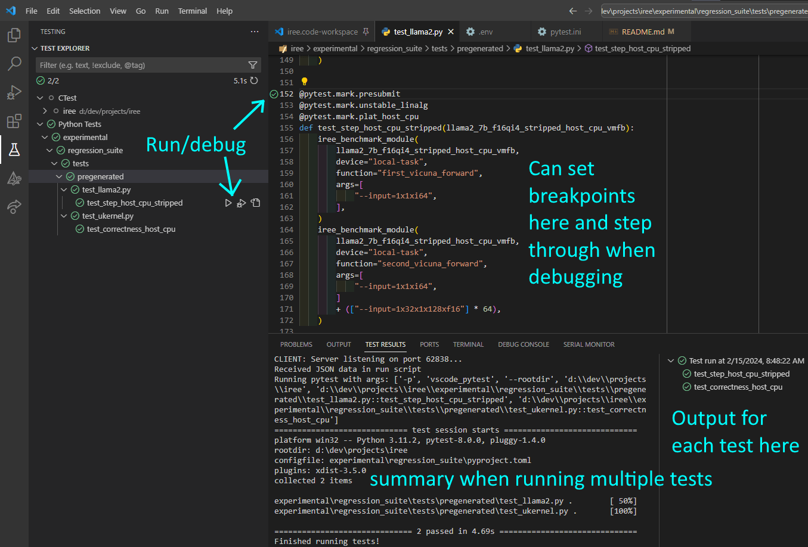
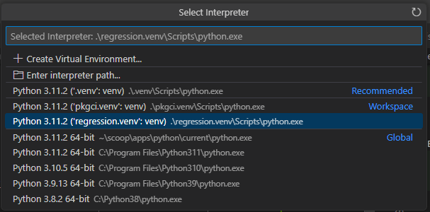

# IREE regression testing suite

This project defines tooling and tests comprising IREE's model regression
testing suite. It aims operate at the compiler-input level and choreographs
the normal tool flows of `iree-compile`, `iree-run-module`,
`iree-benchmark-module`, etc.

## Quick Start

If you have IREE tools on your path or have a virtual environment setup:

```
pip install -e experimental/regression_suite
PATH=../iree-build/tools:$PATH \
pytest experimental/regression_suite
```

Useful options:

* `-s`: Stream all test output.
* `-m MARKEXPR`: Select subsets of the test suite.

Common marker selections:

* `-m "plat_host_cpu and presubmit"`: Run the host-CPU tests configured for
  presubmit on the CI.
* `-m "plat_rdna3_vulkan and presubmit"`: Run the host-CPU tests configured for
  presubmit on the CI.

You can display all markers with `pytest experimental/regression_suite --markers`

## Setting up a venv

NOTE: For this to work, you must previously have installed GitHub command line
tools and authenticated (`gh auth`). See https://cli.github.com/.

The test suite doesn't care how you get tools on your path, but a common
case is to run the regression suite from built compilers and tools from a
GitHub presubmit or postsubmit run. This can be done in one step by setting
up a venv:

```
deactivate  # If have any venv active.
python ./build_tools/pkgci/setup_venv.py \
  /tmp/iree_gh_venv \
  --fetch-gh-workflow=<<RUN_ID>> \
  [--compiler-variant=asserts] [--runtime-variant=asserts]
source /tmp/iree_gh_venv/bin/activate
```

In the above, `<<RUN_ID>>` is the value in any GitHub action presubmit/postsubmit
workflow which has built package artifacts. As an example, if looking at a GitHub
Actions status page on:
`https://github.com/openxla/iree/actions/runs/5957351746/job/16159877442`, then
the run id is the first number in the URL (5957351746).

Running the above will allow you to run `pytest` and you will have tools as built
at the commit from which the workflow run originated.

## Developing using Visual Studio Code

You can also run and debug this test suite using
[Visual Studio Code](https://code.visualstudio.com/):



Setup instructions:

1. Install these extensions:
    * [Python](https://marketplace.visualstudio.com/items?itemName=ms-python.python)
    * [Test Explorer UI](https://marketplace.visualstudio.com/items?itemName=hbenl.vscode-test-explorer)
2. Select your Python virtual environment

    * Follow the general instructions above (create the env)
    * From the command palette in VSCode, select `Python: Select Interpreter`
      and pick the venv you already configured:

      

3. Choose a
  [settings file](https://code.visualstudio.com/docs/getstarted/settings) or a
  [workspace](https://code.visualstudio.com/docs/editor/workspaces) file and
  add some settings:

    ```jsonc
    // CMake and CTest settings.
    "cmake.buildDirectory": "${workspaceFolder}/../iree-build",
    "cmake.configureArgs": [
      "-DIREE_BUILD_PYTHON_BINDINGS=ON",
      "-DPython3_EXECUTABLE=C:\\Program Files\\Python311\\python.exe",
    ],
    "cmakeExplorer.buildDir": "../iree-build",
    "cmakeExplorer.suiteDelimiter": "/",
    "cmakeExplorer.extraCtestRunArgs": "--verbose",

    // Command Palette 'Python: Configure Tests' also sets these:
    //   "Choose a test framework/tool to enable" --> pytest
    //   "Select the directory containing the tests" --> experimental
    "python.testing.unittestEnabled": false,
    "python.testing.pytestEnabled": true,
    "python.testing.pytestArgs": [
      "experimental"
    ],
    // Useful settings for working with Python venvs:
    "python.terminal.activateEnvironment": true,
    "python.terminal.activateEnvInCurrentTerminal": true,
    "python.defaultInterpreterPath": "${workspaceFolder}/regression.venv/Scripts/python.exe",

    // Create this file - see below.
    "python.envFile": "${workspaceFolder}/regression_tests.env",
    ```
4. Select which environment you want to test - a _build_ or a _release_. Both
  can be configured from a .env file. The CMake build writes one to your
  source directory with contents like this:

    ```
    PYTHONPATH=build\compiler\bindings\python;build\runtime\bindings\python
    ```

    Add the system path environment variable with your desired tools location,

    ```
    PATH=D:\dev\projects\iree\regression.venv\Scripts
    <!-- OR -->
    PATH=D:\dev\projects\iree-build\tools
    ```

    You can also use the `PYTHONPATH` from your venv.

5. Configure which tests you want to run. This can be configured from a
  `pytest.ini` file in the repository root, or possibly by passing a file
  with `--config-file` to the `python.testing.pytestArgs` setting.

    ```ini
    # pytest.ini (Note: ignore with .git/info/exclude)
    [pytest]
    addopts = -m "plat_host_cpu and presubmit"
    ```

Note: the 'test' and 'debug' modes in VSCode with pytest may use different
sources for scripts and tools - check those settings carefully!
