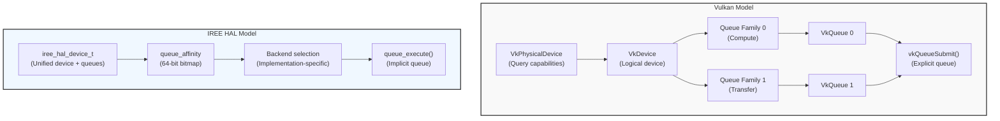
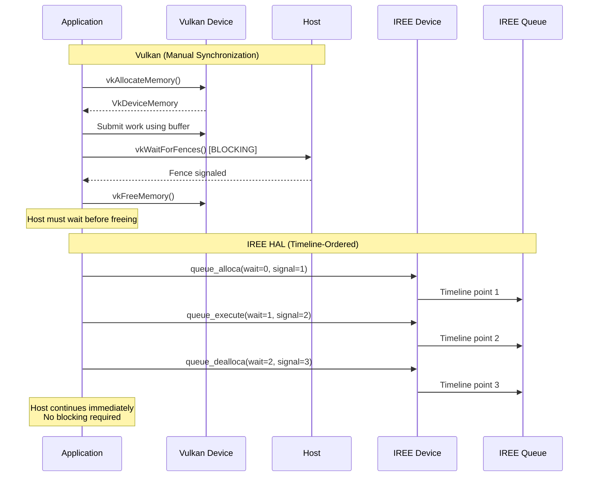
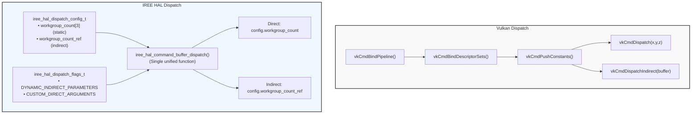
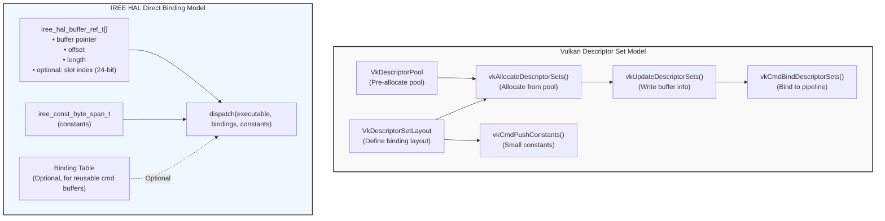

# IREE HAL vs Vulkan Compute API: Technical Comparison

## Executive Summary

The IREE Hardware Abstraction Layer (HAL) is a Vulkan-inspired asynchronous execution API designed for machine learning workload execution across diverse hardware backends. The core architectural patterns follow Vulkan's explicit, low-level control philosophy, while introducing features oriented toward compiler-generated workloads, including queue-ordered asynchronous memory management, direct queue operations, and support for collective operations.

This document provides a technical comparison between IREE HAL's compute-oriented API surface and Vulkan's compute capabilities, focusing exclusively on general-purpose GPU computing features.

---

## 1. Device Abstraction

### Vulkan Model

Vulkan separates physical and logical device concepts:

- **`VkPhysicalDevice`**: Represents physical GPU hardware; used for capability queries
- **`VkDevice`**: Logical device handle providing resource creation and management
- **`VkQueue`**: Explicit queue objects obtained from the device for command submission
- **Queue Families**: Queues grouped by capability (graphics, compute, transfer); applications must query queue family properties and create queues explicitly

Queue selection requires explicit enumeration:
```c
vkGetPhysicalDeviceQueueFamilyProperties(physicalDevice, &count, properties);
// Select queue family with VK_QUEUE_COMPUTE_BIT
vkCreateDevice(...);
vkGetDeviceQueue(device, queueFamilyIndex, queueIndex, &queue);
vkQueueSubmit(queue, submitCount, pSubmits, fence);
```

### IREE HAL Model

IREE HAL consolidates device and queue management into a unified abstraction:

- **`iree_hal_device_t`**: Central orchestrator combining device and queue functionality
- **No explicit queue objects**: Queue selection occurs through affinity bitmaps
- **Queue affinity system**: 64-bit bitmap (`iree_hal_queue_affinity_t`) enables NUMA-aware targeting

Queue selection is implicit and dynamic:
```c
iree_hal_device_queue_execute(
  device,
  queue_affinity,        // Bitmap specifying queue preferences; backend selects queue
  wait_semaphore_list,
  signal_semaphore_list,
  command_buffer,
  binding_table,
  flags
);
```

**Key Location**: `runtime/src/iree/hal/device.h`

### Visual Comparison



### Comparison

| Aspect | Vulkan | IREE HAL |
|--------|--------|----------|
| Device abstraction | Physical + Logical devices | Single device handle |
| Queue objects | Explicit `VkQueue` handles | Implicit, selected via affinity bitmap |
| Queue selection | Manual enumeration and retrieval | Backend-determined via affinity bitmap |
| NUMA awareness | Application-managed | Built-in via queue affinity |
| Multi-queue submission | Requires multiple `vkQueueSubmit` calls | Single submission with affinity bitmap |

**Design Rationale**: IREE HAL's affinity-based model abstracts queue management, providing NUMA-aware scheduling through affinity bitmaps and bitwise operations.

---

## 2. Memory Management

### 2.1 Allocation Model

#### Vulkan Approach

Vulkan requires explicit, separate allocation and binding:

1. Query memory requirements: `vkGetBufferMemoryRequirements()`
2. Select memory type from `VkPhysicalDeviceMemoryProperties`
3. Allocate memory: `vkAllocateMemory()`
4. Bind memory to buffer: `vkBindBufferMemory()`

Memory types are characterized by property flags:
```c
VK_MEMORY_PROPERTY_DEVICE_LOCAL_BIT      // GPU-local (fastest)
VK_MEMORY_PROPERTY_HOST_VISIBLE_BIT       // CPU-mappable
VK_MEMORY_PROPERTY_HOST_COHERENT_BIT      // No manual cache control
VK_MEMORY_PROPERTY_HOST_CACHED_BIT        // CPU-cached reads
```

**Lifetime Management**: Applications must explicitly track when buffers are no longer in use before calling `vkFreeMemory()`. No native support for asynchronous deallocation.

#### IREE HAL Approach

IREE HAL provides unified buffer allocation with automatic memory binding:

```c
iree_hal_allocator_allocate_buffer(
  allocator,
  params,    // Memory type, usage, access, queue affinity, alignment
  size,
  &buffer
);
```

Memory types use similar but simplified semantics:
```c
IREE_HAL_MEMORY_TYPE_OPTIMAL           // Allocator chooses best
IREE_HAL_MEMORY_TYPE_HOST_LOCAL        // Host-visible + coherent
IREE_HAL_MEMORY_TYPE_DEVICE_LOCAL      // Device-optimal
IREE_HAL_MEMORY_TYPE_HOST_CACHED       // Cached host memory
```

**Key Location**: `runtime/src/iree/hal/buffer.h`, `runtime/src/iree/hal/allocator.h`

### 2.2 Asynchronous Memory Management

#### Vulkan Approach

Vulkan provides no native mechanism for asynchronous allocation or deallocation:

- `vkAllocateMemory()` and `vkFreeMemory()` are synchronous host operations
- Applications must manually synchronize with GPU timeline before freeing memory
- Common pattern: maintain per-frame deletion queues, defer freeing until fence signaled
- This requires host-side blocking or explicit lifetime tracking

#### IREE HAL Approach

IREE HAL provides timeline-ordered allocation and deallocation as API primitives:

```c
// Allocate transient device memory on timeline
iree_hal_device_queue_alloca(
  device,
  queue_affinity,
  wait_semaphore_list,      // Wait until these reach specified values
  signal_semaphore_list,    // Signal when allocation complete
  pool,                     // Memory pool
  params,
  size,
  &buffer
);

// Deallocate on timeline (no host synchronization needed)
iree_hal_device_queue_dealloca(
  device,
  queue_affinity,
  wait_semaphore_list,      // Wait until buffer no longer in use
  signal_semaphore_list,    // Signal when deallocation complete
  buffer
);
```

**Preserve/Discard Tracking**: Additional lifetime control for buffers with multiple owners:
```c
iree_hal_buffer_allocation_preserve(buffer);  // Add co-owner
iree_hal_buffer_allocation_discard(buffer);   // Remove co-owner, last enables async dealloca
```

**Use Case Example**:
```c
// Compiler-generated code with zero host synchronization:
queue_alloca(wait=0, signal=1) -> scratch_buffer
queue_execute(wait=1, signal=2, dispatch_A using scratch_buffer)
queue_execute(wait=2, signal=3, dispatch_B using scratch_buffer)
queue_dealloca(wait=3, signal=4, scratch_buffer)
// Host continues without synchronization
```

**Key Location**: `runtime/src/iree/hal/device.h`

### Visual Comparison: Async Memory Management Timeline



### 2.3 Buffer Metadata and Capabilities

#### Vulkan Buffer Model

```c
VkBufferCreateInfo {
  size,
  usage,                // VK_BUFFER_USAGE_STORAGE_BUFFER_BIT, etc.
  sharingMode,          // EXCLUSIVE or CONCURRENT
  queueFamilyIndexCount,
  pQueueFamilyIndices   // For concurrent sharing
}
```

Buffer usage flags:
- `VK_BUFFER_USAGE_TRANSFER_SRC/DST_BIT`
- `VK_BUFFER_USAGE_UNIFORM_BUFFER_BIT` (UBO)
- `VK_BUFFER_USAGE_STORAGE_BUFFER_BIT` (SSBO)
- `VK_BUFFER_USAGE_INDIRECT_BUFFER_BIT`
- `VK_BUFFER_USAGE_SHADER_DEVICE_ADDRESS_BIT` (Vulkan 1.2+)

#### IREE HAL Buffer Model

```c
iree_hal_buffer_params_t {
  usage,              // Fine-grained transfer/dispatch/sharing/mapping flags
  access,             // Read/write permissions
  type,               // Memory type hints
  queue_affinity,     // NUMA placement hints
  min_alignment       // Alignment requirements
}
```

**Extended Usage Flags**:
- Transfer: `IREE_HAL_BUFFER_USAGE_TRANSFER_SOURCE/TARGET`
- Dispatch: `DISPATCH_STORAGE/UNIFORM/IMAGE/INDIRECT_PARAMETERS`
- Sharing: `SHARING_EXPORT/REPLICATE/CONCURRENT/IMMUTABLE`
- Mapping: `MAPPING_SCOPED/PERSISTENT/ACCESS_RANDOM`

**Advanced Features**:

1. **Placement Tracking**: `iree_hal_buffer_placement_t` records origin device, queue affinity, allocation flags
2. **Subspan Support**: `iree_hal_buffer_subspan()` creates zero-copy views; reference chain tracks root allocation
3. **External Interop**: Import/export host allocations, device allocations (CUDA `CUdeviceptr`, Vulkan `VkDeviceMemory`), POSIX FD handles (DMA-BUF), Win32 handles

**Key Location**: `runtime/src/iree/hal/buffer.h`

### Comparison Summary

| Aspect | Vulkan | IREE HAL |
|--------|--------|----------|
| Allocation model | Separate allocate + bind | Unified allocation |
| Async allocation | Not supported | `queue_alloca()` timeline-ordered |
| Async deallocation | Manual synchronization required | `queue_dealloca()` timeline-ordered |
| Lifetime tracking | Application-managed | Preserve/discard counting |
| Queue affinity | Sharing mode with queue families | Affinity bitmap with placement tracking |
| Subspan views | Not supported | First-class feature |

---

## 3. Synchronization Primitives

### 3.1 Timeline Semaphores

#### Vulkan Timeline Semaphores (Vulkan 1.2+)

```c
VkSemaphoreTypeCreateInfo {
  semaphoreType = VK_SEMAPHORE_TYPE_TIMELINE,
  initialValue = 0
}
```

Operations:
- **Device wait/signal**: Via `VkSemaphoreSubmitInfo` in queue submission
- **Host wait**: `vkWaitSemaphores(device, &waitInfo, timeout)`
- **Host signal**: `vkSignalSemaphore(device, &signalInfo)`

Timeline semantics:
- 64-bit monotonically increasing payload
- Signal to value N means all operations dN-1 complete
- Multiple waits on same value supported
- Can wait before signal (deferred wait)

#### IREE HAL Timeline Semaphores

```c
iree_hal_semaphore_t
```

Operations:
- **Device wait/signal**: Via semaphore lists in queue submission
- **Host wait**: `iree_hal_device_wait_semaphores()` with wait mode (ALL/ANY)
- **Host signal**: `iree_hal_semaphore_signal()`

**Additional Features**:

1. **Failure Propagation**:
   ```c
   iree_hal_semaphore_fail(semaphore, status);  // Permanent failure state
   // Payloads >= IREE_HAL_SEMAPHORE_FAILURE_VALUE indicate failure
   // Bit 63 set → encodes iree_status_t
   ```

2. **Cross-Device Compatibility Queries**:
   ```c
   iree_hal_semaphore_compatibility_t compat =
     iree_hal_semaphore_query_compatibility(...);
   // Returns: HOST_WAIT, HOST_SIGNAL, DEVICE_WAIT, DEVICE_SIGNAL support
   ```

3. **Timepoint Export**:
   ```c
   iree_hal_semaphore_export_timepoint(
     semaphore,
     value,
     &exported_timepoint  // Platform event, CUDA event, HIP event, etc.
   );
   ```
   Provides interop with other APIs without full semaphore sharing.

**Key Location**: `runtime/src/iree/hal/semaphore.h`

### 3.2 Fences

#### Vulkan Fences

```c
VkFenceCreateInfo {
  flags = VK_FENCE_CREATE_SIGNALED_BIT  // Optional: create pre-signaled
}
```

Operations:
- `vkWaitForFences(device, fenceCount, pFences, waitAll, timeout)`
- `vkResetFences(device, fenceCount, pFences)`
- CPU-GPU synchronization only

#### IREE HAL Fences

```c
iree_hal_fence_t
```

**Higher-Level Abstraction**: Wraps semaphore lists with automatic deduplication

Operations:
- `iree_hal_fence_join(fence_count, fences, &joined_fence)` - Merge multiple fences (wait-all)
- Lightweight structure with embedded semaphore array
- Automatically deduplicates semaphores using max-value semantics

**Key Location**: `runtime/src/iree/hal/fence.h`

### 3.3 Events

Both APIs provide **command buffer-local synchronization** with nearly identical semantics:

| Vulkan | IREE HAL |
|--------|----------|
| `vkCmdSetEvent()` | `iree_hal_command_buffer_signal_event()` |
| `vkCmdResetEvent()` | `iree_hal_command_buffer_reset_event()` |
| `vkCmdWaitEvents()` | `iree_hal_command_buffer_wait_events()` |

**Scope**: Events cannot cross command buffers or queues in either API.

**Key Location**: `runtime/src/iree/hal/event.h`

### 3.4 Memory Barriers

#### Vulkan Memory Barriers

```c
VkBufferMemoryBarrier {
  srcAccessMask,          // Source access types (READ/WRITE flags)
  dstAccessMask,          // Destination access types
  srcQueueFamilyIndex,    // For queue family ownership transfer
  dstQueueFamilyIndex,
  buffer,
  offset,
  size
}

vkCmdPipelineBarrier(
  commandBuffer,
  srcStageMask,           // Source pipeline stages
  dstStageMask,           // Destination pipeline stages
  dependencyFlags,
  memoryBarrierCount,
  pMemoryBarriers,
  bufferMemoryBarrierCount,
  pBufferMemoryBarriers,
  imageMemoryBarrierCount,
  pImageMemoryBarriers
);
```

**Enhanced Synchronization (Vulkan 1.3)**:
- `VkBufferMemoryBarrier2` with per-barrier stage masks
- `vkCmdPipelineBarrier2()` for more flexible barrier specification

#### IREE HAL Execution Barriers

```c
iree_hal_memory_barrier_t {
  srcAccessScope,         // Combined stage + access
  dstAccessScope
}

iree_hal_buffer_barrier_t {
  srcAccessScope,
  dstAccessScope,
  buffer,
  offset,
  length
}

iree_hal_command_buffer_execution_barrier(
  command_buffer,
  srcStageMask,
  dstStageMask,
  flags,
  memoryBarrierCount,
  pMemoryBarriers,
  bufferBarrierCount,
  pBufferBarriers
);
```

**Execution Stages**: Fine-grained stages similar to Vulkan:
```c
IREE_HAL_EXECUTION_STAGE_COMMAND_ISSUE
IREE_HAL_EXECUTION_STAGE_COMMAND_PROCESS
IREE_HAL_EXECUTION_STAGE_DISPATCH
IREE_HAL_EXECUTION_STAGE_TRANSFER
IREE_HAL_EXECUTION_STAGE_COMMAND_RETIRE
IREE_HAL_EXECUTION_STAGE_HOST
```

**Access Scopes**: Combined memory and synchronization scope
```c
IREE_HAL_ACCESS_SCOPE_DISPATCH_READ
IREE_HAL_ACCESS_SCOPE_DISPATCH_WRITE
IREE_HAL_ACCESS_SCOPE_TRANSFER_READ
IREE_HAL_ACCESS_SCOPE_TRANSFER_WRITE
IREE_HAL_ACCESS_SCOPE_HOST_READ
IREE_HAL_ACCESS_SCOPE_HOST_WRITE
```

**Key Location**: `runtime/src/iree/hal/command_buffer.h`

### Comparison Summary

| Aspect | Vulkan | IREE HAL |
|--------|--------|----------|
| Timeline semaphores | Vulkan 1.2+ | First-class since inception |
| Failure propagation | Not supported | Built-in with status encoding |
| Timepoint export | Not supported | Export to CUDA/HIP events, platform primitives |
| Fence join operation | Not supported | `iree_hal_fence_join()` |
| Semaphore deduplication | Manual | Automatic in fences |

---

## 4. Command Execution

### 4.1 Command Buffer Model

#### Vulkan Command Buffer Hierarchy

```c
// Command pool per queue family
VkCommandPoolCreateInfo {
  queueFamilyIndex,
  flags  // TRANSIENT, RESET_COMMAND_BUFFER
}

// Allocate command buffers from pool
VkCommandBufferAllocateInfo {
  commandPool,
  level,                // PRIMARY or SECONDARY
  commandBufferCount
}

// Recording
vkBeginCommandBuffer(commandBuffer, &beginInfo);
// ... record commands ...
vkEndCommandBuffer(commandBuffer);
```

**Secondary Command Buffers**: Can be executed by primary buffers via `vkCmdExecuteCommands()`.

#### IREE HAL Command Buffer Model

```c
iree_hal_command_buffer_t

// Recording
iree_hal_command_buffer_begin(command_buffer);
// ... record commands ...
iree_hal_command_buffer_end(command_buffer);
```

**Command Categories**:
```c
IREE_HAL_COMMAND_CATEGORY_TRANSFER   // DMA operations
IREE_HAL_COMMAND_CATEGORY_DISPATCH   // Compute kernels
IREE_HAL_COMMAND_CATEGORY_ANY        // Mixed workloads
```

**Execution Modes**:
- `ONE_SHOT`: Single submission, allows in-place patching
- `ALLOW_INLINE_EXECUTION`: Hints immediate execution
- `UNVALIDATED`: Skip validation (replay scenarios)
- `UNRETAINED`: Caller manages resource lifetimes (unsafe)

**Key Location**: `runtime/src/iree/hal/command_buffer.h`

### 4.2 Transfer Operations

#### Vulkan Transfer Commands

```c
vkCmdCopyBuffer(commandBuffer, srcBuffer, dstBuffer, regionCount, pRegions);
vkCmdFillBuffer(commandBuffer, dstBuffer, dstOffset, size, data);  // 32-bit pattern
vkCmdUpdateBuffer(commandBuffer, dstBuffer, dstOffset, dataSize, pData);  // Max 64KB
```

#### IREE HAL Transfer Commands

```c
iree_hal_command_buffer_fill_buffer(command_buffer, buffer, offset, length, pattern, pattern_length);
iree_hal_command_buffer_update_buffer(command_buffer, buffer, offset, data, length);
iree_hal_command_buffer_copy_buffer(command_buffer, src_buffer, src_offset, dst_buffer, dst_offset, length);
```

**Pattern Filling**: Supports 1/2/4-byte patterns (not just 32-bit).

### 4.3 Compute Dispatch

#### Vulkan Dispatch Commands

```c
// Bind pipeline and resources
vkCmdBindPipeline(commandBuffer, VK_PIPELINE_BIND_POINT_COMPUTE, pipeline);
vkCmdBindDescriptorSets(commandBuffer, VK_PIPELINE_BIND_POINT_COMPUTE, pipelineLayout, ...);
vkCmdPushConstants(commandBuffer, pipelineLayout, VK_SHADER_STAGE_COMPUTE_BIT, ...);

// Dispatch
vkCmdDispatch(commandBuffer, groupCountX, groupCountY, groupCountZ);
vkCmdDispatchIndirect(commandBuffer, buffer, offset);
vkCmdDispatchBase(commandBuffer, baseGroupX, baseGroupY, baseGroupZ, groupCountX, ...);  // Vulkan 1.1+
```

#### IREE HAL Dispatch Commands

```c
iree_hal_command_buffer_dispatch(
  command_buffer,
  executable,
  export_ordinal,
  config,                 // iree_hal_dispatch_config_t (workgroup count + size)
  constants,              // iree_const_byte_span_t (specialization constants)
  bindings,               // iree_hal_buffer_ref_list_t (buffer bindings)
  flags                   // iree_hal_dispatch_flags_t (dispatch behavior)
);
```

**Dispatch Configuration Structure**:
```c
iree_hal_dispatch_config_t {
  workgroup_size[3],           // Optional workgroup size override
  workgroup_count[3],          // Static workgroup count (direct dispatch)
  workgroup_count_ref,         // Buffer reference for indirect dispatch
  dynamic_workgroup_local_memory
}
```

**Direct Dispatch** (static workgroup count):
```c
iree_hal_dispatch_config_t config = iree_hal_make_static_dispatch_config(x, y, z);
iree_hal_command_buffer_dispatch(
  command_buffer, executable, export_ordinal, config,
  constants, bindings, IREE_HAL_DISPATCH_FLAG_NONE
);
```

**Indirect Dispatch** (workgroup count from buffer):
```c
config.workgroup_count_ref = iree_hal_make_buffer_ref(params_buffer, offset, 12);
iree_hal_command_buffer_dispatch(
  command_buffer, executable, export_ordinal, config,
  constants, bindings, IREE_HAL_DISPATCH_FLAG_DYNAMIC_INDIRECT_PARAMETERS
);
```

**Dispatch Flags**:
- `DYNAMIC_INDIRECT_PARAMETERS`: Fetch workgroup count from buffer at dispatch time
- `STATIC_INDIRECT_PARAMETERS`: Fetch workgroup count at submit time
- `CUSTOM_DIRECT_ARGUMENTS`: Pass constants directly without HAL ABI processing
- `DYNAMIC_INDIRECT_ARGUMENTS`: Use bindings[0] as argument buffer
- `STATIC_INDIRECT_ARGUMENTS`: Static arguments from buffer

**Additional Capabilities**:
- **Custom argument passing**: Use dispatch flags (`CUSTOM_DIRECT_ARGUMENTS`, `DYNAMIC_INDIRECT_ARGUMENTS`) to bypass HAL ABI
- **Direct buffer bindings**: `iree_hal_buffer_ref_t` with explicit buffer pointer
- **Indirect buffer bindings**: Reference binding table slot (24-bit slot index), binding table provided at submission

### Visual Comparison: Dispatch API



### 4.4 Direct Queue Operations

IREE HAL provides APIs that bypass command buffer recording for simple operations:

```c
// Direct transfer operations
iree_hal_device_queue_fill(device, queue_affinity, wait_list, signal_list, buffer, offset, length, pattern);
iree_hal_device_queue_update(device, queue_affinity, wait_list, signal_list, buffer, offset, data, length);
iree_hal_device_queue_copy(device, queue_affinity, wait_list, signal_list, src_buffer, src_offset, dst_buffer, dst_offset, length);

// Direct dispatch
iree_hal_device_queue_dispatch(device, queue_affinity, wait_list, signal_list, executable, entry_point, workgroup_count, constants, bindings);

// File I/O operations (see Section 5.2)
iree_hal_device_queue_read(device, queue_affinity, wait_list, signal_list, file, file_offset, buffer, buffer_offset, length);
iree_hal_device_queue_write(device, queue_affinity, wait_list, signal_list, buffer, buffer_offset, file, file_offset, length);
```

**Characteristic**: Reduces API overhead for single operations while maintaining asynchronous execution via semaphore lists.

**Vulkan Equivalent**: None. All operations must be recorded into command buffers.

**Key Location**: `runtime/src/iree/hal/device.h`

### Comparison Summary

| Aspect | Vulkan | IREE HAL |
|--------|--------|----------|
| Command buffer hierarchy | Primary/secondary with pools | Flat model with categories |
| Pattern fill | 32-bit only | 1/2/4-byte patterns |
| Dispatch binding model | Descriptor sets + push constants | Buffer bindings + constants |
| Indirect bindings | Not supported | Binding table slots |
| Direct queue operations | Not supported | Fill/update/copy/dispatch/file I/O |

---

## 5. Executable and Pipeline Management

### 5.1 Pipeline Creation

#### Vulkan Compute Pipeline

```c
// 1. Create shader module from SPIR-V
VkShaderModuleCreateInfo {
  codeSize,
  pCode      // SPIR-V bytecode
}
vkCreateShaderModule(device, &createInfo, nullptr, &shaderModule);

// 2. Specialization constants (optional)
VkSpecializationInfo {
  mapEntryCount,
  pMapEntries,   // Constant ID -> offset/size mappings
  dataSize,
  pData          // Constant values
}

// 3. Create descriptor set layout
VkDescriptorSetLayoutBinding bindings[] = {
  {binding: 0, descriptorType: VK_DESCRIPTOR_TYPE_STORAGE_BUFFER, descriptorCount: 1, stageFlags: VK_SHADER_STAGE_COMPUTE_BIT},
  ...
};
vkCreateDescriptorSetLayout(device, &layoutInfo, nullptr, &descriptorSetLayout);

// 4. Create pipeline layout
VkPipelineLayoutCreateInfo {
  setLayoutCount,
  pSetLayouts,           // Array of descriptor set layouts
  pushConstantRangeCount,
  pPushConstantRanges
}
vkCreatePipelineLayout(device, &layoutInfo, nullptr, &pipelineLayout);

// 5. Create compute pipeline
VkComputePipelineCreateInfo {
  stage: {
    stage: VK_SHADER_STAGE_COMPUTE_BIT,
    module: shaderModule,
    pName: "main",
    pSpecializationInfo: &specializationInfo
  },
  layout: pipelineLayout
}
vkCreateComputePipelines(device, VK_NULL_HANDLE, 1, &pipelineInfo, nullptr, &pipeline);
```

#### IREE HAL Executable Model

```c
iree_hal_executable_t       // Loaded shader/kernel module
iree_hal_executable_cache_t // JIT cache and preparation pipeline
```

**Executable Preparation**:
```c
iree_hal_executable_cache_prepare_executable(
  cache,
  params,            // Caching modes, debugging/profiling flags
  executable_data,   // Executable format (SPIR-V, PTX, metal-lib, etc.)
  &executable
);
```

**Caching Modes**:
```c
IREE_HAL_EXECUTABLE_CACHING_MODE_ALIAS_PROVIDED_DATA         // Zero-copy executable data
IREE_HAL_EXECUTABLE_CACHING_MODE_ALLOW_PERSISTENT_CACHING    // On-disk caching
IREE_HAL_EXECUTABLE_CACHING_MODE_ALLOW_OPTIMIZATION          // Enable JIT optimizations
IREE_HAL_EXECUTABLE_CACHING_MODE_ENABLE_DEBUGGING            // Debugging instrumentation
IREE_HAL_EXECUTABLE_CACHING_MODE_ENABLE_COVERAGE             // Coverage tracking
IREE_HAL_EXECUTABLE_CACHING_MODE_ENABLE_PROFILING            // Profiling instrumentation
```

**Entry Point Metadata**:
```c
iree_hal_executable_export_info_t {
  name,                 // iree_string_view_t - optional C-style name
  flags,                // iree_hal_executable_export_flags_t - export behavior flags
  constant_count,       // uint16_t - number of 32-bit constants expected
  binding_count,        // uint16_t - number of bindings expected
  parameter_count,      // uint16_t - total number of logical parameters
  workgroup_size[3],    // uint32_t[3] - static or minimum workgroup size (X, Y, Z)
  occupancy_info        // iree_hal_occupancy_info_t - scheduling hints
}
```

**Export Flags**:
- `IREE_HAL_EXECUTABLE_EXPORT_FLAG_SEQUENTIAL`: Contiguous workgroups process data sequentially
- `IREE_HAL_EXECUTABLE_EXPORT_FLAG_WORKGROUP_SIZE_DYNAMIC`: Workgroup size is dynamic at dispatch time

**Parameter Reflection**:
```c
iree_hal_executable_export_parameter_t {
  type,  // Constants, Bindings, Buffer pointers
  // ...
}
```

**Key Location**: `runtime/src/iree/hal/executable.h`, `runtime/src/iree/hal/executable_cache.h`

### 5.2 Resource Binding Models

#### Vulkan Descriptor Set Model

```c
// 1. Create descriptor pool
VkDescriptorPoolSize poolSizes[] = {
  {VK_DESCRIPTOR_TYPE_STORAGE_BUFFER, 10},
  ...
};
VkDescriptorPoolCreateInfo {
  maxSets,
  poolSizeCount,
  pPoolSizes
}
vkCreateDescriptorPool(device, &poolInfo, nullptr, &descriptorPool);

// 2. Allocate descriptor sets
VkDescriptorSetAllocateInfo {
  descriptorPool,
  descriptorSetCount,
  pSetLayouts
}
vkAllocateDescriptorSets(device, &allocInfo, descriptorSets);

// 3. Update descriptor sets
VkWriteDescriptorSet writes[] = {
  {
    dstSet: descriptorSet,
    dstBinding: 0,
    descriptorType: VK_DESCRIPTOR_TYPE_STORAGE_BUFFER,
    pBufferInfo: &bufferInfo
  },
  ...
};
vkUpdateDescriptorSets(device, writeCount, writes, 0, nullptr);

// 4. Bind descriptor sets
vkCmdBindDescriptorSets(commandBuffer, VK_PIPELINE_BIND_POINT_COMPUTE, pipelineLayout, firstSet, descriptorSetCount, pDescriptorSets, dynamicOffsetCount, pDynamicOffsets);
```

**Push Constants** (small, frequently-updated data):
```c
VkPushConstantRange {
  stageFlags: VK_SHADER_STAGE_COMPUTE_BIT,
  offset,
  size     // Usually limited to 128-256 bytes
}

vkCmdPushConstants(commandBuffer, pipelineLayout, VK_SHADER_STAGE_COMPUTE_BIT, offset, size, pValues);
```

#### IREE HAL Buffer Binding Model

```c
// Direct bindings (most common)
iree_hal_buffer_ref_t bindings[] = {
  {buffer: buffer0, offset: 0, length: IREE_WHOLE_BUFFER},
  {buffer: buffer1, offset: 1024, length: 512},
  ...
};

iree_hal_command_buffer_dispatch(
  command_buffer,
  executable,
  entry_point,
  workgroup_count_x, workgroup_count_y, workgroup_count_z,
  constants,
  bindings,
  binding_count
);

// Indirect bindings (for reusable command buffers)
// Reference binding table slot (24-bit slot index)
// Binding table provided at submission time
iree_hal_device_queue_execute(
  device,
  queue_affinity,
  wait_list,
  signal_list,
  command_buffer,
  binding_table,    // Array of buffer references
  flags
);
```

**Specialization Constants**: Passed per-dispatch, not at pipeline creation time. Enables runtime JIT specialization on supporting targets.

### Visual Comparison: Resource Binding Models



### Comparison Summary

| Aspect | Vulkan | IREE HAL |
|--------|--------|----------|
| Shader format | SPIR-V | Multiple formats (SPIR-V, PTX, Metal, etc.) |
| Pipeline creation | Explicit multi-step | Unified preparation via cache |
| Specialization constants | Pipeline creation time | Per-dispatch (enables runtime JIT) |
| Resource binding | Descriptor sets (pre-allocated pools) | Direct buffer references |
| Binding table | Not supported | First-class for reusable command buffers |
| Push constants | Explicit API | Integrated into constant array |
| Reflection | Limited | Full parameter reflection |

---

## 6. Additional IREE HAL Features

### 6.1 File I/O Operations

IREE HAL provides native support for hardware-accelerated file I/O:

```c
iree_hal_file_t  // Device-accessible file handle
```

**Queue-Ordered File Operations**:
```c
iree_hal_device_queue_read(
  device,
  queue_affinity,
  wait_list,
  signal_list,
  file,
  file_offset,
  buffer,
  buffer_offset,
  length
);

iree_hal_device_queue_write(
  device,
  queue_affinity,
  wait_list,
  signal_list,
  buffer,
  buffer_offset,
  file,
  file_offset,
  length
);
```

### 6.2 Collective Operations

IREE HAL integrates MPI/NCCL-style collective operations as first-class primitives:

```c
iree_hal_channel_t  // Represents single rank in collective group
```

**Channel Operations**:
```c
iree_hal_channel_split(
  channel,
  color,         // Subgroup identifier
  key,           // Rank within subgroup
  flags,
  &split_channel
);
```

**Supported Collectives**:
- `AllGather`
- `AllReduce`
- `AllToAll`
- `Broadcast`
- `Reduce`
- `ReduceScatter`
- `Send` / `Recv` / `SendRecv`

**Integration**:
```c
iree_hal_command_buffer_collective(
  command_buffer,
  channel,
  op,            // AllReduce, AllGather, etc.
  element_type,
  send_binding,
  recv_binding,
  element_count,
  reduction_op,  // ADD, MUL, MIN, MAX, etc.
  flags
);
```

**Use Case**: Multi-GPU training and inference with distributed data parallelism.

**Vulkan Equivalent**: None. Applications must implement collectives manually or use separate libraries (NCCL, MPI).

**Note**: The collective API may be augmented in future versions to enable better command buffer reuse.

### 6.3 Host Callbacks

IREE HAL allows executing host code in queue order:


```c
iree_hal_device_queue_host_call(
  device,
  queue_affinity,
  wait_list,
  signal_list,
  callback,
  user_data,
  flags
);
```

**Modes**:
- **Blocking**: Host callback executes, signals semaphores when complete
- **Non-blocking**: Queue signals immediately, callback runs detached

**Use Cases**:
- Custom synchronization
- Notifications (e.g., progress callbacks)
- Debugging (capture intermediate state)

**Limitations**: Callback cannot re-enter queue submission APIs.

**Vulkan Equivalent**: None.

### 6.4 Deferred Command Buffers

```c
iree_hal_deferred_command_buffer_t  // Records commands into arena memory
```

**Workflow**:
```c
// 1. Record into deferred command buffer
iree_hal_deferred_command_buffer_begin(...);
// ... record commands ...
iree_hal_deferred_command_buffer_end(...);

// 2. Replay against target command buffer later
iree_hal_deferred_command_buffer_apply(
  deferred_command_buffer,
  target_command_buffer,
  binding_table
);
```

**Use Cases**:
- **Command preprocessing**: Transform commands before execution
- **Validation wrapping**: Add validation layers
- **Remote backends**: Serialize/deserialize commands for remote execution
- **Command buffer templating**: Record once, replay with different bindings

**Vulkan Comparison**: Secondary command buffers provide limited templating but cannot be serialized or transformed.

### 6.5 Buffer Views

```c
iree_hal_buffer_view_t  // High-level typed tensor view: (shape, dtype, buffer)
```

**Type System**:
- Numerical types: int, float, complex, bool
- Sub-byte types: i4, various float8 formats
- Encoding hints: dense row-major, sparse CSR, etc.

**Purpose**: Application-level convenience abstraction. Not used internally by HAL.

**Vulkan Equivalent**: None. Vulkan provides `VkBufferView` for formatted buffer access in shaders, but no host-side tensor abstraction.

### Comparison Summary

| Feature | Vulkan | IREE HAL |
|---------|--------|----------|
| Hardware-accelerated file I/O | Not supported | `queue_read/write` with cuFile/DirectStorage |
| Collective operations | Not supported | First-class channels and collective commands |
| Host callbacks in queue order | Not supported | `queue_host_call` |
| Deferred command buffers | Secondary command buffers (limited) | Full replay/transform capability |
| Tensor abstraction | Not supported | Buffer views with rich type system |

---

## 7. Architectural Patterns and Design Philosophy

### 7.1 Resource Lifetime Management

#### Vulkan Approach

- **Manual reference counting**: Applications track resource usage
- **Deletion queues**: Common pattern for deferred deletion
  ```c
  // Pseudocode
  frame_resources[frame_index].deletion_queue.push_back(buffer);
  // Later, after fence signaled:
  for (auto res : deletion_queue) { vkDestroyBuffer(...); }
  ```
- **No automatic retention**: Command buffers do not retain resources; application must ensure validity

#### IREE HAL Approach

- **Automatic reference counting**: All resources derive from `iree_hal_resource_t` with atomic refcount
  ```c
  iree_hal_buffer_retain(buffer);   // +1 refcount
  iree_hal_buffer_release(buffer);  // -1, destroy if 0
  ```
- **Command buffer retention**: Command buffers automatically retain directly referenced resources
- **Preserve/discard model**: Decouples Python GC from GPU timeline
  ```c
  iree_hal_buffer_allocation_preserve(buffer);  // Add co-owner
  iree_hal_buffer_allocation_discard(buffer);   // Remove co-owner
  ```

**Key Location**: All HAL headers

### 7.2 Abstraction Layer Patterns

#### Vulkan Abstraction

- **Explicit queue objects**: Applications manage `VkQueue` handles directly
- **Physical + logical device split**: Enumeration vs. resource creation
- **Driver as implicit concept**: Selected via `VkInstance` layer

#### IREE HAL Abstraction

- **Implicit queue selection**: Affinity bitmap interpreted by backend to select queue
- **Unified device abstraction**: Single handle for all operations
- **Explicit driver/device split**:
  ```c
  iree_hal_driver_t       // "vulkan", "cuda", "metal", "cpu"
  iree_hal_device_t       // Single device or device set
  ```

**Vtable Dispatch**:
```c
struct iree_hal_buffer_t {
  iree_hal_resource_t resource;  // Must be at offset 0
  // ... implementation data
};

IREE_HAL_VTABLE_DISPATCH(buffer, method)
```

Enables polymorphic backend implementations with minimal overhead.

**Key Location**: `runtime/src/iree/hal/` (driver registry)

### 7.3 Design Philosophy Comparison

| Aspect | Vulkan | IREE HAL |
|--------|--------|----------|
| Target audience | Graphics/compute developers | ML compiler-generated code |
| Explicitness | Maximum control, minimal abstraction | Balanced control with automation |
| Queue management | Manual | Affinity-based backend selection |
| Memory lifetime | Manual synchronization | Async alloca/dealloca + preserve/discard |
| Resource retention | Application-managed | Automatic refcounting |

---

## 8. Performance Considerations

### 8.1 Host Overhead

#### Vulkan

- Low overhead when amortized across frame-pipelined graphics with reused command buffers
- Increased overhead for dynamic workloads requiring per-frame descriptor set creation and binding updates

#### IREE HAL

- Direct queue operations reduce API call count: single function call vs. command buffer record + submit
- Affinity-based submission eliminates manual queue enumeration
- Automatic resource retention reduces explicit lifetime tracking in generated code

### 8.2 Device Pipelining

Both APIs support overlapping GPU work:

#### Vulkan

- Timeline semaphores enable fine-grained dependency graphs
- Multiple queues support parallel execution (compute + transfer)

#### IREE HAL

- Timeline semaphores are available as a core primitive
- Async alloca/dealloca allows scheduling memory operations without host intervention
- Queue affinity provides a mechanism for load balancing across NUMA nodes

### 8.3 Memory Management

#### Vulkan

- Suballocation typically required: Vulkan drivers have limited allocation counts (4096 on some hardware)
- Manual memory type selection: application must query and select optimal memory types

#### IREE HAL

- Async alloca uses transient pools: backend manages suballocation
- OPTIMAL hint delegates selection: allocator chooses memory type based on usage
- Preserve/discard model decouples garbage collection from GPU execution timeline

---

## 9. Feature Compatibility Matrix

| Feature | Vulkan | IREE HAL | Notes |
|---------|--------|----------|-------|
| **Core Abstraction** |
| Device abstraction | VkPhysicalDevice + VkDevice | iree_hal_device_t | IREE unifies concepts |
| Explicit queue objects | Yes | No | IREE uses affinity bitmaps |
| Queue families | Yes | No | IREE uses affinity bitmaps |
| Multi-device | Via VkDeviceGroup (Vulkan 1.1+) | Via device sets | |
| **Memory Management** |
| Synchronous allocation | Yes | Yes | |
| Asynchronous allocation | No | Yes | IREE `queue_alloca` |
| Asynchronous deallocation | No | Yes | IREE `queue_dealloca` |
| Buffer suballocation | Manual | Manual + async pools | |
| Buffer views (subranges) | Not directly supported | `iree_hal_buffer_subspan` | |
| External memory import/export | Yes (extensions) | Yes | Similar capabilities |
| Memory type hints | Property flags | Property flags + OPTIMAL | |
| **Synchronization** |
| Binary semaphores | Yes | Via timeline with value 0/1 | |
| Timeline semaphores | Yes (Vulkan 1.2+) | Yes | IREE first-class |
| Fences | Yes | Yes | IREE fences wrap semaphore lists |
| Events | Yes | Yes | Nearly identical semantics |
| Failure propagation | No | Yes | IREE semaphore failure state |
| Timepoint export | No | Yes | IREE exports to CUDA/HIP events |
| **Command Execution** |
| Command pools | Yes | Implicit | |
| Primary command buffers | Yes | Yes | |
| Secondary command buffers | Yes | Deferred command buffers | Different purposes |
| Direct queue operations | No | Yes | IREE `queue_fill/update/copy/dispatch` |
| Indirect dispatch | Yes | Yes | |
| Multi-dispatch | Via command buffers | Via command buffers | |
| **Pipelines & Executables** |
| Shader modules | Yes (SPIR-V only) | Yes (SPIR-V, PTX, Metal, etc.) | IREE multi-format |
| Specialization constants | At pipeline creation | Per-dispatch | IREE enables runtime JIT |
| Pipeline cache | Yes | iree_hal_executable_cache_t | Similar purposes |
| Reflection | Limited | Full parameter reflection | |
| **Resource Binding** |
| Descriptor sets | Yes | No | Different binding models |
| Push constants | Yes (limited size) | Via constant array | |
| Direct buffer bindings | No | Yes | IREE primary binding method |
| Binding tables | No | Yes | For reusable command buffers |
| Dynamic offsets | Yes | Via buffer_ref offset | |
| **Advanced Features** |
| Collective operations | No | Yes | IREE channels + collectives |
| Host callbacks | No | Yes | IREE `queue_host_call` |
| Buffer views (tensor abstraction) | No | Yes | IREE application-level feature |
| Deferred/replay command buffers | Secondary (limited) | Yes | IREE full replay/transform |
| **Debugging & Profiling** |
| Validation layers | Yes (via instance layers) | Yes (built-in) | |
| API tracing | RenderDoc, etc. | Tracy, profiling modes | |
| Statistics | No | Yes | IREE allocator statistics |

---

## 10. Use Case Recommendations

### Vulkan Suitability

1. **Graphics + compute hybrid workloads**: Vulkan provides a complete graphics pipeline
2. **Broad hardware portability**: Vulkan is widely supported across desktop, mobile, and embedded platforms
3. **Existing Vulkan codebases**: Leverages existing knowledge and tooling
4. **Explicit descriptor set control**: Fine-grained control over resource binding patterns
5. **Cross-vendor consistency**: Vulkan conformance requirements

### IREE HAL Suitability

1. **ML inference and training**: Designed for compiler-generated ML workloads
2. **Dynamic workload scheduling**: Async alloca/dealloca reduces host-side synchronization
3. **Multi-backend deployments**: Single API surface for CPU, GPU, and accelerators
4. **Compiler-generated code**: Direct queue operations reduce API overhead
5. **Distributed computing**: Built-in support for collective operations
6. **Large dataset streaming**: Hardware-accelerated file I/O support

---

## 11. Migration Considerations

### Vulkan → IREE HAL

**Conceptual Mappings**:
- `VkDevice` → `iree_hal_device_t`
- `VkQueue` → Queue affinity bitmap
- `VkBuffer` → `iree_hal_buffer_t`
- `VkSemaphore` (timeline) → `iree_hal_semaphore_t`
- `VkFence` → `iree_hal_fence_t`
- `VkCommandBuffer` → `iree_hal_command_buffer_t`
- `VkPipeline` → `iree_hal_executable_t`
- Descriptor sets → Direct buffer bindings

**Key Differences to Address**:
1. **No explicit queues**: Replace queue enumeration with affinity bitmaps
2. **Unified buffer allocation**: No separate `VkDeviceMemory` binding step
3. **Different binding model**: Descriptor sets → direct buffer references
4. **Async memory management**: Leverage `queue_alloca/dealloca` for transient allocations

**Characteristics**:
- Reduced API surface area
- Automatic resource lifetime management
- Built-in support for ML-oriented features (collectives, async alloca)

### IREE HAL → Vulkan

**Challenges**:
1. **Manual queue management**: Must enumerate queue families and create explicit queues
2. **Descriptor set infrastructure**: Requires pools, layouts, allocation, and updates
3. **Manual resource tracking**: No automatic refcounting; must implement deletion queues
4. **Async memory emulation**: Implement application-level async alloca/dealloca

**Characteristics**:
- Broader hardware support (mobile, embedded)
- Graphics capabilities
- Established ecosystem and tooling

---

## 12. Conclusion

IREE HAL and Vulkan compute share a common philosophical foundation: explicit, low-level control over GPU execution with minimal driver intervention. Their design priorities reflect different use cases:

**Vulkan** targets hand-written application code across graphics and compute domains, with an API surface reflecting the needs of frame-pipelined graphics workloads with reusable command buffers and explicit resource management.

**IREE HAL** targets compiler-generated code for ML workloads. Its design—asynchronous memory management, direct queue operations, collective operations, and hardware-accelerated file I/O—addresses requirements common in ML inference and training scenarios.

Key architectural distinctions:

1. **Asynchronous Memory Management**: IREE's `queue_alloca/dealloca` provides timeline-ordered memory operations, differing from Vulkan's synchronous allocation model.

2. **Queue Abstraction**: IREE uses affinity bitmaps with backend-determined queue selection, while Vulkan uses explicit queue objects.

3. **Resource Binding Model**: IREE uses direct buffer bindings, while Vulkan uses descriptor sets with pre-allocated pools.

4. **Domain-Specific Features**: IREE includes collectives, file I/O, and host callbacks as API primitives, while Vulkan focuses on general-purpose compute and graphics.

Both APIs serve their respective domains. Vulkan provides broad hardware portability for graphics and compute applications. IREE HAL provides an API surface designed for ML compilers targeting compute workloads across CPU, GPU, and accelerator hardware.
