# Streaming API Support on the IREE HAL

The streaming API is a binary-compatible HIP runtime on top of IREE HAL, enabling existing GPU applications to run unchanged on any IREE-supported hardware. This guide distills the key concepts, implementation strategies, and architectural decisions.

## Context

GPU applications written for HIP expect stream-based asynchronous execution models with specific memory management semantics. IREE's HAL provides a lower-level, more general abstraction designed for command-buffer based workloads. The streaming API bridges this gap by providing a translation layer. The primary benefit of this approach is the relatively small API surface of the IREE HAL as well as the similarity between the IREE HAL and existing low-level GPU APIs.

### User Needs Addressed

- **Application Compatibility**: Run existing HIP applications without source modification
- **Cross-Platform Execution**: Execute GPU workloads across different hardware backends
- **Performance Preservation**: Maintain asynchronous execution and minimize overhead
- **Unified API**: Single implementation supporting multiple high-level APIs

### Objectives

- Reduce porting costs for GPU applications
- Provide pathway for gradual migration to more modern native APIs
- Support heterogeneous computing environments

## Technical Overview

### Architecture

The streaming implementation follows a multi-layer architecture where each layer has specific responsibilities and transformations:

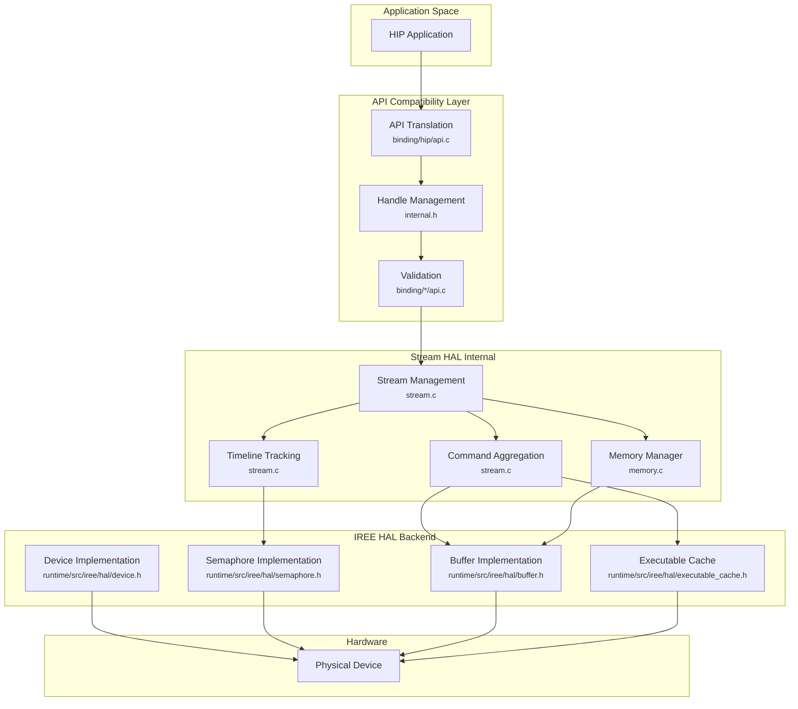

### Key Components for HAL Backends

IREE HAL backend implementations are responsible for five core capabilities:

1. **Device Management**: Enumerate devices, report capabilities, manage contexts
2. **Memory Operations**: Allocate, transfer, and manage device/host memory
3. **Command Execution**: Record and submit command buffers with proper ordering
4. **Synchronization**: Timeline semaphores, events, and stream ordering
5. **Module Loading**: Load and prepare executable code for target hardware

### Design Patterns

The streaming layer uses several patterns that HAL backends must support:

- **Timeline-Based Synchronization**: Using monotonic semaphore values for ordering
- **Lazy Command Recording**: Batching operations in command buffers
- **Queue-Ordered Memory Management**: Asynchronous allocation/deallocation on device timeline

## Detailed Specification

### Layer Plumbing: How API Calls Flow Through the System

#### Memory Copy Flow Example

This is a trace of how `hipMemcpyAsync` flows through all layers. The implementation supports two paths:

**Path 1: Direct Queue Copy** - Uses `iree_hal_device_queue_copy()` for direct hardware submission

**Path 2: Fallback Path** - Records copy in a command buffer for batched execution

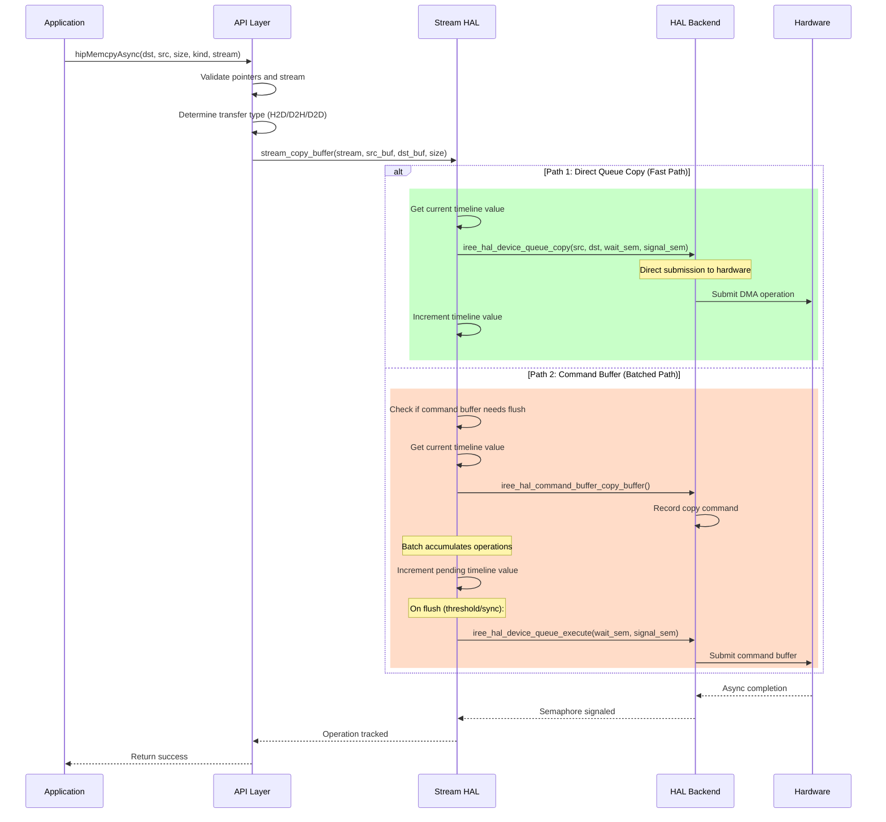

**Key Transformations at Each Layer:**

1. **API Layer**:
   - Translates HIP types to internal handles
   - Validates parameters and permissions
   - Determines optimal transfer strategy

2. **Stream HAL Layer**:
   - Manages timeline progression
   - Aggregates operations into command buffers
   - Tracks dependencies between operations

3. **HAL Backend Layer**:
   - Records hardware-specific commands
   - Manages physical memory mappings
   - Submits work to hardware queues

#### Kernel Launch Flow

The kernel launch demonstrates more complex layer interactions:

```mermaid
graph LR
    subgraph "API Call"
        KC[kernel<<<grid,block,args,stream>>>]
    end

    subgraph "API Layer Processing"
        KP[Parse Launch Config]
        KB[Pack Parameters]
        KM[Lookup Module]
    end

    subgraph "Stream HAL Processing"
        KT[Update Timeline]
        KR[Record Dispatch]
        KS[Schedule Submission]
    end

    subgraph "HAL Backend"
        KE[Load Executable]
        KD[Configure Dispatch]
        KQ[Queue Execution]
    end

    KC --> KP
    KP --> KB
    KB --> KM
    KM --> KT
    KT --> KR
    KR --> KS
    KS --> KE
    KE --> KD
    KD --> KQ
```

### Timeline Progression and Synchronization

#### Timeline Semaphore Mechanics

Timeline semaphores are the core synchronization primitive. Each stream maintains a monotonically increasing timeline:

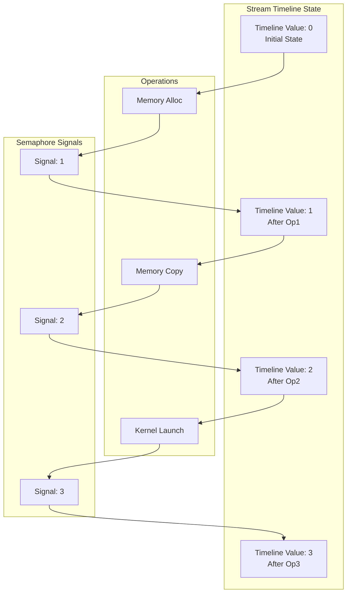

#### Multi-Stream Synchronization

When operations span multiple streams, timeline semaphores coordinate execution:

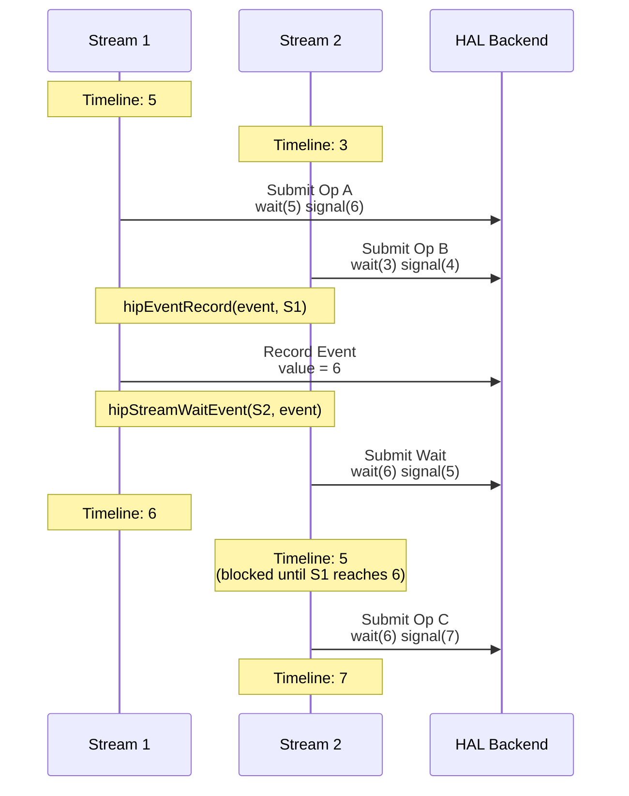

### Memory Management Architecture

#### Memory Type Hierarchy

The streaming layer manages different memory types with specific allocation strategies:

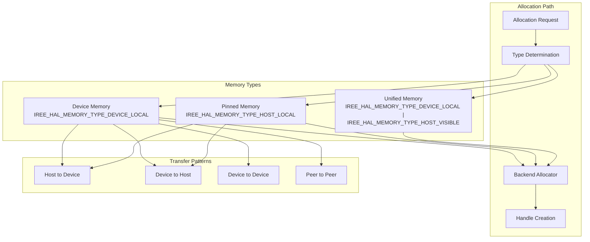

#### Memory Transfer Patterns

The streaming layer supports three primary transfer patterns:

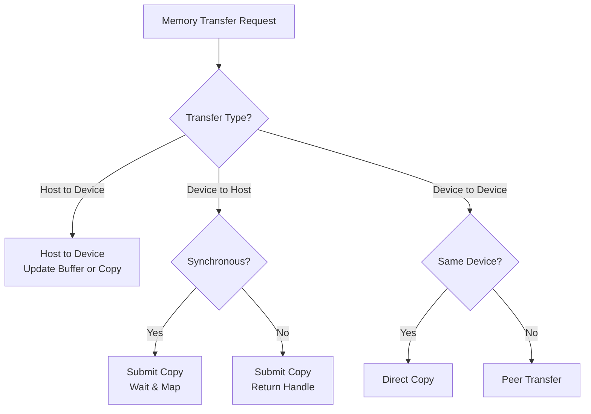

**Host-to-Device:** Uses either command buffer update operations or copy operations depending on backend capabilities and transfer size.

**Device-to-Host:** Requires staging through device-visible memory, with synchronous operations blocking until complete.

**Device-to-Device:** Direct DMA transfers within the same device, or peer-to-peer transfers across devices if supported.

### Command Buffer Lifecycle

#### Recording and Submission Pattern

Command buffers aggregate operations for efficient submission:

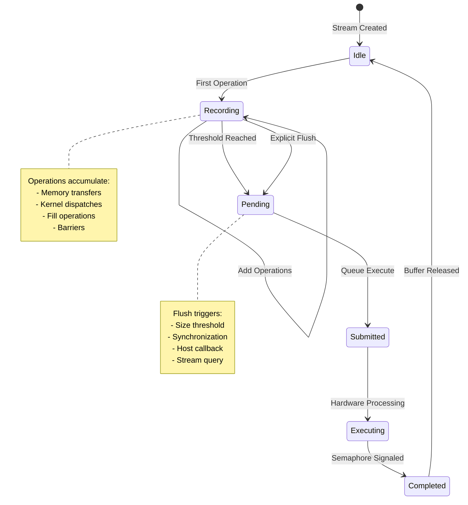

#### Command Aggregation Strategy

The streaming layer intelligently batches operations:

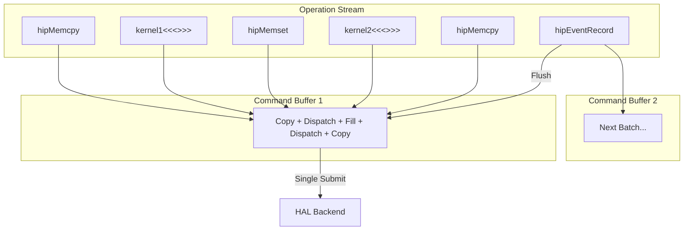

### Module Loading and Kernel Dispatch

#### Executable Cache Architecture

The system maintains a cache of loaded kernels:

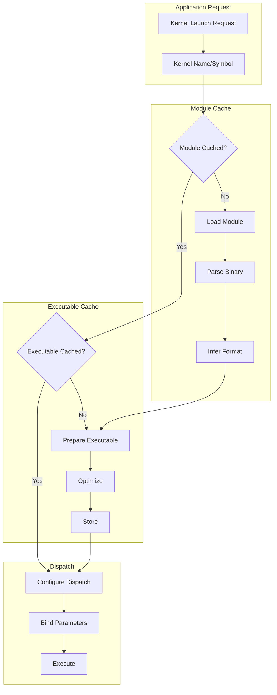

#### Parameter Binding Flow

Kernel parameters are packed and bound efficiently:

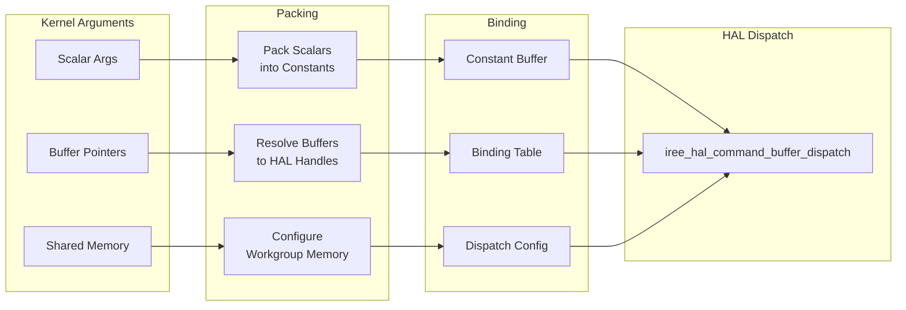

### Advanced Flow: Multi-Operation Sequence

#### Complete Workflow Example

The following diagram illustrates how a typical GPU computation flows through all layers:

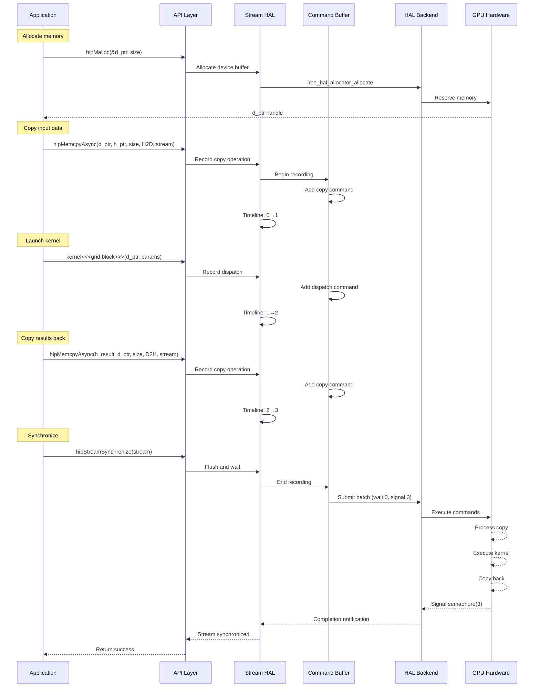

### Graph Execution Model

#### Graph Capture and Instantiation

Graphs map to reusable command buffers:

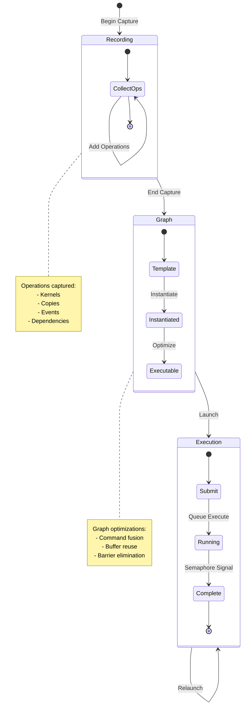

## Implementation Status

### Completed Features

The following core features have been implemented and validated:

- **Device Management**: Device enumeration, property queries, and context management
- **Memory System**: Allocation types (device, host, pinned) with transfer support
- **Stream Operations**: Stream creation, synchronization, callbacks, and priority management
- **Kernel Dispatch**: Module loading, caching, and execution with parameter binding
- **Synchronization**: Events, stream waits, and timeline semaphore integration
- **Graph Support**: Graph capture, instantiation, and replay

The implementation supports standard compute workflows and binary compatibility has been validated with real applications. Some advanced features remain under development.

### Features Under Development

The following features require additional HAL support or are currently under development:

1. **Cooperative Kernel Launch**:
   - Requires HAL support for grid-wide synchronization primitives
   - Needs backend coordination for work-group synchronization

2. **Unified Memory**:
   - Requires HAL allocator extensions for managed memory
   - Needs page migration and coherency protocols

3. **GPU Timing**:
   - Requires device-side timestamp queries
   - Profiling marker support in HAL

4. **Graph Updates**:
   - Support for modifying instantiated graph parameters
   - Node addition/removal after instantiation

## Understanding IREE HAL for Backend Implementers

### Relationship to Vulkan

The IREE HAL is based on Vulkan's compute API, adapted for machine learning workloads. It uses the same explicit, low-level control model as Vulkan compute while adding features for compiler-generated code and removing graphics-specific complexity.

**Vulkan to IREE HAL Mappings:**

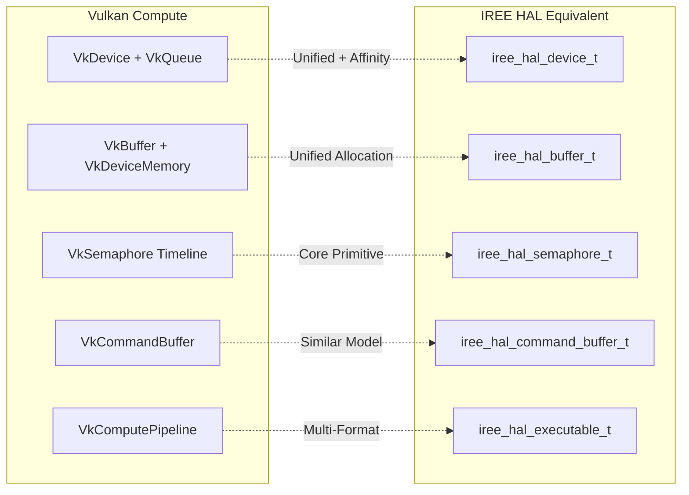

**Similarities to Vulkan:**

- Explicit resource management with manual synchronization
- Timeline semaphores for coordination
- Command buffer recording for batching GPU work
- Memory type abstractions (device-local, host-visible, etc.)
- Asynchronous execution with minimal host blocking

**Differences from Vulkan:**

1. **Queue Management**: IREE HAL uses queue affinity bitmaps instead of explicit `VkQueue` objects. The device implementation hashes affinity values to select queues internally.

2. **Asynchronous Memory Operations**: IREE HAL includes `queue_alloca()` and `queue_dealloca()` for timeline-ordered memory allocation and deallocation, which the streaming layer uses for transient allocations. Vulkan requires synchronous allocation with manual lifetime tracking.

3. **Resource Binding**: IREE HAL provides a simplified binding model using direct buffer binding arrays, avoiding Vulkan's descriptor pool management complexity. Buffers are passed directly in dispatch calls. Note that some backend implementations may use descriptor set concepts internally for their target APIs.

4. **Unified Buffer Allocation**: No separate `VkDeviceMemory` binding step. One allocation call creates a ready-to-use buffer.

5. **Direct Queue Operations**: IREE HAL provides `queue_fill()`, `queue_copy()`, `queue_dispatch()` that bypass command buffer recording for single operations. These have higher overhead than batched command buffers and should be used judiciously.

6. **Executable Formats**: Vulkan only supports SPIR-V. IREE HAL backends can consume multiple formats (HSACO, SPIR-V, Metal bytecode, etc.).

**Binary Format Support Requirements:**

HAL backends must handle executable formats appropriate for their target hardware:

- **Vulkan backends**: SPIR-V
- **ROCm backends**: HSACO (AMD GCN/CDNA)
- **Metal backends**: Metal Library (.metallib)
- **CPU backends**: Native executables (ELF, PE, Mach-O)

The `iree_hal_executable_cache_t` interface provides format detection and JIT compilation support for optimizing or transforming executables at load time.

**Implementation Overview:**

Vulkan compute and the IREE HAL share substantial similarities. The main implementation differences are:

- Queue affinity bitmaps instead of explicit queue family enumeration
- Timeline-ordered memory allocation and deallocation support
- Direct buffer bindings instead of descriptor set machinery
- Support for hardware-native executable formats

The streaming layer uses HAL timeline semaphores for synchronization, command buffers for batching operations, and the buffer/allocator interfaces for memory management.

### Known Limitations

The following architectural limitations apply to current HAL implementations:

1. **No Texture Support**: The HAL does not provide texture primitives
2. **Limited Profiling**: Some profiling capabilities exist, but GPU-side timing data must be implemented per-backend. The HAL does not currently provide a standardized timing API.
3. **Single Context Model**: Multiple contexts per device are not supported

## Future Considerations

### Planned Enhancements

#### Performance Optimizations

The following optimizations are planned for future releases:

- **Memory Pooling**: Stream-ordered allocation pools to reduce allocation overhead
- **Command Buffer Caching**: Reuse command buffers for common patterns
- **Parameter Packing**: Optimize kernel parameter layout for cache efficiency

#### Migration to Native IREE HAL

The streaming API is designed as a thin, open wrapper over the IREE HAL, enabling gradual migration strategies:

**Interoperability Goals:**

- **Mixed API Usage**: Applications can use both streaming API and native IREE HAL calls within the same codebase
- **Handle Compatibility**: Streaming API handles can be converted to/from native HAL objects
- **Piecewise Migration**: Workloads can be incrementally ported from streaming API to direct HAL usage
- **Zero-Copy Integration**: Buffers and synchronization primitives can be shared between APIs without conversion overhead

**Migration Path:**

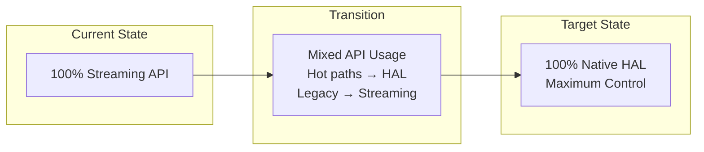

This approach allows developers to optimize critical paths with direct HAL control while maintaining compatibility with existing streaming API code.

#### Potential Future Additions

**Streaming API Features:**

- **Full Unified Memory**: Complete support with migration hints and prefetching
- **Multi-GPU Graphs**: Graph execution across multiple devices
- **Advanced Profiling**: Hardware counter integration and trace generation
- **Texture Support**: If/when added to HAL layer

**IREE HAL Enhancements:**

The following HAL extensions would benefit both the streaming API and direct HAL applications:

1. **Virtual Memory Management**
   - Asynchronous virtual memory support (reserve/commit as queue operations)
   - Enable sparse resource management and dynamic memory expansion

2. **Enhanced Graph API**
   - Simplified API for modifying instantiated graphs
   - Improved support for launching multiple instances of the same graph with different parameters

3. **Control Flow in Command Buffers**
   - Looping constructs for repeated execution
   - Predicated commands based on host or device-side conditions

4. **Event and Synchronization Improvements**
   - Command-buffer events (current IREE events force re-recording)
   - Barrier scopes for fine-grained synchronization

5. **Expanded Indirect Execution Support**
   - Indirect workgroup sizes
   - Indirect copy/fill lengths and offsets

6. **Extension Framework**
   - Generic extension API for vendor-specific features
   - Backend-specific optimizations exposed through standard interface
   - Optional capabilities with runtime detection

7. **Low-Latency Execution**
   - Inline command buffer execution to bypass submission overhead
   - Direct-to-hardware submission for latency-critical operations

### Ongoing Investigation

**Library Integration:**

- **Common Libraries**: Assess whether additional HAL features are needed to support commonly used libraries
- **Communication Libraries**: Evaluate requirements for MPI-like patterns and NCCL-style collectives
- **Vendor Libraries**: Determine extensibility needs for proprietary accelerator libraries

### Key Source Files for Backend Implementers

The streaming implementation is organized as follows:

- `experimental/streaming/internal.h` - Core data structures and internal APIs
- `experimental/streaming/device.c` - Device enumeration and management patterns
- `experimental/streaming/stream.c` - Stream execution model and timeline management
- `experimental/streaming/memory.c` - Memory allocation and transfer strategies
- `experimental/streaming/module.c` - Kernel loading and caching approach
- `experimental/streaming/event.c` - Event and synchronization patterns
- `experimental/streaming/graph_exec.c` - Graph capture and execution optimization

### HAL Backend Interfaces

HAL backend implementations must provide these core interfaces:

- `runtime/src/iree/hal/device.h` - Device operations and property queries
- `runtime/src/iree/hal/allocator.h` - Memory allocation for different types
- `runtime/src/iree/hal/buffer.h` - Buffer management and mapping
- `runtime/src/iree/hal/command_buffer.h` - Command recording interface
- `runtime/src/iree/hal/executable.h` - Kernel/shader interface
- `runtime/src/iree/hal/executable_cache.h` - JIT compilation and caching
- `runtime/src/iree/hal/semaphore.h` - Timeline semaphore operations

## Summary

The streaming API provides binary-compatible HIP runtime support on top of the IREE HAL, enabling existing GPU applications to run unchanged across different hardware backends. The implementation follows a layered architecture where the streaming layer translates high-level HIP calls into HAL primitives, while backend implementations handle hardware-specific execution.

**Key architectural principles:**

- **Timeline semaphores** enable asynchronous execution models through monotonically increasing synchronization values
- **Command buffer batching** reduces submission overhead by aggregating operations
- **Flexible memory management** supports multiple memory types and transfer patterns
- **Thin translation layer** maps streaming operations directly to HAL primitives with minimal overhead

Backend implementations that provide the core HAL capabilities—device management, memory operations, command execution, synchronization, and module loading—can enable full HIP compatibility for their target hardware. The streaming layer handles API translation and semantic mapping, while backends focus on efficient hardware execution.
